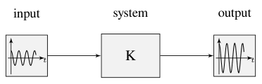
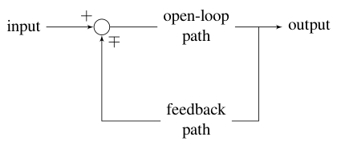
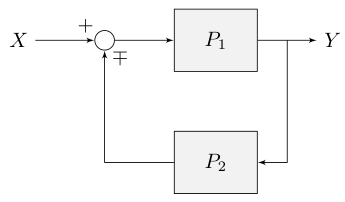
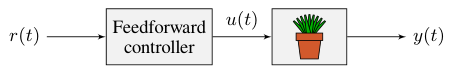
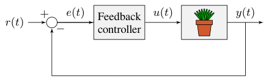
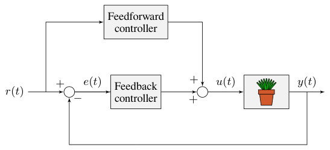

# Chapter 1: Control system basics

Control systems are all around us and we interact with them daily. A small list of ones you may have seen includes heaters and air conditioners with thermostats, cruise control and the anti-lock braking system (ABS) on automobiles, and fan speed modulation on modern laptops. Control systems monitor or control the behavior of systems like these and may consist of humans controlling them directly (manual control), or of only machines (automatic control).

How can we prove closed-loop controllers on an autonomous car, for example, will behave safely and meet the desired performance specifications in the presence of uncertainty? Control theory is an application of algebra and geometry used to analyze and predict the behavior of systems, make them respond how we want them to, and make them robust to disturbances and uncertainty.

Controls engineering is, put simply, the engineering process applied to control theory. As such, it’s more than just applied math. While control theory has some beautiful math behind it, controls engineering is an engineering discipline like any other that is filled with trade-offs. The solutions control theory gives should always be sanity checked and informed by our performance specifications. We don’t need to be perfect; we just need to be good enough to meet our specifications.[^1]

> **Remark.** Most resources for advanced engineering topics assume a level of knowledge well above that which is necessary. Part of the problem is the use of jargon. While it efficiently communicates ideas to those within the field, new people who aren’t familiar with it are lost. Therefore, it’s important to define terms before using them. See the glossary for a list of words and phrases commonly used in control theory, their origins, and their meaning. Links to the glossary are provided for certain words throughout the book and will use this color.

## 1.1 What is gain?

Gain is a proportional value that shows the relationship between the magnitude of an input signal to the magnitude of an output signal at steady-state. Many systems contain a method by which the gain can be altered, providing more or less “power” to the system.

Figure 1.1 shows a system with a hypothetical input and output. Since the output is twice the amplitude of the input, the system has a gain of $2$.

*Figure 1.1: Demonstration of system with a gain of $K = 2$*

## 1.2 Block diagrams

When designing or analyzing a control system, it is useful to model it graphically. Block diagrams are used for this purpose. They can be manipulated and simplified systematically (see appendix [A](A-simplifying-block-diagrams.md#appendix-a-simplifying-block-diagrams)). Figure 1.2 is an example of one.

*Figure 1.2: Block diagram with nomenclature*

The open-loop gain is the total gain from the sum node at the input (the circle) to the output branch. This would be the system’s gain if the feedback loop was disconnected. The feedback gain is the total gain from the output back to the input sum node. A sum node’s output is the sum of its inputs.

Figure 1.3 is a block diagram with more formal notation in a feedback configuration.

*Figure 1.3: Feedback block diagram*

$\mp$ means “minus or plus” where a minus represents negative feedback.

## 1.3 Open-loop and closed-loop systems

The system or collection of actuators being controlled by a control system is called the plant. A controller is used to drive the plant from its current state to some desired state (the reference). We’ll be using the following notation for relevant quantities in block diagrams.

|        |           |        |               |
|:-------|:----------|:-------|:--------------|
| $r(t)$ | reference | $u(t)$ | control input |
| $e(t)$ | error     | $y(t)$ | output        |

Controllers which don’t include information measured from the plant’s output are called *open-loop* or *feedforward* controllers. Figure 1.4 shows a plant with a feedforward controller.

*Figure 1.4: Open-loop control system*

Controllers which incorporate information fed back from the plant’s output are called *closed-loop* or *feedback* controllers. Figure 1.5 shows a plant with a feedback controller.

*Figure 1.5: Closed-loop control system*

Note that the input and output of a system are defined from the plant’s point of view. The negative feedback controller shown is driving the difference between the reference and output, also known as the error, to zero.

Figure 1.6 shows a plant with feedforward and feedback controllers.

*Figure 1.6: Control system with feedforward and feedback*

## 1.4 Feedforward

Feedback control can be effective for reference tracking (making a system’s output follow a desired reference signal), but it’s a reactionary measure; the system won’t start applying control effort until the system is already behind. If we could tell the controller about the desired movement and required input beforehand, the system could react quicker and the feedback controller could do less work. A controller that feeds information forward into the plant like this is called a feedforward controller.

A feedforward controller injects information about the system’s dynamics (like a model does) or the desired movement. The feedforward handles parts of the control actions we already know must be applied to make a system track a reference, then feedback compensates for what we do not or cannot know about the system’s behavior at runtime.

There are two types of feedforwards: model-based feedforward and feedforward for unmodeled dynamics. The first solves a mathematical model of the system for the inputs required to meet desired velocities and accelerations. The second compensates for unmodeled forces or behaviors directly so the feedback controller doesn’t have to. Both types can facilitate simpler feedback controllers; we’ll cover examples of each in later chapters.

## 1.5 Why feedback control?

Let’s say we are controlling a DC motor. With just a mathematical model and knowledge of all current states of the system (i.e., angular velocity), we can predict all future states given the future voltage inputs. Why then do we need feedback control? If the system is disturbed in any way that isn’t modeled by our equations, like a load was applied to the armature, or voltage sag in the rest of the circuit caused the commanded voltage to not match the actual applied voltage, the angular velocity of the motor will deviate from the model over time.

To combat this, we can take measurements of the system and the environment to detect this deviation and account for it. For example, we could measure the current position and estimate an angular velocity from it. We can then give the motor corrective commands as well as steer our model back to reality. This feedback allows us to account for uncertainty and be robust to it.

[^1]: See section [0.4](00-notes-to-the-reader.md#04-mindset-of-an-egoless-engineer) for more on engineering.
