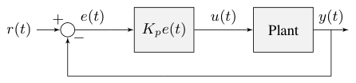
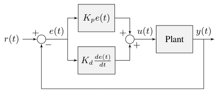
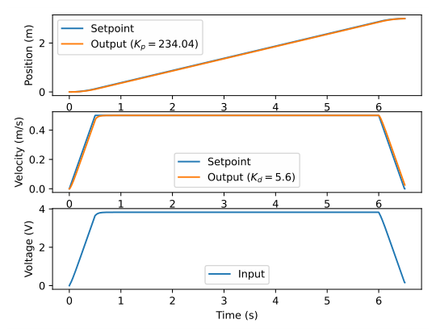
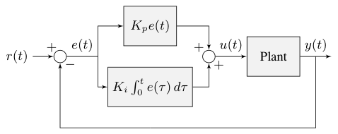
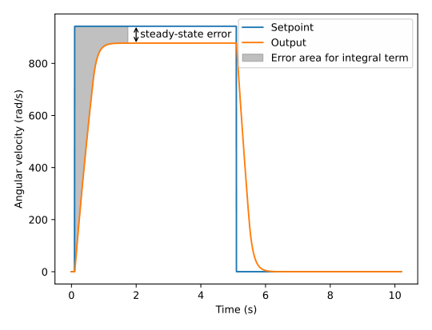
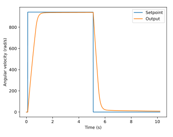
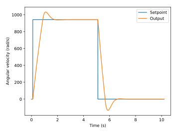
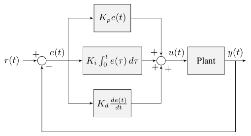
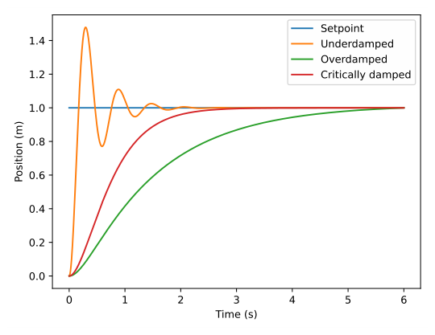

# Chapter 2: PID controllers

The PID controller is a commonly used feedback controller consisting of proportional, integral, and derivative terms, hence the name. This chapter will build up the definition of a PID controller term by term while trying to provide intuition for how each of them behaves.

First, we’ll get some nomenclature for PID controllers out of the way. The reference is called the setpoint (the desired position) and the output is called the process variable (the measured position). Below are some common variable naming conventions for relevant quantities.

|        |          |        |               |
|:-------|:---------|:-------|:--------------|
| $r(t)$ | setpoint | $u(t)$ | control input |
| $e(t)$ | error    | $y(t)$ | output        |

The error $e(t)$ is $r(t) - y(t)$.

For those already familiar with PID control, this book’s interpretation won’t be consistent with the classical intuition of “past”, “present”, and “future” error. We will be approaching it from the viewpoint of modern control theory with proportional controllers applied to different physical quantities we care about. This will provide a more complete explanation of the derivative term’s behavior for constant and moving setpoints, and this intuition will carry over to the modern control methods covered later in this book.

The proportional term drives the position error to zero, the derivative term drives the velocity error to zero, and the integral term accumulates the area between the setpoint and output plots over time (the integral of position error) and adds the current total to the control input. We’ll go into more detail on each of these.

## 2.1 Proportional term

The *Proportional* term drives the position error to zero.

> **Definition 2.1.1 — Proportional controller.**
>
> $$
> u(t) = K_p e(t)
> $$
>
> where $K_p$ is the proportional gain and $e(t)$ is the error at the current time $t$.

Figure 2.1 shows a block diagram for a system controlled by a P controller.

*Figure 2.1: P controller block diagram*

Proportional gains act like “software-defined springs” that pull the system toward the desired position. Recall from physics that we model springs as $F = -kx$ where $F$ is the force applied, $k$ is a proportional constant, and $x$ is the displacement from the equilibrium point. This can be written another way as $F = k(0 - x)$ where $0$ is the equilibrium point. If we let the equilibrium point be our feedback controller’s setpoint, the equations have a one-to-one correspondence.

$$
\begin{aligned}
F &= k(r - x) \\
u(t) &= K_p e(t) = K_p(r(t) - y(t))
\end{aligned}
$$

so the “force” with which the proportional controller pulls the system’s output toward the setpoint is proportional to the error, just like a spring.

## 2.2 Derivative term

The *Derivative* term drives the velocity error to zero.

> **Definition 2.2.1 — PD controller.**
>
> $$
> u(t) = K_p e(t) + K_d \frac{de}{dt}
> $$
>
> where $K_p$ is the proportional gain, $K_d$ is the derivative gain, and $e(t)$ is the error at the current time $t$.

Figure 2.2 shows a block diagram for a system controlled by a PD controller.

*Figure 2.2: PD controller block diagram*

*Figure 2.3: PD controller on an elevator*

A PD controller has a proportional controller for position ($K_p$) and a proportional controller for velocity ($K_d$). The velocity setpoint is implicitly provided by how the position setpoint changes over time. Figure 2.3 shows an example for an elevator.

To prove a PD controller is just two proportional controllers, we will rearrange the equation for a PD controller.

$$
\begin{aligned}
u_k &= K_p e_k + K_d \frac{e_k - e_{k-1}}{\Delta t}
\end{aligned}
$$

where $u_k$ is the control input at timestep $k$, $e_k$ is the error at timestep $k$, and $\Delta t$ is the timestep duration. $e_k$ is defined as $e_k = r_k - y_k$ where $r_k$ is the setpoint at timestep $k$ and $y_k$ is the output at timestep $k$.

$$
\begin{aligned}
u_k &= K_p (r_k - y_k) +
    K_d \frac{(r_k - y_k) - (r_{k-1} - y_{k-1})}{\Delta t} \\
u_k &= K_p (r_k - y_k) + K_d \frac{r_k - y_k - r_{k-1} + y_{k-1}}{\Delta t} \\
u_k &= K_p (r_k - y_k) + K_d \frac{r_k - r_{k-1} - y_k + y_{k-1}}{\Delta t} \\
u_k &= K_p (r_k - y_k) +
    K_d \frac{(r_k - r_{k-1}) - (y_k - y_{k-1})}{\Delta t} \\
u_k &= K_p (r_k - y_k) + K_d \left(\frac{r_k - r_{k-1}}{\Delta t} -
    \frac{y_k - y_{k-1}}{\Delta t}\right)
\end{aligned}
$$

Notice how $\frac{r_k - r_{k-1}}{\Delta t}$ is the velocity of the setpoint and $\frac{y_k - y_{k-1}}{\Delta t}$ is the estimated velocity of the system. This means the $K_d$ term of the PD controller drives the estimated velocity to the setpoint velocity.

If the setpoint is constant, the implicit velocity setpoint is zero, so the $K_d$ term slows the system down if it’s moving. This acts like a “software-defined damper”. These are commonly seen on door closers, and their damping force increases linearly with velocity.

## 2.3 Integral term

The *Integral* term accumulates the area between the setpoint and output plots over time (i.e., the integral of position error) and adds the current total to the control input. Accumulating the area between two curves is called integration.

> **Definition 2.3.1 — PI controller.**
>
> $$
> u(t) = K_p e(t) + K_i \int_0^t e(\tau) \,d\tau
> $$
>
> where $K_p$ is the proportional gain, $K_i$ is the integral gain, $e(t)$ is the error at the current time $t$, and $\tau$ is the integration variable.
>
> The integral integrates from time $0$ to the current time $t$. We use $\tau$ for the integration because we need a variable to take on multiple values throughout the integral, but we can’t use $t$ because we already defined that as the current time.

Figure 2.4 shows a block diagram for a system controlled by a PI controller.

*Figure 2.4: PI controller block diagram*

When the system is close to the setpoint in steady-state, the proportional term may be too small to pull the output all the way to the setpoint, and the derivative term is zero. This can result in steady-state error, as shown in figure 2.5.

*Figure 2.5: P controller on a flywheel with steady-state error*

A common way of eliminating steady-state error is to integrate the error and add it to the control input. This increases the control effort until the system converges. Figure 2.5 shows an example of steady-state error for a flywheel, and figure 2.6 shows how an integrator added to the flywheel controller eliminates it. However, too high of an integral gain can lead to overshoot, as shown in figure 2.7.

*Figure 2.6: PI controller on a flywheel without steady-state error*

*Figure 2.7: PI controller on a flywheel with overshoot from large $K_i$ gain*

> **Remark.** There are better approaches to fix steady-state error like using feedforwards or constraining when the integral control acts using other knowledge of the system. We will discuss these in more detail when we get to modern control theory.

## 2.4 PID controller definition

When these three terms are combined, one gets the typical definition for a PID controller.

> **Definition 2.4.1 — PID controller.**
>
> $$
> u(t) = K_p e(t) + K_i \int_0^t e(\tau) \,d\tau + K_d \frac{de}{dt}
> $$
>
> where $K_p$ is the proportional gain, $K_i$ is the integral gain, $K_d$ is the derivative gain, $e(t)$ is the error at the current time $t$, and $\tau$ is the integration variable.

Figure 2.8 shows a block diagram for a system controlled by a PID controller.

*Figure 2.8: PID controller block diagram*

## 2.5 Response types

A system driven by a PID controller generally has three types of responses: underdamped, overdamped, and critically damped. These are shown in figure 2.9.

*Figure 2.9: PID controller response types*

For the step responses in figure 2.9, rise time is the time the system takes to initially reach the reference after applying the step input. Settling time is the time the system takes to settle at the reference after the step input is applied.

An *underdamped* response oscillates around the reference before settling. An *overdamped* response is slow to rise and does not overshoot the reference. A *critically damped* response has the shortest rise time without oscillating around the reference (i.e., overshooting then undershooting).

## 2.6 Manual tuning

These steps apply to position PID controllers. Velocity PID controllers typically don’t need $K_d$.

1.  Set $K_p$, $K_i$, and $K_d$ to zero.

2.  Increase $K_p$ until the output starts to oscillate around the setpoint.

3.  Increase $K_d$ as much as possible without introducing jittering in the system response.

If the setpoint follows a trapezoid profile (see section [15.1](15-motion-profiles.md#151-1-dof-motion-profiles)), tuning becomes a lot easier. Plot the position setpoint, velocity setpoint, measured position, and measured velocity. The velocity setpoint can be obtained via numerical differentiation of the position setpoint (i.e., $v_{desired,k} = \frac{r_k - r_{k-1}}{\Delta t}$). Increase $K_p$ until the position tracks well, then increase $K_d$ until the velocity tracks well.

If the controller settles at an output above or below the setpoint, one can increase $K_i$ such that the controller reaches the setpoint in a reasonable amount of time.

> **Remark.** If a model is available (not the case here with output-based control), prefer a feedforward (section [7.8](07-discrete-state-space-control.md#78-feedforward)) or an integrator in the plant (section [6.7](06-continuous-state-space-control.md#67-integral-control)) instead of an integrator in the controller (e.g., the I term in PID). Use integrators only to compensate for unmodelable dynamics.

Beware that if $K_i$ is too large, integral windup can occur. Following a large change in setpoint, the integral term can accumulate an error larger than the maximal control input. As a result, the system overshoots and continues to increase until this accumulated error is unwound.

## 2.7 Limitations

PID’s heuristic method of tuning is a reasonable choice when there is no *a priori* knowledge of the system dynamics. However, controllers with much better response can be developed if a dynamical model of the system is known. Furthermore, PID only applies to single-input, single-output (SISO) systems; we’ll cover methods for multiple-input, multiple-output (MIMO) control in part II of this book.
