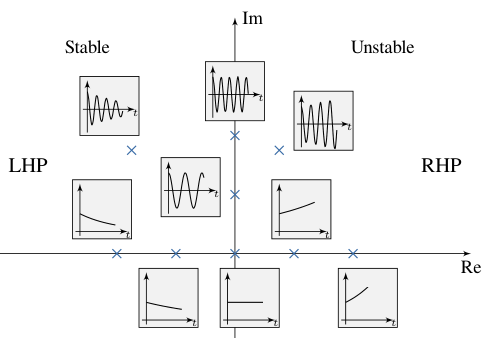
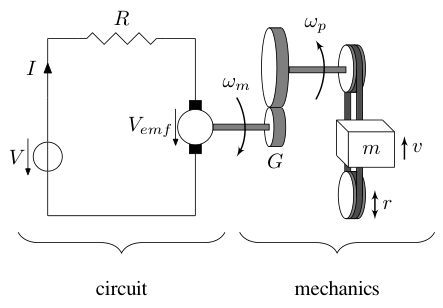
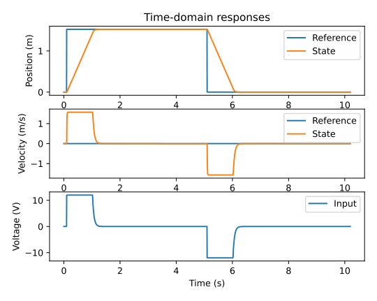
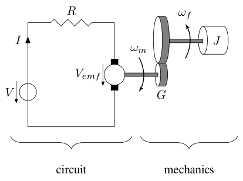
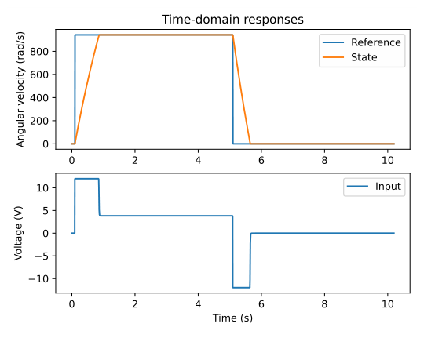
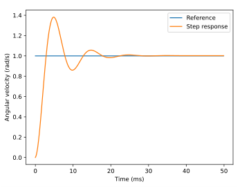
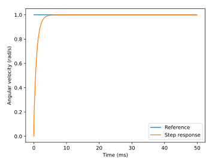
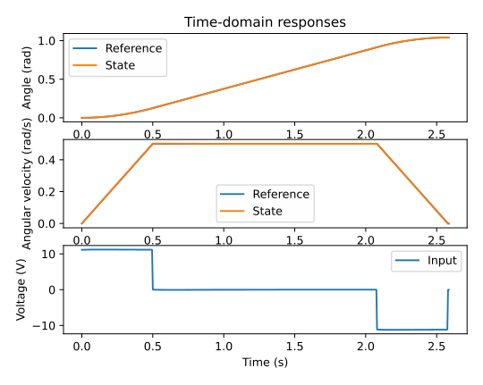

# Chapter 6: Continuous state-space control

When we want to command a system to a set of states, we design a controller with certain control laws to do it. PID controllers use the system outputs with proportional, integral, and derivative control laws. In state-space, we also have knowledge of the system states so we can do better.

Modern control theory uses state-space representation to model and control systems. State-space representation models systems as a set of state, input, and output variables related by first-order differential equations that describe how the system’s state changes over time given the current states and inputs.

## 6.1 From PID control to model-based control

As mentioned before, controls engineers have a more general framework to describe control theory than just PID control. PID controller designers are focused on fiddling with controller parameters relating to the current, past, and future error rather than the underlying system states. Integral control is a commonly used tool, and some people use integral action as the majority of the control action. While this approach works in a lot of situations, it is an incomplete view of the world.

Model-based control has a completely different mindset. Controls designers using model-based control care about developing an accurate model of the system, then driving the states they care about to zero (or to a reference). Integral control is added with $u_{error}$ estimation if needed to handle model uncertainty, but we prefer not to use it because its response is hard to tune and some of its destabilizing dynamics aren’t visible during simulation.

Why use model-based control in FRC? Poor build season schedule management often leads to the software team:

1.  Not getting enough time to verify basic functionality and test/tune feedback controllers.

2.  Spending dedicated software testing time troubleshooting mechanical/electrical issues within recently integrated subsystems instead.

Model-based control (one of the focuses of this book) avoids both problems because it lets software teams test basic functionality in simulation much earlier in the build season and tune their feedback controllers automatically.

## 6.2 What is a dynamical system?

A dynamical system is a system whose motion varies according to a set of differential equations. A dynamical system is considered *linear* if the differential equations describing its dynamics consist only of linear operators. Linear operators are things like constant gain multiplications, derivatives, and integrals. You can define reasonably accurate linear models for pretty much everything you’ll see in FRC with just those relations.

But let’s say you have a DC motor hooked up to a power supply and you applied a constant voltage to it from rest. The motor approaches a steady-state angular velocity, but the shape of the angular velocity curve over time isn’t a line. In fact, it’s a decaying exponential curve akin to

$$
\omega = \omega_{max}\left(1 - e^{-t}\right)
$$

where $\omega$ is the angular velocity and $\omega_{max}$ is the maximum angular velocity. If DC motors are said to behave linearly, then why is this?

Linearity refers to a system’s equations of motion, not its time domain response. The equation defining the motor’s change in angular velocity over time looks like

$$
\dot{\omega} = -a\omega + bV
$$

where $\dot{\omega}$ is the derivative of $\omega$ with respect to time, $V$ is the input voltage, and $a$ and $b$ are constants specific to the motor. This equation, unlike the one shown before, is actually linear because it only consists of multiplications and additions relating the input $V$ and current state $\omega$.

Also of note is that the relation between the input voltage and the angular velocity of the output shaft is a linear regression. You’ll see why if you model a DC motor as a voltage source and generator producing back-EMF (in the equation above, $bV$ corresponds to the voltage source and $-a\omega$ corresponds to the back-EMF). As you increase the input voltage, the back-EMF increases linearly with the motor’s angular velocity. If there was a friction term that varied with the angular velocity squared (air resistance is one example), the relation from input to output would be a curve. Friction that scales with just the angular velocity would result in a lower maximum angular velocity, but because that term can be lumped into the back-EMF term, the response is still linear.

## 6.3 Continuous state-space notation

### 6.3.1 What is state-space?

Recall from last chapter that 2D space has two axes: $x$ and $y$. We represent locations within this space as a pair of numbers packaged in a vector, and each coordinate is a measure of how far to move along the corresponding axis. State-space is a Cartesian coordinate system with an axis for each state variable, and we represent locations within it the same way we do for 2D space: with a list of numbers in a vector. Each element in the vector corresponds to a state of the system.

In state-space notation, there are also input and output vectors with corresponding input and output spaces. Inputs drive the system to other points in the state-space, and outputs are sensor measurements that have a linear relationship to the state and input. Since the mapping from state and input to change in state is a system of equations, it’s natural to write it in matrix form.

### 6.3.2 Definition

Below is the continuous version of state-space notation.

> **Definition 6.3.1 — Continuous state-space notation.**
>
> $$
> \begin{aligned}
> \dot{\mathbf{x}} &= \mathbf{A}\mathbf{x} + \mathbf{B}\mathbf{u} \\
> \mathbf{y} &= \mathbf{C}\mathbf{x} + \mathbf{D}\mathbf{u}
> \end{aligned} \tag{6.1\text{--}6.2}
> $$
>
> |              |                    |              |               |
> |:-------------|:-------------------|:-------------|:--------------|
> | $\mathbf{A}$ | system matrix      | $\mathbf{x}$ | state vector  |
> | $\mathbf{B}$ | input matrix       | $\mathbf{u}$ | input vector  |
> | $\mathbf{C}$ | output matrix      | $\mathbf{y}$ | output vector |
> | $\mathbf{D}$ | feedthrough matrix |              |               |

*Table 6.1: State-space matrix dimensions*

| **Matrix** | **Rows $\times$ Columns** | **Matrix** | **Rows $\times$ Columns** |
|:---|:---|:---|:---|
| $\mathbf{A}$ | states $\times$ states | $\mathbf{x}$ | states $\times$ 1 |
| $\mathbf{B}$ | states $\times$ inputs | $\mathbf{u}$ | inputs $\times$ 1 |
| $\mathbf{C}$ | outputs $\times$ states | $\mathbf{y}$ | outputs $\times$ 1 |
| $\mathbf{D}$ | outputs $\times$ inputs |  |  |

The change in state and the output are linear combinations of the state vector and the input vector. The $\mathbf{A}$ and $\mathbf{B}$ matrices are used to map the state vector $\mathbf{x}$ and the input vector $\mathbf{u}$ to a change in the state vector $\dot{\mathbf{x}}$. The $\mathbf{C}$ and $\mathbf{D}$ matrices are used to map the state vector $\mathbf{x}$ and the input vector $\mathbf{u}$ to an output vector $\mathbf{y}$.

## 6.4 Eigenvalues and stability

If a system is stable, its output will tend toward equilibrium (steady-state) over time. For a general system $\dot{\mathbf{x}} = f(\mathbf{x}, \mathbf{u})$, equilibrium points are points where $\dot{\mathbf{x}} = \mathbf{0}$. If we let $\mathbf{x} = \mathbf{0}$ and $\mathbf{u} = \mathbf{0}$ in $\dot{\mathbf{x}} = \mathbf{A}\mathbf{x} + \mathbf{B}\mathbf{u}$, we can see that $\dot{\mathbf{x}} = \mathbf{0}$, so $\mathbf{x} = \mathbf{0}$ is an equilibrium point.

We’d like to know whether all possible unforced system trajectories ($\mathbf{u} = \mathbf{0}$) move toward or away from the equilibrium point. If we solve the system of linear differential equations $\dot{\mathbf{x}} = \mathbf{A}\mathbf{x}$, we get $\mathbf{x}(t) = e^{\mathbf{A}t} \mathbf{x}_0$.[^1] $e^{\mathbf{A}t}$ is the superposition of $e^{\lambda_j t}$ terms where $\{\lambda_j\}$ is the set of $\mathbf{A}$’s eigenvalues.[^2]

For now, let’s consider when all the eigenvalues are real numbers.

$$
\begin{cases}
    \lambda_j < 0, & e^{\lambda_j t} \text{ decays to zero (stable)}
      \\
    \lambda_j = 0, & e^{\lambda_j t} = 1 \text{ (marginally stable)} \\
    \lambda_j > 0, & e^{\lambda_j t} \text{ grows to infinity (unstable)}
  \end{cases}
$$

So the system tends toward the equilibrium point (i.e., it’s stable) if $\lambda_j < 0$ for all $j$.

Now let’s consider when the eigenvalues are complex numbers. What does that mean for the system response? Let $\lambda_j = a_j + b_j i$. Each of the exponential terms in the solution can be written as

$$
e^{\lambda_j t} = e^{(a_j + b_j i)t} = e^{a_j t} e^{i b_j t}
$$

The complex exponential can be rewritten using Euler’s formula.[^3]

$$
e^{i b_j t} = \cos(b_j t) + i \sin(b_j t)
$$

Therefore,

$$
e^{\lambda_j t} = e^{a_j t} (\cos(b_j t) + i \sin(b_j t))
$$

When the eigenvalue’s imaginary part $b_j \neq 0$, it contributes oscillation to the real part’s response.

The eigenvalues of $\mathbf{A}$ are called *poles*.[^4] Figure 6.1 shows the impulse responses in the time domain for systems with various pole locations in the complex plane (real numbers on the x-axis and imaginary numbers on the y-axis). Each response has an initial condition of $1$.



*Figure 6.1: Continuous impulse response vs pole location*

Poles in the left half-plane (LHP) are stable; the system’s output may oscillate but it converges to steady-state. Poles on the imaginary axis are marginally stable; the system’s output oscillates at a constant amplitude forever. Poles in the right half-plane (RHP) are unstable; the system’s output grows without bound.

> **Remark.** Imaginary poles always come in complex conjugate pairs (e.g., $-2 + 3i$, $-2 - 3i$).

## 6.5 Closed-loop controller

With the control law $\mathbf{u} = \mathbf{K}(\mathbf{r} - \mathbf{x})$, we can derive the closed-loop state-space equations. We’ll discuss where this control law comes from in subsection [7.7](07-discrete-state-space-control.md#77-linear-quadratic-regulator).

First is the state update equation. Substitute the control law into equation (6.1).

$$
\begin{aligned}
\dot{\mathbf{x}} &= \mathbf{A}\mathbf{x} + \mathbf{B}\mathbf{K}(\mathbf{r} - \mathbf{x}) \\
\dot{\mathbf{x}} &= \mathbf{A}\mathbf{x} + \mathbf{B}\mathbf{K}\mathbf{r} -
    \mathbf{B}\mathbf{K}\mathbf{x} \\
\dot{\mathbf{x}} &= (\mathbf{A} - \mathbf{B}\mathbf{K})\mathbf{x} + \mathbf{B}\mathbf{K}\mathbf{r}
\end{aligned} \tag{6.3}
$$

Now for the output equation. Substitute the control law into equation (6.2).

$$
\begin{aligned}
\mathbf{y} &= \mathbf{C}\mathbf{x} + \mathbf{D}(\mathbf{K}(\mathbf{r} - \mathbf{x})) \\
\mathbf{y} &= \mathbf{C}\mathbf{x} + \mathbf{D}\mathbf{K}\mathbf{r} - \mathbf{D}\mathbf{K}\mathbf{x} \\
\mathbf{y} &= (\mathbf{C} - \mathbf{D}\mathbf{K})\mathbf{x} + \mathbf{D}\mathbf{K}\mathbf{r}
\end{aligned}
$$

Instead of commanding the system to a state using the vector $\mathbf{u}$ directly, we can now specify a vector of desired states through $\mathbf{r}$ and the controller will choose values of $\mathbf{u}$ for us over time that drive the system toward the reference.

The eigenvalues of $\mathbf{A} - \mathbf{B}\mathbf{K}$ are the poles of the closed-loop system. Therefore, the rate of convergence and stability of the closed-loop system can be changed by moving the poles via the eigenvalues of $\mathbf{A} - \mathbf{B}\mathbf{K}$. $\mathbf{A}$ and $\mathbf{B}$ are inherent to the system, but $\mathbf{K}$ can be chosen arbitrarily by the controller designer. For equation (6.3) to reach steady-state, the eigenvalues of $\mathbf{A} - \mathbf{B}\mathbf{K}$ must be in the left-half plane. There will be steady-state error if $\mathbf{A}\mathbf{r} \ne \mathbf{0}$.

*Table 6.2: Controller matrix dimensions*

| **Symbol**   | **Name**               | **Rows $\times$ Columns** |
|:-------------|:-----------------------|:--------------------------|
| $\mathbf{A}$ | system matrix          | states $\times$ states    |
| $\mathbf{B}$ | input matrix           | states $\times$ inputs    |
| $\mathbf{C}$ | output matrix          | outputs $\times$ states   |
| $\mathbf{D}$ | feedthrough matrix     | outputs $\times$ inputs   |
| $\mathbf{K}$ | controller gain matrix | inputs $\times$ states    |
| $\mathbf{r}$ | reference vector       | states $\times$ 1         |
| $\mathbf{x}$ | state vector           | states $\times$ 1         |
| $\mathbf{u}$ | input vector           | inputs $\times$ 1         |
| $\mathbf{y}$ | output vector          | outputs $\times$ 1        |

## 6.6 Model augmentation

This section will teach various tricks for manipulating state-space models with the goal of demystifying the matrix algebra at play. We will use the augmentation techniques discussed here in the section on integral control.

Matrix augmentation is the process of appending rows or columns to a matrix. In state-space, there are several common types of augmentation used: plant augmentation, controller augmentation, and observer augmentation.

### 6.6.1 Plant augmentation

Plant augmentation is the process of adding a state to a model’s state vector and adding a corresponding row to the $\mathbf{A}$ and $\mathbf{B}$ matrices.

### 6.6.2 Controller augmentation

Controller augmentation is the process of adding a column to a controller’s $\mathbf{K}$ matrix. This is often done in combination with plant augmentation to add controller dynamics relating to a newly added state.

### 6.6.3 Observer augmentation

Observer augmentation is closely related to plant augmentation. In addition to adding entries to the observer matrix $\mathbf{K}$,[^5] the observer is using this augmented plant for estimation purposes. This is better explained with an example.

By augmenting the plant with a bias term with no dynamics (represented by zeroes in its rows in $\mathbf{A}$ and $\mathbf{B}$), the observer will attempt to estimate a value for this bias term that makes the model best reflect the measurements taken of the real system. Note that we’re not collecting any data on this bias term directly; it’s what’s known as a hidden state. Rather than our inputs and other states affecting it directly, the observer determines a value for it based on what is most likely given the model and current measurements. We just tell the plant what kind of dynamics the term has and the observer will estimate it for us.

### 6.6.4 Output augmentation

Output augmentation is the process of adding rows to the $\mathbf{C}$ matrix. This is done to help the controls designer visualize the behavior of internal states or other aspects of the system in MATLAB or Python Control. $\mathbf{C}$ matrix augmentation doesn’t affect state feedback, so the designer has a lot of freedom here. Noting that the output is defined as $\mathbf{y} = \mathbf{C}\mathbf{x} + \mathbf{D}\mathbf{u}$, the following row augmentations of $\mathbf{C}$ may prove useful. Of course, $\mathbf{D}$ needs to be augmented with zeroes as well in these cases to maintain the correct matrix dimensionality.

Since $\mathbf{u} = -\mathbf{K}\mathbf{x}$, augmenting $\mathbf{C}$ with $-\mathbf{K}$ makes the observer estimate the control input $\mathbf{u}$ applied.

$$
\begin{aligned}
\mathbf{y} &= \mathbf{C}\mathbf{x} + \mathbf{D}\mathbf{u} \\
\begin{bmatrix}
    \mathbf{y} \\
    \mathbf{u}
  \end{bmatrix} &=
  \begin{bmatrix}
    \mathbf{C} \\
    -\mathbf{K}
  \end{bmatrix}
  \mathbf{x} +
  \begin{bmatrix}
    \mathbf{D} \\
    \mathbf{0}
  \end{bmatrix}
  \mathbf{u}
\end{aligned}
$$

This works because $\mathbf{K}$ has the same number of columns as states.

Various states can also be produced in the output with $\mathbf{I}$ matrix augmentation.

### 6.6.5 Examples

Snippet 6.1 shows how one packs together the following augmented matrix in Python using `np.block()`.

$$
\begin{bmatrix}
    \mathbf{A} & \mathbf{B} \\
    \mathbf{C} & \mathbf{D}
  \end{bmatrix}
$$

```python
import numpy as np

A = np.array([[1, 2], [3, 4]])
B = np.array([[5], [6]])
C = np.array([[7, 8]])
D = np.array([[9]])

tmp = np.block([[A, B], [C, D]])

```

*Snippet 6.1. Matrix augmentation example: block*

Snippet 6.2 shows how one packs together the same augmented matrix in Python using array slices.

```python
import numpy as np

A = np.array([[1, 2], [3, 4]])
B = np.array([[5], [6]])
C = np.array([[7, 8]])
D = np.array([[9]])

tmp = np.empty((3, 3))
tmp[:2, :2] = A  # tmp[0:2, 0:2] = A
tmp[:2, 2:] = B  # tmp[0:2, 2:3] = B
tmp[2:, :2] = C  # tmp[2:3, 0:2] = C
tmp[2:, 2:] = D  # tmp[2:3, 2:3] = D

```

*Snippet 6.2. Matrix augmentation example: array slices*

Section [6.7](#67-integral-control) demonstrates model augmentation for different types of integral control.

## 6.7 Integral control

A common way of implementing integral control is to add an additional state that is the integral of the error of the variable intended to have zero steady-state error.

We’ll present two methods:

1.  Augment the plant. For an arm, one would add an “integral of position” state.

2.  Estimate the “error” in the control input (the difference between what was applied versus what was observed to happen) via the observer and compensate for it. We’ll call this “input error estimation”.

In FRC, avoid integral control unless you have a very good reason to use it. Integral control adds significant complexity, and steady-state error can often be avoided with a motion profile, a well-tuned feedforward, and proportional feedback (i.e., more deterministic options you should be using anyway).

### 6.7.1 Plant augmentation

#### Caveats

First, unconstrained integral control exhibits integral windup on a unit step input. When the error reaches zero, the integrator may still have a large positive accumulated error from the initial ramp-up. The integrator makes the system overshoot until the accumulated error is unwound by negative errors. Poor tuning can lead to instability.[^6] Integrating only when close to the reference somewhat mitigates integral windup.

Second, unconstrained integral control is a poor choice for modeled dynamics compensation. Feedforwards provide more precise compensation since we already know beforehand how to counteract the undesirable dynamics.

Third, unconstrained integral control is a poor choice for unmodeled dynamics compensation. To choose proper gains, the integrator must be tuned online when the unmodeled dynamics are present, which may be inconvenient or unsafe in some circumstances. Furthermore, accumulation even when the system is following the model means it still compensates for modeled dynamics despite our intent otherwise. Prefer the approach in subsection [6.7.2](#672-input-error-estimation).

#### Implementation

We want to augment the system with an integral term that integrates the error $\mathbf{e} = \mathbf{r} - \mathbf{y} = \mathbf{r} - \mathbf{C}\mathbf{x}$.

$$
\begin{aligned}
\mathbf{x}_I &= \int \mathbf{e} \,dt \\
\dot{\mathbf{x}}_I &= \mathbf{e} = \mathbf{r} - \mathbf{C}\mathbf{x}
\end{aligned}
$$

The plant is augmented as

$$
\begin{aligned}
\dot{\begin{bmatrix}
    \mathbf{x} \\
    \mathbf{x}_I
  \end{bmatrix}} &=
  \begin{bmatrix}
    \mathbf{A} & \mathbf{0} \\
    -\mathbf{C} & \mathbf{0}
  \end{bmatrix}
  \begin{bmatrix}
    \mathbf{x} \\
    \mathbf{x}_I
  \end{bmatrix} +
  \begin{bmatrix}
    \mathbf{B} \\
    \mathbf{0}
  \end{bmatrix}
  \mathbf{u} +
  \begin{bmatrix}
    \mathbf{0} \\
    \mathbf{I}
  \end{bmatrix}
  \mathbf{r} \\
  \dot{\begin{bmatrix}
    \mathbf{x} \\
    \mathbf{x}_I
  \end{bmatrix}} &=
  \begin{bmatrix}
    \mathbf{A} & \mathbf{0} \\
    -\mathbf{C} & \mathbf{0}
  \end{bmatrix}
  \begin{bmatrix}
    \mathbf{x} \\
    \mathbf{x}_I
  \end{bmatrix} +
  \begin{bmatrix}
    \mathbf{B} & \mathbf{0} \\
    \mathbf{0} & \mathbf{I}
  \end{bmatrix}
  \begin{bmatrix}
    \mathbf{u} \\
    \mathbf{r}
  \end{bmatrix}
\end{aligned}
$$

The controller is augmented as

$$
\begin{aligned}
\mathbf{u} &= \mathbf{K} (\mathbf{r} - \mathbf{x}) - \mathbf{K}_I\mathbf{x}_I \\
\mathbf{u} &=
  \begin{bmatrix}
    \mathbf{K} & \mathbf{K}_I
  \end{bmatrix}
  \left(\begin{bmatrix}
    \mathbf{r} \\
    \mathbf{0}
  \end{bmatrix} -
  \begin{bmatrix}
    \mathbf{x} \\
    \mathbf{x}_I
  \end{bmatrix}\right)
\end{aligned}
$$

### 6.7.2 Input error estimation

Models can predict system behavior, but unmodeled disturbances make the observed system behavior deviate from the model. We want to react to these disturbances quickly and improve the model’s predictive power in the face of these disturbances.

Input error estimation uses a state observer (covered in chapter [9](09-stochastic-control-theory.md#chapter-9-stochastic-control-theory)) to estimate the difference between the provided model input and a hypothetical input that makes the model match the observed behavior. Subtracting this value from the provided input compensates for unmodeled disturbances, and adding it to the state observer’s input makes the model better predict the system’s future behavior.

First, we’ll consider the one-dimensional case. Let $u_{error}$ be the difference between the hypothetical input with disturbances and the provided input. The $u_{error}$ term is then added to the system as follows.

$$
\begin{aligned}
\dot{x} &= Ax + B\left(u + u_{error}\right)
\end{aligned}
$$

$u + u_{error}$ is the hypothetical input actually applied to the system.

$$
\begin{aligned}
\dot{x} &= Ax + Bu + Bu_{error}
\end{aligned}
$$

The following equation generalizes this to a multiple-input system.

$$
\begin{aligned}
\dot{\mathbf{x}} &= \mathbf{A}\mathbf{x} + \mathbf{B}\mathbf{u} + \mathbf{B}_{error}u_{error}
\end{aligned}
$$

where $\mathbf{B}_{error}$ is a column vector that maps $u_{error}$ to changes in the rest of the state the same way $\mathbf{B}$ does for $\mathbf{u}$. $\mathbf{B}_{error}$ is only a column of $\mathbf{B}$ if $u_{error}$ corresponds to an existing input within $\mathbf{u}$.

Given the above equation, we’ll augment the plant as

$$
\begin{aligned}
\dot{\begin{bmatrix}
    \mathbf{x} \\
    u_{error}
  \end{bmatrix}} &=
  \begin{bmatrix}
    \mathbf{A} & \mathbf{B}_{error} \\
    \mathbf{0} & \mathbf{0}
  \end{bmatrix}
  \begin{bmatrix}
    \mathbf{x} \\
    u_{error}
  \end{bmatrix} +
  \begin{bmatrix}
    \mathbf{B} \\
    \mathbf{0}
  \end{bmatrix}
  \mathbf{u} \\
  \mathbf{y} &= \begin{bmatrix}
    \mathbf{C} & 0
  \end{bmatrix} \begin{bmatrix}
    \mathbf{x} \\
    u_{error}
  \end{bmatrix} + \mathbf{D}\mathbf{u}
\end{aligned}
$$

Notice how the state is augmented with $u_{error}$. With this model, the observer will estimate both the state and the $u_{error}$ term. The controller is augmented similarly. $\mathbf{r}$ is augmented with a zero for the goal $u_{error}$ term.

$$
\begin{aligned}
\mathbf{u} &= \mathbf{K} \left(\mathbf{r} - \mathbf{x}\right) - \mathbf{k}_{error}u_{error} \\
\mathbf{u} &=
  \begin{bmatrix}
    \mathbf{K} & \mathbf{k}_{error}
  \end{bmatrix}
  \left(\begin{bmatrix}
    \mathbf{r} \\
    0
  \end{bmatrix} -
  \begin{bmatrix}
    \mathbf{x} \\
    u_{error}
  \end{bmatrix}\right)
\end{aligned}
$$

where $\mathbf{k}_{error}$ is a column vector with a $1$ in a given row if $u_{error}$ should be applied to that input or a $0$ otherwise.

This process can be repeated for an arbitrary error which can be corrected via some linear combination of the inputs.

## 6.8 Double integrator

The double integrator has two states (position and velocity) and one input (acceleration). Their relationship can be expressed by the following system of differential equations, where $x$ is position, $v$ is velocity, and $a$ is acceleration.

$$
\begin{aligned}
\dot{x} &= v \\
\dot{v} &= a
\end{aligned}
$$

We want to put these into the form $\dot{\mathbf{x}} = \mathbf{A}\mathbf{x} + \mathbf{B}\mathbf{u}$. Let $\mathbf{x} = \begin{bmatrix}x & v\end{bmatrix}^{\mathsf{T}}$ and $\mathbf{u} = \begin{bmatrix}a\end{bmatrix}^{\mathsf{T}}$. First, add missing terms so that all equations have the same states and inputs. Then, sort them by states followed by inputs.

$$
\begin{aligned}
\dot{x} &= 0x + 1v + 0a \\
\dot{v} &= 0x + 0v + 1a
\end{aligned}
$$

Now, factor out the constants into matrices.

$$
\begin{aligned}
\dot{\begin{bmatrix}
    x \\
    v
  \end{bmatrix}} &=
  \begin{bmatrix}
    0 & 1 \\
    0 & 0
  \end{bmatrix}
  \begin{bmatrix}
    x \\
    v
  \end{bmatrix} +
  \begin{bmatrix}
    0 \\
    1
  \end{bmatrix}
  \begin{bmatrix}
    a
  \end{bmatrix} \\
  \dot{\mathbf{x}} &= \mathbf{A}\mathbf{x} + \mathbf{B}\mathbf{u}
\end{aligned}
$$

## 6.9 Elevator

This elevator consists of a DC motor attached to a pulley that drives a mass up or down.



*Figure 6.2: Elevator system diagram*

### 6.9.1 Continuous state-space model

Using equation (12.15), the position and velocity derivatives of the elevator can be written as

$$
\begin{aligned}
\dot{x} &= v \\
\dot{v} &= -\frac{G^2 K_t}{Rr^2 m K_v} v + \frac{GK_t}{Rrm} V
\end{aligned}
$$

Factor out $v$ and $V$ into column vectors.

$$
\begin{aligned}
\dot{\begin{bmatrix}
    v
  \end{bmatrix}} &=
  \begin{bmatrix}
    -\frac{G^2 K_t}{Rr^2 m K_v}
  \end{bmatrix}
  \begin{bmatrix}
    v
  \end{bmatrix} +
  \begin{bmatrix}
    \frac{GK_t}{Rrm}
  \end{bmatrix}
  \begin{bmatrix}
    V
  \end{bmatrix}
\end{aligned}
$$

Augment the matrix equation with the position state $x$, which has the model equation $\dot{x} = v$. The matrix elements corresponding to $v$ will be $1$, and the others will be $0$ since they don’t appear, so $\dot{x} = 0x + 1v + 0V$. The existing rows will have zeroes inserted where $x$ is multiplied in.

$$
\begin{aligned}
\dot{\begin{bmatrix}
    x \\
    v
  \end{bmatrix}} &=
  \begin{bmatrix}
    0 & 1 \\
    0 & -\frac{G^2 K_t}{Rr^2 m K_v}
  \end{bmatrix}
  \begin{bmatrix}
    x \\
    v
  \end{bmatrix} +
  \begin{bmatrix}
    0 \\
    \frac{GK_t}{Rrm}
  \end{bmatrix}
  \begin{bmatrix}
    V
  \end{bmatrix}
\end{aligned}
$$

> **Theorem 6.9.1 — Elevator state-space model.**
>
> $$
> \begin{aligned}
> \dot{\mathbf{x}} &= \mathbf{A} \mathbf{x} + \mathbf{B} \mathbf{u} \\
> \mathbf{y} &= \mathbf{C} \mathbf{x} + \mathbf{D} \mathbf{u}
> \end{aligned}
> $$
>
> $$
> \mathbf{x} =
>     \begin{bmatrix}
>       x \\
>       v
>     \end{bmatrix} =
>     \begin{bmatrix}
>       \text{position} \\
>       \text{velocity}
>     \end{bmatrix}
>     \quad
>     \mathbf{y} = x = \text{position}
>     \quad
>     \mathbf{u} = V = \text{voltage}
> $$
>
> $$
> \begin{aligned}
> \mathbf{A} &=
>     \begin{bmatrix}
>       0 & 1 \\
>       0 & -\frac{G^2 K_t}{Rr^2 mK_v}
>     \end{bmatrix} \\
>     \mathbf{B} &=
>     \begin{bmatrix}
>       0 \\
>       \frac{GK_t}{Rrm}
>     \end{bmatrix} \\
>     \mathbf{C} &=
>     \begin{bmatrix}
>       1 & 0
>     \end{bmatrix} \\
>     \mathbf{D} &= 0
> \end{aligned}
> $$
>

### 6.9.2 Model augmentation

As per subsection [6.7.2](#672-input-error-estimation), we will now augment the model so a $u_{error}$ state is added to the control input.

The plant and observer augmentations should be performed before the model is discretized. After the controller gain is computed with the unaugmented discrete model, the controller may be augmented. Therefore, the plant and observer augmentations assume a continuous model and the controller augmentation assumes a discrete controller.

$$
\mathbf{x}_{aug} =
  \begin{bmatrix}
    x \\
    v \\
    u_{error}
  \end{bmatrix}
  \quad
  \mathbf{y} = x
  \quad
  \mathbf{u} = V
$$

$$
\mathbf{A}_{aug} =
  \begin{bmatrix}
    \mathbf{A} & \mathbf{B} \\
    \mathbf{0}_{1 \times 2} & 0
  \end{bmatrix}
  \quad
  \mathbf{B}_{aug} =
  \begin{bmatrix}
    \mathbf{B} \\
    0
  \end{bmatrix}
  \quad
  \mathbf{C}_{aug} = \begin{bmatrix}
    \mathbf{C} & 0
  \end{bmatrix}
  \quad
  \mathbf{D}_{aug} = \mathbf{D}
$$

$$
\mathbf{K}_{aug} = \begin{bmatrix}
    \mathbf{K} & 1
  \end{bmatrix}
  \quad
  \mathbf{r}_{aug} = \begin{bmatrix}
    \mathbf{r} \\
    0
  \end{bmatrix}
$$

This will compensate for unmodeled dynamics such as gravity. However, using a constant voltage feedforward to counteract gravity is preferred over $u_{error}$ estimation in this case because it results in a simpler controller with similar performance.

### 6.9.3 Gravity feedforward

Input voltage is proportional to force and gravity is a constant force, so a constant voltage feedforward can compensate for gravity. We’ll model gravity as an acceleration disturbance $-g$. To compensate for it, we want to find a voltage that is equal and opposite to it. The bottom row of the continuous elevator model contains the acceleration terms.

$$
\begin{aligned}
Bu_{ff} &= -(\text{unmodeled dynamics})
\end{aligned}
$$

where $B$ is the motor acceleration term from $\mathbf{B}$ and $u_{ff}$ is the voltage feedforward.

$$
\begin{aligned}
Bu_{ff} &= -(-g) \\
Bu_{ff} &= g \\
\frac{G K_t}{Rrm} u_{ff} &= g \\
u_{ff} &= \frac{Rrmg}{G K_t}
\end{aligned}
$$

### 6.9.4 Simulation

Python Control will be used to discretize the model and simulate it. One of the frccontrol examples[^7] creates and tests a controller for it. Figure 6.3 shows the closed-loop system response.



*Figure 6.3: Elevator response*

### 6.9.5 Implementation

C++ and Java implementations of this elevator controller are available online.[^8][^9]

## 6.10 Flywheel

This flywheel consists of a DC motor attached to a spinning mass of non-negligible moment of inertia.



*Figure 6.4: Flywheel system diagram*

### 6.10.1 Continuous state-space model

By equation (12.18)

$$
\begin{aligned}
\dot{\omega} &= -\frac{G^2 K_t}{K_v RJ} \omega + \frac{G K_t}{RJ} V
\end{aligned}
$$

Factor out $\omega$ and $V$ into column vectors.

$$
\begin{aligned}
\dot{\begin{bmatrix}
    \omega
  \end{bmatrix}} &=
  \begin{bmatrix}
    -\frac{G^2 K_t}{K_v RJ}
  \end{bmatrix}
  \begin{bmatrix}
    \omega
  \end{bmatrix} +
  \begin{bmatrix}
    \frac{GK_t}{RJ}
  \end{bmatrix}
  \begin{bmatrix}
    V
  \end{bmatrix}
\end{aligned}
$$

> **Theorem 6.10.1 — Flywheel state-space model.**
>
> $$
> \begin{aligned}
> \dot{\mathbf{x}} &= \mathbf{A} \mathbf{x} + \mathbf{B} \mathbf{u} \\
> \mathbf{y} &= \mathbf{C} \mathbf{x} + \mathbf{D} \mathbf{u}
> \end{aligned}
> $$
>
> $$
> \mathbf{x} = \omega = \text{angular velocity}
>     \quad
>     \mathbf{y} = \omega = \text{angular velocity}
>     \quad
>     \mathbf{u} = V = \text{voltage}
> $$
>
> $$
> \begin{aligned}
> \mathbf{A} &= -\frac{G^2 K_t}{K_v RJ} \\
> \mathbf{B} &= \frac{G K_t}{RJ} \\
> \mathbf{C} &= 1 \\
> \mathbf{D} &= 0
> \end{aligned}
> $$
>

### 6.10.2 Model augmentation

As per subsection [6.7.2](#672-input-error-estimation), we will now augment the model so a $u_{error}$ state is added to the control input.

The plant and observer augmentations should be performed before the model is discretized. After the controller gain is computed with the unaugmented discrete model, the controller may be augmented. Therefore, the plant and observer augmentations assume a continuous model and the controller augmentation assumes a discrete controller.

$$
\mathbf{x} =
  \begin{bmatrix}
    \omega \\
    u_{error}
  \end{bmatrix}
  \quad
  \mathbf{y} = \omega
  \quad
  \mathbf{u} = V
$$

$$
\mathbf{A}_{aug} =
  \begin{bmatrix}
    \mathbf{A} & \mathbf{B} \\
    0 & 0
  \end{bmatrix}
  \quad
  \mathbf{B}_{aug} =
  \begin{bmatrix}
    \mathbf{B} \\
    0
  \end{bmatrix}
  \quad
  \mathbf{C}_{aug} = \begin{bmatrix}
    \mathbf{C} & 0
  \end{bmatrix}
  \quad
  \mathbf{D}_{aug} = \mathbf{D}
$$

$$
\mathbf{K}_{aug} = \begin{bmatrix}
    \mathbf{K} & 1
  \end{bmatrix}
  \quad
  \mathbf{r}_{aug} = \begin{bmatrix}
    \mathbf{r} \\
    0
  \end{bmatrix}
$$

This will compensate for unmodeled dynamics such as projectiles slowing down the flywheel.

### 6.10.3 Simulation

Python Control will be used to discretize the model and simulate it. One of the frccontrol examples[^10] creates and tests a controller for it. Figure 6.5 shows the closed-loop system response.



*Figure 6.5: Flywheel response*

Notice how the control effort when the reference is reached is nonzero. This is a plant inversion feedforward compensating for the system dynamics attempting to slow the flywheel down when no voltage is applied.

### 6.10.4 Implementation

C++ and Java implementations of this flywheel controller are available online.[^11][^12]

### 6.10.5 Flywheel model without encoder

In the FIRST Robotics Competition, we can get the current drawn for specific channels on the power distribution panel. We can theoretically use this to estimate the angular velocity of a DC motor without an encoder. We’ll start with the flywheel model derived earlier as equation (12.18).

$$
\begin{aligned}
\dot{\omega} &= \frac{G K_t}{RJ} V - \frac{G^2 K_t}{K_v RJ} \omega \\
\dot{\omega} &= -\frac{G^2 K_t}{K_v RJ} \omega + \frac{G K_t}{RJ} V
\end{aligned}
$$

Next, we’ll derive the current $I$ as an output.

$$
\begin{aligned}
V &= IR + \frac{\omega}{K_v} \\
IR &= V - \frac{\omega}{K_v} \\
I &= -\frac{1}{K_v R} \omega + \frac{1}{R} V
\end{aligned}
$$

Therefore,

> **Theorem 6.10.2 — Flywheel state-space model without encoder.**
>
> $$
> \begin{aligned}
> \dot{\mathbf{x}} &= \mathbf{A} \mathbf{x} + \mathbf{B} \mathbf{u} \\
> \mathbf{y} &= \mathbf{C} \mathbf{x} + \mathbf{D} \mathbf{u}
> \end{aligned}
> $$
>
> $$
> \mathbf{x} = \omega = \text{angular velocity}
>     \quad
>     \mathbf{y} = I = \text{current}
>     \quad
>     \mathbf{u} = V = \text{voltage}
> $$
>
> $$
> \begin{aligned}
> \mathbf{A} &= -\frac{G^2 K_t}{K_v RJ} \\
> \mathbf{B} &= \frac{G K_t}{RJ} \\
> \mathbf{C} &= -\frac{1}{K_v R} \\
> \mathbf{D} &= \frac{1}{R}
> \end{aligned}
> $$
>

Notice that in this model, the output doesn’t provide any direct measurements of the state. To estimate the full state (also known as full observability), we only need the outputs to collectively include linear combinations of every state[^13]. We’ll revisit this in chapter [9](09-stochastic-control-theory.md#chapter-9-stochastic-control-theory) with an example that uses range measurements to estimate an object’s orientation.

The effectiveness of this model’s observer is heavily dependent on the quality of the current sensor used. If the sensor’s noise isn’t zero-mean, the observer won’t converge to the true state.

### 6.10.6 Voltage compensation

To improve controller tracking, one may want to use the voltage renormalized to the power rail voltage to compensate for voltage drop when current spikes occur. This can be done as follows.

$$
V = V_{cmd} \frac{V_{nominal}}{V_{rail}}
$$

where $V$ is the controller’s new input voltage, $V_{cmd}$ is the old input voltage, $V_{nominal}$ is the rail voltage when effects like voltage drop due to current draw are ignored, and $V_{rail}$ is the real rail voltage.

To drive the model with a more accurate voltage that includes voltage drop, the reciprocal can be used.

$$
V = V_{cmd} \frac{V_{rail}}{V_{nominal}}
$$

where $V$ is the model’s new input voltage. Note that if both the controller compensation and model compensation equations are applied, the original voltage is obtained. The model input only drops from ideal if the compensated controller voltage saturates.

### 6.10.7 Do flywheels need PD control?

PID controllers typically control voltage to a motor in FRC independent of the equations of motion of that motor. For position PID control, large values of $K_p$ can lead to overshoot and $K_d$ is commonly used to reduce overshoots. Let’s consider a flywheel controlled with a standard PID controller. Why wouldn’t $K_d$ provide damping for velocity overshoots in this case?

PID control is designed to control second-order and first-order systems well. It can be used to control a lot of things, but struggles when given higher order systems. It has three degrees of freedom. Two are used to place the two poles of the system, and the third is used to remove steady-state error. With higher order systems like a one input, seven state system, there aren’t enough degrees of freedom to place the system’s poles in desired locations. This will result in poor control.

The math for PID doesn’t assume voltage, a motor, etc. It defines an output based on derivatives and integrals of its input. We happen to use it for motors because it actually works pretty well for it because motors are second-order systems.

The following math will be in continuous time, but the same ideas apply to discrete time. This is all assuming a velocity controller.

Our simple motor model hooked up to a mass is

$$
\begin{aligned}
V &= IR + \frac{\omega}{K_v} \\
\tau &= I K_t \\
\tau &= J \frac{d\omega}{dt}
\end{aligned} \tag{6.22\text{--}6.24}
$$

For an explanation of where these equations come from, read section [12.1](12-newtonian-mechanics-examples.md#121-dc-motor).

First, we’ll solve for $\frac{d\omega}{dt}$ in terms of $V$.

Substitute equation (6.23) into equation (6.22).

$$
\begin{aligned}
V &= IR + \frac{\omega}{K_v} \\
V &= \left(\frac{\tau}{K_t}\right) R + \frac{\omega}{K_v}
\end{aligned}
$$

Substitute in equation (6.24).

$$
\begin{aligned}
V &= \frac{\left(J \frac{d\omega}{dt}\right)}{K_t} R + \frac{\omega}{K_v}
\end{aligned}
$$

Solve for $\frac{d\omega}{dt}$.

$$
\begin{aligned}
V &= \frac{J \frac{d\omega}{dt}}{K_t} R + \frac{\omega}{K_v} \\
V - \frac{\omega}{K_v} &= \frac{J \frac{d\omega}{dt}}{K_t} R \\
\frac{d\omega}{dt} &= \frac{K_t}{JR} \left(V - \frac{\omega}{K_v}\right) \\
\underbrace{\frac{d\omega}{dt}}_{\dot{\mathbf{x}}} &=
    \underbrace{-\frac{K_t}{JRK_v}}_{\mathbf{A}} \underbrace{\omega}_{\mathbf{x}} +
    \underbrace{\frac{K_t}{JR}}_{\mathbf{B}} \underbrace{V}_{\mathbf{u}}
\end{aligned}
$$

There’s one stable open-loop pole at $-\frac{K_t}{JRK_v}$. Let’s try a simple P controller.

$$
\begin{aligned}
\mathbf{u} &= \mathbf{K} (\mathbf{r} - \mathbf{x}) \\
V &= K_p (\omega_{goal} - \omega)
\end{aligned}
$$

Closed-loop models have the form $\dot{\mathbf{x}} = (\mathbf{A} - \mathbf{B}\mathbf{K})\mathbf{x} + \mathbf{B}\mathbf{K}\mathbf{r}$. Therefore, the closed-loop poles are the eigenvalues of $\mathbf{A} - \mathbf{B}\mathbf{K}$.

$$
\begin{aligned}
\dot{\mathbf{x}} &= (\mathbf{A} - \mathbf{B}\mathbf{K})\mathbf{x} + \mathbf{B}\mathbf{K}\mathbf{r} \\
\dot{\omega} &= \left(\left(-\frac{K_t}{JRK_v}\right) -
    \left(\frac{K_t}{JR}\right)(K_p)\right)\omega +
    \left(\frac{K_t}{JR}\right)(K_p)(\omega_{goal}) \\
\dot{\omega} &= -\left(\frac{K_t}{JRK_v} + \frac{K_t K_p}{JR}\right)\omega +
    \frac{K_t K_p}{JR}\omega_{goal}
\end{aligned}
$$

This closed-loop flywheel model has one pole at $-\left(\frac{K_t}{JRK_v} + \frac{K_t K_p}{JR}\right)$. It therefore only needs one P controller to place that pole anywhere on the real axis. A derivative term is unnecessary on an ideal flywheel. It may compensate for unmodeled dynamics such as accelerating projectiles slowing the flywheel down, but that effect may also increase recovery time; $K_d$ drives the acceleration to zero in the undesired case of negative acceleration as well as well as the actually desired case of positive acceleration.

This analysis assumes that the motor is well coupled to the mass and that the time constant of the inductor is small enough that it doesn’t factor into the motor equations. The latter is a pretty good assumption for a CIM motor with the following constants: $J = 3.2284 \times 10^{-6}$ $kg$-$m^2$, $b = 3.5077 \times 10^{-6}$ $N$-$m$-$s$, $K_e = K_t = 0.0181 \,V/rad/s$, $R = 0.0902 \,\Omega$, and $L = 230$ μH. Notice the millisecond-timescale oscillation in figure 6.6 compared to figure 6.7. If more mass is added to the motor armature, the response timescales increase and the inductance matters even less.



*Figure 6.6: Second-order CIM motor model step response ($L = 230$ μH)*



*Figure 6.7: First-order CIM motor model step response ($L = 0$ μH)*

Subsection [6.7.2](#672-input-error-estimation) covers a superior compensation method that avoids zeroes in the controller, doesn’t act against the desired control action, and facilitates better tracking.

## 6.11 Single-jointed arm

This single-jointed arm consists of a DC motor attached to a pulley that spins a straight bar in pitch.


*Figure 6.8: Single-jointed arm system diagram*

### 6.11.1 Continuous state-space model

Using equation (12.23), the angle and angular rate derivatives of the arm can be written as

$$
\begin{aligned}
\dot{\theta}_{arm} &= \omega_{arm} \\
\dot{\omega}_{arm} &= -\frac{G^2 K_t}{K_v RJ} \omega_{arm} + \frac{G K_t}{RJ} V
\end{aligned}
$$

Factor out $\omega_{arm}$ and $V$ into column vectors.

$$
\begin{aligned}
\dot{\begin{bmatrix}
    \omega_{arm}
  \end{bmatrix}} &=
  \begin{bmatrix}
    -\frac{G^2 K_t}{K_v RJ}
  \end{bmatrix}
  \begin{bmatrix}
    \omega_{arm}
  \end{bmatrix} +
  \begin{bmatrix}
    \frac{GK_t}{RJ}
  \end{bmatrix}
  \begin{bmatrix}
    V
  \end{bmatrix}
\end{aligned}
$$

Augment the matrix equation with the angle state $\theta_{arm}$, which has the model equation $\dot{\theta}_{arm} = \omega_{arm}$. The matrix elements corresponding to $\omega_{arm}$ will be $1$, and the others will be $0$ since they don’t appear, so $\dot{\theta}_{arm} = 0\theta_{arm} + 1\omega_{arm} + 0V$. The existing rows will have zeroes inserted where $\theta_{arm}$ is multiplied in.

$$
\begin{aligned}
\dot{\begin{bmatrix}
    \theta_{arm} \\
    \omega_{arm}
  \end{bmatrix}} &=
  \begin{bmatrix}
    0 & 1 \\
    0 & -\frac{G^2 K_t}{K_v RJ}
  \end{bmatrix}
  \begin{bmatrix}
    \theta_{arm} \\
    \omega_{arm}
  \end{bmatrix} +
  \begin{bmatrix}
    0 \\
    \frac{GK_t}{RJ}
  \end{bmatrix}
  \begin{bmatrix}
    V
  \end{bmatrix}
\end{aligned}
$$

> **Theorem 6.11.1 — Single-jointed arm state-space model.**
>
> $$
> \begin{aligned}
> \dot{\mathbf{x}} &= \mathbf{A} \mathbf{x} + \mathbf{B} \mathbf{u} \\
> \mathbf{y} &= \mathbf{C} \mathbf{x} + \mathbf{D} \mathbf{u}
> \end{aligned}
> $$
>
> $$
> \mathbf{x} =
>     \begin{bmatrix}
>       \theta_{arm} \\
>       \omega_{arm}
>     \end{bmatrix} =
>     \begin{bmatrix}
>       \text{angle} \\
>       \text{angular velocity}
>     \end{bmatrix}
>     \quad
>     \mathbf{y} = \theta_{arm} = \text{angle}
>     \quad
>     \mathbf{u} = V = \text{voltage}
> $$
>
> $$
> \begin{aligned}
> \mathbf{A} &=
>     \begin{bmatrix}
>       0 & 1 \\
>       0 & -\frac{G^2 K_t}{K_v RJ}
>     \end{bmatrix} \\
>     \mathbf{B} &=
>     \begin{bmatrix}
>       0 \\
>       \frac{G K_t}{RJ}
>     \end{bmatrix} \\
>     \mathbf{C} &=
>     \begin{bmatrix}
>       1 & 0
>     \end{bmatrix} \\
>     \mathbf{D} &= 0
> \end{aligned}
> $$
>

### 6.11.2 Model augmentation

As per subsection [6.7.2](#672-input-error-estimation), we will now augment the model so a $u_{error}$ state is added to the control input.

The plant and observer augmentations should be performed before the model is discretized. After the controller gain is computed with the unaugmented discrete model, the controller may be augmented. Therefore, the plant and observer augmentations assume a continuous model and the controller augmentation assumes a discrete controller.

$$
\mathbf{x}_{aug} =
  \begin{bmatrix}
    \mathbf{x} \\
    u_{error}
  \end{bmatrix}
  \quad
  \mathbf{y} = \theta_{arm}
  \quad
  \mathbf{u} = V
$$

$$
\mathbf{A}_{aug} =
  \begin{bmatrix}
    \mathbf{A} & \mathbf{B} \\
    \mathbf{0}_{1 \times 2} & 0
  \end{bmatrix}
  \quad
  \mathbf{B}_{aug} =
  \begin{bmatrix}
    \mathbf{B} \\
    0
  \end{bmatrix}
  \quad
  \mathbf{C}_{aug} =
  \begin{bmatrix}
    \mathbf{C} & 0
  \end{bmatrix}
  \quad
  \mathbf{D}_{aug} = \mathbf{D}
$$

$$
\mathbf{K}_{aug} = \begin{bmatrix}
    \mathbf{K} & 1
  \end{bmatrix}
  \quad
  \mathbf{r}_{aug} = \begin{bmatrix}
    \mathbf{r} \\
    0
  \end{bmatrix}
$$

This will compensate for unmodeled dynamics such as gravity or other external loading from lifted objects. However, if only gravity compensation is desired, a feedforward of the form $u_{ff} = V_{gravity} \cos\theta$ is preferred where $V_{gravity}$ is the voltage required to hold the arm level with the ground and $\theta$ is the angle of the arm with the ground.

### 6.11.3 Gravity feedforward

Input voltage is proportional to torque and gravity is a constant force, but the torque applied against the motor varies according to the arm’s angle. We’ll use sum of torques to find a compensating torque.

We’ll model gravity as an acceleration disturbance $-g$. To compensate for it, we want to find a torque that is equal and opposite to the torque applied to the arm by gravity. The bottom row of the continuous elevator model contains the angular acceleration terms, so $Bu_{ff}$ is angular acceleration caused by the motor; $JBu_{ff}$ is the torque.

$$
\begin{aligned}
J Bu_{ff} &= -(\mathbf{r}\times\mathbf{F}) \\
J Bu_{ff} &= -(rF\cos\theta)
\end{aligned}
$$

Torque is usually written as $rF\sin\theta$ where $\theta$ is the angle between the $\mathbf{r}$ and $\mathbf{F}$ vectors, but $\theta$ in this case is being measured from the horizontal axis rather than the vertical one, so the force vector is $\frac{\pi}{4}$ radians out of phase. Thus, an angle of $0$ results in the maximum torque from gravity being applied rather than the minimum.

The force of gravity $mg$ is applied at the center of the arm’s mass. For a uniform beam, this is halfway down its length, or $\frac{L}{2}$ where $L$ is the length of the arm.

$$
\begin{aligned}
J Bu_{ff} &= -\left(\left(\frac{L}{2}\right)(-mg)\cos\theta\right) \\
J Bu_{ff} &= mg \frac{L}{2}\cos\theta
\end{aligned}
$$

$B = \frac{GK_t}{RJ}$, so

$$
\begin{aligned}
J \frac{GK_t}{RJ} u_{ff} &= mg \frac{L}{2}\cos\theta \\
u_{ff} &= \frac{RJ}{JGK_t} mg \frac{L}{2}\cos\theta \\
u_{ff} &= \frac{L}{2} \frac{Rmg}{GK_t}\cos\theta
\end{aligned}
$$

$\frac{L}{2}$ can be adjusted according to the location of the arm’s center of mass.

### 6.11.4 Simulation

Python Control will be used to discretize the model and simulate it. One of the frccontrol examples[^14] creates and tests a controller for it. Figure 6.9 shows the closed-loop system response.



*Figure 6.9: Single-jointed arm response*

### 6.11.5 Implementation

C++ and Java implementations of this single-jointed arm controller are available online.[^15][^16]

## 6.12 Controllability and observability

### 6.12.1 Controllability matrix

A system is controllable if it can be steered from any state to any state by a finite sequence of admissible inputs.

The controllability matrix can be used to determine if a system is controllable.

> **Theorem 6.12.1 — Controllability.**
>
> A continuous time-invariant linear state-space model is controllable if and only if
>
> $$
> \operatorname{rank}\left(
>     \begin{bmatrix}
>       \mathbf{B} & \mathbf{A}\mathbf{B} & \cdots & \mathbf{A}^{n-1}\mathbf{B}
>     \end{bmatrix}
>     \right) = n \tag{6.31}
> $$
>
> where rank is the number of linearly independent rows in a matrix and $n$ is the number of states.

The controllability matrix in equation (6.31) being rank-deficient means the inputs cannot apply transforms along all axes in the state-space; the transformation the matrix represents is collapsed into a lower dimension.

The condition number of the controllability matrix $\mathcal{C}$ is defined as $\frac{\sigma_{max}(\mathcal{C})}{\sigma_{min}(\mathcal{C})}$ where $\sigma_{max}$ is the maximum singular value[^17] and $\sigma_{min}$ is the minimum singular value. As this number approaches infinity, one or more of the states becomes uncontrollable. This number can also be used to tell us which actuators are better than others for the given system; a lower condition number means that the actuators have more control authority.

### 6.12.2 Controllability Gramian

While the rank of the observability matrix can tell us whether the system is controllable, it won’t tell us which specific states are controllable or how controllable. The controllability Gramian can be used to determine these things.

If $\mathbf{A}$ is stable, the controllability Gramian $\mathbf{W}_c$ is the unique solution to the following continuous Lyapunov equation.

$$
\mathbf{A}\mathbf{W}_c + \mathbf{W}_c\mathbf{A}^{\mathsf{T}} + \mathbf{B}\mathbf{B}^{\mathsf{T}} = 0
$$

Alternatively,

$$
\mathbf{W}_c =
    \int_0^\infty e^{\mathbf{A}\tau} \mathbf{B}\mathbf{B}^{\mathsf{T}} e^{\mathbf{A}^{\mathsf{T}}\tau} \,d\tau
$$

If the solution is positive definite, the system is controllable. The eigenvalues of $\mathbf{W}_c$ represent how controllable their respective states are (larger means more controllable).

### 6.12.3 Controllability of specific states

If you want to know if a specific state is controllable, first find its corresponding eigenvalue $\lambda$ in $\mathbf{A}$. Then, that state is controllable if

$$
\operatorname{rank}\left(
  \begin{bmatrix}
    \lambda\mathbf{I} - \mathbf{A} & \mathbf{B}
  \end{bmatrix}\right) = n
$$

where $n$ is the number of states.

### 6.12.4 Stabilizability

Stabilizability is a weaker form of controllability. A system is considered stabilizable if one of the following conditions is true:

1.  All uncontrollable states can be stabilized

2.  All unstable states are controllable

### 6.12.5 Observability matrix

A system is observable if the state, whatever it may be, can be inferred from a finite sequence of outputs.

Observability and controllability are mathematical duals; controllability proves that a sequence of inputs exists that drives the system to any state, and observability proves that a sequence of outputs exists that drives the state estimate to any true state.

The observability matrix can be used to determine if a system is observable.

> **Theorem 6.12.2 — Observability.**
>
> A continuous time-invariant linear state-space model is observable if and only if
>
> $$
> \operatorname{rank}\left(
>     \begin{bmatrix}
>       \mathbf{C} \\
>       \mathbf{C}\mathbf{A} \\
>       \vdots \\
>       \mathbf{C}\mathbf{A}^{n-1}
>     \end{bmatrix}\right) = n \tag{6.35}
> $$
>
> where rank is the number of linearly independent rows in a matrix and $n$ is the number of states.

The observability matrix in equation (6.35) being rank-deficient means the outputs do not contain contributions from every state. That is, not all states are mapped to a linear combination in the output. Therefore, the outputs alone are insufficient to estimate all the states.

The condition number of the observability matrix $\mathcal{O}$ is defined as $\frac{\sigma_{max}(\mathcal{O})}{\sigma_{min}(\mathcal{O})}$ where $\sigma_{max}$ is the maximum singular value and $\sigma_{min}$ is the minimum singular value. As this number approaches infinity, one or more of the states becomes unobservable. This number can also be used to tell us which sensors are better than others for the given system; a lower condition number means the outputs produced by the sensors are better indicators of the system state.

### 6.12.6 Observability Gramian

While the rank of the observability matrix can tell us whether the system is observable, it won’t tell us which specific states are observable or how observable. The observability Gramian can be used to determine these things.

If $\mathbf{A}$ is stable, the observability Gramian $\mathbf{W}_o$ is the unique solution to the following continuous Lyapunov equation.

$$
\mathbf{A}^{\mathsf{T}}\mathbf{W}_o + \mathbf{W}_o\mathbf{A} + \mathbf{C}^{\mathsf{T}}\mathbf{C} = 0
$$

Alternatively,

$$
\mathbf{W}_o =
    \int_0^\infty e^{\mathbf{A}^{\mathsf{T}}\tau} \mathbf{C}^{\mathsf{T}}\mathbf{C} e^{\mathbf{A}\tau} \,d\tau
$$

If the solution is positive definite, the system is observable. The eigenvalues of $\mathbf{W}_o$ represent how observable their respective states are (larger means more observable).

### 6.12.7 Observability of specific states

If you want to know if a specific state is observable, first find its corresponding eigenvalue $\lambda$ in $\mathbf{A}$. Then, that state is observable if

$$
\operatorname{rank}\left(
  \begin{bmatrix}
    \lambda\mathbf{I} - \mathbf{A} \\
    \mathbf{C}
  \end{bmatrix}\right) = n
$$

where $n$ is the number of states.

### 6.12.8 Detectability

Detectability is a weaker form of observability. A system is considered detectable if one of the following conditions is true:

1.  All unobservable states are stable

2.  All unstable states are observable

[^1]: Section [7.3](07-discrete-state-space-control.md#73-linear-system-discretization) will explain why the matrix exponential $e^{\mathbf{A}t}$ shows up here.

[^2]: We’re handwaving why this is the case, but it’s a consequence of $e^{\mathbf{A}t}$ being diagonalizable.

[^3]: Euler’s formula may seem surprising at first, but it’s rooted in the fact that complex exponentials are rotations in the complex plane around the origin. If you can imagine walking around the unit circle traced by that rotation, you’ll notice the real part of your position oscillates between $-1$ and $1$ over time. That is, complex exponentials manifest as oscillations in real life.

    <div class="center">

    \
    “What is Euler’s formula actually saying? \| Ep. 4 Lockdown live math” (51 minutes)\
    3Blue1Brown\
    <https://youtu.be/ZxYOEwM6Wbk>

    </div>

[^4]: This name comes from classical control theory. See subsection [E.2.2](E-classical-control-theory.md#e22-parts-of-a-transfer-function) for more.

[^5]: Observers use a matrix $\mathbf{K}$ to steer the state estimate toward the true state in the same way controllers use a matrix $\mathbf{K}$ to steer the current state toward a desired state. We’ll cover this in more detail in part III.

[^6]: With proper tuning, proportional control should generally be doing much more work than integral control.

[^7]: <https://github.com/calcmogul/frccontrol/blob/main/examples/elevator.py>

[^8]: <https://github.com/wpilibsuite/allwpilib/blob/main/wpilibcExamples/src/main/cpp/examples/StateSpaceElevator/cpp/Robot.cpp>

[^9]: <https://github.com/wpilibsuite/allwpilib/blob/main/wpilibjExamples/src/main/java/org/wpilib/examples/statespaceelevator/Robot.java>

[^10]: <https://github.com/calcmogul/frccontrol/blob/main/examples/flywheel.py>

[^11]: <https://github.com/wpilibsuite/allwpilib/blob/main/wpilibcExamples/src/main/cpp/examples/StateSpaceFlywheel/cpp/Robot.cpp>

[^12]: <https://github.com/wpilibsuite/allwpilib/blob/main/wpilibjExamples/src/main/java/org/wpilib/examples/statespaceflywheel/Robot.java>

[^13]: While the flywheel model’s outputs are a linear combination of both the states and inputs, inputs don’t provide new information about the states. Therefore, they don’t affect whether the system is observable.

[^14]: <https://github.com/calcmogul/frccontrol/blob/main/examples/single_jointed_arm.py>

[^15]: <https://github.com/wpilibsuite/allwpilib/blob/main/wpilibcExamples/src/main/cpp/examples/StateSpaceArm/cpp/Robot.cpp>

[^16]: <https://github.com/wpilibsuite/allwpilib/blob/main/wpilibjExamples/src/main/java/org/wpilib/examples/statespacearm/Robot.java>

[^17]: Singular values are a generalization of eigenvalues for nonsquare matrices.
