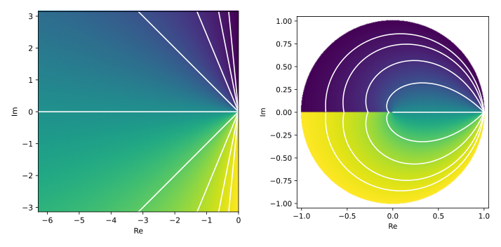
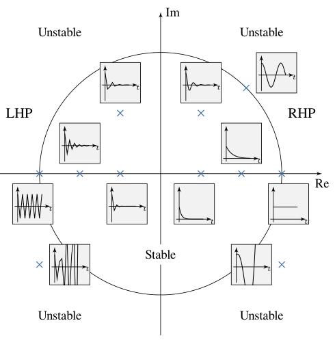
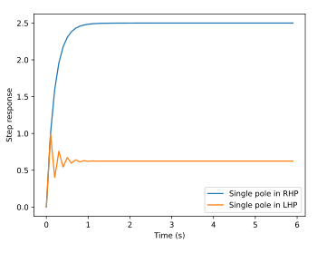
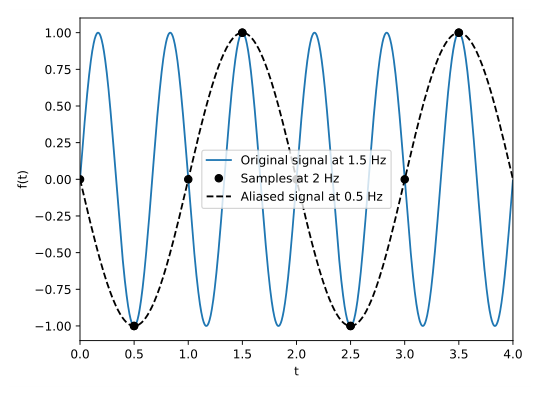
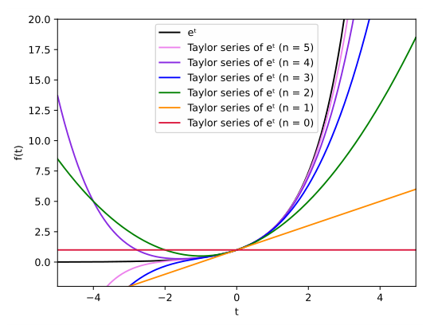
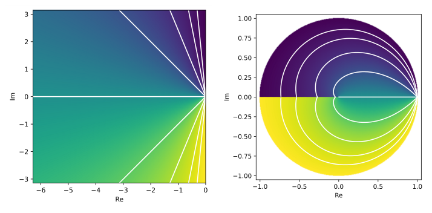
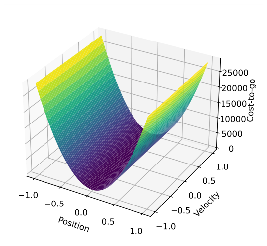
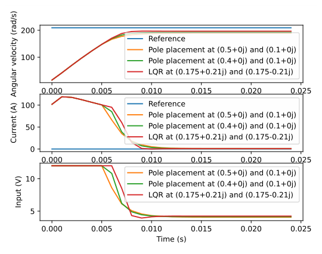
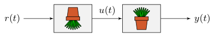
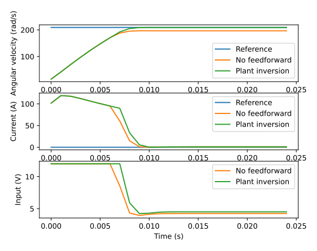

# Chapter 7: Discrete state-space control

The complex plane discussed so far deals with continuous systems. In decades past, plants and controllers were implemented using analog electronics, which are continuous in nature. Nowadays, microprocessors can be used to achieve cheaper, less complex controller designs. Discretization converts the continuous model we’ve worked with so far from a differential equation like

$$
\begin{aligned}
\dot{x} &= x - 3
\end{aligned} \tag{7.1}
$$

to a difference equation like

$$
\begin{aligned}
\frac{x_{k+1} - x_k}{\Delta T} &= x_k - 3 \\
x_{k+1} - x_k &= (x_k - 3) \Delta T \\
x_{k+1} &= x_k + (x_k - 3) \Delta T
\end{aligned} \tag{7.2}
$$

where $x_k$ refers to the value of $x$ at the $k^{th}$ timestep. The difference equation is run with some update period denoted by $T$, by $\Delta T$, or sometimes sloppily by $dt$.[^1]

While higher order terms of a differential equation are derivatives of the state variable (e.g., $\ddot{x}$ in relation to equation (7.1)), higher order terms of a difference equation are delayed copies of the state variable (e.g., $x_{k-1}$ with respect to $x_k$ in equation (7.2)).

## 7.1 Continuous to discrete pole mapping

When a continuous system is discretized, its poles in the LHP map to the inside of a unit circle. Table 7.1 contains a few common points and figure 7.1 shows the mapping visually.

*Table 7.1: Mapping from continuous to discrete*

| **Continuous** |    **Discrete**     |
|:--------------:|:-------------------:|
|    $(0, 0)$    |      $(1, 0)$       |
| imaginary axis | edge of unit circle |
| $(-\infty, 0)$ |      $(0, 0)$       |



*Figure 7.1: Mapping of complex plane from continuous (left) to discrete (right)*

### 7.1.1 Discrete system stability

Eigenvalues of a system that are within the unit circle are stable. To demonstrate this, consider the discrete system $x_{k + 1} = ax_k$ where $a$ is a complex number. $|a| < 1$ will make $x_{k + 1}$ converge to zero.

### 7.1.2 Discrete system behavior

Figure 7.2 shows the impulse responses in the time domain for systems with various pole locations in the complex plane (real numbers on the x-axis and imaginary numbers on the y-axis). Each response has an initial condition of $1$.



*Figure 7.2: Discrete impulse response vs pole location*

As $\omega$ increases in $s = j\omega$, a pole in the discrete plane moves around the perimeter of the unit circle. Once it hits $\frac{\omega_s}{2}$ (half the sampling frequency) at $(-1, 0)$, the pole wraps around. This is due to poles faster than the sample frequency folding down to below the sample frequency (that is, higher frequency signals *alias* to lower frequency ones).

Placing the poles at $(0, 0)$ produces a *deadbeat controller*. An $\rm N^{th}$-order deadbeat controller decays to the reference in N timesteps. While this sounds great, there are other considerations like control effort, robustness, and noise immunity.

Poles in the left half-plane cause jagged outputs because the frequency of the system dynamics is above the Nyquist frequency (twice the sample frequency). The discretized signal doesn’t have enough samples to reconstruct the continuous system’s dynamics. See figures 7.3 and 7.4 for examples.



*Figure 7.3: Single poles in various locations in discrete plane*


*Figure 7.4: Complex conjugate poles in various locations in discrete plane*

### 7.1.3 Nyquist frequency

To completely reconstruct a signal, the Nyquist-Shannon sampling theorem states that it must be sampled at a frequency at least twice the maximum frequency it contains. The highest frequency a given sample rate can capture is called the Nyquist frequency, which is half the sample frequency. This is why recorded audio is sampled at $44.1$ kHz. The maximum frequency a typical human can hear is about $20$ kHz, so the Nyquist frequency is $20$ kHz and the minimum sampling frequency is $40$ kHz. ($44.1$ kHz in particular was chosen for unrelated historical reasons.)

Frequencies above the Nyquist frequency are folded down across it. The higher frequency and the folded down lower frequency are said to alias each other.[^2] Figure 7.5 demonstrates aliasing.



*Figure 7.5: The original signal is a $1.5$ Hz sine wave, which means its Nyquist frequency is $1.5$ Hz. The signal is being sampled at $2$ Hz, so the aliased signal is a $0.5$ Hz sine wave.*

The effect of these high-frequency aliases can be reduced with a low-pass filter (called an anti-aliasing filter in this application).

## 7.2 Effects of discretization on controller performance

### 7.2.1 Sample delay

Implementing a discrete control system is easier than implementing a continuous one, but discretization has drawbacks. A microcontroller updates the system input in discrete intervals of duration $T$; it’s held constant between updates. This introduces an average sample delay of $\frac{T}{2}$. Large delays can make a stable controller in the continuous domain become unstable in the discrete domain since it can’t react as quickly to output changes. Here are a few ways to combat this.

- Run the controller with a high sample rate.

- Designing the controller in the analog domain with enough phase margin to compensate for any phase loss that occurs as part of discretization.

- Convert the plant to the digital domain and design the controller completely in the digital domain.

### 7.2.2 Sample rate

Running a feedback controller at a faster update rate doesn’t always mean better control. In fact, you may be using more computational resources than you need. However, here are some reasons for running at a faster update rate.

Firstly, if you have a discrete model of the system, that model can more accurately approximate the underlying continuous system. Not all controllers use a model though.

Secondly, the controller can better handle fast system dynamics. If the system can move from its initial state to the desired one in under $250$ ms, you obviously want to run the controller with a period less than $250$ ms. When you reduce the sample period, you’re making the discrete controller more accurately reflect what the equivalent continuous controller would do (controllers built from analog circuit components like op-amps are continuous).

Running at a lower sample rate only causes problems if you don’t take into account the response time of your system. Some systems like heaters have outputs that change on the order of minutes. Running a control loop at $1$ kHz doesn’t make sense for this because the plant input the controller computes won’t change much, if at all, in $1$ ms.

## 7.3 Linear system discretization

We’re going to discretize the following continuous time state-space model

$$
\begin{aligned}
\dot{\mathbf{x}} &= \mathbf{A}_c\mathbf{x} + \mathbf{B}_c\mathbf{u} + \mathbf{w} \\
\mathbf{y} &= \mathbf{C}_c\mathbf{x} + \mathbf{D}_c\mathbf{u} + \mathbf{v}
\end{aligned}
$$

where $\mathbf{w}$ is the process noise, $\mathbf{v}$ is the measurement noise, and both are zero-mean white noise sources with covariances of $\mathbf{Q}_c$ and $\mathbf{R}_c$ respectively. $\mathbf{w}$ and $\mathbf{v}$ are defined as normally distributed random variables.

$$
\begin{aligned}
\mathbf{w} &\sim N(0, \mathbf{Q}_c) \\
\mathbf{v} &\sim N(0, \mathbf{R}_c)
\end{aligned}
$$

Discretization is done using a zero-order hold. That is, the input is only updated at discrete intervals and it’s held constant between samples.

### 7.3.1 Taylor series

> **Remark.** Watch the “Taylor series” video from 3Blue1Brown’s *Essence of calculus* series for an explanation of how the Taylor series expansion works.
>
> > **Video:** [“Taylor series” (22 minutes)](https://www.3blue1brown.com/lessons/taylor-series/) — 3Blue1Brown

The definition for the matrix exponential and the approximations below all use the *Taylor series expansion*. The Taylor series is a method of approximating a function like $e^t$ via the summation of weighted polynomial terms like $t^k$. $e^t$ has the following Taylor series around $t = 0$.

$$
e^t = \sum_{n = 0}^\infty \frac{t^n}{n!}
$$

where a finite upper bound on the number of terms produces an approximation of $e^t$. As $n$ increases, the polynomial terms increase in power and the weights by which they are multiplied decrease. For $e^t$ and some other functions, the Taylor series expansion equals the original function for all values of $t$ as the number of terms approaches infinity.[^3] Figure 7.6 shows the Taylor series expansion of $e^t$ around $t = 0$ for a varying number of terms.



*Figure 7.6: Taylor series expansions of $e^t$ around $t = 0$ for $n$ terms*

We’ll expand the first few terms of the Taylor series expansion in equation (7.3) for $\mathbf{X} = \mathbf{A}T$ so we can compare it with other methods.

$$
\sum_{k=0}^3 \frac{1}{k!} (\mathbf{A}T)^k = \mathbf{I} + \mathbf{A}T +
    \frac{1}{2}\mathbf{A}^2T^2 + \frac{1}{6}\mathbf{A}^3T^3
$$

Table 7.2 compares discretization methods for the matrix case, and table 7.3 compares their Taylor series expansions. These use a more complex formula which we won’t present here.

*Table 7.2: Discretization methods (matrix case). The zero-order hold discretization method is exact.*

| **Method** | **Conversion to $\mathbf{A}_d$** |
|:--:|:---|
| Zero-order hold | $e^{\mathbf{A}_c T}$ |
| Bilinear | $\left(\mathbf{I} + \frac{1}{2}\mathbf{A}_c T\right) \left(\mathbf{I} - \frac{1}{2}\mathbf{A}_c T\right)^{-1}$ |
| Backward Euler | $\left(\mathbf{I} - \mathbf{A}_c T\right)^{-1}$ |
| Forward Euler | $\mathbf{I} + \mathbf{A}_c T$ |

*Table 7.3: Taylor series expansions of discretization methods (matrix case). The zero-order hold discretization method is exact.*

| **Method** | **Taylor series expansion** |
|:--:|:---|
| Zero-order hold | $\mathbf{I} + \mathbf{A}_c T + \frac{1}{2}\mathbf{A}_c^2T^2 + \frac{1}{6}\mathbf{A}_c^3T^3 + \ldots$ |
| Bilinear | $\mathbf{I} + \mathbf{A}_c T + \frac{1}{2}\mathbf{A}_c^2T^2 + \frac{1}{4}\mathbf{A}_c^3T^3 + \ldots$ |
| Backward Euler | $\mathbf{I} + \mathbf{A}_c T + \mathbf{A}_c^2T^2 + \mathbf{A}_c^3T^3 + \ldots$ |
| Forward Euler | $\mathbf{I} + \mathbf{A}_c T$ |

Each of them has different stability properties. The bilinear transform preserves the (in)stability of the continuous time system.

### 7.3.2 Matrix exponential

> **Remark.** Watch the “How (and why) to raise e to the power of a matrix” video from 3Blue1Brown’s *Essence of linear algebra* series for a visual introduction to the matrix exponential.
>
> > **Video:** [“How (and why) to raise e to the power of a matrix” (27 minutes)](https://www.3blue1brown.com/lessons/matrix-exponents/) — 3Blue1Brown

> **Definition 7.3.1 — Matrix exponential.**
>
> Let $\mathbf{X}$ be an $n \times n$ matrix. The exponential of $\mathbf{X}$ denoted by $e^{\mathbf{X}}$ is the $n \times n$ matrix given by the following power series.
>
> $$
> e^{\mathbf{X}} = \sum_{k=0}^\infty \frac{1}{k!} \mathbf{X}^k \tag{7.3}
> $$
>
> where $\mathbf{X}^0$ is defined to be the identity matrix $\mathbf{I}$ with the same dimensions as $\mathbf{X}$.

To understand why the matrix exponential is used in the discretization process, consider the scalar differential equation $\dot{x} = ax$. The solution to this type of differential equation uses an exponential.

$$
\begin{aligned}
\dot{x} &= ax \\
\frac{dx}{dt} &= ax(t) \\
dx &= ax(t) \,dt \\
\frac{1}{x(t)} \,dx &= a \,dt \\
\int_0^t \frac{1}{x(t)} \,dx &= \int_0^t a \,dt \\
\ln(x(t)) \rvert_0^t &= at \rvert_0^t \\
\ln(x(t)) - \ln(x(0)) &= at - a \cdot 0 \\
\ln(x(t)) - \ln(x_0) &= at \\
\ln\left(\frac{x(t)}{x_0}\right) &= at \\
\frac{x(t)}{x_0} &= e^{at} \\
x(t) &= e^{at} x_0
\end{aligned}
$$

This solution generalizes via the matrix exponential to the set of differential equations $\dot{\mathbf{x}} = \mathbf{A}\mathbf{x} + \mathbf{B}\mathbf{u}$ we use to describe systems.[^4]

$$
\mathbf{x}(t) = e^{\mathbf{A}t} \mathbf{x}_0 +
    \mathbf{A}^{-1}(e^{\mathbf{A}t} - \mathbf{I})\mathbf{B} \mathbf{u}
$$

where $\mathbf{x}_0$ contains the initial conditions and $\mathbf{u}$ is the constant input from time $0$ to $t$. If the initial state is the current system state, then we can describe the system’s state over time as

$$
\begin{aligned}
\mathbf{x}_{k+1} &= e^{\mathbf{A}T} \mathbf{x}_k +
    \mathbf{A}^{-1}(e^{\mathbf{A}T} - \mathbf{I})\mathbf{B} \mathbf{u}_k
\end{aligned}
$$

or more compactly,

$$
\begin{aligned}
\mathbf{x}_{k+1} &= \mathbf{A}_d\mathbf{x}_k + \mathbf{B}_d\mathbf{u}_k
\end{aligned}
$$

where $T$ is the time between samples $\mathbf{x}_k$ and $\mathbf{x}_{k+1}$. Theorem 7.3.1 has more efficient ways to compute $\mathbf{A}_d$ and $\mathbf{B}_d$.

### 7.3.3 Definition

The model can be discretized as follows

$$
\begin{aligned}
\mathbf{x}_{k+1} &= \mathbf{A}_d \mathbf{x}_k + \mathbf{B}_d \mathbf{u}_k + \mathbf{w}_k \\
\mathbf{y}_k &= \mathbf{C}_d \mathbf{x}_k + \mathbf{D}_d \mathbf{u}_k + \mathbf{v}_k
\end{aligned}
$$

with covariances

$$
\begin{aligned}
\mathbf{w}_k &\sim N(0, \mathbf{Q}_d) \\
\mathbf{v}_k &\sim N(0, \mathbf{R}_d)
\end{aligned}
$$

> **Theorem 7.3.1 — Linear system zero-order hold.**
>
> $$
> \begin{aligned}
> \mathbf{A}_d &= e^{\mathbf{A}_c T} \\
> \mathbf{B}_d &= \int_0^T e^{\mathbf{A}_c \tau} d\tau \mathbf{B}_c =
>       \mathbf{A}_c^{-1} (\mathbf{A}_d - \mathbf{I}) \mathbf{B}_c \\
> \mathbf{C}_d &= \mathbf{C}_c \\
> \mathbf{D}_d &= \mathbf{D}_c \\
> \mathbf{Q}_d &= \int_{\tau = 0}^{T} e^{\mathbf{A}_c\tau} \mathbf{Q}_c
>       e^{\mathbf{A}_c^{\mathsf{T}}\tau} d\tau \\
> \mathbf{R}_d &= \frac{1}{T}\mathbf{R}_c
> \end{aligned}
> $$
>
> where subscripts $c$ and $d$ denote matrices for the continuous or discrete systems respectively, $T$ is the sample period of the discrete system, and $e^{\mathbf{A}_c T}$ is the matrix exponential of $\mathbf{A}_c T$.

See appendix [D.1](D-derivations.md#d1-linear-system-zero-order-hold) for derivations.

$\mathbf{A}_d$ and $\mathbf{B}_d$ can be computed in one step as

$$
e^{
  \begin{bmatrix}
    \mathbf{A}_c & \mathbf{B}_c \\
    \mathbf{0} & \mathbf{0}
  \end{bmatrix}T} =
  \begin{bmatrix}
    \mathbf{A}_d & \mathbf{B}_d \\
    \mathbf{0} & \mathbf{I}
  \end{bmatrix}
$$

and $\mathbf{Q}_d$ can be computed as

$$
\Phi = e^{
  \begin{bmatrix}
    -\mathbf{A}_c & \mathbf{Q}_c \\
    \mathbf{0} & \mathbf{A}_c^{\mathsf{T}}
  \end{bmatrix}T} =
  \begin{bmatrix}
    -\mathbf{A}_d & \mathbf{A}_d^{-1} \mathbf{Q}_d \\
    \mathbf{0} & \mathbf{A}_d^{\mathsf{T}}
  \end{bmatrix}
$$

where $\mathbf{Q}_d = \Phi_{2,2}^{\mathsf{T}} \Phi_{1,2}$.[^5]

To see why $\mathbf{R}_c$ is being divided by $T$, consider the discrete white noise sequence $\mathbf{v}_k$ and the (non-physically realizable) continuous white noise process $\mathbf{v}$. Whereas $\mathbf{R}_{d,k} = E[\mathbf{v}_k \mathbf{v}_k^{\mathsf{T}}]$ is a covariance matrix, $\mathbf{R}_c(t)$ defined by $E[\mathbf{v}(t) \mathbf{v}^{\mathsf{T}}(\tau)] = \mathbf{R}_c(t)\delta(t - \tau)$ is a spectral density matrix (the Dirac function $\delta(t - \tau)$ has units of $1/\text{sec}$). The covariance matrix $\mathbf{R}_c(t)\delta(t - \tau)$ has infinite-valued elements. The discrete white noise sequence can be made to approximate the continuous white noise process by shrinking the pulse lengths ($T$) and increasing their amplitude, such that $\mathbf{R}_d \rightarrow \frac{1}{T}\mathbf{R}_c$.

That is, in the limit as $T \rightarrow 0$, the discrete noise sequence tends to one of infinite-valued pulses of zero duration such that the area under the “impulse” autocorrelation function is $\mathbf{R}_d T$. This is equal to the area $\mathbf{R}_c$ under the continuous white noise impulse autocorrelation function.

## 7.4 Discrete state-space notation

Below is the discrete version of state-space notation.

> **Definition 7.4.1 — Discrete state-space notation.**
>
> $$
> \begin{aligned}
> \mathbf{x}_{k+1} &= \mathbf{A}\mathbf{x}_k + \mathbf{B}\mathbf{u}_k \\
> \mathbf{y}_k &= \mathbf{C}\mathbf{x}_k + \mathbf{D}\mathbf{u}_k
> \end{aligned} \tag{7.10\text{--}7.11}
> $$
>
> |              |                    |              |               |
> |:-------------|:-------------------|:-------------|:--------------|
> | $\mathbf{A}$ | system matrix      | $\mathbf{x}$ | state vector  |
> | $\mathbf{B}$ | input matrix       | $\mathbf{u}$ | input vector  |
> | $\mathbf{C}$ | output matrix      | $\mathbf{y}$ | output vector |
> | $\mathbf{D}$ | feedthrough matrix |              |               |

## 7.5 Closed-loop controller

With the control law $\mathbf{u}_k = \mathbf{K}(\mathbf{r}_k - \mathbf{x}_k)$, we can derive the closed-loop state-space equations. We’ll discuss where this control law comes from in subsection [7.7](#77-linear-quadratic-regulator).

First is the state update equation. Substitute the control law into equation (7.10).

$$
\begin{aligned}
\mathbf{x}_{k+1} &= \mathbf{A}\mathbf{x}_k + \mathbf{B}\mathbf{K}(\mathbf{r}_k - \mathbf{x}_k) \\
\mathbf{x}_{k+1} &= \mathbf{A}\mathbf{x}_k + \mathbf{B}\mathbf{K}\mathbf{r}_k -
    \mathbf{B}\mathbf{K}\mathbf{x}_k \\
\mathbf{x}_{k+1} &= (\mathbf{A} - \mathbf{B}\mathbf{K})\mathbf{x}_k + \mathbf{B}\mathbf{K}\mathbf{r}_k
\end{aligned} \tag{7.12}
$$

Now for the output equation. Substitute the control law into equation (7.11).

$$
\begin{aligned}
\mathbf{y}_k &= \mathbf{C}\mathbf{x}_k + \mathbf{D}(\mathbf{K}(\mathbf{r}_k - \mathbf{x}_k)) \\
\mathbf{y}_k &= \mathbf{C}\mathbf{x}_k + \mathbf{D}\mathbf{K}\mathbf{r}_k -
    \mathbf{D}\mathbf{K}\mathbf{x}_k \\
\mathbf{y}_k &= (\mathbf{C} - \mathbf{D}\mathbf{K})\mathbf{x}_k + \mathbf{D}\mathbf{K}\mathbf{r}_k
\end{aligned}
$$

Instead of commanding the system to a state using the vector $\mathbf{u}_k$ directly, we can now specify a vector of desired states through $\mathbf{r}_k$ and the controller will choose values of $\mathbf{u}_k$ for us over time that drive the system toward the reference.

The eigenvalues of $\mathbf{A} - \mathbf{B}\mathbf{K}$ are the poles of the closed-loop system. Therefore, the rate of convergence and stability of the closed-loop system can be changed by moving the poles via the eigenvalues of $\mathbf{A} - \mathbf{B}\mathbf{K}$. $\mathbf{A}$ and $\mathbf{B}$ are inherent to the system, but $\mathbf{K}$ can be chosen arbitrarily by the controller designer. For equation (7.12) to reach steady-state, the eigenvalues of $\mathbf{A} - \mathbf{B}\mathbf{K}$ must be in the left-half plane. There will be steady-state error if $\mathbf{A}\mathbf{r}_k \ne \mathbf{r}_k$.

*Table 7.4: Controller matrix dimensions*

| **Symbol**   | **Name**               | **Rows $\times$ Columns** |
|:-------------|:-----------------------|:--------------------------|
| $\mathbf{A}$ | system matrix          | states $\times$ states    |
| $\mathbf{B}$ | input matrix           | states $\times$ inputs    |
| $\mathbf{C}$ | output matrix          | outputs $\times$ states   |
| $\mathbf{D}$ | feedthrough matrix     | outputs $\times$ inputs   |
| $\mathbf{K}$ | controller gain matrix | inputs $\times$ states    |
| $\mathbf{r}$ | reference vector       | states $\times$ 1         |
| $\mathbf{x}$ | state vector           | states $\times$ 1         |
| $\mathbf{u}$ | input vector           | inputs $\times$ 1         |
| $\mathbf{y}$ | output vector          | outputs $\times$ 1        |

## 7.6 Pole placement

This is the practice of placing the poles of a closed-loop system directly to produce a desired response. Python Control offers several pole placement algorithms for generating controller or observer gains from a set of poles.

Since all our applications will be discrete systems, we’ll place poles in the discrete domain (the z-plane). The s-plane’s LHP maps to the inside of a unit circle (see figure 7.7).



*Figure 7.7: Mapping of complex plane from continuous (left) to discrete (right)*

Pole placement should only be used if you know what you’re doing. It’s much easier to let LQR place the poles for you, which we’ll discuss next.

## 7.7 Linear-quadratic regulator

### 7.7.1 The intuition

We can demonstrate the basic idea behind the linear-quadratic regulator with the following flywheel model.

$$
\dot{x} = ax + bu
$$

where $a$ is a negative constant representing the back-EMF of the motor, $x$ is the angular velocity, $b$ is a positive constant that maps the input voltage to some change in angular velocity (angular acceleration), $u$ is the voltage applied to the motor, and $\dot{x}$ is the angular acceleration. Discretized, this equation would look like

$$
x_{k+1} = a_d x + b_d u_k
$$

If the angular velocity starts from zero and we apply a positive voltage, we’d see the motor spin up to some constant speed following an exponential decay, then stay at that speed. If we throw in the control law $u_k = k_p(r_k - x_k)$, we can make the system converge to a desired state $r_k$ through proportional feedback. In what manner can we pick the constant $k_p$ that balances getting to the target angular velocity quickly with getting there efficiently (minimal oscillations or excessive voltage)?

We can solve this problem with something called the linear-quadratic regulator. We’ll define the following cost function that includes the states and inputs:

$$
J = \sum_{k=0}^\infty (Q(r_k - x_k)^2 + Ru_k^2)
$$

We want to minimize this while obeying the constraint that the system follow our flywheel dynamics $x_{k+1} = a_d x_k + b_d u_k$.

The cost is the sum of the squares of the error and the input for all time. If the controller gain $k_p$ we pick in the control law $u_k = k_p(r_k - x_k)$ is stable, the error $r_k - x_k$ and the input $u_k$ will both go to zero and give us a finite cost. $Q$ and $R$ let us decide how much the error and input contribute to the cost (we will require that $Q \geq 0$ and $R > 0$ for reasons that will be clear shortly[^6]). Penalizing error more will make the controller more aggressive, while penalizing the input more will make the controller less aggressive. We want to pick a $k_p$ that minimizes the cost.

There’s a common trick for finding the value of a variable that minimizes a function of that variable. We’ll take the derivative (the slope) of the cost function with respect to the input $u_k$, set the derivative to zero, then solve for $u_k$. When the slope is zero, the function is at a minimum or maximum. Now, the cost function we picked is quadratic. All the terms are strictly positive on account of the squared variables and nonnegative weights, so our cost is strictly positive and the quadratic function is concave up. The $u_k$ we found is therefore a minimum.

The actual process of solving for $u_k$ is mathematically intensive and outside the scope of this explanation (appendix [B.1](B-linear-quadratic-regulator.md#b1-derivation) references a derivation for those curious). The rest of this section will describe the more general form of the linear-quadratic regulator and how to use it.

### 7.7.2 The mathematical definition

Instead of placing the poles of a closed-loop system manually, the linear-quadratic regulator (LQR) places the poles for us based on acceptable relative error and control effort costs. This method of controller design uses a quadratic function for the cost-to-go defined as the sum of the error and control effort over time for the linear system $\mathbf{x}_{k+1} = \mathbf{A}\mathbf{x}_k + \mathbf{B}\mathbf{u}_k$.

$$
J = \sum_{k=0}^\infty \left(\mathbf{x}_k^{\mathsf{T}}\mathbf{Q}\mathbf{x}_k +
    \mathbf{u}_k^{\mathsf{T}}\mathbf{R}\mathbf{u}_k\right)
$$

where $J$ represents a trade-off between state excursion and control effort with the weighting factors $\mathbf{Q}$ and $\mathbf{R}$. LQR is a control law $\mathbf{u}$ that minimizes the cost functional. Figure 7.8 shows the optimal cost-to-go for an elevator model. Pole placement, on the other hand, will have a cost-to-go above this for an arbitrary state vector (in this case, an arbitrary position-velocity pair).



*Figure 7.8: Cost-to-go for elevator model*

The cost-to-go looks effectively constant along the velocity axis because the velocity is contributing much less to the cost-to-go than position.[^7] In other words, it’s much more expensive to correct for a position error than a velocity error. This difference in cost is reflected by LQR’s selected position feedback gain of $K_p = 234.041$ and selected velocity feedback gain of $K_d = 5.603$.

The minimum of LQR’s cost functional is found by setting the derivative of the cost functional to zero and solving for the control law $\mathbf{u}_k$. However, matrix calculus is used instead of normal calculus to take the derivative.

The feedback control law that minimizes $J$ is shown in theorem 7.7.1.

> **Theorem 7.7.1 — Linear-quadratic regulator.**
>
> $$
> \begin{aligned}
> \mathbf{u}_k^* = \operatorname*{arg\,min}_{\mathbf{u}_k} &\sum\limits_{k=0}^\infty
>       \left(\mathbf{x}_k^{\mathsf{T}}\mathbf{Q}\mathbf{x}_k + \mathbf{u}_k^{\mathsf{T}}\mathbf{R}\mathbf{u}_k\right) \\
> \text{subject to } &\mathbf{x}_{k+1} = \mathbf{A}\mathbf{x}_k + \mathbf{B}\mathbf{u}_k
> \end{aligned}
> $$
>
> If the system is controllable, the optimal control policy $\mathbf{u}_k^*$ that drives all the states to zero is $-\mathbf{K}\mathbf{x}_k$. To converge to nonzero states, a reference vector $\mathbf{r}_k$ can be added to the state $\mathbf{x}_k$.
>
> $$
> \mathbf{u}_k = \mathbf{K}(\mathbf{r}_k - \mathbf{x}_k)
> $$
>

This means that optimal control can be achieved with simply a set of proportional gains on all the states. To use the control law, we need knowledge of the full state of the system. That means we either have to measure all our states directly or estimate those we do not measure.

See appendix [B.1](B-linear-quadratic-regulator.md#b1-derivation) for how $\mathbf{K}$ is calculated. If the result is finite, the controller is guaranteed to be stable and robust with a gain margin of infinity and a phase margin of 60 degrees (see appendix [B.2](B-linear-quadratic-regulator.md#b2-gain-and-phase-margin)). However, using a state estimator forfeits the robustness guarantees.[^8]

> **Remark.** LQR design’s $\mathbf{Q}$ and $\mathbf{R}$ matrices don’t need discretization, but the $\mathbf{K}$ calculated for continuous time and discrete time systems will be different. The discrete time gains approach the continuous time gains as the sample period tends to zero.

### 7.7.3 Bryson’s rule

Tuning $\mathbf{Q}$ and $\mathbf{R}$ is more art than science, but Bryson’s rule [^9] provides a good starting point. Bryson’s rule sets $\mathbf{Q}$’s diagonal to the inverse square of the acceptable state excursions and $\mathbf{R}$’s diagonal to the inverse square of the acceptable control efforts. The nondiagonal elements are zero.

$$
\mathbf{Q} = \operatorname{diag}\left(\frac{\rho}{\mathbf{x}_{max}^2}\right)
  \quad
  \mathbf{R} = \operatorname{diag}\left(\frac{1}{\mathbf{u}_{max}^2}\right)
$$

where $\mathbf{x}_{max}$ is the vector of acceptable state excursions, $\mathbf{u}_{max}$ is the vector of acceptable control efforts, and $\rho$ is a weighting factor that adjusts the balance between state excursion and control effort penalty. Small values of $\rho$ penalize control effort while large values of $\rho$ penalize state excursions. Large values would be chosen in applications like fighter jets where performance is necessary. Spacecrafts would use small values to conserve their limited fuel supply.

### 7.7.4 Pole placement vs LQR

This example uses the following continuous second-order model for a CIM motor (a DC motor).

$$
\begin{aligned}
\mathbf{A} = \begin{bmatrix}
    -\frac{b}{J} & \frac{K_t}{J} \\
    -\frac{K_e}{L} & -\frac{R}{L}
  \end{bmatrix}
  \quad
  \mathbf{B} = \begin{bmatrix}
    0 \\
    \frac{1}{L}
  \end{bmatrix}
  \quad
  \mathbf{C} = \begin{bmatrix}
    1 & 0
  \end{bmatrix}
  \quad
  \mathbf{D} = \begin{bmatrix}
    0
  \end{bmatrix}
\end{aligned}
$$

Figure 7.9 shows the response using various discrete pole placements and using LQR with the following cost matrices.

$$
\begin{aligned}
\mathbf{Q} = \begin{bmatrix}
    \frac{1}{20^2} & 0 \\
    0 & 0
  \end{bmatrix}
  \quad
  \mathbf{R} = \begin{bmatrix}
    \frac{1}{12^2}
  \end{bmatrix}
\end{aligned}
$$

With Bryson’s rule, this means an angular velocity tolerance of $20$ rad/s, an infinite current tolerance (in other words, we don’t care what the current does), and a voltage tolerance of $12$ V.



*Figure 7.9: Second-order CIM motor response with pole placement and LQR*

Notice with pole placement that as the current pole moves toward the origin, the control effort becomes more aggressive.

## 7.8 Feedforward

There are two types of feedforwards: model-based feedforward and feedforward for unmodeled dynamics. The first solves a mathematical model of the system for the inputs required to meet desired velocities and accelerations. The second compensates for unmodeled forces or behaviors directly so the feedback controller doesn’t have to. Both types can facilitate simpler feedback controllers; we’ll cover examples of each.

### 7.8.1 Plant inversion

Plant inversion is a method of model-based feedforward that solves the plant for the input that will make the plant track a desired state. This is called inversion because in a block diagram, the inverted plant feedforward and plant cancel out to produce a unity system from input to output.



*Figure 7.10: Open-loop control system with plant inversion feedforward*

While it can be an effective tool, the following should be kept in mind.

1.  Don’t invert an unstable plant. If the expected plant doesn’t match the real plant exactly, the plant inversion will still result in an unstable system. Stabilize the plant first with feedback, then inject an inversion.

2.  Don’t invert a nonminimum phase system. The advice for pole-zero cancellation in subsection [Pole-zero cancellation](E-classical-control-theory.md#pole-zero-cancellation) applies here.

#### Setup

Let’s start with the equation for the reference dynamics

$$
\mathbf{r}_{k+1} = \mathbf{A}\mathbf{r}_k + \mathbf{B}\mathbf{u}_k
$$

where $\mathbf{u}_k$ is the feedforward input. Note that this feedforward equation does not and should not take into account any feedback terms. We want to find the optimal $\mathbf{u}_k$ such that we minimize the tracking error between $\mathbf{r}_{k+1}$ and $\mathbf{r}_k$.

$$
\mathbf{r}_{k+1} - \mathbf{A}\mathbf{r}_k = \mathbf{B}\mathbf{u}_k
$$

To solve for $\mathbf{u}_k$, we need to take the inverse of the nonsquare matrix $\mathbf{B}$. This isn’t possible, but we can find the pseudoinverse given some constraints on the state tracking error and control effort. To find the optimal solution for these sorts of trade-offs, one can define a cost function and attempt to minimize it. To do this, we’ll first solve the expression for $\mathbf{0}$.

$$
\mathbf{0} = \mathbf{B}\mathbf{u}_k - (\mathbf{r}_{k+1} - \mathbf{A}\mathbf{r}_k)
$$

This expression will be the state tracking cost we use in the following cost function as an $H_2$ norm.

$$
\mathbf{J} = (\mathbf{B}\mathbf{u}_k - (\mathbf{r}_{k+1} - \mathbf{A}\mathbf{r}_k))^{\mathsf{T}}
    (\mathbf{B}\mathbf{u}_k - (\mathbf{r}_{k+1} - \mathbf{A}\mathbf{r}_k))
$$

#### Minimization

Given theorem 5.15.1, find the minimum of $\mathbf{J}$ by taking the partial derivative with respect to $\mathbf{u}_k$ and setting the result to $\mathbf{0}$.

$$
\begin{aligned}
\frac{\partial\mathbf{J}}{\partial\mathbf{u}_k} &= 2\mathbf{B}^{\mathsf{T}}
    (\mathbf{B}\mathbf{u}_k - (\mathbf{r}_{k+1} - \mathbf{A}\mathbf{r}_k)) \\
\mathbf{0} &= 2\mathbf{B}^{\mathsf{T}}
    (\mathbf{B}\mathbf{u}_k - (\mathbf{r}_{k+1} - \mathbf{A}\mathbf{r}_k)) \\
\mathbf{0} &= 2\mathbf{B}^{\mathsf{T}}\mathbf{B}\mathbf{u}_k -
    2\mathbf{B}^{\mathsf{T}}(\mathbf{r}_{k+1} - \mathbf{A}\mathbf{r}_k) \\
2\mathbf{B}^{\mathsf{T}}\mathbf{B}\mathbf{u}_k &=
    2\mathbf{B}^{\mathsf{T}}(\mathbf{r}_{k+1} - \mathbf{A}\mathbf{r}_k) \\
\mathbf{B}^{\mathsf{T}}\mathbf{B}\mathbf{u}_k &=
    \mathbf{B}^{\mathsf{T}}(\mathbf{r}_{k+1} - \mathbf{A}\mathbf{r}_k) \\
\mathbf{u}_k &=
    (\mathbf{B}^{\mathsf{T}}\mathbf{B})^{-1} \mathbf{B}^{\mathsf{T}}(\mathbf{r}_{k+1} - \mathbf{A}\mathbf{r}_k)
\end{aligned}
$$

$(\mathbf{B}^{\mathsf{T}}\mathbf{B})^{-1} \mathbf{B}^{\mathsf{T}}$ is the left Moore-Penrose pseudoinverse of $\mathbf{B}$ denoted by $\mathbf{B}^+$.

> **Theorem 7.8.1 — Linear plant inversion.**
>
> Given the discrete model $\mathbf{x}_{k+1} = \mathbf{A}\mathbf{x}_k + \mathbf{B}\mathbf{u}_k$, the plant inversion feedforward is
>
> $$
> \mathbf{u}_k = \mathbf{B}^+ (\mathbf{r}_{k+1} - \mathbf{A}\mathbf{r}_k)
> $$
>
> where $\mathbf{B}^+$ is the Moore-Penrose pseudoinverse of $\mathbf{B}$, $\mathbf{r}_{k+1}$ is the reference at the next timestep, and $\mathbf{r}_k$ is the reference at the current timestep.

#### Discussion

Linear plant inversion in theorem 7.8.1 compensates for reference dynamics that don’t follow how the model inherently behaves. If they do follow the model, the feedforward has nothing to do as the model already behaves in the desired manner. When this occurs, $\mathbf{r}_{k+1} - \mathbf{A}\mathbf{r}_k$ will return a zero vector.

For example, a constant reference requires a feedforward that opposes system dynamics that would change the state over time. If the system has no dynamics, then $\mathbf{A} = \mathbf{I}$ and thus

$$
\begin{aligned}
\mathbf{u}_k &= \mathbf{B}^+ (\mathbf{r}_{k+1} - \mathbf{I}\mathbf{r}_k) \\
\mathbf{u}_k &= \mathbf{B}^+ (\mathbf{r}_{k+1} - \mathbf{r}_k)
\end{aligned}
$$

For a constant reference, $\mathbf{r}_{k+1} = \mathbf{r}_k$.

$$
\begin{aligned}
\mathbf{u}_k &= \mathbf{B}^+ (\mathbf{r}_k - \mathbf{r}_k) \\
\mathbf{u}_k &= \mathbf{B}^+ (\mathbf{0}) \\
\mathbf{u}_k &= \mathbf{0}
\end{aligned}
$$

so no feedforward is required to hold a system with no dynamics at a constant reference, as expected.

Figure 7.11 shows plant inversion applied to a second-order CIM motor model. Plant inversion accounts for the motor back-EMF and eliminates steady-state error.



*Figure 7.11: Second-order CIM motor response with plant inversion*

### 7.8.2 Unmodeled dynamics

In addition to plant inversion, one can include feedforwards for unmodeled dynamics. Consider an elevator model which doesn’t include gravity. A constant voltage offset can be used compensate for this. The feedforward takes the form of a voltage constant because voltage is proportional to force applied, and the force is acting in only one direction at all times.

$$
\begin{aligned}
u_k &= V_{app}
\end{aligned}
$$

where $V_{app}$ is a constant. Another feedforward holds a single-jointed arm steady in the presence of gravity. It has the following form.

$$
\begin{aligned}
u_k &= V_{app} \cos\theta
\end{aligned}
$$

where $V_{app}$ is the voltage required to keep the single-jointed arm level with the ground, and $\theta$ is the angle of the arm relative to the ground. Therefore, the force applied is greatest when the arm is parallel with the ground and zero when the arm is perpendicular to the ground (at that point, the joint supports all the weight).

Note that the elevator model could be augmented easily enough to include gravity and still be linear, but this wouldn’t work for the single-jointed arm since a trigonometric function is required to model the gravitational force in the arm’s rotating reference frame.[^10]

### 7.8.3 Do feedforwards affect stability?

Feedforwards have no effect on stability because they don’t use the system state. We’ll demonstrate this for a plant inversion feedforward.

Let $\mathbf{u}_k = \mathbf{K}(\mathbf{r}_k - \mathbf{x}_k)$ be a feedback controller for the discrete model $\mathbf{x}_{k+1} = \mathbf{A}\mathbf{x}_k + \mathbf{B}\mathbf{u}_k$.

$$
\begin{aligned}
\mathbf{x}_{k+1} &= \mathbf{A}\mathbf{x}_k + \mathbf{B}\mathbf{u}_k \\
\mathbf{x}_{k+1} &= \mathbf{A}\mathbf{x}_k + \mathbf{B}(\mathbf{K}(\mathbf{r}_k - \mathbf{x}_k)) \\
\mathbf{x}_{k+1} &= \mathbf{A}\mathbf{x}_k + \mathbf{B}\mathbf{K}(\mathbf{r}_k - \mathbf{x}_k) \\
\mathbf{x}_{k+1} &= \mathbf{A}\mathbf{x}_k + \mathbf{B}\mathbf{K}\mathbf{r}_k -
    \mathbf{B}\mathbf{K}\mathbf{x}_k \\
\mathbf{x}_{k+1} &= (\mathbf{A} - \mathbf{B}\mathbf{K})\mathbf{x}_k + \mathbf{B}\mathbf{K}\mathbf{r}_k
\end{aligned}
$$

The system is stable if the eigenvalues of $\mathbf{A} - \mathbf{B}\mathbf{K}$ are within the unit circle. Now add the plant inversion feedforward controller $\mathbf{B}^+(\mathbf{r}_{k+1} - \mathbf{A}\mathbf{r}_k)$ to $\mathbf{u}_k$.

$$
\begin{aligned}
\mathbf{x}_{k+1} &= \mathbf{A}\mathbf{x}_k + \mathbf{B}\mathbf{u}_k \\
\mathbf{x}_{k+1} &= \mathbf{A}\mathbf{x}_k + \mathbf{B}(\mathbf{K}(\mathbf{r}_k - \mathbf{x}_k) +
    \mathbf{B}^+(\mathbf{r}_{k+1} - \mathbf{A}\mathbf{r}_k)) \\
\mathbf{x}_{k+1} &= \mathbf{A}\mathbf{x}_k + \mathbf{B}\mathbf{K}(\mathbf{r}_k - \mathbf{x}_k) +
    \mathbf{r}_{k+1} - \mathbf{A}\mathbf{r}_k \\
\mathbf{x}_{k+1} &= \mathbf{A}\mathbf{x}_k + \mathbf{B}\mathbf{K}\mathbf{r}_k -
    \mathbf{B}\mathbf{K}\mathbf{x}_k + \mathbf{r}_{k+1} - \mathbf{A}\mathbf{r}_k \\
\mathbf{x}_{k+1} &= (\mathbf{A} - \mathbf{B}\mathbf{K})\mathbf{x}_k + \mathbf{r}_{k+1} +
    (\mathbf{B}\mathbf{K} - \mathbf{A})\mathbf{r}_k \\
\mathbf{x}_{k+1} &= (\mathbf{A} - \mathbf{B}\mathbf{K})\mathbf{x}_k + \mathbf{r}_{k+1} -
    (\mathbf{A} - \mathbf{B}\mathbf{K})\mathbf{r}_k
\end{aligned}
$$

The multiplicative term on $\mathbf{x}_k$ is still $\mathbf{A} - \mathbf{B}\mathbf{K}$, so the feedforward didn’t affect stability. It still affects the system response and steady-state error though.

## 7.9 Numerical integration methods

Most systems don’t have linear dynamics and their differential equations can’t be solved analytically. Instead, we’ll have to approximate their solutions with numerical integration.

### 7.9.1 Butcher tableaus

Butcher tableaus are a more succinct representation for explicit and implicit Runge-Kutta numerical integration methods. Here’s the general structure for explicit methods.

$$
\begin{array}{c|cccc}
    0 \\
    c_2    & a_{2,1} \\
    \vdots & \vdots & \ddots \\
    c_s    & a_{s,1} & \ldots & a_{s,s-1} \\
    \hline
           & b_1    & \ldots & \ldots    & b_s
  \end{array}
$$

where $s$ is the number of stages in the method, the matrix $[a_{ij}]$ is the Runge-Kutta matrix, $b_1, \ldots, b_s$ are the weights, and $c_1, \ldots, c_s$ are the nodes. The top-left quadrant contains the sums of the rows in the top-right quadrant. Each column in the right half corresponds to a $\mathbf{k}$ coefficient from $\mathbf{k}_1$ to $\mathbf{k}_s$.

The family of solutions to $\dot{\mathbf{x}} = f(t, \mathbf{x})$ is given by

$$
\begin{aligned}
\mathbf{k}_1 &= f(t_k, \mathbf{x}_k) \\
\mathbf{k}_2 &= f(t_k + c_2 h, \mathbf{x}_k + h (a_{2,1} \mathbf{k}_1)) \\
&\ \ \vdots \\
\mathbf{k}_s &= f(t_k + c_s h, \mathbf{x}_k +
    h (a_{s,1} \mathbf{k}_1 + \ldots + a_{s,s-1} \mathbf{k}_{s-1})) \\
\mathbf{x}_{k+1} &= \mathbf{x}_k + h \sum_{i=1}^s b_i \mathbf{k}_i
\end{aligned}
$$

where $h$ is the timestep duration.

### 7.9.2 Forward Euler method

The simplest explicit Runge-Kutta integration method is forward Euler integration. Avoid it because it suffers from numerical stability issues. We’ll demonstrate how to translate its Butcher tableau into equations that integrate $\dot{\mathbf{x}} = f(t, \mathbf{x})$ from $0$ to $h$.

$$
\begin{aligned}
\mathbf{k}_1 &= f(t +
      && {\color{blue}0} h,
      && \mathbf{x}_k)
      && \\
\mathbf{x}_{k+1} &=
      &&
      && \mathbf{x}_k + h (
      && {\color{#008000}1} \mathbf{k}_1)
\end{aligned}
$$

$$
\begin{array}{c|c}
      {\color{blue}0} \\
      \hline
      & {\color{#008000}1}
    \end{array}
$$

Remove zeroed out terms.

$$
\begin{aligned}
\mathbf{k}_1 &= f(t, \mathbf{x}_k) \\
\mathbf{x}_{k+1} &= \mathbf{x}_k + h \mathbf{k}_1
\end{aligned}
$$

Simplify.

$$
\begin{aligned}
\mathbf{x}_{k+1} &= \mathbf{x}_k + h f(t, \mathbf{x}_k)
\end{aligned}
$$

In FRC, our differential equations are of the form $\dot{\mathbf{x}} = f(\mathbf{x}, \mathbf{u})$ where $\mathbf{u}$ is held constant between timesteps. Since it’s time-invariant, we can ignore the time argument of the integration method. This gives theorem 7.9.1.

> **Theorem 7.9.1 — Forward Euler integration.**
>
> Given the differential equation $\dot{\mathbf{x}} = f(\mathbf{x}_k, \mathbf{u}_k)$, this method solves for $\mathbf{x}_{k+1}$ at $h$ seconds in the future. $\mathbf{u}$ is assumed to be held constant between timesteps.
>
> $$
> \mathbf{x}_{k+1} = \mathbf{x}_k + h f(\mathbf{x}_k, \mathbf{u}_k)
> $$
>
> $$
> \begin{array}{c|c}
>         0 \\
>         \hline
>         & 1
>       \end{array}
> $$
>

### 7.9.3 Runge-Kutta fourth-order method

The most common method we’ll cover is Runge-Kutta fourth-order (RK4). It’s simple and accurate for most systems we’ll see in FRC. We’ll demonstrate how to translate its Butcher tableau into equations that integrate $\dot{\mathbf{x}} = f(t, \mathbf{x})$ from $0$ to $h$.

$$
\begin{aligned}
\mathbf{k}_1 &= f(t +
      && {\color{blue}0} h,
      && \mathbf{x}_k)
      &&
      &&
      &&
      && \\
\mathbf{k}_2 &= f(t +
      && {\color{blue}\frac{1}{2}} h,
      && \mathbf{x}_k + h (
      && {\color{#F36619}\frac{1}{2}} \mathbf{k}_1))
      &&
      &&
      && \\
\mathbf{k}_3 &= f(t +
      && {\color{blue}\frac{1}{2}} h,
      && \mathbf{x}_k + h (
      && {\color{#F36619}0} \mathbf{k}_1 +
      && {\color{#F36619}\frac{1}{2}} \mathbf{k}_2))
      &&
      && \\
\mathbf{k}_4 &= f(t +
      && {\color{blue}1} h,
      && \mathbf{x}_k + h (
      && {\color{#F36619}0} \mathbf{k}_1 +
      && {\color{#F36619}0} \mathbf{k}_2 +
      && {\color{#F36619}1} \mathbf{k}_3))
      && \\
\mathbf{x}_{k+1} &=
      &&
      && \mathbf{x}_k + h (
      && {\color{#008000}\frac{1}{6}} \mathbf{k}_1 +
      && {\color{#008000}\frac{1}{3}} \mathbf{k}_2 +
      && {\color{#008000}\frac{1}{3}} \mathbf{k}_3 +
      && {\color{#008000}\frac{1}{6}} \mathbf{k}_4)
\end{aligned}
$$

$$
\begin{array}{c|cccc}
      {\color{blue}0} \\
      {\color{blue}\frac{1}{2}} & {\color{#F36619}\frac{1}{2}} \\
      {\color{blue}\frac{1}{2}} & {\color{#F36619}0}           & {\color{#F36619}\frac{1}{2}} \\
      {\color{blue}1}           & {\color{#F36619}0}           & {\color{#F36619}0}           & {\color{#F36619}1} \\
      \hline
                                & {\color{#008000}\frac{1}{6}}  & {\color{#008000}\frac{1}{3}}  & {\color{#008000}\frac{1}{3}} & {\color{#008000}\frac{1}{6}}
    \end{array}
$$

Remove zeroed out terms.

$$
\begin{aligned}
\mathbf{k}_1 &= f(t, \mathbf{x}_k) \\
\mathbf{k}_2 &= f(t + \frac{1}{2} h, \mathbf{x}_k + h \frac{1}{2} \mathbf{k}_1) \\
\mathbf{k}_3 &= f(t + \frac{1}{2} h, \mathbf{x}_k + h \frac{1}{2} \mathbf{k}_2) \\
\mathbf{k}_4 &= f(t + h, \mathbf{x}_k + h \mathbf{k}_3) \\
\mathbf{x}_{k+1} &= \mathbf{x}_k + h \left(
    \frac{1}{6} \mathbf{k}_1 +
    \frac{1}{3} \mathbf{k}_2 +
    \frac{1}{3} \mathbf{k}_3 +
    \frac{1}{6} \mathbf{k}_4\right)
\end{aligned}
$$

$\frac{1}{6}$ is usually factored out of the last equation to reduce the number of floating point operations.

$$
\begin{aligned}
\mathbf{x}_{k+1} &= \mathbf{x}_k + h \frac{1}{6} (
    \mathbf{k}_1 + 2\mathbf{k}_2 + 2\mathbf{k}_3 + \mathbf{k}_4)
\end{aligned}
$$

In FRC, our differential equations are of the form $\dot{\mathbf{x}} = f(\mathbf{x}, \mathbf{u})$ where $\mathbf{u}$ is held constant between timesteps. Since it’s time-invariant, we can ignore the time argument of the integration method. This gives theorem 7.9.2.

> **Theorem 7.9.2 — Runge-Kutta fourth-order integration.**
>
> Given the differential equation $\dot{\mathbf{x}} = f(\mathbf{x}_k, \mathbf{u}_k)$, this method solves for $\mathbf{x}_{k+1}$ at $h$ seconds in the future. $\mathbf{u}$ is assumed to be held constant between timesteps.
>
> $$
> \begin{aligned}
> \mathbf{k}_1 &= f(\mathbf{x}_k, \mathbf{u}_k) \\
> \mathbf{k}_2 &= f(\mathbf{x}_k + h \frac{1}{2}\mathbf{k}_1, \mathbf{u}_k) \\
> \mathbf{k}_3 &= f(\mathbf{x}_k + h \frac{1}{2}\mathbf{k}_2, \mathbf{u}_k) \\
> \mathbf{k}_4 &= f(\mathbf{x}_k + h \mathbf{k}_3, \mathbf{u}_k) \\
> \mathbf{x}_{k+1} &= \mathbf{x}_k + h \frac{1}{6} (\mathbf{k}_1 + 2\mathbf{k}_2 +
>         2\mathbf{k}_3 + \mathbf{k}_4)
> \end{aligned}
> $$
>
> $$
> \begin{array}{c|cccc}
>         0 \\
>         \frac{1}{2} & \frac{1}{2} \\
>         \frac{1}{2} & 0 & \frac{1}{2} \\
>         1 & 0 & 0 & 1 \\
>         \hline
>         & \frac{1}{6} & \frac{1}{3} & \frac{1}{3} & \frac{1}{6}
>       \end{array}
> $$
>

Here’s a reference implementation.

```cpp
/// Performs 4th order Runge-Kutta integration of dx/dt = f(x, u) for dt.
///
/// @param f The function to integrate. It must take two arguments x and u.
/// @param x The initial value of x.
/// @param u The value u held constant over the integration period.
/// @param dt The time over which to integrate.
template <typename F, typename T, typename U>
T rk4(F&& f, T x, U u, double dt) {
  const auto& h = dt;

  T k1 = f(x, u);
  T k2 = f(x + h * 0.5 * k1, u);
  T k3 = f(x + h * 0.5 * k2, u);
  T k4 = f(x + h * k3, u);

  return x + h / 6.0 * (k1 + 2.0 * k2 + 2.0 * k3 + k4);
}
```

*Snippet 7.1. RK4 implementation in C++*

Other methods of Runge-Kutta integration exist with various properties,[^11] but the one presented here is popular for its high accuracy relative to the amount of floating point operations (FLOPs) it requires.

### 7.9.4 Dormand-Prince method

Dormand-Prince (RKDP) is a fourth-order method with fifth-order error checking. It uses an adaptive stepsize to enforce an upper bound on the integration error.

> **Theorem 7.9.3 — Dormand-Prince integration.**
>
> Given the differential equation $\dot{\mathbf{x}} = f(\mathbf{x}_k, \mathbf{u}_k)$, this method solves for $\mathbf{x}_{k+1}$ at $h$ seconds in the future. $\mathbf{u}$ is assumed to be held constant between timesteps. It has the following Butcher tableau.
>
> $$
> \begin{array}{c|ccccccc}
>       0 \\
>       \frac{1}{5} & \frac{1}{5} \\
>       \frac{3}{10} & \frac{3}{40} & \frac{9}{40} \\
>       \frac{4}{5} & \frac{44}{45} & -\frac{56}{15} & \frac{32}{9} \\
>       \frac{8}{9} & \frac{19372}{6561} & -\frac{25360}{2187} &
>         \frac{64448}{6561} & -\frac{212}{729} \\
>       1 & \frac{9017}{3168} & -\frac{355}{33} & \frac{46732}{5247} &
>         \frac{49}{176} & -\frac{5103}{18656} \\
>       1 & \frac{35}{384} & 0 & \frac{500}{1113} & \frac{125}{192} &
>         -\frac{2187}{6784} & \frac{11}{84} \\
>       \hline
>       & \frac{35}{384} & 0 & \frac{500}{1113} & \frac{125}{192} &
>         -\frac{2187}{6784} & \frac{11}{84} & 0 \\
>       & \frac{5179}{57600} & 0 & \frac{7571}{16695} & \frac{393}{640} &
>         -\frac{92097}{339200} & \frac{187}{2100} & \frac{1}{40}
>     \end{array}
> $$
>
> The first row of coefficients below the table divider gives the fifth-order accurate solution. The second row gives an alternative solution which, when subtracted from the first solution, gives the error estimate.

Here’s a reference implementation.

```cpp
#include <algorithm>
#include <cmath>

/// Performs adaptive Dormand-Prince integration of dx/dt = f(x, u) for dt.
///
/// @param f The function to integrate. It must take two arguments x and u.
/// @param x The initial value of x.
/// @param u The value u held constant over the integration period.
/// @param dt The time over which to integrate.
/// @param max_error The maximum acceptable truncation error. Usually a small
///     number like 1e-6.
template <typename F, typename T, typename U>
T rkdp(F&& f, T x, U u, double dt, double max_error = 1e-6) {
  // See https://en.wikipedia.org/wiki/Dormand%E2%80%93Prince_method for the
  // Butcher tableau the following arrays came from.

  constexpr int DIM = 7;

  // clang-format off
  constexpr double A[DIM - 1][DIM - 1]{
      {      1.0 / 5.0},
      {      3.0 / 40.0,        9.0 / 40.0},
      {     44.0 / 45.0,      -56.0 / 15.0,       32.0 / 9.0},
      {19372.0 / 6561.0, -25360.0 / 2187.0, 64448.0 / 6561.0, -212.0 / 729.0},
      { 9017.0 / 3168.0,     -355.0 / 33.0, 46732.0 / 5247.0,   49.0 / 176.0, -5103.0 / 18656.0},
      {    35.0 / 384.0,               0.0,   500.0 / 1113.0,  125.0 / 192.0,  -2187.0 / 6784.0, 11.0 / 84.0}};
  // clang-format on

  constexpr double b1[DIM]{
      35.0 / 384.0, 0.0, 500.0 / 1113.0, 125.0 / 192.0, -2187.0 / 6784.0,
      11.0 / 84.0,  0.0};
  constexpr double b2[DIM]{5179.0 / 57600.0,    0.0,
                           7571.0 / 16695.0,    393.0 / 640.0,
                           -92097.0 / 339200.0, 187.0 / 2100.0,
                           1.0 / 40.0};

  // Loop until dt has elapsed
  double dt_elapsed = 0.0;
  double h = dt;
  while (dt_elapsed < dt) {
    // clang-format off
    T k1 = f(x, u);
    T k2 = f(x + h * (A[0][0] * k1), u);
    T k3 = f(x + h * (A[1][0] * k1 + A[1][1] * k2), u);
    T k4 = f(x + h * (A[2][0] * k1 + A[2][1] * k2 + A[2][2] * k3), u);
    T k5 = f(x + h * (A[3][0] * k1 + A[3][1] * k2 + A[3][2] * k3 + A[3][3] * k4), u);
    T k6 = f(x + h * (A[4][0] * k1 + A[4][1] * k2 + A[4][2] * k3 + A[4][3] * k4 + A[4][4] * k5), u);
    // clang-format on

    // Since the final row of A and the array b1 have the same coefficients and
    // k7 has no effect on new_x, we can reuse the calculation.
    T new_x = x + h * (A[5][0] * k1 + A[5][1] * k2 + A[5][2] * k3 +
                       A[5][3] * k4 + A[5][4] * k5 + A[5][5] * k6);
    T k7 = f(new_x, u);

    double truncation_error =
        (h *
         ((b1[0] - b2[0]) * k1 + (b1[1] - b2[1]) * k2 + (b1[2] - b2[2]) * k3 +
          (b1[3] - b2[3]) * k4 + (b1[4] - b2[4]) * k5 + (b1[5] - b2[5]) * k6 +
          (b1[6] - b2[6]) * k7))
            .norm();

    if (truncation_error <= max_error) {
      // Accept the step
      x = new_x;
      dt_elapsed += h;
    }

    if (truncation_error == 0.0) {
      h = dt - dt_elapsed;
    } else {
      h = std::min(0.9 * h * std::pow(max_error / truncation_error, 0.2),
                   dt - dt_elapsed);
    }
  }

  return x;
}
```

*Snippet 7.2. RKDP implementation in C++*

[^1]: The discretization of equation (7.1) to equation (7.2) uses the forward Euler discretization method.

[^2]: The aliases of a frequency $f$ can be expressed as $f_{alias}(N) \stackrel{def}{=} |f - Nf_s|$. For example, if a $200$ Hz sine wave is sampled at $150$ Hz, the observer will see a $50$ Hz signal instead of a $200$ Hz one.

[^3]: Functions for which their Taylor series expansion converges to and also equals it are called analytic functions.

[^4]: See section [D.1](D-derivations.md#d1-linear-system-zero-order-hold) for a complete derivation of the linear system zero-order hold.

[^5]: Van Loan, C. *Computing integrals involving the matrix exponential*. IEEE Transactions on Automatic Control. 1978. <https://doi.org/10.1109/TAC.1978.1101743>

[^6]: Lets consider the boundary conditions on the weights $Q$ and $R$. If we set $Q$ to zero, error doesn’t contribute to the cost, so the optimal solution is to not move. This minimizes the sum of the inputs over time. If we let $R$ be zero, the input doesn’t contribute to the cost, so infinite inputs are allowed as they minimize the sum of the errors over time. This isn’t useful, so we require that the input be penalized with a nonzero $R$.

[^7]: While it may not look like it at this scale, the elevator’s cost-to-go along both state axes is strictly increasing away from the origin (convex upward). This means there’s a global minimum at the origin, and the system is globally stable; no matter what state you start from, you’re guaranteed to reach the origin with this controller.

[^8]: Doyle, J. *Guaranteed margins for LQG regulators*. IEEE Transactions on Automatic Control. 1978. <https://doi.org/10.1109/TAC.1978.1101812>

[^9]: Arthur E. Bryson, Jr., Yu-Chi Ho. *Applied Optimal Control*. CRC Press. 1975.

[^10]: While the applied torque of the motor is constant throughout the arm’s range of motion, the torque caused by gravity in the opposite direction varies according to the arm’s angle.

[^11]: <https://en.wikipedia.org/wiki/Runge%E2%80%93Kutta_methods#Explicit_Runge.E2.80.93Kutta_methods>
