# Chapter 8: Nonlinear control

While many tools exist for designing controllers for linear systems, all systems in reality are inherently nonlinear. We’ll cover some examples of nonlinear systems and how to control them.

## 8.1 Nonlinear system notation

Recall from linear system theory that we defined systems as having the following form:

$$
\begin{aligned}
\dot{\mathbf{x}} &= \mathbf{A}\mathbf{x} + \mathbf{B}\mathbf{u} + \mathbf{w} \\
\mathbf{y} &= \mathbf{C}\mathbf{x} + \mathbf{D}\mathbf{u} + \mathbf{v}
\end{aligned}
$$

In this equation, $\mathbf{A}$ and $\mathbf{B}$ are constant matrices, which means they are both time-invariant and linear (all transformations on the system state are linear ones, and those transformations remain the same for all time). In nonlinear and time-variant systems, the state evolution and output are defined by arbitrary functions of the current states and inputs.

$$
\begin{aligned}
\dot{\mathbf{x}} &= f(\mathbf{x}, \mathbf{u}, \mathbf{w}) \\
\mathbf{y} &= h(\mathbf{x}, \mathbf{u}, \mathbf{v})
\end{aligned}
$$

Nonlinear functions come up regularly when attempting to control the pose of a vehicle in the global coordinate frame instead of the vehicle’s rotating local coordinate frame. Converting from one to the other requires applying a rotation matrix, which consists of sine and cosine operations. These functions are nonlinear.

## 8.2 Linearization

One way to control nonlinear systems is to linearize the model around a reference point. Then, all the powerful tools that exist for linear controls can be applied. This is done by taking the Jacobians of $f$ and $h$ with respect to the state and input vectors. See section [5.15](05-linear-algebra.md#515-matrix-calculus) for more on Jacobians.

$$
\begin{aligned}
&\mathbf{A} = \frac{\partial f(\mathbf{x}, \mathbf{u}, \mathbf{w})}{\partial \mathbf{x}}
  &\mathbf{B} = \frac{\partial f(\mathbf{x}, \mathbf{u}, \mathbf{w})}{\partial \mathbf{u}} \\
&\mathbf{C} = \frac{\partial h(\mathbf{x}, \mathbf{u}, \mathbf{v})}{\partial \mathbf{x}}
  &\mathbf{D} = \frac{\partial h(\mathbf{x}, \mathbf{u}, \mathbf{v})}{\partial \mathbf{u}}
\end{aligned}
$$

Linearization of a nonlinear equation is a Taylor series expansion to only the first-order terms (that is, terms whose variables have exponents on the order of $x^1$). This is where the small angle approximations for $\sin\theta$ and $\cos\theta$ ($\theta$ and $1$ respectively) come from.

Higher order partial derivatives can be added to better approximate the nonlinear dynamics. We typically only linearize around equilibrium points[^1] because we are interested in how the system behaves when perturbed from equilibrium. The FAQ *Why do we have to linearize around an equilibrium point?* by Sean Humbert[^2] goes into more detail on this. To be clear though, linearizing the system around the current state as the system evolves does give a closer approximation over time.

Note that linearization with static matrices (that is, with a time-invariant linear system) only works if the original system in question is feedback linearizable.

## 8.3 Lyapunov stability

Lyapunov stability is a fundamental concept in nonlinear control, so we’re going to give a brief overview of what it is so students can research it further.

Since the state evolution in nonlinear systems is defined by a function rather than a constant matrix, the system’s poles as determined by linearization move around. Nonlinear control uses Lyapunov stability to determine if nonlinear systems are stable. From a linear control theory point of view, Lyapunov stability says the system is stable if, for a given initial condition, all possible eigenvalues of $\mathbf{A}$ from that point on remain in the left-half plane. However, nonlinear control uses a different definition.

Lyapunov stability means that the system trajectory can be kept arbitrarily close to the origin by starting sufficiently close to it. Lyapunov’s direct method uses a function consisting of the energy in a system or derivatives of the system’s state to prove stability around an equilibrium point. This is done by showing that the function, and thus its inputs, decay to some ground state. More rigorously, the value function $V(\mathbf{x})$ must be positive definite and equal zero at the equilibrium point

$$
\begin{aligned}
V(\mathbf{x}) > 0 \\
V(\mathbf{0}) = 0
\end{aligned}
$$

and its derivative $\dot{V}(\mathbf{x})$ must be negative definite.

$$
\dot{V}(\mathbf{x}) = \frac{dV}{dt} =
    \frac{\partial V}{\partial \mathbf{x}} \frac{d\mathbf{x}}{dt} \leq 0
$$

More than one Lyapunov function can prove stability, and if one function doesn’t prove it, another candidate should be tried. For this reason, we refer to these functions as *Lyapunov candidate functions*.

### 8.3.1 Lyapunov stability for linear systems

We’re going to find stability criteria for the linear system $\dot{\mathbf{x}} = \mathbf{A}\mathbf{x}$ using Lyapunov theory. Let’s use the following Lyapunov candidate function.

$$
V(\mathbf{x}) = \mathbf{x}^{\mathsf{T}}\mathbf{P}\mathbf{x} \text{ where }
    \mathbf{P} = \mathbf{P}^{\mathsf{T}} > \mathbf{0}
$$

This function is positive definite by definition. Its derivative is

$$
\begin{aligned}
\dot{V}(\mathbf{x}) &= \dot{\mathbf{x}}^{\mathsf{T}}\mathbf{P}\mathbf{x} +
    \mathbf{x}^{\mathsf{T}}\dot{\mathbf{P}}\mathbf{x} + \mathbf{x}^{\mathsf{T}}\mathbf{P}\dot{\mathbf{x}} \\
\dot{V}(\mathbf{x}) &= \dot{\mathbf{x}}^{\mathsf{T}}\mathbf{P}\mathbf{x} +
    \mathbf{x}^{\mathsf{T}}\mathbf{0}\mathbf{x} + \mathbf{x}^{\mathsf{T}}\mathbf{P}\dot{\mathbf{x}} \\
\dot{V}(\mathbf{x}) &= \dot{\mathbf{x}}^{\mathsf{T}}\mathbf{P}\mathbf{x} +
    \mathbf{x}^{\mathsf{T}}\mathbf{P}\dot{\mathbf{x}} \\
\dot{V}(\mathbf{x}) &= (\mathbf{A}\mathbf{x})^{\mathsf{T}}\mathbf{P}\mathbf{x} +
    \mathbf{x}^{\mathsf{T}}\mathbf{P}(\mathbf{A}\mathbf{x}) \\
\dot{V}(\mathbf{x}) &= \mathbf{x}^{\mathsf{T}}\mathbf{A}^{\mathsf{T}}\mathbf{P}\mathbf{x} +
    \mathbf{x}^{\mathsf{T}}\mathbf{P}\mathbf{A}\mathbf{x} \\
\dot{V}(\mathbf{x}) &= \mathbf{x}^{\mathsf{T}}(\mathbf{A}^{\mathsf{T}}\mathbf{P} + \mathbf{P}\mathbf{A})\mathbf{x}
\end{aligned}
$$

For this function to be negative definite, $\mathbf{A}^{\mathsf{T}}\mathbf{P} + \mathbf{P}\mathbf{A}$ must be negative definite. Since $\mathbf{P}$ is positive definite, the only way to satisfy that condition is if $\mathbf{A}$ is negative definite (i.e., $\mathbf{A}$ is stable).

## 8.4 Affine systems

Let $\mathbf{x} = \mathbf{x}_0 + \delta\mathbf{x}$ and $\mathbf{u} = \mathbf{u}_0 + \delta\mathbf{u}$ where $\delta\mathbf{x}$ and $\delta\mathbf{u}$ are perturbations from $(\mathbf{x}_0, \mathbf{u}_0)$. A first-order linearization of $\dot{\mathbf{x}} = f(\mathbf{x}, \mathbf{u})$ around $(\mathbf{x}_0, \mathbf{u}_0)$ gives

$$
\begin{aligned}
\dot{\mathbf{x}} &\approx f(\mathbf{x}_0, \mathbf{u}_0) +
    \left.\frac{\partial f(\mathbf{x}, \mathbf{u})}{\partial \mathbf{x}}
    \right|_{\mathbf{x}_0, \mathbf{u}_0}\delta\mathbf{x} +
    \left.\frac{\partial f(\mathbf{x}, \mathbf{u})}{\partial \mathbf{u}}
    \right|_{\mathbf{x}_0, \mathbf{u}_0}\delta\mathbf{u} \\
\dot{\mathbf{x}} &= f(\mathbf{x}_0, \mathbf{u}_0) +
    \left.\frac{\partial f(\mathbf{x}, \mathbf{u})}{\partial \mathbf{x}}
    \right|_{\mathbf{x}_0, \mathbf{u}_0}\delta\mathbf{x} +
    \left.\frac{\partial f(\mathbf{x}, \mathbf{u})}{\partial \mathbf{u}}
    \right|_{\mathbf{x}_0, \mathbf{u}_0}\delta\mathbf{u}
\end{aligned}
$$

An affine system is a linear system with a constant offset in the dynamics. If $(\mathbf{x}_0, \mathbf{u}_0)$ is an equilibrium point, $f(\mathbf{x}_0, \mathbf{u}_0) = \mathbf{0}$, the resulting model is linear, and LQR works as usual. If $(\mathbf{x}_0, \mathbf{u}_0)$ is, say, the current operating point rather than an equilibrium point, the easiest way to correctly apply LQR is

1.  Find a control input $\mathbf{u}_0$ that makes $(\mathbf{x}_0, \mathbf{u}_0)$ an equilibrium point.

2.  Obtain an LQR for the linearized system.

3.  Add $\mathbf{u}_0$ to the LQR’s control input.

A control-affine system is of the form $\dot{\mathbf{x}} = f(\mathbf{x}) + g(\mathbf{x})\mathbf{u}$. Since it has separable control inputs, $\mathbf{u}_0$ can be derived via plant inversion as follows.

$$
\begin{aligned}
\dot{\mathbf{x}} &= f(\mathbf{x}_0) + g(\mathbf{x}_0)\mathbf{u}_0 \\
\mathbf{0} &= f(\mathbf{x}_0) + g(\mathbf{x}_0)\mathbf{u}_0 \\
g(\mathbf{x}_0)\mathbf{u}_0 &= -f(\mathbf{x}_0) \\
\mathbf{u}_0 &= -g^{-1}(\mathbf{x}_0) f(\mathbf{x}_0)
\end{aligned}
$$

For the control-affine system $\dot{\mathbf{x}} = f(\mathbf{x}) + \mathbf{B}\mathbf{u}$, $\mathbf{u}_0$ would be

$$
\begin{aligned}
\mathbf{u}_0 &= -\mathbf{B}^+ f(\mathbf{x}_0)
\end{aligned}
$$

### 8.4.1 Feedback linearization for reference tracking

Feedback linearization lets us erase the nonlinear dynamics of a system so we can apply our own (usually linear) dynamics for reference tracking. To do this, we will perform a similar procedure as in subsection [7.8.1](07-discrete-state-space-control.md#781-plant-inversion) and solve for $\mathbf{u}$ given the reference dynamics in $\dot{\mathbf{r}}$.

$$
\begin{aligned}
\dot{\mathbf{r}} &= f(\mathbf{x}) + \mathbf{B}\mathbf{u} \\
\mathbf{B}\mathbf{u} &= \dot{\mathbf{r}} - f(\mathbf{x}) \\
\mathbf{u} &= \mathbf{B}^+ (\dot{\mathbf{r}} - f(\mathbf{x}))
\end{aligned} \tag{8.3}
$$

> **Remark.** To use equation (8.3) in a discrete controller, one can approximate $\dot{\mathbf{r}}$ with $\frac{\mathbf{r}_{k + 1} - \mathbf{r}_k}{T}$ where $T$ is the time period between the two references.

### 8.4.2 Affine system discretization

We’re going to discretize the following continuous time state-space model with a zero-order hold.

$$
\dot{\mathbf{x}} = \mathbf{A}_c\mathbf{x} + \mathbf{B}_c\mathbf{u} + \mathbf{c}
$$

Since $\mathbf{u}$ and $\mathbf{c}$ are held constant between updates, we can treat them as the aggregated input of the linear model $\dot{\mathbf{x}} = \mathbf{A}_c\mathbf{x} + \mathbf{B}_c\mathbf{u}$ and use the zero-order hold from theorem 7.3.1.

$$
\begin{aligned}
\dot{\mathbf{x}} &= \mathbf{A}_c\mathbf{x} + \mathbf{B}_c(\mathbf{u} + \mathbf{B}_c^+\mathbf{c}) \\
\mathbf{x}_{k+1} &= \mathbf{A}_d \mathbf{x}_k + \mathbf{B}_d
    (\mathbf{u}_k + \mathbf{B}_c^+\mathbf{c}_k) \\
\mathbf{x}_{k+1} &= \mathbf{A}_d \mathbf{x}_k + \mathbf{B}_d \mathbf{u}_k +
    \mathbf{B}_d \mathbf{B}_c^+\mathbf{c}_k
\end{aligned}
$$

See theorem 7.3.1 for how to compute $\mathbf{A}_d$ and $\mathbf{B}_d$.

## 8.5 Pendulum

### 8.5.1 State-space model

Below is the model for a pendulum

$$
\ddot{\theta} = -\frac{g}{l}\sin\theta
$$

where $\theta$ is the angle of the pendulum and $l$ is the length of the pendulum.

Since state-space representation requires that only single derivatives be used, they should be broken up as separate states. We’ll reassign $\dot{\theta}$ to be $\omega$ so the derivatives are easier to keep straight for state-space representation.

$$
\begin{aligned}
\dot{\omega} &= -\frac{g}{l}\sin\theta
\end{aligned}
$$

Now separate the states.

$$
\begin{aligned}
\dot{\theta} &= \omega \\
\dot{\omega} &= -\frac{g}{l} \sin\theta
\end{aligned}
$$

This makes our state vector $\begin{bmatrix}\theta & \omega\end{bmatrix}^{\mathsf{T}}$ and our nonlinear model the following.

$$
\begin{aligned}
f(\mathbf{x}, \mathbf{u}) &=
  \begin{bmatrix}
    \omega \\
    -\frac{g}{l}\sin\theta
  \end{bmatrix}
\end{aligned}
$$

#### Linearization around $\theta = 0$

To apply our tools for linear control theory, the model must be a linear combination of the states and inputs (addition and multiplication by constants). Since this model is nonlinear on account of the sine function, we should linearize it.

Linearization finds a tangent line to the nonlinear dynamics at a desired point in the state-space. The Taylor series is a way to approximate arbitrary functions with polynomials, so we can use it for linearization.

The taylor series expansion for $\sin\theta$ around $\theta = 0$ is $\theta - \frac{1}{6} \theta^3 + \frac{1}{120} \theta^5 - \ldots$. We’ll take just the first-order term $\theta$ to obtain a linear function.

$$
\begin{aligned}
\dot{\theta} &= \omega \\
\dot{\omega} &= -\frac{g}{l} \theta
\end{aligned}
$$

Now write the model in state-space representation. We’ll write out the system of equations with the zeroed variables included to assist with this.

$$
\begin{aligned}
\dot{\theta} &= \;\;\;\,0 \theta + 1 \omega \\
\dot{\omega} &= -\frac{g}{l} \theta + 0 \omega
\end{aligned}
$$

Factor out $\theta$ and $\omega$ into a column vector.

$$
\begin{aligned}
\dot{
  \begin{bmatrix}
    \theta \\
    \omega
  \end{bmatrix}} &=
  \begin{bmatrix}
    0 & 1 \\
    -\frac{g}{l} & 0
  \end{bmatrix}
  \begin{bmatrix}
    \theta \\
    \omega
  \end{bmatrix}
\end{aligned}
$$

#### Linearization with the Jacobian

Here’s the original nonlinear model in state-space representation.

$$
\begin{aligned}
f(\mathbf{x}, \mathbf{u}) &=
  \begin{bmatrix}
    \omega \\
    -\frac{g}{l}\sin\theta
  \end{bmatrix}
\end{aligned}
$$

If we want to linearize around an arbitrary point, we can take the Jacobian with respect to $\mathbf{x}$.

$$
\begin{aligned}
\frac{\partial f(\mathbf{x}, \mathbf{u})}{\partial\mathbf{x}} &=
  \begin{bmatrix}
    0 & 1 \\
    -\frac{g}{l}\cos\theta & 0
  \end{bmatrix}
\end{aligned}
$$

For full state feedback, knowledge of all states is required. If not all states are measured directly, an estimator can be used to supplement them.

We may only be measuring $\theta$ in the pendulum example, not $\dot{\theta}$, so we’ll need to estimate the latter. The $\mathbf{C}$ matrix the observer would use in this case is

$$
\begin{aligned}
\mathbf{C} &= \begin{bmatrix}
    1 & 0 \\
  \end{bmatrix}
\end{aligned}
$$

Therefore, the output vector is

$$
\begin{aligned}
\mathbf{y} &= \mathbf{C}\mathbf{x} \\
  \mathbf{y} &= \begin{bmatrix}
    1 & 0
  \end{bmatrix}
  \begin{bmatrix}
    \theta \\
    \omega
  \end{bmatrix} \\
  \mathbf{y} &= 1\theta + 0\omega \\
  \mathbf{y} &= \theta
\end{aligned}
$$

## 8.6 Holonomic drivetrains

### 8.6.1 Model

Holonomic drivetrains have three degrees of freedom: $x$, $y$, and heading. They are described by the following kinematics.

$$
\dot{\begin{bmatrix}
    x \\
    y \\
    \theta
  \end{bmatrix}} =
  \begin{bmatrix}
    \cos\theta & -\sin\theta & 0 \\
    \sin\theta & \cos\theta & 0 \\
    0 & 0 & 1
  \end{bmatrix}
  \begin{bmatrix}
    v_{x,chassis} \\
    v_{y,chassis} \\
    \omega_{chassis}
  \end{bmatrix}
$$

where $v_{x,chassis}$ is the velocity ahead in the chassis frame, $v_{y,chassis}$ is the velocity to the left in the chassis frame, and $\omega_{chassis}$ is the angular velocity in the chassis frame. This can be written in state-space notation as

$$
\dot{\begin{bmatrix}
    x \\
    y \\
    \theta
  \end{bmatrix}} =
  \begin{bmatrix}
    0 & 0 & 0 \\
    0 & 0 & 0 \\
    0 & 0 & 0
  \end{bmatrix}
  \begin{bmatrix}
    x \\
    y \\
    \theta
  \end{bmatrix} +
  \begin{bmatrix}
    \cos\theta & -\sin\theta & 0 \\
    \sin\theta & \cos\theta & 0 \\
    0 & 0 & 1
  \end{bmatrix}
  \begin{bmatrix}
    v_{x,chassis} \\
    v_{y,chassis} \\
    \omega_{chassis}
  \end{bmatrix}
$$

### 8.6.2 Control

This control-affine model is fully actuated but nonlinear in the chassis frame. However, we can apply linear control theory to the error dynamics in the global frame instead. Note how equation (8.6)’s state vector contains the global pose and its input vector contains the global linear and angular velocities.

$$
\begin{aligned}
&\dot{\begin{bmatrix}
    x \\
    y \\
    \theta
  \end{bmatrix}} =
  \begin{bmatrix}
    0 & 0 & 0 \\
    0 & 0 & 0 \\
    0 & 0 & 0
  \end{bmatrix}
  \begin{bmatrix}
    x \\
    y \\
    \theta
  \end{bmatrix} +
  \begin{bmatrix}
    1 & 0 & 0 \\
    0 & 1 & 0 \\
    0 & 0 & 1
  \end{bmatrix}
  \begin{bmatrix}
    v_{x,global} \\
    v_{y,global} \\
    \omega_{global}
  \end{bmatrix}
   \\
  \text{where}
  &\begin{bmatrix}
    v_{x,global} \\
    v_{y,global} \\
    \omega_{global}
  \end{bmatrix} =
  \begin{bmatrix}
    \cos\theta & -\sin\theta & 0 \\
    \sin\theta & \cos\theta & 0 \\
    0 & 0 & 1
  \end{bmatrix}
  \begin{bmatrix}
    v_{x,chassis} \\
    v_{y,chassis} \\
    \omega_{chassis}
  \end{bmatrix}
\end{aligned} \tag{8.6}
$$

We can control the model in equation (8.6) with an LQR, which will have three independent proportional controllers. Then, we can convert the global velocity commands to chassis velocity commands with equation (8.6) and convert the chassis velocity commands to wheel speed commands with inverse kinematics. LQRs on each wheel can track the wheel speed commands.

Note that the full control law is nonlinear because the kinematics contain a rotation matrix for transforming from the chassis frame to the global frame. However, the nonlinear part has been abstracted away from the tunable linear control laws.

### 8.6.3 Holonomic vs nonholonomic control

Drivetrains that are unable to exercise all possible degrees of freedom (e.g., moving sideways with respect to the chassis) are nonholonomic. An LQR on each degree of freedom is ideal for holonomic drivetrains, but not for nonholonomic. Section [8.7](#87-differential-drive) will use the differential drive as a motivating example for various nonholonomic controllers.

> **Remark.** Nonholonomic controllers should not be used for holonomic drivetrains. They make different assumptions about the drivetrain dynamics that yield suboptimal results compared to holonomic controllers.

## 8.7 Differential drive

This drivetrain consists of two DC motors per side which are chained together on their respective sides and drive wheels which are assumed to be massless.

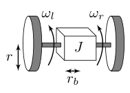

*Figure 8.1: Differential drive dimensions*

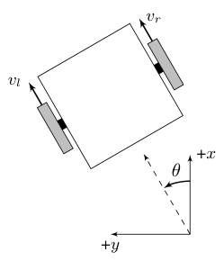

*Figure 8.2: Differential drive coordinate frame*

### 8.7.1 Velocity subspace state-space model

By equations (12.35) and (12.36)

$$
\begin{aligned}
\dot{v}_l &= \left(\frac{1}{m} + \frac{r_b^2}{J}\right)
    \left(C_1 v_l + C_2 V_l\right) +
    \left(\frac{1}{m} - \frac{r_b^2}{J}\right) \left(C_3 v_r + C_4 V_r\right) \\
\dot{v}_r &= \left(\frac{1}{m} - \frac{r_b^2}{J}\right)
    \left(C_1 v_l + C_2 V_l\right) +
    \left(\frac{1}{m} + \frac{r_b^2}{J}\right) \left(C_3 v_r + C_4 V_r\right)
\end{aligned}
$$

Regroup the terms into states $v_l$ and $v_r$ and inputs $V_l$ and $V_r$.

$$
\begin{aligned}
\dot{v}_l &= \left(\frac{1}{m} + \frac{r_b^2}{J}\right) C_1 v_l +
    \left(\frac{1}{m} + \frac{r_b^2}{J}\right) C_2 V_l \\
&\qquad + \left(\frac{1}{m} - \frac{r_b^2}{J}\right) C_3 v_r +
    \left(\frac{1}{m} - \frac{r_b^2}{J}\right) C_4 V_r \\
\dot{v}_r &= \left(\frac{1}{m} - \frac{r_b^2}{J}\right) C_1 v_l +
    \left(\frac{1}{m} - \frac{r_b^2}{J}\right) C_2 V_l \\
&\qquad + \left(\frac{1}{m} + \frac{r_b^2}{J}\right) C_3 v_r +
    \left(\frac{1}{m} + \frac{r_b^2}{J}\right) C_4 V_r
\end{aligned}
$$

$$
\begin{aligned}
\dot{v}_l &= \left(\frac{1}{m} + \frac{r_b^2}{J}\right) C_1 v_l +
    \left(\frac{1}{m} - \frac{r_b^2}{J}\right) C_3 v_r \\
&\qquad + \left(\frac{1}{m} + \frac{r_b^2}{J}\right) C_2 V_l +
    \left(\frac{1}{m} - \frac{r_b^2}{J}\right) C_4 V_r \\
\dot{v}_r &= \left(\frac{1}{m} - \frac{r_b^2}{J}\right) C_1 v_l +
    \left(\frac{1}{m} + \frac{r_b^2}{J}\right) C_3 v_r \\
&\qquad + \left(\frac{1}{m} - \frac{r_b^2}{J}\right) C_2 V_l +
    \left(\frac{1}{m} + \frac{r_b^2}{J}\right) C_4 V_r
\end{aligned}
$$

Factor out $v_l$ and $v_r$ into a column vector and $V_l$ and $V_r$ into a column vector.

$$
\begin{aligned}
\dot{\begin{bmatrix}
    v_l \\
    v_r
  \end{bmatrix}} &=
  \begin{bmatrix}
    \left(\frac{1}{m} + \frac{r_b^2}{J}\right) C_1 &
    \left(\frac{1}{m} - \frac{r_b^2}{J}\right) C_3 \\
    \left(\frac{1}{m} - \frac{r_b^2}{J}\right) C_1 &
    \left(\frac{1}{m} + \frac{r_b^2}{J}\right) C_3
  \end{bmatrix}
  \begin{bmatrix}
    v_l \\
    v_r
  \end{bmatrix} \\
  &\qquad +
  \begin{bmatrix}
    \left(\frac{1}{m} + \frac{r_b^2}{J}\right) C_2 &
    \left(\frac{1}{m} - \frac{r_b^2}{J}\right) C_4 \\
    \left(\frac{1}{m} - \frac{r_b^2}{J}\right) C_2 &
    \left(\frac{1}{m} + \frac{r_b^2}{J}\right) C_4
  \end{bmatrix}
  \begin{bmatrix}
    V_l \\
    V_r
  \end{bmatrix}
\end{aligned}
$$

> **Theorem 8.7.1 — Differential drive velocity state-space model.**
>
> $$
> \dot{\mathbf{x}} = \mathbf{A} \mathbf{x} + \mathbf{B} \mathbf{u}
> $$
>
> $$
> \mathbf{x} =
>     \begin{bmatrix}
>       v_l \\
>       v_r
>     \end{bmatrix} =
>     \begin{bmatrix}
>       \text{left velocity} \\
>       \text{right velocity}
>     \end{bmatrix}
>     \quad
>     \mathbf{u} =
>     \begin{bmatrix}
>       V_l \\
>       V_r
>     \end{bmatrix} =
>     \begin{bmatrix}
>       \text{left voltage} \\
>       \text{right voltage}
>     \end{bmatrix}
> $$
>
> $$
> \begin{aligned}
> \mathbf{A} &=
>     \begin{bmatrix}
>       \left(\frac{1}{m} + \frac{r_b^2}{J}\right) C_1 & \left(\frac{1}{m} - \frac{r_b^2}{J}\right) C_3 \\
>       \left(\frac{1}{m} - \frac{r_b^2}{J}\right) C_1 & \left(\frac{1}{m} + \frac{r_b^2}{J}\right) C_3
>     \end{bmatrix} \\
>     \mathbf{B} &=
>     \begin{bmatrix}
>       \left(\frac{1}{m} + \frac{r_b^2}{J}\right) C_2 & \left(\frac{1}{m} - \frac{r_b^2}{J}\right) C_4 \\
>       \left(\frac{1}{m} - \frac{r_b^2}{J}\right) C_2 & \left(\frac{1}{m} + \frac{r_b^2}{J}\right) C_4
>     \end{bmatrix}
> \end{aligned}
> $$
>
> where $C_1 = -\frac{G_l^2 K_t}{K_v R r^2}$, $C_2 = \frac{G_l K_t}{Rr}$, $C_3 = -\frac{G_r^2 K_t}{K_v R r^2}$, and $C_4 = \frac{G_r K_t}{Rr}$.

#### Simulation

Python Control will be used to discretize the model and simulate it. One of the frccontrol examples[^3] creates and tests a controller for it. Figure 8.3 shows the closed-loop system response.

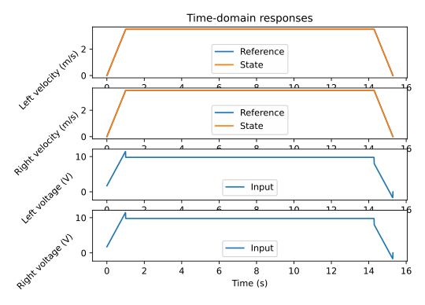

*Figure 8.3: Drivetrain response*

Given the high inertia in drivetrains, it’s better to drive the reference with a motion profile instead of a step input for reproducibility.

### 8.7.2 Heading state-space model

We can control heading by augmenting the state with that. The change in heading is defined as

$$
\dot{\theta} = \frac{v_r - v_l}{2r_b} = \frac{v_r}{2r_b} - \frac{v_l}{2r_b}
$$

This gives the following linear model.

> **Theorem 8.7.2 — Differential drive heading state-space model.**
>
> $$
> \dot{\mathbf{x}} = \mathbf{A}\mathbf{x} + \mathbf{B}\mathbf{u}
> $$
>
> $$
> \mathbf{x} =
>     \begin{bmatrix}
>       \theta \\
>       v_l \\
>       v_r
>     \end{bmatrix} =
>     \begin{bmatrix}
>       \text{heading} \\
>       \text{left velocity} \\
>       \text{right velocity}
>     \end{bmatrix}
>     \quad
>     \mathbf{u} =
>     \begin{bmatrix}
>       V_l \\
>       V_r
>     \end{bmatrix} =
>     \begin{bmatrix}
>       \text{left voltage} \\
>       \text{right voltage}
>     \end{bmatrix}
> $$
>
> $$
> \begin{aligned}
> \mathbf{A} &=
>     \begin{bmatrix}
>       0 & -\frac{1}{2r_b} & \frac{1}{2r_b} \\
>       0 & \left(\frac{1}{m} + \frac{r_b^2}{J}\right) C_1 &
>         \left(\frac{1}{m} - \frac{r_b^2}{J}\right) C_3 \\
>       0 & \left(\frac{1}{m} - \frac{r_b^2}{J}\right) C_1 &
>         \left(\frac{1}{m} + \frac{r_b^2}{J}\right) C_3
>     \end{bmatrix} \\
>     \mathbf{B} &=
>     \begin{bmatrix}
>       0 & 0 \\
>       \left(\frac{1}{m} + \frac{r_b^2}{J}\right) C_2 &
>       \left(\frac{1}{m} - \frac{r_b^2}{J}\right) C_4 \\
>       \left(\frac{1}{m} - \frac{r_b^2}{J}\right) C_2 &
>       \left(\frac{1}{m} + \frac{r_b^2}{J}\right) C_4
>     \end{bmatrix}
> \end{aligned}
> $$
>
> where $C_1 = -\frac{G_l^2 K_t}{K_v R r^2}$, $C_2 = \frac{G_l K_t}{Rr}$, $C_3 = -\frac{G_r^2 K_t}{K_v R r^2}$, and $C_4 = \frac{G_r K_t}{Rr}$. The constants $C_1$ through $C_4$ are from the derivation in section [12.6](12-newtonian-mechanics-examples.md#126-differential-drive).

The velocity states are required to make the heading controllable.

### 8.7.3 Linear time-varying model

We can control the drivetrain’s global pose $(x, y, \theta)$ by augmenting the state with $x$ and $y$. The change in global pose is defined by these three equations.

$$
\begin{aligned}
\dot{x} &= \frac{v_l + v_r}{2}\cos\theta = \frac{v_r}{2}\cos\theta +
    \frac{v_l}{2}\cos\theta \\
\dot{y} &= \frac{v_l + v_r}{2}\sin\theta = \frac{v_r}{2}\sin\theta +
    \frac{v_l}{2}\sin\theta \\
\dot{\theta} &= \frac{v_r - v_l}{2r_b} = \frac{v_r}{2r_b} - \frac{v_l}{2r_b}
\end{aligned}
$$

This augmented model is a nonlinear vector function where $\mathbf{x} = \begin{bmatrix} x & y & \theta & v_l & v_r \end{bmatrix}^{\mathsf{T}}$ and $\mathbf{u} = \begin{bmatrix} V_l & V_r \end{bmatrix}^{\mathsf{T}}$.

$$
\begin{aligned}
&f(\mathbf{x}, \mathbf{u}) = \\
&\qquad \begin{bmatrix}
    \frac{v_r}{2}\cos\theta + \frac{v_l}{2}\cos\theta \\
    \frac{v_r}{2}\sin\theta + \frac{v_l}{2}\sin\theta \\
    \frac{v_r}{2r_b} - \frac{v_l}{2r_b} \\
    \left(\frac{1}{m} + \frac{r_b^2}{J}\right) C_1 v_l +
      \left(\frac{1}{m} - \frac{r_b^2}{J}\right) C_3 v_r +
      \left(\frac{1}{m} + \frac{r_b^2}{J}\right) C_2 V_l +
      \left(\frac{1}{m} - \frac{r_b^2}{J}\right) C_4 V_r \\
    \left(\frac{1}{m} - \frac{r_b^2}{J}\right) C_1 v_l +
      \left(\frac{1}{m} + \frac{r_b^2}{J}\right) C_3 v_r +
      \left(\frac{1}{m} - \frac{r_b^2}{J}\right) C_2 V_l +
      \left(\frac{1}{m} + \frac{r_b^2}{J}\right) C_4 V_r
  \end{bmatrix}
\end{aligned} \tag{8.9}
$$

As mentioned in chapter [8](#chapter-8-nonlinear-control), one can approximate a nonlinear system via linearizations around points of interest in the state-space and design controllers for those linearized subspaces. If we sample linearization points progressively closer together, we converge on a control policy for the original nonlinear system. Since the linear plant being controlled varies with time, its controller is called a linear time-varying (LTV) controller.

If we use LQRs for the linearized subspaces, the nonlinear control policy will also be locally optimal. We’ll be taking this approach with a differential drive. To create an LQR, we need to linearize equation (8.9).

$$
\begin{aligned}
\frac{\partial f(\mathbf{x}, \mathbf{u})}{\partial\mathbf{x}} &=
  \begin{bmatrix}
    0 & 0 & -\frac{v_l + v_r}{2}\sin\theta & \frac{1}{2}\cos\theta &
      \frac{1}{2}\cos\theta \\
    0 & 0 & \frac{v_l + v_r}{2}\cos\theta & \frac{1}{2}\sin\theta &
      \frac{1}{2}\sin\theta \\
    0 & 0 & 0 & -\frac{1}{2r_b} & \frac{1}{2r_b} \\
    0 & 0 & 0 & \left(\frac{1}{m} + \frac{r_b^2}{J}\right) C_1 &
      \left(\frac{1}{m} - \frac{r_b^2}{J}\right) C_3 \\
    0 & 0 & 0 & \left(\frac{1}{m} - \frac{r_b^2}{J}\right) C_1 &
      \left(\frac{1}{m} + \frac{r_b^2}{J}\right) C_3
  \end{bmatrix} \\
  \frac{\partial f(\mathbf{x}, \mathbf{u})}{\partial\mathbf{u}} &=
  \begin{bmatrix}
    0 & 0 \\
    0 & 0 \\
    0 & 0 \\
    \left(\frac{1}{m} + \frac{r_b^2}{J}\right) C_2 &
    \left(\frac{1}{m} - \frac{r_b^2}{J}\right) C_4 \\
    \left(\frac{1}{m} - \frac{r_b^2}{J}\right) C_2 &
    \left(\frac{1}{m} + \frac{r_b^2}{J}\right) C_4
  \end{bmatrix}
\end{aligned}
$$

Therefore,

> **Theorem 8.7.3 — Linear time-varying differential drive state-space model.**
>
> $$
> \dot{\mathbf{x}} = \mathbf{A}\mathbf{x} + \mathbf{B}\mathbf{u}
> $$
>
> $$
> \mathbf{x} =
>     \begin{bmatrix}
>       x \\
>       y \\
>       \theta \\
>       v_l \\
>       v_r
>     \end{bmatrix} =
>     \begin{bmatrix}
>       \text{x position} \\
>       \text{y position} \\
>       \text{heading} \\
>       \text{left velocity} \\
>       \text{right velocity}
>     \end{bmatrix}
>     \quad
>     \mathbf{u} =
>     \begin{bmatrix}
>       V_l \\
>       V_r
>     \end{bmatrix} =
>     \begin{bmatrix}
>       \text{left voltage} \\
>       \text{right voltage}
>     \end{bmatrix}
> $$
>
> $$
> \begin{aligned}
> \mathbf{A} &=
>     \begin{bmatrix}
>       0 & 0 & -vs & \frac{1}{2}c & \frac{1}{2}c \\
>       0 & 0 & vc & \frac{1}{2}s & \frac{1}{2}s \\
>       0 & 0 & 0 & -\frac{1}{2r_b} & \frac{1}{2r_b} \\
>       0 & 0 & 0 & \left(\frac{1}{m} + \frac{r_b^2}{J}\right) C_1 &
>         \left(\frac{1}{m} - \frac{r_b^2}{J}\right) C_3 \\
>       0 & 0 & 0 & \left(\frac{1}{m} - \frac{r_b^2}{J}\right) C_1 &
>         \left(\frac{1}{m} + \frac{r_b^2}{J}\right) C_3
>     \end{bmatrix} \\
>     \mathbf{B} &=
>     \begin{bmatrix}
>       0 & 0 \\
>       0 & 0 \\
>       0 & 0 \\
>       \left(\frac{1}{m} + \frac{r_b^2}{J}\right) C_2 &
>       \left(\frac{1}{m} - \frac{r_b^2}{J}\right) C_4 \\
>       \left(\frac{1}{m} - \frac{r_b^2}{J}\right) C_2 &
>       \left(\frac{1}{m} + \frac{r_b^2}{J}\right) C_4
>     \end{bmatrix}
> \end{aligned}
> $$
>
> where $v = \frac{v_l + v_r}{2}$, $c = \cos\theta$, $s = \sin\theta$, $C_1 = -\frac{G_l^2 K_t}{K_v R r^2}$, $C_2 = \frac{G_l K_t}{Rr}$, $C_3 = -\frac{G_r^2 K_t}{K_v R r^2}$, and $C_4 = \frac{G_r K_t}{Rr}$. The constants $C_1$ through $C_4$ are from the derivation in section [12.6](12-newtonian-mechanics-examples.md#126-differential-drive).

We can also use this in an extended Kalman filter as is since the measurement model ($\mathbf{y} = \mathbf{C}\mathbf{x} + \mathbf{D}\mathbf{u}$) is linear.

### 8.7.4 Improving model accuracy

Figures 8.4 and 8.5 demonstrate the tracking behavior of the linearized differential drive controller.

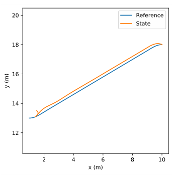

*Figure 8.4: Linear time-varying differential drive controller x-y plot (first-order)*

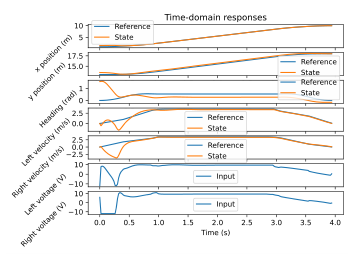

*Figure 8.5: Linear time-varying differential drive controller response (first-order)*

The linearized differential drive model doesn’t track well because the first-order linearization of $\mathbf{A}$ doesn’t capture the full heading dynamics, making the model update inaccurate. This linearization inaccuracy is evident in the Hessian matrix (second partial derivative with respect to the state vector) being nonzero.

$$
\frac{\partial^2 f(\mathbf{x}, \mathbf{u})}{\partial\mathbf{x}^2} =
  \begin{bmatrix}
    0 & 0 & -\frac{v_l + v_r}{2}\cos\theta & 0 & 0 \\
    0 & 0 & -\frac{v_l + v_r}{2}\sin\theta & 0 & 0 \\
    0 & 0 & 0 & 0 & 0 \\
    0 & 0 & 0 & 0 & 0 \\
    0 & 0 & 0 & 0 & 0
  \end{bmatrix}
$$

The second-order Taylor series expansion of the model around $\mathbf{x}_0$ would be

$$
f(\mathbf{x}, \mathbf{u}_0) \approx f(\mathbf{x}_0, \mathbf{u}_0) +
    \frac{\partial f(\mathbf{x}, \mathbf{u})}{\partial\mathbf{x}}(\mathbf{x} - \mathbf{x}_0) +
    \frac{1}{2}\frac{\partial^2 f(\mathbf{x}, \mathbf{u})}{\partial\mathbf{x}^2}
    (\mathbf{x} - \mathbf{x}_0)^2
$$

To include higher-order dynamics in the linearized differential drive model integration, we’ll apply the Dormand-Prince integration method (RKDP) from theorem 7.9.3 to equation (8.9).

Figures 8.6 and 8.7 show a simulation using RKDP instead of the first-order model.

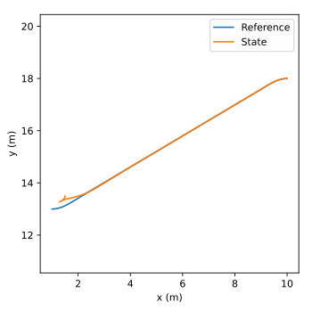

*Figure 8.6: Linear time-varying differential drive controller (global reference frame formulation) x-y plot*

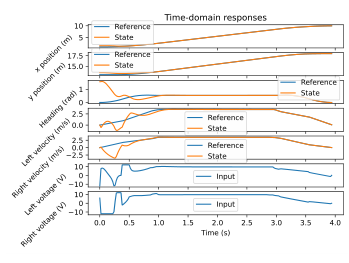

*Figure 8.7: Linear time-varying differential drive controller (global reference frame formulation) response*

### 8.7.5 Cross track error controller

Figures 8.6 and 8.7 show the tracking performance of the linearized differential drive controller for a given trajectory. The performance-effort trade-off can be tuned rather intuitively via the Q and R gains. However, if the $x$ and $y$ error cost are too high, the $x$ and $y$ components of the controller will fight each other, and it will take longer to converge to the path. This can be fixed by applying a clockwise rotation matrix to the global tracking error to transform it into the robot’s coordinate frame.

$$
{}^{R}{\begin{bmatrix}
    e_x \\
    e_y \\
    e_\theta
  \end{bmatrix}} =
  \begin{bmatrix}
    \cos\theta & \sin\theta & 0 \\
    -\sin\theta & \cos\theta & 0 \\
    0 & 0 & 1
  \end{bmatrix}
  {}^{G}{\begin{bmatrix}
    e_x \\
    e_y \\
    e_\theta
  \end{bmatrix}}
$$

where the the superscript $R$ represents the robot’s coordinate frame and the superscript $G$ represents the global coordinate frame.

With this transformation, the $x$ and $y$ error cost in LQR penalize the error ahead of the robot and cross-track error respectively instead of global pose error. Since the cross-track error is always measured from the robot’s coordinate frame, the model used to compute the LQR should be linearized around $\theta = 0$ at all times.

$$
\begin{aligned}
\mathbf{A} &=
  \begin{bmatrix}
    0 & 0 & -\frac{v_l + v_r}{2}\sin 0 & \frac{1}{2}\cos 0 &
      \frac{1}{2}\cos 0 \\
    0 & 0 & \frac{v_l + v_r}{2}\cos 0 & \frac{1}{2}\sin 0 &
      \frac{1}{2}\sin 0 \\
    0 & 0 & 0 & -\frac{1}{2r_b} & \frac{1}{2r_b} \\
    0 & 0 & 0 & \left(\frac{1}{m} + \frac{r_b^2}{J}\right) C_1 &
      \left(\frac{1}{m} - \frac{r_b^2}{J}\right) C_3 \\
    0 & 0 & 0 & \left(\frac{1}{m} - \frac{r_b^2}{J}\right) C_1 &
      \left(\frac{1}{m} + \frac{r_b^2}{J}\right) C_3
  \end{bmatrix} \\
  \mathbf{A} &=
  \begin{bmatrix}
    0 & 0 & 0 & \frac{1}{2} & \frac{1}{2} \\
    0 & 0 & \frac{v_l + v_r}{2} & 0 & 0 \\
    0 & 0 & 0 & -\frac{1}{2r_b} & \frac{1}{2r_b} \\
    0 & 0 & 0 & \left(\frac{1}{m} + \frac{r_b^2}{J}\right) C_1 &
      \left(\frac{1}{m} - \frac{r_b^2}{J}\right) C_3 \\
    0 & 0 & 0 & \left(\frac{1}{m} - \frac{r_b^2}{J}\right) C_1 &
      \left(\frac{1}{m} + \frac{r_b^2}{J}\right) C_3
  \end{bmatrix}
\end{aligned}
$$

> **Theorem 8.7.4 — Linear time-varying differential drive controller.**
>
> Let the differential drive dynamics be of the form $\dot{\mathbf{x}} = f(\mathbf{x}) + \mathbf{B}\mathbf{u}$ where
>
> $$
> \mathbf{x} =
>     \begin{bmatrix}
>       x \\
>       y \\
>       \theta \\
>       v_l \\
>       v_r
>     \end{bmatrix} =
>     \begin{bmatrix}
>       \text{x position} \\
>       \text{y position} \\
>       \text{heading} \\
>       \text{left velocity} \\
>       \text{right velocity}
>     \end{bmatrix}
>     \quad
>     \mathbf{u} =
>     \begin{bmatrix}
>       V_l \\
>       V_r
>     \end{bmatrix} =
>     \begin{bmatrix}
>       \text{left voltage} \\
>       \text{right voltage}
>     \end{bmatrix}
> $$
>
> $$
> \begin{aligned}
> \mathbf{A} &=
>     \left.\frac{\partial f(\mathbf{x})}{\partial\mathbf{x}}\right|_{\theta = 0} =
>     \begin{bmatrix}
>       0 & 0 & 0 & \frac{1}{2} & \frac{1}{2} \\
>       0 & 0 & v & 0 & 0 \\
>       0 & 0 & 0 & -\frac{1}{2r_b} & \frac{1}{2r_b} \\
>       0 & 0 & 0 & \left(\frac{1}{m} + \frac{r_b^2}{J}\right) C_1 &
>         \left(\frac{1}{m} - \frac{r_b^2}{J}\right) C_3 \\
>       0 & 0 & 0 & \left(\frac{1}{m} - \frac{r_b^2}{J}\right) C_1 &
>         \left(\frac{1}{m} + \frac{r_b^2}{J}\right) C_3
>     \end{bmatrix} \\
>     \mathbf{B} &=
>     \begin{bmatrix}
>       0 & 0 \\
>       0 & 0 \\
>       0 & 0 \\
>       \left(\frac{1}{m} + \frac{r_b^2}{J}\right) C_2 &
>       \left(\frac{1}{m} - \frac{r_b^2}{J}\right) C_4 \\
>       \left(\frac{1}{m} - \frac{r_b^2}{J}\right) C_2 &
>       \left(\frac{1}{m} + \frac{r_b^2}{J}\right) C_4
>     \end{bmatrix}
> \end{aligned}
> $$
>
> where $v = \frac{v_l + v_r}{2}$, $C_1 = -\frac{G_l^2 K_t}{K_v R r^2}$, $C_2 = \frac{G_l K_t}{Rr}$, $C_3 = -\frac{G_r^2 K_t}{K_v R r^2}$, and $C_4 = \frac{G_r K_t}{Rr}$. The constants $C_1$ through $C_4$ are from the derivation in section [12.6](12-newtonian-mechanics-examples.md#126-differential-drive).
>
> The linear time-varying differential drive controller is
>
> $$
> \mathbf{u} = \mathbf{K}
>     \left[
>       \begin{array}{c|c}
>         \begin{array}{cc}
>           \cos\theta & \sin\theta \\
>           -\sin\theta & \cos\theta
>         \end{array} & \mathbf{0}_{2 \times 3} \\
>         \hline
>         \mathbf{0}_{3 \times 2} & \mathbf{I}_{3 \times 3}
>       \end{array}
>     \right]
>     (\mathbf{r} - \mathbf{x})
> $$
>
> At each timestep, the LQR controller gain $\mathbf{K}$ is computed for the $(\mathbf{A}, \mathbf{B})$ pair evaluated at the current state.

With the model in theorem 8.7.4, $y$ is uncontrollable at $v = 0$ because the row corresponding to $y$ becomes the zero vector. This means the state dynamics and inputs can no longer affect $y$. This is obvious given that nonholonomic drivetrains can’t move sideways. Some DARE solvers throw errors in this case, but one can avoid it by linearizing the model around a slightly nonzero velocity instead.

The controller in theorem 8.7.4 results in figures 8.8 and 8.9, which show slightly better tracking performance than the previous formulation.

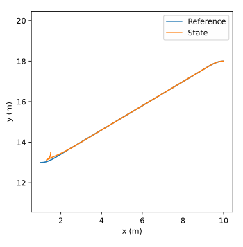

*Figure 8.8: Linear time-varying differential drive controller x-y plot*

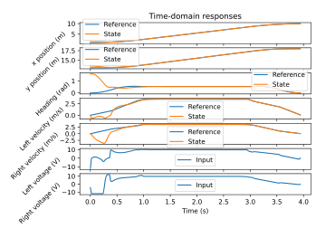

*Figure 8.9: Linear time-varying differential drive controller response*

### 8.7.6 Nonlinear observer design

#### Encoder position augmentation

Estimation of the global pose can be significantly improved if encoder position measurements are used instead of velocity measurements. By augmenting the plant with the line integral of each wheel’s velocity over time, we can provide a mapping from model states to position measurements. We can augment the linear subspace of the model as follows.

Augment the matrix equation with position states $x_l$ and $x_r$, which have the model equations $\dot{x}_l = v_l$ and $\dot{x}_r = v_r$. The matrix elements corresponding to $v_l$ in the first equation and $v_r$ in the second equation will be $1$, and the others will be $0$ since they don’t appear, so $\dot{x}_l = 1v_l + 0v_r + 0x_l + 0x_r + 0V_l + 0V_r$ and $\dot{x}_r = 0v_l + 1v_r + 0x_l + 0x_r + 0V_l + 0V_r$. The existing rows will have zeroes inserted where $x_l$ and $x_r$ are multiplied in.

$$
\dot{\begin{bmatrix}
    x_l \\
    x_r
  \end{bmatrix}} =
  \begin{bmatrix}
    1 & 0 \\
    0 & 1
  \end{bmatrix}
  \begin{bmatrix}
    v_l \\
    v_r
  \end{bmatrix} +
  \begin{bmatrix}
    0 & 0 \\
    0 & 0
  \end{bmatrix}
  \begin{bmatrix}
    V_l \\
    V_r
  \end{bmatrix}
$$

This produces the following linear subspace over $\mathbf{x} = \begin{bmatrix}v_l & v_r & x_l & x_r\end{bmatrix}^{\mathsf{T}}$.

$$
\begin{aligned}
\mathbf{A} &=
  \begin{bmatrix}
    \left(\frac{1}{m} + \frac{r_b^2}{J}\right) C_1 &
      \left(\frac{1}{m} - \frac{r_b^2}{J}\right) C_3 & 0 & 0 \\
    \left(\frac{1}{m} - \frac{r_b^2}{J}\right) C_1 &
      \left(\frac{1}{m} + \frac{r_b^2}{J}\right) C_3 & 0 & 0 \\
    1 & 0 & 0 & 0 \\
    0 & 1 & 0 & 0
  \end{bmatrix} \\
  \mathbf{B} &=
  \begin{bmatrix}
    \left(\frac{1}{m} + \frac{r_b^2}{J}\right) C_2 &
      \left(\frac{1}{m} - \frac{r_b^2}{J}\right) C_4 \\
    \left(\frac{1}{m} - \frac{r_b^2}{J}\right) C_2 &
      \left(\frac{1}{m} + \frac{r_b^2}{J}\right) C_4 \\
    0 & 0 \\
    0 & 0
  \end{bmatrix}
\end{aligned} \tag{8.13}
$$

The measurement model for the complete nonlinear model is now $\mathbf{y} = \begin{bmatrix}\theta & x_l & x_r\end{bmatrix}^{\mathsf{T}}$ instead of $\mathbf{y} = \begin{bmatrix}\theta & v_l & v_r\end{bmatrix}^{\mathsf{T}}$.

#### U error estimation

As per subsection [6.7.2](06-continuous-state-space-control.md#672-input-error-estimation), we will now augment the model so $u_{error}$ states are added to the control inputs.

The plant and observer augmentations should be performed before the model is discretized. After the controller gain is computed with the unaugmented discrete model, the controller may be augmented. Therefore, the plant and observer augmentations assume a continuous model and the controller augmentation assumes a discrete controller.

The three $u_{error}$ states we’ll be adding are $u_{error,l}$, $u_{error,r}$, and $u_{error,heading}$ for left voltage error, right voltage error, and heading error respectively. The left and right wheel positions are filtered encoder positions and are not adjusted for heading error. The turning angle computed from the left and right wheel positions is adjusted by the gyroscope heading. The heading $u_{error}$ state is the heading error between what the wheel positions imply and the gyroscope measurement.

The full state is thus

$$
\mathbf{x} =
  \begin{bmatrix}
    x \\
    y \\
    \theta \\
    v_l \\
    v_r \\
    x_l \\
    x_r \\
    u_{error,l} \\
    u_{error,r} \\
    u_{error,heading}
  \end{bmatrix}
$$

The complete nonlinear model is as follows. Let $v = \frac{v_l + v_r}{2}$. The three $u_{error}$ states augment the linear subspace, so the nonlinear pose dynamics are the same.

$$
\begin{aligned}
\dot{\begin{bmatrix}
    x \\
    y \\
    \theta
  \end{bmatrix}} &=
    \begin{bmatrix}
      v\cos\theta \\
      v\sin\theta \\
      \frac{v_r}{2r_b} - \frac{v_l}{2r_b}
    \end{bmatrix}
\end{aligned}
$$

The left and right voltage error states should be mapped to the corresponding velocity states, so the system matrix should be augmented with $\mathbf{B}$.

The heading $u_{error}$ is measuring counterclockwise encoder understeer relative to the gyroscope heading, so it should add to the left position and subtract from the right position for clockwise correction of encoder positions. That corresponds to the following input mapping vector.

$$
\mathbf{B}_{\theta} = \begin{bmatrix}
    0 \\
    0 \\
    1 \\
    -1
  \end{bmatrix}
$$

Now we’ll augment the linear system matrix horizontally to accommodate the $u_{error}$ states.

$$
\dot{\begin{bmatrix}
    v_l \\
    v_r \\
    x_l \\
    x_r
  \end{bmatrix}} =
    \begin{bmatrix}
      \mathbf{A} & \mathbf{B} & \mathbf{B}_{\theta}
    \end{bmatrix}
    \begin{bmatrix}
      v_l \\
      v_r \\
      x_l \\
      x_r \\
      u_{error,l} \\
      u_{error,r} \\
      u_{error,heading}
    \end{bmatrix} + \mathbf{B}\mathbf{u}
$$

$\mathbf{A}$ and $\mathbf{B}$ are the linear subspace from equation (8.13).

The $u_{error}$ states have no dynamics. The observer selects them to minimize the difference between the expected and actual measurements.

$$
\dot{\begin{bmatrix}
    u_{error,l} \\
    u_{error,r} \\
    u_{error,heading}
  \end{bmatrix}} = \mathbf{0}_{3 \times 1}
$$

The controller is augmented as follows.

$$
\mathbf{K}_{error} =
  \begin{bmatrix}
    1 & 0 & 0 \\
    0 & 1 & 0
  \end{bmatrix}
  \quad
  \mathbf{K}_{aug} = \begin{bmatrix}
    \mathbf{K} & \mathbf{K}_{error}
  \end{bmatrix}
  \quad
  \mathbf{r}_{aug} = \begin{bmatrix}
    \mathbf{r} \\
    0 \\
    0 \\
    0
  \end{bmatrix}
$$

This controller augmentation compensates for unmodeled dynamics like:

1.  Understeer caused by wheel friction inherent in skid-steer robots

2.  Battery voltage drop under load, which reduces the available control authority

> **Remark.** The process noise for the voltage error states should be how much the voltage can be expected to drop. The heading error state should be the encoder model uncertainty.

## 8.8 Linear time-varying unicycle controller

One can also create a linear time-varying controller with a cascaded control architecture, where the outer layer consumes a pose command and produces unicycle velocity commands, and the inner layer consumes unicycle velocity commands and produces wheel motor voltages.

The change in global pose for a unicycle is defined by the following three equations.

$$
\begin{aligned}
\dot{x} &= v\cos\theta \\
\dot{y} &= v\sin\theta \\
\dot{\theta} &= \omega
\end{aligned}
$$

Here’s the model as a vector function where $\mathbf{x} = \begin{bmatrix} x & y & \theta \end{bmatrix}^{\mathsf{T}}$ and $\mathbf{u} = \begin{bmatrix} v & \omega \end{bmatrix}^{\mathsf{T}}$.

$$
f(\mathbf{x}, \mathbf{u}) =
  \begin{bmatrix}
    v\cos\theta \\
    v\sin\theta \\
    \omega
  \end{bmatrix}
$$

To create an LQR, we need to linearize this.

$$
\frac{\partial f(\mathbf{x}, \mathbf{u})}{\partial\mathbf{x}} =
  \begin{bmatrix}
    0 & 0 & -v\sin\theta \\
    0 & 0 & v\cos\theta \\
    0 & 0 & 0
  \end{bmatrix}
  \quad
  \frac{\partial f(\mathbf{x}, \mathbf{u})}{\partial\mathbf{u}} =
  \begin{bmatrix}
    \cos\theta & 0 \\
    \sin\theta & 0 \\
    0 & 1
  \end{bmatrix}
$$

We’re going to make a cross-track error controller, so we’ll apply a clockwise rotation matrix to the global tracking error to transform it into the robot’s coordinate frame. Since the cross-track error is always measured from the robot’s coordinate frame, the model used to compute the LQR should be linearized around $\theta = 0$ at all times.

$$
\begin{array}{ll}
    \mathbf{A} =
    \begin{bmatrix}
      0 & 0 & -v\sin 0 \\
      0 & 0 & v\cos 0 \\
      0 & 0 & 0
    \end{bmatrix} &
    \mathbf{B} =
    \begin{bmatrix}
      \cos 0 & 0 \\
      \sin 0 & 0 \\
      0 & 1
    \end{bmatrix} \\
    \mathbf{A} =
    \begin{bmatrix}
      0 & 0 & 0 \\
      0 & 0 & v \\
      0 & 0 & 0
    \end{bmatrix} &
    \mathbf{B} =
    \begin{bmatrix}
      1 & 0 \\
      0 & 0 \\
      0 & 1
    \end{bmatrix}
  \end{array}
$$

Therefore,

> **Theorem 8.8.1 — Linear time-varying unicycle controller.**
>
> Let the unicycle dynamics be $\dot{\mathbf{x}} = f(\mathbf{x}, \mathbf{u}) = \begin{bmatrix} v\cos\theta & v\sin\theta & \omega \end{bmatrix}^{\mathsf{T}}$ where
>
> $$
> \mathbf{x} =
>     \begin{bmatrix}
>       x \\
>       y \\
>       \theta
>     \end{bmatrix} =
>     \begin{bmatrix}
>       \text{x position} \\
>       \text{y position} \\
>       \text{heading}
>     \end{bmatrix}
>     \quad
>     \mathbf{u} =
>     \begin{bmatrix}
>       v \\
>       \omega
>     \end{bmatrix} =
>     \begin{bmatrix}
>       \text{linear velocity} \\
>       \text{angular velocity}
>     \end{bmatrix}
> $$
>
> $$
> \begin{aligned}
> \mathbf{A} &= \left.
>       \frac{\partial f(\mathbf{x}, \mathbf{u})}{\partial\mathbf{x}}
>     \right|_{\theta = 0} =
>     \begin{bmatrix}
>       0 & 0 & 0 \\
>       0 & 0 & v \\
>       0 & 0 & 0
>     \end{bmatrix} \\
>     \mathbf{B} &= \left.
>       \frac{\partial f(\mathbf{x}, \mathbf{u})}{\partial\mathbf{u}}
>     \right|_{\theta = 0} =
>     \begin{bmatrix}
>       1 & 0 \\
>       0 & 0 \\
>       0 & 1
>     \end{bmatrix}
> \end{aligned}
> $$
>
> The linear time-varying unicycle controller is
>
> $$
> \mathbf{u} = \mathbf{K}
>     \begin{bmatrix}
>       \cos\theta & \sin\theta & 0 \\
>       -\sin\theta & \cos\theta & 0 \\
>       0 & 0 & 1
>     \end{bmatrix}
>     (\mathbf{r} - \mathbf{x})
> $$
>
> At each timestep, the LQR controller gain $\mathbf{K}$ is computed for the $(\mathbf{A}, \mathbf{B})$ pair evaluated at the current input.

With the model in theorem 8.8.1, $y$ is uncontrollable at $v = 0$ because nonholonomic drivetrains are unable to move sideways. Some DARE solvers throw errors in this case, but one can avoid it by linearizing the model around a slightly nonzero velocity instead.

The controller in theorem 8.8.1 results in figures 8.10 and 8.11.

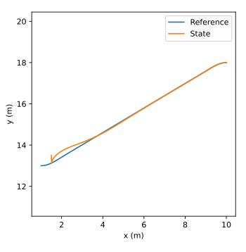

*Figure 8.10: Linear time-varying unicycle controller x-y plot*

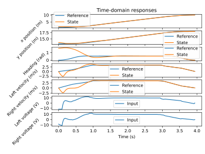

*Figure 8.11: Linear time-varying unicycle controller response*

## 8.9 Further reading

To learn more about nonlinear control, watch MIT’s underactuated robotics lectures and read their course notes.[^4]

> **Video:** [“Underactuated Robotics”](https://www.youtube.com/channel/UChfUOAhz7ynELF-s_1LPpWg/videos) — Russ Tedrake

The books *Nonlinear Dynamics and Chaos* by Steven Strogatz and *Applied Nonlinear Control* by Jean-Jacques Slotine are also good references.

[^1]: Equilibrium points are points where $\dot{\mathbf{x}} = \mathbf{0}$. At these points, the system is in steady-state.

[^2]: <https://www.cds.caltech.edu/~murray/courses/cds101/fa02/faq/02-10-09_linearization.html>

[^3]: <https://github.com/calcmogul/frccontrol/blob/main/examples/differential_drive.py>

[^4]: <https://underactuated.mit.edu>
