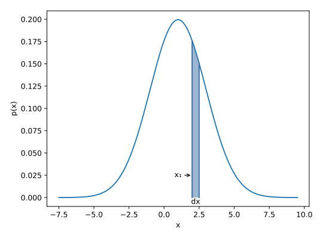
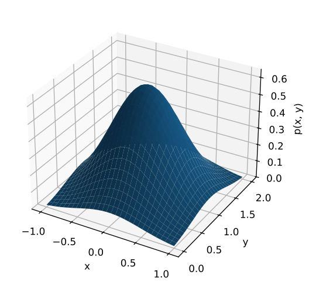
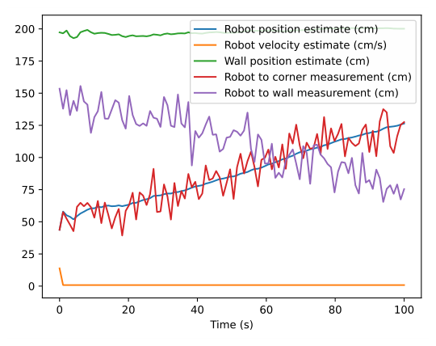
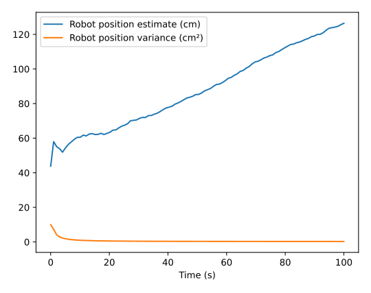
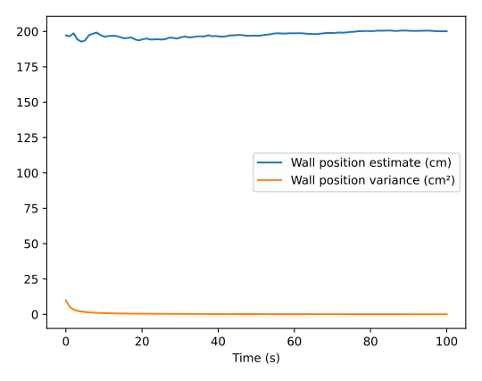
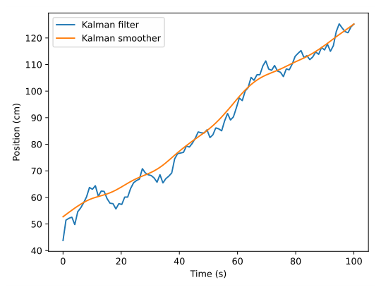
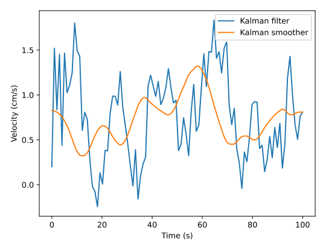
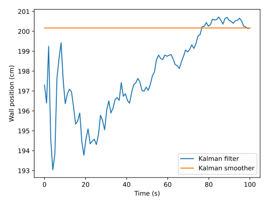
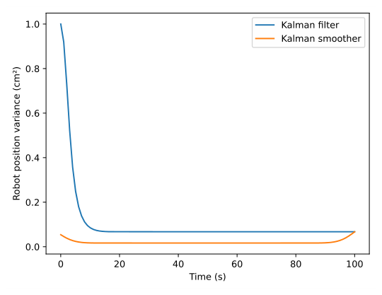

# Chapter 9: Stochastic control theory

Stochastic control theory is a subfield of control theory that deals with the existence of uncertainty either in observations or in noise that drives the evolution of a system. We assign probability distributions to this random noise and aim to achieve a desired control task despite the presence of this uncertainty.

Stochastic optimal control is concerned with doing this with minimum cost defined by some cost functional, like we did with LQR earlier. First, we’ll cover the basics of probability and how we represent linear stochastic systems in state-space representation. Then, we’ll derive an optimal estimator using this knowledge, the Kalman filter, and demonstrate creative applications of the Kalman filter theory.

This will be a math-heavy introduction, so read *Kalman and Bayesian Filters in Python* by Roger Labbe[^1] first.

## 9.1 Terminology

First, we should provide definitions for terms that have specific meanings in this field.

A causal system is one that uses only past information. A noncausal system also uses information from the future. A filter is a causal system that *filters* information through a probabilistic model to produce an estimate of a desired quantity that can’t be measured directly. A smoother is a noncausal system, so it uses information from before and after the current state to produce a better estimate.

## 9.2 State observers

State observers are used to estimate states which cannot be measured directly. This can be due to noisy measurements or the state not being measurable (a hidden state). This information can be used for localization, which is the process of using external measurements to determine an agent’s pose,[^2] or orientation in the world.

One type of state estimator is LQE. “LQE” stands for “Linear-Quadratic Estimator”. Similar to LQR, it places the estimator poles such that it minimizes the sum of squares of the estimation error. The Luenberger observer and Kalman filter are examples of these, where the latter chooses the pole locations optimally based on the model and measurement uncertainties.

Computer vision can also be used for localization. By extracting features from an image taken by the agent’s camera, like a retroreflective target in FRC, and comparing them to known dimensions, one can determine where the agent’s camera would have to be to see that image. This can be used to correct our state estimate in the same way we do with an encoder or gyroscope.

### 9.2.1 Luenberger observer

We’ll introduce the Luenberger observer first to demonstrate the general form of a state estimator and some of their properties.

> **Theorem 9.2.1 — Luenberger observer.**
>
> $$
> \begin{aligned}
> \dot{\hat{\mathbf{x}}} &= \mathbf{A}\hat{\mathbf{x}} + \mathbf{B}\mathbf{u} +
>       \mathbf{L} (\mathbf{y} - \hat{\mathbf{y}}) \\
> \hat{\mathbf{y}} &= \mathbf{C}\hat{\mathbf{x}} + \mathbf{D}\mathbf{u}
> \end{aligned}
> $$
>
> $$
> \begin{aligned}
> \hat{\mathbf{x}}_{k+1} &= \mathbf{A}\hat{\mathbf{x}}_k + \mathbf{B}\mathbf{u}_k +
>       \mathbf{L}(\mathbf{y}_k - \hat{\mathbf{y}}_k) \\
> \hat{\mathbf{y}}_k &= \mathbf{C}\hat{\mathbf{x}}_k + \mathbf{D}\mathbf{u}_k \\
> \end{aligned} \tag{9.3\text{--}9.4}
> $$
>
> |  |  |  |  |
> |:---|:---|:---|:---|
> | $\mathbf{A}$ | system matrix | $\hat{\mathbf{x}}$ | state estimate vector |
> | $\mathbf{B}$ | input matrix | $\mathbf{u}$ | input vector |
> | $\mathbf{C}$ | output matrix | $\mathbf{y}$ | output vector |
> | $\mathbf{D}$ | feedthrough matrix | $\hat{\mathbf{y}}$ | output estimate vector |
> | $\mathbf{L}$ | estimator gain matrix |  |  |

*Table 9.1: Luenberger observer matrix dimensions*

| **Matrix** | **Rows $\times$ Columns** | **Matrix** | **Rows $\times$ Columns** |
|:---|:---|:---|:---|
| $\mathbf{A}$ | states $\times$ states | $\hat{\mathbf{x}}$ | states $\times$ 1 |
| $\mathbf{B}$ | states $\times$ inputs | $\mathbf{u}$ | inputs $\times$ 1 |
| $\mathbf{C}$ | outputs $\times$ states | $\mathbf{y}$ | outputs $\times$ 1 |
| $\mathbf{D}$ | outputs $\times$ inputs | $\hat{\mathbf{y}}$ | outputs $\times$ 1 |
| $\mathbf{L}$ | states $\times$ outputs |  |  |

Variables denoted with a hat are estimates of the corresponding variable. For example, $\hat{\mathbf{x}}$ is the estimate of the true state $\mathbf{x}$.

Notice that a Luenberger observer has an extra term in the state evolution equation. This term uses the difference between the estimated outputs and measured outputs to steer the estimated state toward the true state. $\mathbf{L}$ approaching $\mathbf{C}^+$ trusts the measurements more while $\mathbf{L}$ approaching $\mathbf{0}$ trusts the model more.

> **Remark.** Using an estimator forfeits the performance guarantees from earlier,[^3] but the responses are still generally very good if the process and measurement noises are small enough.

A Luenberger observer combines the prediction and update steps of an estimator. To run them separately, use the equations in theorem 9.2.2 instead.

> **Theorem 9.2.2 — Luenberger observer with separate predict/update.**
>
> $$
> \begin{aligned}
> \text{Predict step} \\
> \hat{\mathbf{x}}_{k+1}^- &= \mathbf{A}\hat{\mathbf{x}}_k^- + \mathbf{B}\mathbf{u}_k \\
> \text{Update step} \\
> \hat{\mathbf{x}}_{k+1}^+ &= \hat{\mathbf{x}}_{k+1}^- + \mathbf{A}^{-1}\mathbf{L}
>       (\mathbf{y}_k - \hat{\mathbf{y}}_k) \\
> \hat{\mathbf{y}}_k &= \mathbf{C} \hat{\mathbf{x}}_k^-
> \end{aligned}
> $$
>

See appendix [D.2.1](D-derivations.md#d21-luenberger-observer-with-separate-prediction-and-update) for a derivation.

#### Eigenvalues of closed-loop observer

The eigenvalues of the system matrix can be used to determine whether a state observer’s estimate will converge to the true state.

Plugging equation (9.4) into equation (9.3) gives

$$
\begin{aligned}
\hat{\mathbf{x}}_{k+1} &= \mathbf{A}\hat{\mathbf{x}}_k + \mathbf{B}\mathbf{u}_k +
    \mathbf{L} (\mathbf{y}_k - \hat{\mathbf{y}}_k) \\
\hat{\mathbf{x}}_{k+1} &= \mathbf{A}\hat{\mathbf{x}}_k + \mathbf{B}\mathbf{u}_k +
    \mathbf{L} (\mathbf{y}_k - (\mathbf{C}\hat{\mathbf{x}}_k + \mathbf{D}\mathbf{u}_k)) \\
\hat{\mathbf{x}}_{k+1} &= \mathbf{A}\hat{\mathbf{x}}_k + \mathbf{B}\mathbf{u}_k +
    \mathbf{L} (\mathbf{y}_k - \mathbf{C}\hat{\mathbf{x}}_k - \mathbf{D}\mathbf{u}_k)
\end{aligned}
$$

Plugging in $\mathbf{y}_k = \mathbf{C}\mathbf{x}_k + \mathbf{D}\mathbf{u}_k$ gives

$$
\begin{aligned}
\hat{\mathbf{x}}_{k+1} &= \mathbf{A}\hat{\mathbf{x}}_k + \mathbf{B}\mathbf{u}_k +
    \mathbf{L}((\mathbf{C}\mathbf{x}_k + \mathbf{D}\mathbf{u}_k) - \mathbf{C}\hat{\mathbf{x}}_k -
    \mathbf{D}\mathbf{u}_k) \\
\hat{\mathbf{x}}_{k+1} &= \mathbf{A}\hat{\mathbf{x}}_k + \mathbf{B}\mathbf{u}_k +
    \mathbf{L}(\mathbf{C}\mathbf{x}_k + \mathbf{D}\mathbf{u}_k - \mathbf{C}\hat{\mathbf{x}}_k -
    \mathbf{D}\mathbf{u}_k) \\
\hat{\mathbf{x}}_{k+1} &= \mathbf{A}\hat{\mathbf{x}}_k + \mathbf{B}\mathbf{u}_k +
    \mathbf{L}(\mathbf{C}\mathbf{x}_k - \mathbf{C}\hat{\mathbf{x}}_k) \\
\hat{\mathbf{x}}_{k+1} &= \mathbf{A}\hat{\mathbf{x}}_k + \mathbf{B}\mathbf{u}_k +
    \mathbf{L}\mathbf{C}(\mathbf{x}_k - \hat{\mathbf{x}}_k)
\end{aligned}
$$

Let $\mathbf{e}_k = \mathbf{x}_k - \hat{\mathbf{x}}_k$ be the error in the estimate $\hat{\mathbf{x}}_k$.

$$
\begin{aligned}
\hat{\mathbf{x}}_{k+1} &= \mathbf{A}\hat{\mathbf{x}}_k + \mathbf{B}\mathbf{u}_k +
    \mathbf{L}\mathbf{C}\mathbf{e}_k
\end{aligned}
$$

Subtracting this from $\mathbf{x}_{k+1} = \mathbf{A}\mathbf{x}_k + \mathbf{B}\mathbf{u}_k$ gives

$$
\begin{aligned}
\mathbf{x}_{k+1} - \hat{\mathbf{x}}_{k+1} &= \mathbf{A}\mathbf{x}_k + \mathbf{B}\mathbf{u}_k -
    (\mathbf{A}\hat{\mathbf{x}}_k + \mathbf{B}\mathbf{u}_k +
     \mathbf{L}\mathbf{C}\mathbf{e}_k) \\
\mathbf{e}_{k+1} &= \mathbf{A}\mathbf{x}_k + \mathbf{B}\mathbf{u}_k -
    (\mathbf{A}\hat{\mathbf{x}}_k + \mathbf{B}\mathbf{u}_k + \mathbf{L}\mathbf{C}\mathbf{e}_k) \\
\mathbf{e}_{k+1} &= \mathbf{A}\mathbf{x}_k + \mathbf{B}\mathbf{u}_k -
    \mathbf{A}\hat{\mathbf{x}}_k - \mathbf{B}\mathbf{u}_k - \mathbf{L}\mathbf{C}\mathbf{e}_k \\
\mathbf{e}_{k+1} &= \mathbf{A}\mathbf{x}_k - \mathbf{A}\hat{\mathbf{x}}_k -
    \mathbf{L}\mathbf{C}\mathbf{e}_k \\
\mathbf{e}_{k+1} &= \mathbf{A}(\mathbf{x}_k - \hat{\mathbf{x}}_k) -
    \mathbf{L}\mathbf{C}\mathbf{e}_k \\
\mathbf{e}_{k+1} &= \mathbf{A}\mathbf{e}_k - \mathbf{L}\mathbf{C}\mathbf{e}_k \\
\mathbf{e}_{k+1} &= (\mathbf{A} - \mathbf{L}\mathbf{C})\mathbf{e}_k
\end{aligned} \tag{9.8}
$$

For equation (9.8) to have a bounded output, the eigenvalues of $\mathbf{A} - \mathbf{L}\mathbf{C}$ must be within the unit circle. These eigenvalues represent how fast the estimator converges to the true state of the given model. A fast estimator converges quickly while a slow estimator avoids amplifying noise in the measurements used to produce a state estimate.

The effect of noise can be seen if it is modeled stochastically as

$$
\begin{aligned}
\hat{\mathbf{x}}_{k+1} &= \mathbf{A}\hat{\mathbf{x}}_k + \mathbf{B}\mathbf{u}_k +
    \mathbf{L} ((\mathbf{y}_k + \mathbf{\nu}_k) - \hat{\mathbf{y}}_k)
\end{aligned}
$$

where $\mathbf{\nu}_k$ is the measurement noise. Rearranging this equation yields

$$
\begin{aligned}
\hat{\mathbf{x}}_{k+1} &= \mathbf{A}\hat{\mathbf{x}}_k + \mathbf{B}\mathbf{u}_k +
    \mathbf{L} (\mathbf{y}_k - \hat{\mathbf{y}}_k + \mathbf{\nu}_k) \\
\hat{\mathbf{x}}_{k+1} &= \mathbf{A}\hat{\mathbf{x}}_k + \mathbf{B}\mathbf{u}_k +
    \mathbf{L} (\mathbf{y}_k - \hat{\mathbf{y}}_k) + \mathbf{L}\mathbf{\nu}_k
\end{aligned}
$$

As $\mathbf{L}$ increases, the measurement noise is amplified.

### 9.2.2 Separation principle

The separation principle for linear stochastic systems states that the optimal controller and optimal observer for the stochastic system can be designed independently, and the combination of a stable controller and a stable observer is itself stable.

This means that designing the optimal feedback controller for the stochastic system can be decomposed into designing the optimal state observer, then feeding that into the optimal controller for the deterministic system.

Consider the following state-space model.

$$
\begin{aligned}
\mathbf{x}_{k+1} &= \mathbf{A}\mathbf{x}_k + \mathbf{B}\mathbf{u}_k \\
\mathbf{y}_k &= \mathbf{C}\mathbf{x}_k + \mathbf{D}\mathbf{u}_k
\end{aligned}
$$

We’ll use the following controller for state feedback.

$$
\mathbf{u}_k = -\mathbf{K}\hat{\mathbf{x}}_k
$$

With the estimation error defined as $\mathbf{e}_k = \mathbf{x}_k - \hat{\mathbf{x}}_k$, we get the observer dynamics derived in equation (9.8).

$$
\mathbf{e}_{k+1} = (\mathbf{A} - \mathbf{L}\mathbf{C})\mathbf{e}_k
$$

Also, after rearranging the error equation to be $\hat{\mathbf{x}}_k = \mathbf{x}_k - \mathbf{e}_k$, the controller can be rewritten as

$$
\mathbf{u}_k = -\mathbf{K}(\mathbf{x}_k - \mathbf{e}_k)
$$

Substitute this into the model.

$$
\begin{aligned}
\mathbf{x}_{k+1} &= \mathbf{A}\mathbf{x}_k + \mathbf{B}\mathbf{u}_k \\
\mathbf{x}_{k+1} &= \mathbf{A}\mathbf{x}_k - \mathbf{B}\mathbf{K}(\mathbf{x}_k - \mathbf{e}_k) \\
\mathbf{x}_{k+1} &= (\mathbf{A} - \mathbf{B}\mathbf{K})\mathbf{x}_k + \mathbf{B}\mathbf{K}\mathbf{e}_k
\end{aligned}
$$

Now, we can write the closed-loop dynamics as

$$
\begin{bmatrix}
    \mathbf{x}_{k+1} \\
    \mathbf{e}_{k+1}
  \end{bmatrix} =
  \begin{bmatrix}
    \mathbf{A} - \mathbf{B}\mathbf{K} & \mathbf{B}\mathbf{K} \\
    \mathbf{0} & \mathbf{A} - \mathbf{L}\mathbf{C}
  \end{bmatrix}
  \begin{bmatrix}
    \mathbf{x}_k \\
    \mathbf{e}_k
  \end{bmatrix}
$$

Since the closed-loop system matrix is triangular, the eigenvalues are those of $\mathbf{A} - \mathbf{B}\mathbf{K}$ and $\mathbf{A} - \mathbf{L}\mathbf{C}$. Therefore, the stability of the feedback controller and observer are independent.

## 9.3 Introduction to probability

Now we’ll begin establishing probability concepts we need to describe and manipulate stochastic systems.

### 9.3.1 Random variables

A random variable is a variable whose values are the outcomes of a random phenomenon, like dice rolls or noisy process measurements. As such, a random variable is defined as a function that maps the outcomes of an unpredictable process to numerical quantities. A particular output of this function is called a sample. The sample space is the set of possible values taken by the random variable.

A probability density function (PDF) is a function of the random variable whose value at a given sample (measured value) in the sample space (the range of possible measured values) is the probability of that sample occurring. The area under the function over a range gives the probability that the sample falls within that range. Let $x$ be a random variable, and let $p(x)$ denote the probability density function of $x$. The probability that the value of $x$ will be in the interval $x \in [x_1, x_1 + dx]$ is $p(x_1) \,dx$. In other words, the probability is the area under the PDF within the region $[x_1, x_1 + dx]$ (see figure 9.1).



*Figure 9.1: Probability density function*

A probability of zero means that the sample will not occur and a probability of one means that the sample will always occur. Probability density functions require that no probabilities are negative and that the sum of all probabilities is $1$. If the probabilities sum to $1$, that means one of those outcomes *must* happen. In other words,

$$
p(x) \geq 0, \int_{-\infty}^\infty p(x) \,dx = 1
$$

or given that the probability of a given sample is greater than or equal to zero, the sum of probabilities for all possible input values is equal to one.

### 9.3.2 Expected value

Expected value or expectation is a weighted average of the values the PDF can produce where the weight for each value is the probability of that value occurring. This can be written mathematically as

$$
\overline{x} = E[x] = \int_{-\infty}^\infty x \,p(x) \,dx
$$

The expectation can be applied to random functions as well as random variables.

$$
E[f(x)] = \int_{-\infty}^\infty f(x) \,p(x) \,dx
$$

The mean of a random variable is denoted by an overbar (e.g., $\overline{x}$) pronounced x-bar. The expectation of the difference between a random variable and its mean $x - \overline{x}$ converges to zero. In other words, the expectation of a random variable is its mean. Here’s a proof.

$$
\begin{aligned}
E[x - \overline{x}] &= \int_{-\infty}^\infty (x - \overline{x}) \,p(x) \,dx \\
E[x - \overline{x}] &= \int_{-\infty}^\infty x \, p(x) \,dx -
    \int_{-\infty}^\infty \overline{x} \,p(x) \,dx \\
E[x - \overline{x}] &= \int_{-\infty}^\infty x \,p(x) \,dx -
    \overline{x} \int_{-\infty}^\infty p(x) \,dx \\
E[x - \overline{x}] &= \overline{x} - \overline{x} \cdot 1 \\
E[x - \overline{x}] &= 0
\end{aligned}
$$

### 9.3.3 Variance

Informally, variance is a measure of how far the outcome of a random variable deviates from its mean. Later, we will use variance to quantify how confident we are in the estimate of a random variable; we can’t know the true value of that variable without randomness, but we can give a bound on its randomness.

$$
\operatorname{var}(x) = \sigma^2 = E[(x - \overline{x})^2] =
    \int_{-\infty}^{\infty} (x - \overline{x})^2 \,p(x) \,dx
$$

The standard deviation is the square root of the variance.

$$
\operatorname{std}[x] = \sigma = \sqrt{\operatorname{var}(x)}
$$

### 9.3.4 Joint probability density functions

Probability density functions can also include more than one variable. Let $x$ and $y$ be random variables. The joint probability density function $p(x, y)$ defines the probability $p(x, y) \,dx \,dy$, so that $x$ and $y$ are in the intervals $x \in [x, x + dx], y \in [y, y + dy]$. In other words, the probability is the volume under a region of the PDF manifold (see figure 9.2 for an example of a joint PDF).



*Figure 9.2: Joint probability density function*

Joint probability density functions also require that no probabilities are negative and that the sum of all probabilities is $1$.

$$
p(x, y) \geq 0, \int_{-\infty}^\infty \int_{-\infty}^{\infty} p(x, y) \,dx
    \,dy = 1
$$

The expected values for joint PDFs are as follows.

$$
\begin{aligned}
E[x] &= \int_{-\infty}^\infty \int_{-\infty}^{\infty} x p(x, y) \,dx \,dy \\
E[y] &= \int_{-\infty}^\infty \int_{-\infty}^{\infty} y p(x, y) \,dx \,dy \\
E[f(x, y)] &= \int_{-\infty}^\infty \int_{-\infty}^{\infty} f(x, y) p(x, y)
    \,dx \,dy
\end{aligned}
$$

The variance of a joint PDF measures how a variable correlates with itself (we’ll cover variances with respect to other variables shortly).

$$
\begin{aligned}
\operatorname{var}(x) &= \Sigma_{xx} = E[(x - \overline{x})^2] =
    \int_{-\infty}^\infty \int_{-\infty}^\infty (x - \overline{x})^2 \,p(x, y)
    \,dx \,dy \\
\operatorname{var}(y) &= \Sigma_{yy} = E[(y - \overline{y})^2] =
    \int_{-\infty}^\infty \int_{-\infty}^\infty (y - \overline{y})^2 \,p(x, y)
    \,dx \,dy
\end{aligned}
$$

### 9.3.5 Covariance

A covariance is a measurement of how a variable correlates with another. If they vary in the same direction, the covariance increases. If they vary in opposite directions, the covariance decreases.

$$
\operatorname{cov}(x, y) = \Sigma_{xy} = E[(x - \overline{x})(y - \overline{y})] =
    \int_{-\infty}^\infty \int_{-\infty}^\infty (x - \overline{x})
    (y - \overline{y}) \,p(x, y) \,dx \,dy \\
$$

### 9.3.6 Correlation

Two random variables are correlated if the result of one random variable affects the result of another. Correlation is defined as

$$
\rho(x, y) = \frac{\Sigma_{xy}}{\sqrt{\Sigma_{xx}\Sigma_{yy}}}, |\rho(x, y)|
    \leq 1
$$

So two variable’s correlation is defined as their covariance over the geometric mean of their variances. Uncorrelated sources have a covariance of zero.

### 9.3.7 Independence

Two random variables are independent if the following relation is true.

$$
p(x, y) = p(x) \,p(y)
$$

This means that the values of $x$ do not correlate with the values of $y$. That is, the outcome of one random variable does not affect another’s outcome. If we assume independence,

$$
\begin{aligned}
E[xy] &= \int_{-\infty}^\infty \int_{-\infty}^\infty xy \,p(x, y) \,dx \,dy \\
E[xy] &= \int_{-\infty}^\infty \int_{-\infty}^\infty xy \,p(x) \,p(y) \,dx
    \,dy \\
E[xy] &= \int_{-\infty}^\infty x \,p(x) \,dx \int_{-\infty}^\infty y \,p(y)
    \,dy \\
E[xy] &= E[x]E[y] \\
E[xy] &= \overline{x}\,\overline{y}
\end{aligned}
$$

$$
\begin{aligned}
\operatorname{cov}(x, y) &= E[(x - \overline{x})(y - \overline{y})] \\
\operatorname{cov}(x, y) &= E[(x - \overline{x})]E[(y - \overline{y})] \\
\operatorname{cov}(x, y) &= 0 \cdot 0
\end{aligned}
$$

Therefore, the covariance $\Sigma_{xy}$ is zero, as expected. Furthermore, $\rho(x, y) = 0$, which means they are uncorrelated.

### 9.3.8 Marginal probability density functions

Given two random variables $x$ and $y$ whose joint distribution is known, the marginal PDF $p(x)$ expresses the probability of $x$ averaged over information about $y$. In other words, it’s the PDF of $x$ when $y$ is unknown. This is calculated by integrating the joint PDF over $y$.

$$
p(x) = \int_{-\infty}^\infty p(x, y) \,dy
$$

### 9.3.9 Conditional probability density functions

Let us assume that we know the joint PDF $p(x, y)$ and the exact value for $y$. The conditional PDF gives the probability of $x$ in the interval $[x, x + dx]$ for the given value $y$. The probability of $x$ given $y$ is denoted by $p(x|y)$.

If $p(x, y)$ is known, then we also know $p(x, y = y^\ast)$. However, note that the latter is not the conditional density $p(x|y^\ast)$, instead

$$
\begin{aligned}
C(y^\ast) &= \int_{-\infty}^\infty p(x, y = y^\ast) \,dx \\
p(x|y^\ast) &= \frac{1}{C(y^\ast)} p(x, y = y^\ast)
\end{aligned}
$$

The scale factor $\frac{1}{C(y^\ast)}$ is used to scale the area under the PDF to $1$.

### 9.3.10 Bayes’s rule

Bayes’s rule is used to determine the probability of an event based on prior knowledge of conditions related to the event.

$$
p(x, y) = p(x|y) \,p(y) = p(y|x) \,p(x)
$$

If $x$ and $y$ are independent, then $p(x|y) = p(x)$, $p(y|x) = p(y)$, and $p(x, y) = p(x) \,p(y)$.

### 9.3.11 Conditional expectation

The concept of expectation can also be applied to conditional PDFs. This allows us to determine what the mean of a variable is given prior knowledge of other variables.

$$
\begin{aligned}
E[x|y] &= \int_{-\infty}^\infty x \,p(x|y) \,dx = f(y), E[x|y] \neq E[x] \\
E[y|x] &= \int_{-\infty}^\infty y \,p(y|x) \,dy = f(x), E[y|x] \neq E[y]
\end{aligned}
$$

### 9.3.12 Conditional variances

$$
\begin{aligned}
\operatorname{var}(x|y) &= E[(x - E[x|y])^2|y] \\
\operatorname{var}(x|y) &= \int_{-\infty}^\infty (x - E[x|y])^2 \,p(x|y) \,dx
\end{aligned}
$$

### 9.3.13 Random vectors

Now we will extend the probability concepts discussed so far to vectors where each element has a PDF.

$$
\mathbf{x} = \begin{bmatrix}
    x_1 \\
    \vdots \\
    x_n
  \end{bmatrix}
$$

The elements of $\mathbf{x}$ are scalar variables jointly distributed with a joint density $p(x_1, \ldots, x_n)$. The expectation is

$$
\begin{aligned}
E[\mathbf{x}] &= \overline{\mathbf{x}} = \int_{-\infty}^\infty \mathbf{x} \,p(\mathbf{x})
    \,d\mathbf{x} \\
E[\mathbf{x}] &= \begin{bmatrix}
    E[x_1] \\
    \vdots \\
    E[x_n]
  \end{bmatrix} \\
  E[x_i] &= \int_{-\infty}^\infty \ldots \int_{-\infty}^\infty x_i
    \,p(x_1, \ldots, x_n) \,dx_1 \ldots dx_n \\
  E[f(\mathbf{x})] &= \int_{-\infty}^\infty f(\mathbf{x}) \,p(\mathbf{x}) \,d\mathbf{x}
\end{aligned}
$$

### 9.3.14 Covariance matrix

The covariance matrix for a random vector $\mathbf{x} \in \mathbb{R}^n$ is

$$
\begin{aligned}
\mathbf{\Sigma} &= \operatorname{cov}(\mathbf{x}, \mathbf{x}) = E[(\mathbf{x} - \overline{\mathbf{x}})
    (\mathbf{x} - \overline{\mathbf{x}})^{\mathsf{T}}] \\
\mathbf{\Sigma} &= \begin{bmatrix}
    \operatorname{cov}(x_1, x_1) & \ldots & \operatorname{cov}(x_1, x_n) \\
    \vdots         & \ddots & \vdots \\
    \operatorname{cov}(x_n, x_1) & \ldots & \operatorname{cov}(x_n, x_n) \\
  \end{bmatrix}
\end{aligned}
$$

This $n \times n$ matrix is symmetric and positive semidefinite. A positive semidefinite matrix satisfies the relation that for any $\mathbf{v} \in \mathbb{R}^n$ for which $\mathbf{v} \neq 0$, $\mathbf{v}^{\mathsf{T}} \mathbf{\Sigma} \mathbf{v} \geq 0$. In other words, the eigenvalues of $\mathbf{\Sigma}$ are all greater than or equal to zero.

### 9.3.15 Relations for independent random vectors

First, independent vectors imply linearity from $p(\mathbf{x}, \mathbf{y}) = p(\mathbf{x}) \,p(\mathbf{y})$.

$$
\begin{aligned}
E[\mathbf{A}\mathbf{x} + \mathbf{B}\mathbf{y}] &= \mathbf{A}E[\mathbf{x}] + \mathbf{B}E[\mathbf{y}] \\
E[\mathbf{A}\mathbf{x} + \mathbf{B}\mathbf{y}] &= \mathbf{A}\overline{\mathbf{x}} + \mathbf{B}\overline{\mathbf{y}}
\end{aligned}
$$

Second, independent vectors being uncorrelated means their covariance is zero.

$$
\begin{aligned}
\mathbf{\Sigma}_{\mathbf{x}\mathbf{y}} &= \operatorname{cov}(\mathbf{x}, \mathbf{y}) \\
\mathbf{\Sigma}_{\mathbf{x}\mathbf{y}} &= E[(\mathbf{x} - \overline{\mathbf{x}})
    (\mathbf{y} - \overline{\mathbf{y}})^{\mathsf{T}}] \\
\mathbf{\Sigma}_{\mathbf{x}\mathbf{y}} &= E[\mathbf{x}\mathbf{y}^{\mathsf{T}}] -
    E[\mathbf{x}\overline{\mathbf{y}}^{\mathsf{T}}] - E[\overline{\mathbf{x}}\mathbf{y}^{\mathsf{T}}] +
    E[\overline{\mathbf{x}}\overline{\mathbf{y}}^{\mathsf{T}}] \\
\mathbf{\Sigma}_{\mathbf{x}\mathbf{y}} &= E[\mathbf{x}\mathbf{y}^{\mathsf{T}}] -
    E[\mathbf{x}]\overline{\mathbf{y}}^{\mathsf{T}} - \overline{\mathbf{x}}E[\mathbf{y}^{\mathsf{T}}] +
    \overline{\mathbf{x}}\overline{\mathbf{y}}^{\mathsf{T}} \\
\mathbf{\Sigma}_{\mathbf{x}\mathbf{y}} &= E[\mathbf{x}\mathbf{y}^{\mathsf{T}}] -
    \overline{\mathbf{x}}\overline{\mathbf{y}}^{\mathsf{T}} - \overline{\mathbf{x}}\overline{\mathbf{y}}^{\mathsf{T}} +
    \overline{\mathbf{x}}\overline{\mathbf{y}}^{\mathsf{T}} \\
\mathbf{\Sigma}_{\mathbf{x}\mathbf{y}} &= E[\mathbf{x}\mathbf{y}^{\mathsf{T}}] -
    \overline{\mathbf{x}}\overline{\mathbf{y}}^{\mathsf{T}}
\end{aligned} \tag{9.9}
$$

Now, compute $E[\mathbf{x}\mathbf{y}^{\mathsf{T}}]$.

$$
E[\mathbf{x}\mathbf{y}^{\mathsf{T}}] = \int_X \int_Y \mathbf{x}\mathbf{y}^{\mathsf{T}} \,p(\mathbf{x})
    \,p(\mathbf{y}) \,d\mathbf{x} \,d\mathbf{y}^{\mathsf{T}}
$$

Factor out constants from the inner integral. This includes variables which are held constant for each inner integral evaluation.

$$
E[\mathbf{x}\mathbf{y}^{\mathsf{T}}] = \int_X p(\mathbf{x}) \,\mathbf{x} \,d\mathbf{x}
    \int_Y p(\mathbf{y}) \,\mathbf{y}^{\mathsf{T}} \,d\mathbf{y}^{\mathsf{T}}
$$

Each of these integrals is just the expected value of their respective integration variable.

$$
\begin{aligned}
E[\mathbf{x}\mathbf{y}^{\mathsf{T}}] &= \overline{\mathbf{x}}\overline{\mathbf{y}}^{\mathsf{T}}
\end{aligned} \tag{9.10}
$$

Substitute equation (9.10) into equation (9.9).

$$
\begin{aligned}
\mathbf{\Sigma}_{\mathbf{x}\mathbf{y}} &= (\overline{\mathbf{x}}\overline{\mathbf{y}}^{\mathsf{T}}) -
    \overline{\mathbf{x}}\overline{\mathbf{y}}^{\mathsf{T}} \\
\mathbf{\Sigma}_{\mathbf{x}\mathbf{y}} &= 0
\end{aligned}
$$

Using these results, we can compute the covariance of $\mathbf{z} = \mathbf{A}\mathbf{x} + \mathbf{B}\mathbf{y}$.

$$
\begin{aligned}
\Sigma_z &= \operatorname{cov}(\mathbf{z}, \mathbf{z}) \\
\Sigma_z &= E[(\mathbf{z} - \overline{\mathbf{z}})(\mathbf{z} - \overline{\mathbf{z}})^{\mathsf{T}}] \\
\Sigma_z &= E[(\mathbf{A}\mathbf{x} + \mathbf{B}\mathbf{y} - \mathbf{A}\overline{\mathbf{x}} -
    \mathbf{B}\overline{\mathbf{y}})(\mathbf{A}\mathbf{x} + \mathbf{B}\mathbf{y} -
    \mathbf{A}\overline{\mathbf{x}} - \mathbf{B}\overline{\mathbf{y}})^{\mathsf{T}}] \\
\Sigma_z &= E[(\mathbf{A}(\mathbf{x} - \overline{\mathbf{x}}) +
    \mathbf{B}(\mathbf{y} - \overline{\mathbf{y}}))
    (\mathbf{A}(\mathbf{x} - \overline{\mathbf{x}}) +
     \mathbf{B}(\mathbf{y} - \overline{\mathbf{y}}))^{\mathsf{T}}] \\
\Sigma_z &= E[(\mathbf{A}(\mathbf{x} - \overline{\mathbf{x}}) +
    \mathbf{B}(\mathbf{y} - \overline{\mathbf{y}}))
    ((\mathbf{x} - \overline{\mathbf{x}})^{\mathsf{T}}\mathbf{A}^{\mathsf{T}} +
     (\mathbf{y} - \overline{\mathbf{y}})^{\mathsf{T}}\mathbf{B}^{\mathsf{T}})] \\
\Sigma_z &= E[
    \mathbf{A}(\mathbf{x} - \overline{\mathbf{x}})(\mathbf{x} - \overline{\mathbf{x}})^{\mathsf{T}}\mathbf{A}^{\mathsf{T}} +
    \mathbf{A}(\mathbf{x} - \overline{\mathbf{x}})(\mathbf{y} - \overline{\mathbf{y}})^{\mathsf{T}}\mathbf{B}^{\mathsf{T}} \\
&\qquad + \mathbf{B}(\mathbf{y} - \overline{\mathbf{y}})(\mathbf{x} - \overline{\mathbf{x}})^{\mathsf{T}}\mathbf{A}^{\mathsf{T}} +
    \mathbf{B}(\mathbf{y} - \overline{\mathbf{y}})(\mathbf{y} - \overline{\mathbf{y}})^{\mathsf{T}}\mathbf{B}^{\mathsf{T}}]
\end{aligned}
$$

Since $\mathbf{x}$ and $\mathbf{y}$ are independent, $\Sigma_{xy} = 0$ and the cross terms cancel out.

$$
\begin{aligned}
\Sigma_z &= E[
    \mathbf{A}(\mathbf{x} - \overline{\mathbf{x}})(\mathbf{x} - \overline{\mathbf{x}})^{\mathsf{T}}\mathbf{A}^{\mathsf{T}} + 0 + 0 +
    \mathbf{B}(\mathbf{y} - \overline{\mathbf{y}})(\mathbf{y} - \overline{\mathbf{y}})^{\mathsf{T}}\mathbf{B}^{\mathsf{T}}] \\
\Sigma_z &=
    E[\mathbf{A}(\mathbf{x} - \overline{\mathbf{x}})(\mathbf{x} - \overline{\mathbf{x}})^{\mathsf{T}}\mathbf{A}^{\mathsf{T}}] +
    E[\mathbf{B}(\mathbf{y} - \overline{\mathbf{y}})(\mathbf{y} - \overline{\mathbf{y}})^{\mathsf{T}}\mathbf{B}^{\mathsf{T}}] \\
\Sigma_z &=
    \mathbf{A}E[(\mathbf{x} - \overline{\mathbf{x}})(\mathbf{x} - \overline{\mathbf{x}})^{\mathsf{T}}]\mathbf{A}^{\mathsf{T}} +
    \mathbf{B}E[(\mathbf{y} - \overline{\mathbf{y}})(\mathbf{y} - \overline{\mathbf{y}})^{\mathsf{T}}]\mathbf{B}^{\mathsf{T}}
\end{aligned}
$$

Recall that $\Sigma_x = \operatorname{cov}(\mathbf{x}, \mathbf{x})$ and $\Sigma_y = \operatorname{cov}(\mathbf{y}, \mathbf{y})$.

$$
\begin{aligned}
\Sigma_z &= \mathbf{A}\Sigma_x\mathbf{A}^{\mathsf{T}} + \mathbf{B}\Sigma_y\mathbf{B}^{\mathsf{T}}
\end{aligned}
$$

### 9.3.16 Gaussian random variables

A Gaussian random variable has the following properties:

$$
\begin{aligned}
E[x] &= \overline{x} \\
\operatorname{var}(x) &= \sigma^2 \\
p(x) &= \frac{1}{\sqrt{2\pi\sigma^2}}
    e^{-\frac{(x - \overline{x})^2}{2\sigma^2}}
\end{aligned}
$$

While we could use any random variable to represent a random process, we use the Gaussian random variable a lot in probability theory due to the central limit theorem.

> **Definition 9.3.1 — Central limit theorem.**
>
> When independent random variables are added, their properly normalized sum tends toward a normal distribution (a Gaussian distribution or “bell curve”).

This is the case even if the original variables themselves are not normally distributed. The theorem is a key concept in probability theory because it implies that probabilistic and statistical methods that work for normal distributions can be applicable to many problems involving other types of distributions.

For example, suppose that a sample is obtained containing a large number of independent observations, and that the arithmetic mean of the observed values is computed. The central limit theorem says that the computed values of the mean will tend toward being distributed according to a normal distribution.

> **Video:** [“But what is the Central Limit Theorem?” (31 minutes)](https://youtu.be/zeJD6dqJ5lo) — 3Blue1Brown

> **Video:** [“A pretty reason why Gaussian + Gaussian = Gaussian” (13 minutes)](https://youtu.be/d_qvLDhkg00) — 3Blue1Brown

## 9.4 Linear stochastic systems

Given the following stochastic system

$$
\begin{aligned}
\mathbf{x}_{k+1} &= \mathbf{A}\mathbf{x}_k + \mathbf{B}\mathbf{u}_k + \mathbf{w}_k \\
\mathbf{y}_k &= \mathbf{C}\mathbf{x}_k + \mathbf{D}\mathbf{u}_k + \mathbf{v}_k
\end{aligned}
$$

where $\mathbf{w}_k$ is the process noise and $\mathbf{v}_k$ is the measurement noise,

$$
\begin{aligned}
E[\mathbf{w}_k] &= 0 \\
E[\mathbf{w}_k\mathbf{w}_k^{\mathsf{T}}] &= \mathbf{Q}_k \\
E[\mathbf{v}_k] &= 0 \\
E[\mathbf{v}_k\mathbf{v}_k^{\mathsf{T}}] &= \mathbf{R}_k
\end{aligned}
$$

where $\mathbf{Q}_k$ is the process noise covariance matrix and $\mathbf{R}_k$ is the measurement noise covariance matrix. We assume the noise samples are independent, so $E[\mathbf{w}_k\mathbf{w}_j^{\mathsf{T}}] = 0$ and $E[\mathbf{v}_k\mathbf{v}_j^{\mathsf{T}}] = 0$ where $k \neq j$. Furthermore, process noise samples are independent from measurement noise samples.

We’ll compute the expectation of these equations and their covariance matrices, which we’ll use later for deriving the Kalman filter.

### 9.4.1 State vector expectation evolution

First, we will compute how the expectation of the system state evolves.

$$
\begin{aligned}
E[\mathbf{x}_{k+1}] &= E[\mathbf{A}\mathbf{x}_k + \mathbf{B}\mathbf{u}_k + \mathbf{w}_k] \\
E[\mathbf{x}_{k+1}] &= E[\mathbf{A}\mathbf{x}_k] + E[\mathbf{B}\mathbf{u}_k] +
    E[\mathbf{w}_k] \\
E[\mathbf{x}_{k+1}] &= \mathbf{A}E[\mathbf{x}_k] + \mathbf{B}E[\mathbf{u}_k] +
    E[\mathbf{w}_k] \\
E[\mathbf{x}_{k+1}] &= \mathbf{A}E[\mathbf{x}_k] + \mathbf{B}\mathbf{u}_k + 0 \\
\overline{\mathbf{x}}_{k+1} &= \mathbf{A}\overline{\mathbf{x}}_k + \mathbf{B}\mathbf{u}_k
\end{aligned}
$$

### 9.4.2 Error covariance matrix evolution

Now, we will use this to compute how the error covariance matrix $\mathbf{P}$ evolves.

$$
\begin{aligned}
\mathbf{x}_{k+1} - \overline{\mathbf{x}}_{k+1} &= \mathbf{A}\mathbf{x}_k +
    \mathbf{B}\mathbf{u}_k + \mathbf{w}_k - (\mathbf{A}\overline{\mathbf{x}}_k - \mathbf{B}\mathbf{u}_k) \\
\mathbf{x}_{k+1} - \overline{\mathbf{x}}_{k+1} &=
    \mathbf{A}(\mathbf{x}_k - \overline{\mathbf{x}}_k) + \mathbf{w}_k
\end{aligned}
$$

$$
E[(\mathbf{x}_{k+1} - \overline{\mathbf{x}}_{k+1})(\mathbf{x}_{k+1} - \overline{\mathbf{x}}_{k+1})^{\mathsf{T}}] =
    E[(\mathbf{A}(\mathbf{x}_k - \overline{\mathbf{x}}_k) + \mathbf{w}_k)
      (\mathbf{A}(\mathbf{x}_k - \overline{\mathbf{x}}_k) + \mathbf{w}_k)^{\mathsf{T}}]
$$

$$
\begin{aligned}
\mathbf{P}_{k+1} &=
    E[(\mathbf{A}(\mathbf{x}_k - \overline{\mathbf{x}}_k) + \mathbf{w}_k)
      (\mathbf{A}(\mathbf{x}_k - \overline{\mathbf{x}}_k) + \mathbf{w}_k)^{\mathsf{T}}] \\
\mathbf{P}_{k+1} &=
    E[(\mathbf{A}(\mathbf{x}_k - \overline{\mathbf{x}}_k)(\mathbf{x}_k - \overline{\mathbf{x}}_k)^{\mathsf{T}}
      \mathbf{A}^{\mathsf{T}}] +
    E[\mathbf{A}(\mathbf{x}_k - \overline{\mathbf{x}}_k)\mathbf{w}_k^{\mathsf{T}}] \\
&\qquad + E[\mathbf{w}_k(\mathbf{x}_k - \overline{\mathbf{x}}_k)^{\mathsf{T}}\mathbf{A}^{\mathsf{T}}] +
    E[\mathbf{w}_k\mathbf{w}_k^{\mathsf{T}}] \\
\mathbf{P}_{k+1} &=
    \mathbf{A}E[(\mathbf{x}_k - \overline{\mathbf{x}}_k)(\mathbf{x}_k - \overline{\mathbf{x}}_k)^{\mathsf{T}}]
    \mathbf{A}^{\mathsf{T}} +
    \mathbf{A}E[(\mathbf{x}_k - \overline{\mathbf{x}}_k)\mathbf{w}_k^{\mathsf{T}}] \\
&\qquad + E[\mathbf{w}_k(\mathbf{x}_k - \overline{\mathbf{x}}_k)^{\mathsf{T}}]\mathbf{A}^{\mathsf{T}} +
    E[\mathbf{w}_k\mathbf{w}_k^{\mathsf{T}}] \\
\mathbf{P}_{k+1} &= \mathbf{A}\mathbf{P}_k\mathbf{A}^{\mathsf{T}} +
    \mathbf{A}E[(\mathbf{x}_k - \overline{\mathbf{x}}_k)\mathbf{w}_k^{\mathsf{T}}] +
    E[\mathbf{w}_k(\mathbf{x}_k - \overline{\mathbf{x}}_k)^{\mathsf{T}}]\mathbf{A}^{\mathsf{T}} + \mathbf{Q}_k
\end{aligned}
$$

Since the error and noise are independent, the cross terms are zero.

$$
\begin{aligned}
\mathbf{P}_{k+1} &= \mathbf{A}\mathbf{P}_k\mathbf{A}^{\mathsf{T}} +
    \mathbf{A}\underbrace{
      E[(\mathbf{x}_k - \overline{\mathbf{x}}_k)\mathbf{w}_k^{\mathsf{T}}]}_\mathbf{0} +
    \underbrace{
      E[\mathbf{w}_k(\mathbf{x}_k - \overline{\mathbf{x}}_k)^{\mathsf{T}}]}_\mathbf{0}\mathbf{A}^{\mathsf{T}} + \mathbf{Q}_k \\
\mathbf{P}_{k+1} &= \mathbf{A}\mathbf{P}_k\mathbf{A}^{\mathsf{T}} + \mathbf{Q}_k
\end{aligned}
$$

### 9.4.3 Measurement vector expectation

Next, we will compute the expectation of the output $\mathbf{y}$.

$$
\begin{aligned}
E[\mathbf{y}_k] &= E[\mathbf{C}\mathbf{x}_k + \mathbf{D}\mathbf{u}_k + \mathbf{v}_k] \\
E[\mathbf{y}_k] &= \mathbf{C}E[\mathbf{x}_k] + \mathbf{D}\mathbf{u}_k + 0 \\
\overline{\mathbf{y}}_k &= \mathbf{C}\overline{\mathbf{x}}_k + \mathbf{D}\mathbf{u}_k
\end{aligned}
$$

### 9.4.4 Measurement covariance matrix

Now, we will use this to compute how the measurement covariance matrix $\mathbf{S}$ evolves.

$$
\begin{aligned}
\mathbf{y}_k - \overline{\mathbf{y}}_k &= \mathbf{C}\mathbf{x}_k + \mathbf{D}\mathbf{u}_k + \mathbf{v}_k -
    (\mathbf{C}\overline{\mathbf{x}}_k + \mathbf{D}\mathbf{u}_k) \\
\mathbf{y}_k - \overline{\mathbf{y}}_k &= \mathbf{C}(\mathbf{x}_k - \overline{\mathbf{x}}_k) + \mathbf{v}_k \\
E[(\mathbf{y}_k - \overline{\mathbf{y}}_k)(\mathbf{y}_k - \overline{\mathbf{y}}_k)^{\mathsf{T}}] &=
    E[(\mathbf{C}(\mathbf{x}_k - \overline{\mathbf{x}}_k) + \mathbf{v}_k)
      (\mathbf{C}(\mathbf{x}_k - \overline{\mathbf{x}}_k) + \mathbf{v}_k)^{\mathsf{T}}]
\end{aligned}
$$

$$
\begin{aligned}
\mathbf{S}_k &=
    E[(\mathbf{C}(\mathbf{x}_k - \overline{\mathbf{x}}_k) + \mathbf{v}_k)
      (\mathbf{C}(\mathbf{x}_k - \overline{\mathbf{x}}_k) + \mathbf{v}_k)^{\mathsf{T}}] \\
\mathbf{S}_k &=
    E[(\mathbf{C}(\mathbf{x}_k - \overline{\mathbf{x}}_k) + \mathbf{v}_k)
      ((\mathbf{x}_k - \overline{\mathbf{x}}_k)^{\mathsf{T}}\mathbf{C}^{\mathsf{T}} + \mathbf{v}_k^{\mathsf{T}})] \\
\mathbf{S}_k &=
    E[(\mathbf{C}(\mathbf{x}_k - \overline{\mathbf{x}}_k)(\mathbf{x}_k - \overline{\mathbf{x}}_k)^{\mathsf{T}}
      \mathbf{C}^{\mathsf{T}}] +
    E[\mathbf{C}(\mathbf{x}_k - \overline{\mathbf{x}}_k)\mathbf{v}_k^{\mathsf{T}}] \\
&\qquad + E[\mathbf{v}_k(\mathbf{x}_k - \overline{\mathbf{x}}_k)^{\mathsf{T}}\mathbf{C}^{\mathsf{T}}] +
    E[\mathbf{v}_k\mathbf{v}_k^{\mathsf{T}}] \\
\mathbf{S}_k &=
    \mathbf{C}E[(\mathbf{x}_k - \overline{\mathbf{x}}_k)(\mathbf{x}_k - \overline{\mathbf{x}}_k)^{\mathsf{T}}]
    \mathbf{C}^{\mathsf{T}} + \mathbf{C}E[(\mathbf{x}_k - \overline{\mathbf{x}}_k)\mathbf{v}_k^{\mathsf{T}}] \\
&\qquad + E[\mathbf{v}_k(\mathbf{x}_k - \overline{\mathbf{x}}_k)^{\mathsf{T}}]\mathbf{C}^{\mathsf{T}} +
    E[\mathbf{v}_k\mathbf{v}_k^{\mathsf{T}}] \\
\mathbf{S}_k &= \mathbf{C}\mathbf{P}_k\mathbf{C}^{\mathsf{T}} +
    \mathbf{C}E[(\mathbf{x}_k - \overline{\mathbf{x}}_k)\mathbf{v}_k^{\mathsf{T}}] +
    E[\mathbf{v}_k(\mathbf{x}_k - \overline{\mathbf{x}}_k)^{\mathsf{T}}]\mathbf{C}^{\mathsf{T}} +
    \mathbf{R}_k
\end{aligned}
$$

Since the error and noise are independent, the cross terms are zero.

$$
\begin{aligned}
\mathbf{S}_k &= \mathbf{C}\mathbf{P}_k\mathbf{C}^{\mathsf{T}} +
    \mathbf{C}\underbrace{E[(\mathbf{x}_k - \overline{\mathbf{x}}_k)\mathbf{v}_k^{\mathsf{T}}]}_\mathbf{0} +
    \underbrace{
      E[\mathbf{v}_k(\mathbf{x}_k - \overline{\mathbf{x}}_k)^{\mathsf{T}}]}_\mathbf{0}\mathbf{C}^{\mathsf{T}} + \mathbf{R}_k \\
\mathbf{S}_k &= \mathbf{C}\mathbf{P}_k\mathbf{C}^{\mathsf{T}} + \mathbf{R}_k
\end{aligned}
$$

## 9.5 Two-sensor problem

### 9.5.1 Two noisy (independent) observations

Variable $z_1$ is the noisy measurement of the variable $x$. The value of the noisy measurement is the random variable defined by the probability density function $p(z_1|x)$.

Variable $z_2$ is the noisy measurement of the same variable x and independent of $z_1$. If we know the property of our sensor (measurement noise), then the probability density function of the measurement is $p(z_2|x)$.

We are interested in the probability density function of $x$ given the measurements $z_1$ and $z_2$.

$$
p(x|z_1, z_2) = \frac{p(x, z_1, z_2)}{p(z_1, z_2)}
                = \frac{p(z_1, z_2|x)p(x)}{p(z_1, z_2)}
                = \frac{p(z_1|x) p(z_2|x) p(x)}{p(z_1, z_2)}
$$

where $p(z_1, z_2) = \int_X p(z_1|x) p(z_2|x) \,dx$, but $z_1$ and $z_2$ are given and we can write

$$
p(x|z_1, z_2) = \frac{1}{C} p(z_1|x) p(z_2|x) p(x) \quad \text{or} \quad
    p(x|z_1, z_2) \sim p(z_1|x) p(z_2|x) p(x)
$$

where $C$ is a normalizing constant providing that $\int_X p(x|z_1, z_2) \,dx = 1$. The probability density $p(x|z_1, z_2)$ summarizes our complete knowledge about $x$.

### 9.5.2 Single noisy observations

Variable $z_1$ is the noisy measurement of the variable $x$. The value of the noisy measurement is the random variable defined by the probability density function $p(z_1|x)$.

The probability density function of $x$ given the measurement $z_1$ is

$$
p(x|z_1) = \frac{p(x, z_1)}{p(z_1)} = \frac{p(z_1|x) p(x)}{p(z_1)}
$$

where $p(z_1) = \int_X p(z_1|x) \,dx$, but $z_1$ is given so we can write

$$
p(x|z_1) = \frac{1}{C} p(z_1|x) p(x) \quad \text{or} \quad
    p(x|z_1) \sim p(z_1|x) p(x)
$$

The probability density $p(x|z_1)$ summarizes our complete knowledge about $x$.

> **Remark.** In both the single and double measurement cases, the estimation of the variable $x$ is a data/information fusion problem. In the single measurement case, we combine the *prior probability* with the probability resulting from the measurement.

### 9.5.3 Single noisy observations: a Gaussian case

$$
p(z_1|x) = \frac{1}{\sigma \sqrt{2\pi}} e^{-\frac{1}{2}
    \left(\frac{z_1 - x}{\sigma}\right)^2}
  \quad \text{and} \quad
  p(x) = \frac{1}{\sigma_0 \sqrt{2\pi}} e^{-\frac{1}{2}
    \left(\frac{x - x_0}{\sigma_0}\right)^2}
$$

$z_1$, $x_0$, $\sigma^2$, and $\sigma_0^2$ are given.

$$
\begin{aligned}
p(x|z_1) &= \frac{p(x, z_1)}{p(z_1)} \\
p(x|z_1) &= \frac{p(z_1|x) p(x)}{p(z_1)} \\
p(x|z_1) &= \frac{1}{C} p(z_1|x) p(x) \\
p(x|z_1) &= \frac{1}{C}
    \frac{1}{\sigma \sqrt{2\pi}} e^{-\frac{1}{2}
      \left(\frac{z_1 - x}{\sigma}\right)^2}
    \frac{1}{\sigma_0 \sqrt{2\pi}} e^{-\frac{1}{2}
      \left(\frac{x - x_0}{\sigma_0}\right)^2}
\end{aligned}
$$

Absorb the leading coefficients of the two probability distributions into a new constant $C_1$.

$$
\begin{aligned}
p(x|z_1) &= \frac{1}{C_1}
    e^{-\frac{1}{2} \left(\frac{z_1 - x}{\sigma}\right)^2}
    e^{-\frac{1}{2} \left(\frac{x - x_0}{\sigma_0}\right)^2}
\end{aligned}
$$

Combine the exponents.

$$
\begin{aligned}
p(x|z_1) &= \frac{1}{C_1} e^{-\frac{1}{2} \left(
      \frac{(z_1 - x)^2}{\sigma^2} + \frac{(x - x_0)^2}{\sigma_0^2}
    \right)}
\end{aligned}
$$

Expand the exponent into separate terms.

$$
\begin{aligned}
p(x|z_1) &= \frac{1}{C_1} e^{-\frac{1}{2} \left(
      \frac{z_1^2}{\sigma^2} - \frac{2z_1 x}{\sigma^2} + \frac{x^2}{\sigma^2} +
      \frac{x^2}{\sigma_0^2} - \frac{2xx_0}{\sigma_0^2} + \frac{x_0^2}{\sigma_0^2}
    \right)}
\end{aligned}
$$

Multiply in $\frac{\sigma^2}{\sigma^2}$ or $\frac{\sigma_0^2}{\sigma_0^2}$ as appropriate to give all terms a denominator of $\sigma^2 \sigma_0^2$.

$$
\begin{aligned}
p(x|z_1) &= \frac{1}{C_1} e^{-\frac{1}{2} \left(
      \frac{\sigma_0^2 z_1^2}{\sigma^2 \sigma_0^2} - 2\frac{\sigma_0^2 z_1}{\sigma^2 \sigma_0^2} x + \frac{\sigma_0^2}{\sigma^2 \sigma_0^2} x^2 + \frac{\sigma^2}{\sigma^2 \sigma_0^2} x^2 - 2\frac{\sigma^2 x_0}{\sigma^2 \sigma_0^2} x + \frac{\sigma^2 x_0^2}{\sigma^2 \sigma_0^2}
    \right)}
\end{aligned}
$$

Reorder terms in the exponent.

$$
\begin{aligned}
p(x|z_1) &= \frac{1}{C_1} e^{-\frac{1}{2} \left(
      \frac{\sigma_0^2}{\sigma^2 \sigma_0^2} x^2 + \frac{\sigma^2}{\sigma^2 \sigma_0^2} x^2 - 2\frac{\sigma_0^2 z_1}{\sigma^2 \sigma_0^2} x - 2\frac{\sigma^2 x_0}{\sigma^2 \sigma_0^2} x + \frac{\sigma_0^2 z_1^2}{\sigma^2 \sigma_0^2} + \frac{\sigma^2 x_0^2}{\sigma^2 \sigma_0^2}
    \right)}
\end{aligned}
$$

Combine like terms.

$$
\begin{aligned}
p(x|z_1) &= \frac{1}{C_1} e^{-\frac{1}{2} \left(
      \frac{\sigma_0^2 + \sigma^2}{\sigma^2\sigma_0^2} x^2 -
      2\frac{\sigma_0^2 z_1 + \sigma^2 x_0}{\sigma^2 \sigma_0^2} x +
      \frac{\sigma_0^2 z_1^2 + \sigma^2 x_0^2}{\sigma^2 \sigma_0^2}
    \right)}
\end{aligned}
$$

Factor out $\frac{\sigma_0^2 + \sigma^2}{\sigma^2 \sigma_0^2}$.

$$
\begin{aligned}
p(x|z_1) &= \frac{1}{C_1} e^{-\frac{1}{2}
    \frac{\sigma_0^2 + \sigma^2}{\sigma^2 \sigma_0^2} \left(
      x^2 - 2\frac{\sigma_0^2 z_1 + \sigma^2 x_0}{\sigma_0^2 + \sigma^2} x +
      \frac{\sigma_0^2 z_1^2 + \sigma^2 x_0^2}{\sigma_0^2 + \sigma^2}
    \right)} \\
p(x|z_1) &= \frac{1}{C_1} e^{-\frac{1}{2}
    \frac{\sigma_0^2 + \sigma^2}{\sigma^2 \sigma_0^2} \left(
      x^2 - 2\left(
        \frac{\sigma_0^2}{\sigma_0^2 + \sigma^2} z_1 +
        \frac{\sigma^2}{\sigma_0^2 + \sigma^2} x_0
      \right) x +
      \frac{\sigma_0^2 z_1^2 + \sigma^2 x_0^2}{\sigma_0^2 + \sigma^2}
    \right)}
\end{aligned}
$$

$\frac{\sigma_0^2}{\sigma^2 + \sigma_0^2} z_1 + \frac{\sigma^2}{\sigma_0^2 + \sigma^2} x_0$ is the mean of the combined probability distribution, which we’ll denote as $\mu$.

$$
\begin{aligned}
p(x|z_1) &= \frac{1}{C_1} e^{-\frac{1}{2}
    \frac{\sigma^2 + \sigma_0^2}{\sigma^2 \sigma_0^2} \left(
      x^2 - 2\mu x +
      \frac{\sigma_0^2 z_1^2 + \sigma^2 x_0^2}{\sigma_0^2 + \sigma^2}
    \right)}
\end{aligned}
$$

Add in $\mu^2 - \mu^2$ to perform some factoring.

$$
\begin{aligned}
p(x|z_1) &= \frac{1}{C_1} e^{-\frac{1}{2}
    \frac{\sigma_0^2 + \sigma^2}{\sigma^2 \sigma_0^2} \left(
      x^2 - 2\mu x + \mu^2 - \mu^2 +
      \frac{\sigma_0^2 z_1^2 + \sigma^2 x_0^2}{\sigma_0^2 + \sigma^2}
    \right)} \\
p(x|z_1) &= \frac{1}{C_1} e^{-\frac{1}{2}
    \frac{\sigma_0^2 + \sigma^2}{\sigma^2 \sigma_0^2} \left(
      (x - \mu)^2 - \mu^2 +
      \frac{\sigma_0^2 z_1^2 + \sigma^2 x_0^2}{\sigma_0^2 + \sigma^2}
    \right)}
\end{aligned}
$$

Pull out all constant terms in the exponent and combine them with $C_1$ to make a new constant $C_2$. We’re basically doing $c_1 e^{x + a} \rightarrow c_1 e^a e^x \rightarrow c_2 e^x$.

$$
\begin{aligned}
p(x|z_1) &= \frac{1}{C_2} e^{-\frac{1}{2}
    \frac{\sigma_0^2 + \sigma^2}{\sigma^2 \sigma_0^2} (x - \mu)^2}
\end{aligned}
$$

This means that if we’re given an initial estimate $x_0$ and a measurement $z_1$ with associated means and variances represented by Gaussian distributions, this information can be combined into a third Gaussian distribution with its own mean value and variance. The expected value of $x$ given $z_1$ is

$$
E[x|z_1] = \mu = \frac{\sigma_0^2}{\sigma_0^2 + \sigma^2}z_1 +
    \frac{\sigma^2}{\sigma_0^2 + \sigma^2}x_0
$$

The variance of $x$ given $z_1$ is

$$
E[(x - \mu)^2|z_1] = \frac{\sigma^2 \sigma_0^2}{\sigma_0^2 + \sigma^2}
$$

The expected value, which is also the maximum likelihood value, is the linear combination of the prior expected (maximum likelihood) value and the measurement. The expected value is a reasonable estimator of $x$.

$$
\begin{aligned}
\hat{x} &= E[x|z_1] = \frac{\sigma_0^2}{\sigma_0^2 + \sigma^2}z_1 +
    \frac{\sigma^2}{\sigma_0^2 + \sigma^2}x_0 \\
\hat{x} &= w_1 z_1 + w_2 x_0
\end{aligned}
$$

Note that the weights $w_1$ and $w_2$ sum to $1$. When the prior (i.e., prior knowledge of state) is uninformative (a large variance),

$$
\begin{aligned}
w_1 &= \lim_{\sigma_0^2 \to \infty} \frac{\sigma_0^2}{\sigma_0^2 + \sigma^2} = 1 \\
w_2 &= \lim_{\sigma_0^2 \to \infty} \frac{\sigma^2}{\sigma_0^2 + \sigma^2} = 0
\end{aligned}
$$

and $\hat{x} = z_1$. That is, the weight is on the observations and the estimate is equal to the measurement.

Let us assume we have a model providing an almost exact prior for $x$. In that case, $\sigma_0^2$ approaches 0 and

$$
\begin{aligned}
w_1 &= \lim_{\sigma_0^2 \to 0} \frac{\sigma_0^2}{\sigma_0^2 + \sigma^2} = 0 \\
w_2 &= \lim_{\sigma_0^2 \to 0} \frac{\sigma^2}{\sigma_0^2 + \sigma^2} = 1
\end{aligned}
$$

The Kalman filter uses this optimal fusion as the basis for its operation.

## 9.6 Kalman filter

So far, we’ve derived equations for updating the expected value and state covariance without measurements and how to incorporate measurements into an initial state optimally. Now, we’ll combine these concepts to produce an estimator which minimizes the error covariance for linear systems.

### 9.6.1 Derivations

Given the *a posteriori* update equation $\hat{\mathbf{x}}_{k+1}^+ = \hat{\mathbf{x}}_{k+1}^- + \mathbf{K}_{k+1}(\mathbf{y}_{k+1} - \hat{\mathbf{y}}_{k+1})$, we want to find the value of $\mathbf{K}_{k+1}$ that minimizes the *a posteriori* estimate covariance (the error covariance) because this minimizes the estimation error.

#### *a posteriori* estimate covariance update equation

The following is the definition of the *a posteriori* estimate covariance matrix.

$$
\mathbf{P}_{k+1}^+ = \operatorname{cov}(\mathbf{x}_{k+1} - \hat{\mathbf{x}}_{k+1}^+)
$$

Substitute in the *a posteriori* update equation and expand the measurement equations.

$$
\begin{aligned}
\mathbf{P}_{k+1}^+ &= \operatorname{cov}(\mathbf{x}_{k+1} - (\hat{\mathbf{x}}_{k+1}^- +
    \mathbf{K}_{k+1}(\mathbf{y}_{k+1} - \hat{\mathbf{y}}_{k+1}))) \\
\mathbf{P}_{k+1}^+ &= \operatorname{cov}(\mathbf{x}_{k+1} - \hat{\mathbf{x}}_{k+1}^- -
    \mathbf{K}_{k+1}(\mathbf{y}_{k+1} - \hat{\mathbf{y}}_{k+1})) \\
\mathbf{P}_{k+1}^+ &= \operatorname{cov}(\mathbf{x}_{k+1} - \hat{\mathbf{x}}_{k+1}^- -
    \mathbf{K}_{k+1}( \\
&\qquad (\mathbf{C}_{k+1} \mathbf{x}_{k+1} + \mathbf{D}_{k+1} \mathbf{u}_{k+1} +
        \mathbf{v}_{k+1}) \\
&\qquad - (\mathbf{C}_{k+1} \hat{\mathbf{x}}_{k+1}^- +
        \mathbf{D}_{k+1}\mathbf{u}_{k+1}))) \\
\mathbf{P}_{k+1}^+ &= \operatorname{cov}(\mathbf{x}_{k+1} - \hat{\mathbf{x}}_{k+1}^- -
    \mathbf{K}_{k+1}( \\
&\qquad \mathbf{C}_{k+1} \mathbf{x}_{k+1} + \mathbf{D}_{k+1} \mathbf{u}_{k+1} +
        \mathbf{v}_{k+1} \\
&\qquad - \mathbf{C}_{k+1} \hat{\mathbf{x}}_{k+1}^- -
        \mathbf{D}_{k+1}\mathbf{u}_{k+1}))
\end{aligned}
$$

Reorder terms.

$$
\begin{aligned}
\mathbf{P}_{k+1}^+ &= \operatorname{cov}(\mathbf{x}_{k+1} - \hat{\mathbf{x}}_{k+1}^- -
    \mathbf{K}_{k+1}( \\
&\qquad\mathbf{C}_{k+1} \mathbf{x}_{k+1} -
        \mathbf{C}_{k+1} \hat{\mathbf{x}}_{k+1}^- \\
&\qquad + \mathbf{D}_{k+1} \mathbf{u}_{k+1} - \mathbf{D}_{k+1}\mathbf{u}_{k+1} +
        \mathbf{v}_{k+1}))
\end{aligned}
$$

The $\mathbf{D}_{k+1}\mathbf{u}_{k+1}$ terms cancel.

$$
\begin{aligned}
\mathbf{P}_{k+1}^+ &= \operatorname{cov}(\mathbf{x}_{k+1} - \hat{\mathbf{x}}_{k+1}^- -
    \mathbf{K}_{k+1}(\mathbf{C}_{k+1}\mathbf{x}_{k+1} -
    \mathbf{C}_{k+1} \hat{\mathbf{x}}_{k+1}^- + \mathbf{v}_{k+1}))
\end{aligned}
$$

Distribute $\mathbf{K}_{k+1}$ to $\mathbf{v}_{k+1}$.

$$
\begin{aligned}
\mathbf{P}_{k+1}^+ &= \operatorname{cov}(\mathbf{x}_{k+1} - \hat{\mathbf{x}}_{k+1}^- -
    \mathbf{K}_{k+1}(\mathbf{C}_{k+1}\mathbf{x}_{k+1} -
    \mathbf{C}_{k+1} \hat{\mathbf{x}}_{k+1}^-) - \mathbf{K}_{k+1}\mathbf{v}_{k+1})
\end{aligned}
$$

Factor out $\mathbf{C}_{k+1}$.

$$
\begin{aligned}
\mathbf{P}_{k+1}^+ &= \operatorname{cov}(\mathbf{x}_{k+1} - \hat{\mathbf{x}}_{k+1}^- -
    \mathbf{K}_{k+1}\mathbf{C}_{k+1}(\mathbf{x}_{k+1} - \hat{\mathbf{x}}_{k+1}^-) -
    \mathbf{K}_{k+1}\mathbf{v}_{k+1})
\end{aligned}
$$

Factor out $\mathbf{x}_{k+1} - \hat{\mathbf{x}}_{k+1}^-$ to the right.

$$
\begin{aligned}
\mathbf{P}_{k+1}^+ &= \operatorname{cov}((\mathbf{I} - \mathbf{K}_{k+1}\mathbf{C}_{k+1})
    (\mathbf{x}_{k+1} - \hat{\mathbf{x}}_{k+1}^-) - \mathbf{K}_{k+1}\mathbf{v}_{k+1})
\end{aligned}
$$

Covariance is a linear operator, so it can be applied to each term separately. Covariance squares terms internally, so the negative sign on $\mathbf{K}_{k+1}\mathbf{v}_{k+1}$ is removed.

$$
\begin{aligned}
\mathbf{P}_{k+1}^+ &= \operatorname{cov}((\mathbf{I} - \mathbf{K}_{k+1}\mathbf{C}_{k+1})
    (\mathbf{x}_{k+1} - \hat{\mathbf{x}}_{k+1}^-)) + \operatorname{cov}(\mathbf{K}_{k+1}\mathbf{v}_{k+1})\
\end{aligned}
$$

Now just evaluate the covariances.

$$
\begin{aligned}
\mathbf{P}_{k+1}^+ &= (\mathbf{I} - \mathbf{K}_{k+1}\mathbf{C}_{k+1})
    \operatorname{cov}(\mathbf{x}_{k+1} - \hat{\mathbf{x}}_{k+1}^-)
    (\mathbf{I} - \mathbf{K}_{k+1}\mathbf{C}_{k+1})^{\mathsf{T}} \\
&\qquad + \mathbf{K}_{k+1}cov(\mathbf{v}_{k+1})\mathbf{K}_{k+1}^{\mathsf{T}} \\
\mathbf{P}_{k+1}^+ &= (\mathbf{I} - \mathbf{K}_{k+1}\mathbf{C}_{k+1})\mathbf{P}_{k+1}^-
    (\mathbf{I} - \mathbf{K}_{k+1}\mathbf{C}_{k+1})^{\mathsf{T}} +
    \mathbf{K}_{k+1}\mathbf{R}_{k+1}\mathbf{K}_{k+1}^{\mathsf{T}}
\end{aligned}
$$

This is the *Joseph form* of the covariance update equation, which is valid for all Kalman gains.

> **Remark.** The Joseph form is helpful in floating point implementations of the Kalman filter since it has better numerical stability than the optimal Kalman gain form discussed later.

#### Finding the optimal Kalman gain

The error in the *a posteriori* state estimation is $\mathbf{x}_{k+1} - \hat{\mathbf{x}}_{k+1}^+$. We want to minimize the expected value of the square of the magnitude of this vector, which can be written as $E[(\mathbf{x}_{k+1} - \hat{\mathbf{x}}_{k+1}^+)(\mathbf{x}_{k+1} - \hat{\mathbf{x}}_{k+1}^+)^{\mathsf{T}}]$. By definition, this expected value is the *a posteriori* error covariance $\mathbf{P}_{k+1}^+$. Remember that the eigenvectors of a matrix are the fundamental transformation directions of that matrix, and the eigenvalues are the magnitudes of those transformations. By minimizing the eigenvalues, we minimize the error variance (the uncertainty in the state estimate) for each state.

$\mathbf{P}_{k+1}^+$ is positive definite, so we know all the eigenvalues are positive. Therefore, a reasonable quantity to minimize with our choice of Kalman gain is the sum of the eigenvalues. We don’t have direct access to the eigenvalues, but we can use the fact that the sum of the eigenvalues is equal to the trace of $\mathbf{P}_{k+1}^+$ and minimize that instead.[^4]

We’ll start with the equation for $\mathbf{P}_{k+1}^+$.

$$
\begin{aligned}
\mathbf{P}_{k+1}^+ &= (\mathbf{I} - \mathbf{K}_{k+1}\mathbf{C}_{k+1})\mathbf{P}_{k+1}^-
    (\mathbf{I} - \mathbf{K}_{k+1}\mathbf{C}_{k+1})^{\mathsf{T}} + \mathbf{K}_{k+1}\mathbf{R}_{k+1}
    \mathbf{K}_{k+1}^{\mathsf{T}}
\end{aligned}
$$

We’re going to expand the equation for $\mathbf{P}_{k+1}^+$ and collect terms. First, multiply in $\mathbf{P}_{k+1}^-$.

$$
\begin{aligned}
\mathbf{P}_{k+1}^+ &=
    (\mathbf{P}_{k+1}^- - \mathbf{K}_{k+1}\mathbf{C}_{k+1}\mathbf{P}_{k+1}^-)
    (\mathbf{I} - \mathbf{K}_{k+1}\mathbf{C}_{k+1})^{\mathsf{T}} + \mathbf{K}_{k+1}\mathbf{R}_{k+1}
    \mathbf{K}_{k+1}^{\mathsf{T}}
\end{aligned}
$$

Tranpose each term in $\mathbf{I} - \mathbf{K}_{k+1}\mathbf{C}_{k+1}$. $\mathbf{I}$ is symmetric, so its transpose is dropped.

$$
\begin{aligned}
\mathbf{P}_{k+1}^+ &=
    (\mathbf{P}_{k+1}^- - \mathbf{K}_{k+1}\mathbf{C}_{k+1}\mathbf{P}_{k+1}^-)
    (\mathbf{I} - \mathbf{C}_{k+1}^{\mathsf{T}}\mathbf{K}_{k+1}^{\mathsf{T}}) +
    \mathbf{K}_{k+1}\mathbf{R}_{k+1} \mathbf{K}_{k+1}^{\mathsf{T}}
\end{aligned}
$$

Multiply in $\mathbf{I} - \mathbf{C}_{k+1}^{\mathsf{T}}\mathbf{K}_{k+1}^{\mathsf{T}}$.

$$
\begin{aligned}
\mathbf{P}_{k+1}^+ &=
    \mathbf{P}_{k+1}^-(\mathbf{I} - \mathbf{C}_{k+1}^{\mathsf{T}}\mathbf{K}_{k+1}^{\mathsf{T}}) -
    \mathbf{K}_{k+1}\mathbf{C}_{k+1}\mathbf{P}_{k+1}^-
    (\mathbf{I} - \mathbf{C}_{k+1}^{\mathsf{T}}\mathbf{K}_{k+1}^{\mathsf{T}}) \\
&\qquad + \mathbf{K}_{k+1}\mathbf{R}_{k+1} \mathbf{K}_{k+1}^{\mathsf{T}}
\end{aligned}
$$

Expand terms.

$$
\begin{aligned}
\mathbf{P}_{k+1}^+ &=
    \mathbf{P}_{k+1}^- - \mathbf{P}_{k+1}^-\mathbf{C}_{k+1}^{\mathsf{T}}\mathbf{K}_{k+1}^{\mathsf{T}} -
    \mathbf{K}_{k+1}\mathbf{C}_{k+1}\mathbf{P}_{k+1}^- \\
&\qquad + \mathbf{K}_{k+1}\mathbf{C}_{k+1}\mathbf{P}_{k+1}^-\mathbf{C}_{k+1}^{\mathsf{T}}\mathbf{K}_{k+1}^{\mathsf{T}} +
        \mathbf{K}_{k+1}\mathbf{R}_{k+1} \mathbf{K}_{k+1}^{\mathsf{T}}
\end{aligned}
$$

Factor out $\mathbf{K}_{k+1}$ and $\mathbf{K}_{k+1}^{\mathsf{T}}$.

$$
\begin{aligned}
\mathbf{P}_{k+1}^+ &=
    \mathbf{P}_{k+1}^- - \mathbf{P}_{k+1}^-\mathbf{C}_{k+1}^{\mathsf{T}}\mathbf{K}_{k+1}^{\mathsf{T}} -
    \mathbf{K}_{k+1}\mathbf{C}_{k+1}\mathbf{P}_{k+1}^- \\
&\qquad + \mathbf{K}_{k+1}(\mathbf{C}_{k+1}\mathbf{P}_{k+1}^-\mathbf{C}_{k+1}^{\mathsf{T}} +
        \mathbf{R}_{k+1})\mathbf{K}_{k+1}^{\mathsf{T}}
\end{aligned}
$$

$\mathbf{C}_{k+1}\mathbf{P}_{k+1}^-\mathbf{C}_{k+1}^{\mathsf{T}} + \mathbf{R}_{k+1}$ is the innovation (measurement residual) covariance at timestep $k + 1$. We’ll let this expression equal $\mathbf{S}_{k+1}$. We won’t need it in the final theorem, but it makes the derivations after this point more concise.

$$
\mathbf{P}_{k+1}^+ =
    \mathbf{P}_{k+1}^- - \mathbf{P}_{k+1}^-\mathbf{C}_{k+1}^{\mathsf{T}}\mathbf{K}_{k+1}^{\mathsf{T}} -
    \mathbf{K}_{k+1}\mathbf{C}_{k+1}\mathbf{P}_{k+1}^- +
    \mathbf{K}_{k+1}\mathbf{S}_{k+1}\mathbf{K}_{k+1}^{\mathsf{T}} \tag{9.19}
$$

Now take the trace.

$$
\begin{aligned}
\operatorname{tr}(\mathbf{P}_{k+1}^+) &=
    \operatorname{tr}(\mathbf{P}_{k+1}^-) - \operatorname{tr}(\mathbf{P}_{k+1}^-\mathbf{C}_{k+1}^{\mathsf{T}}\mathbf{K}_{k+1}^{\mathsf{T}}) -
    \operatorname{tr}(\mathbf{K}_{k+1}\mathbf{C}_{k+1}\mathbf{P}_{k+1}^-) \\
&\qquad + \operatorname{tr}(\mathbf{K}_{k+1}\mathbf{S}_{k+1}\mathbf{K}_{k+1}^{\mathsf{T}})
\end{aligned}
$$

Transpose one of the terms twice.

$$
\begin{aligned}
\operatorname{tr}(\mathbf{P}_{k+1}^+) &= \operatorname{tr}(\mathbf{P}_{k+1}^-) -
    \operatorname{tr}((\mathbf{K}_{k+1}\mathbf{C}_{k+1}\mathbf{P}_{k+1}^{-\mathsf{T}})^{\mathsf{T}}) -
    \operatorname{tr}(\mathbf{K}_{k+1}\mathbf{C}_{k+1}\mathbf{P}_{k+1}^-) \\
&\qquad + \operatorname{tr}(\mathbf{K}_{k+1}\mathbf{S}_{k+1}\mathbf{K}_{k+1}^{\mathsf{T}})
\end{aligned}
$$

$\mathbf{P}_{k+1}^-$ is symmetric, so we can drop the transpose.

$$
\begin{aligned}
\operatorname{tr}(\mathbf{P}_{k+1}^+) &= \operatorname{tr}(\mathbf{P}_{k+1}^-) -
    \operatorname{tr}((\mathbf{K}_{k+1}\mathbf{C}_{k+1}\mathbf{P}_{k+1}^-)^{\mathsf{T}}) -
    \operatorname{tr}(\mathbf{K}_{k+1}\mathbf{C}_{k+1}\mathbf{P}_{k+1}^-) \\
&\qquad + \operatorname{tr}(\mathbf{K}_{k+1}\mathbf{S}_{k+1}\mathbf{K}_{k+1}^{\mathsf{T}})
\end{aligned}
$$

The trace of a matrix is equal to the trace of its transpose since the elements used in the trace are on the diagonal.

$$
\begin{aligned}
\operatorname{tr}(\mathbf{P}_{k+1}^+) &= \operatorname{tr}(\mathbf{P}_{k+1}^-) -
    \operatorname{tr}(\mathbf{K}_{k+1}\mathbf{C}_{k+1}\mathbf{P}_{k+1}^-) -
    \operatorname{tr}(\mathbf{K}_{k+1}\mathbf{C}_{k+1}\mathbf{P}_{k+1}^-) \\
&\qquad + \operatorname{tr}(\mathbf{K}_{k+1}\mathbf{S}_{k+1}\mathbf{K}_{k+1}^{\mathsf{T}}) \\
\operatorname{tr}(\mathbf{P}_{k+1}^+) &= \operatorname{tr}(\mathbf{P}_{k+1}^-) -
    2\operatorname{tr}(\mathbf{K}_{k+1}\mathbf{C}_{k+1}\mathbf{P}_{k+1}^-) +
    \operatorname{tr}(\mathbf{K}_{k+1}\mathbf{S}_{k+1}\mathbf{K}_{k+1}^{\mathsf{T}})
\end{aligned}
$$

Given theorems 9.6.1 and 9.6.2

> **Theorem 9.6.1.**
>
> $\frac{\partial}{\partial\mathbf{A}}\operatorname{tr}(\mathbf{A}\mathbf{B}\mathbf{A}^{\mathsf{T}}) = 2\mathbf{A}\mathbf{B}$ where $\mathbf{B}$ is symmetric.

> **Theorem 9.6.2.**
>
> $\frac{\partial}{\partial\mathbf{A}}\operatorname{tr}(\mathbf{A}\mathbf{C}) = \mathbf{C}^{\mathsf{T}}$

find the minimum of the trace of $\mathbf{P}_{k+1}^+$ by taking the partial derivative with respect to $\mathbf{K}$ and setting the result to $\mathbf{0}$.

$$
\begin{aligned}
\frac{\partial\operatorname{tr}(\mathbf{P}_{k+1}^+)}{\partial\mathbf{K}} &=
    \mathbf{0} - 2(\mathbf{C}_{k+1}\mathbf{P}_{k+1}^-)^{\mathsf{T}} + 2\mathbf{K}_{k+1}\mathbf{S}_{k+1} \\
\frac{\partial\operatorname{tr}(\mathbf{P}_{k+1}^+)}{\partial\mathbf{K}} &=
    -2\mathbf{P}_{k+1}^{-\mathsf{T}}\mathbf{C}_{k+1}^{\mathsf{T}} + 2\mathbf{K}_{k+1}\mathbf{S}_{k+1} \\
\frac{\partial\operatorname{tr}(\mathbf{P}_{k+1}^+)}{\partial\mathbf{K}} &=
    -2\mathbf{P}_{k+1}^-\mathbf{C}_{k+1}^{\mathsf{T}} + 2\mathbf{K}_{k+1}\mathbf{S}_{k+1} \\
\mathbf{0} &= -2\mathbf{P}_{k+1}^-\mathbf{C}_{k+1}^{\mathsf{T}} + 2\mathbf{K}_{k+1}\mathbf{S}_{k+1} \\
2\mathbf{K}_{k+1}\mathbf{S}_{k+1} &= 2\mathbf{P}_{k+1}^-\mathbf{C}_{k+1}^{\mathsf{T}} \\
\mathbf{K}_{k+1}\mathbf{S}_{k+1} &= \mathbf{P}_{k+1}^-\mathbf{C}_{k+1}^{\mathsf{T}} \\
\mathbf{K}_{k+1} &= \mathbf{P}_{k+1}^-\mathbf{C}_{k+1}^{\mathsf{T}}\mathbf{S}_{k+1}^{-1}
\end{aligned}
$$

This is the optimal Kalman gain.

#### Simplified *a posteriori* estimate covariance update equation

If the optimal Kalman gain is used, the *a posteriori* estimate covariance matrix update equation can be simplified. First, we’ll manipulate the equation for the optimal Kalman gain.

$$
\begin{aligned}
\mathbf{K}_{k+1} &= \mathbf{P}_{k+1}^-\mathbf{C}_{k+1}^{\mathsf{T}}\mathbf{S}_{k+1}^{-1} \\
\mathbf{K}_{k+1}\mathbf{S}_{k+1} &= \mathbf{P}_{k+1}^-\mathbf{C}_{k+1}^{\mathsf{T}} \\
\mathbf{K}_{k+1}\mathbf{S}_{k+1}\mathbf{K}_{k+1}^{\mathsf{T}} &=
    \mathbf{P}_{k+1}^-\mathbf{C}_{k+1}^{\mathsf{T}}\mathbf{K}_{k+1}^{\mathsf{T}}
\end{aligned}
$$

Now we’ll substitute it into equation (9.19).

$$
\begin{aligned}
\mathbf{P}_{k+1}^+ &=
    \mathbf{P}_{k+1}^- - \mathbf{P}_{k+1}^-\mathbf{C}_{k+1}^{\mathsf{T}}\mathbf{K}_{k+1}^{\mathsf{T}} -
    \mathbf{K}_{k+1}\mathbf{C}_{k+1}\mathbf{P}_{k+1}^- +
    \mathbf{K}_{k+1}\mathbf{S}_{k+1}\mathbf{K}_{k+1}^{\mathsf{T}} \\
\mathbf{P}_{k+1}^+ &=
    \mathbf{P}_{k+1}^- - \mathbf{P}_{k+1}^-\mathbf{C}_{k+1}^{\mathsf{T}}\mathbf{K}_{k+1}^{\mathsf{T}} -
    \mathbf{K}_{k+1}\mathbf{C}_{k+1}\mathbf{P}_{k+1}^- +
    (\mathbf{P}_{k+1}^-\mathbf{C}_{k+1}^{\mathsf{T}}\mathbf{K}_{k+1}^{\mathsf{T}}) \\
\mathbf{P}_{k+1}^+ &=
    \mathbf{P}_{k+1}^- - \mathbf{K}_{k+1}\mathbf{C}_{k+1}\mathbf{P}_{k+1}^-
\end{aligned}
$$

Factor out $\mathbf{P}_{k+1}^-$ to the right.

$$
\begin{aligned}
\mathbf{P}_{k+1}^+ &= (\mathbf{I} - \mathbf{K}_{k+1}\mathbf{C}_{k+1})\mathbf{P}_{k+1}^-
\end{aligned}
$$

### 9.6.2 Predict and update equations

Now that we’ve derived all the pieces we need, we can finally write all the equations for a Kalman filter. Theorem 9.6.3 shows the predict and update steps for a Kalman filter at the $k^{th}$ timestep.

Intuitively, the predict step projects the error covariance forward in an increasing parabolic shape because you become less certain in your state estimate as you go longer since a measurement. In your state-space (think like 3D space but each state is an axis), the error ellipsoid grows over time.

The correct step decreases the error covariance again by injecting new information. The input has no effect on this because it has no noise associated with it. In fact, input cancels out in the Kalman filter expectation and covariance update equation derivations.

A Kalman filter chooses the Kalman gain $\mathbf{K}_{k+1}$ in the correct equation $\hat{\mathbf{x}}_{k+1}^+ = \hat{\mathbf{x}}_{k+1}^- + \mathbf{K}_{k+1}(\mathbf{y}_{k+1} - \hat{\mathbf{y}}_{k+1})$ such that the eigenvalues of $\mathbf{P}$ are minimized. This minimizes the error variances and thus the dimensions of the uncertainty ellipsoid over time.

If the update period is constant, the predict and correct steps are run in a loop as opposed to sporadically skipping correct steps, and the $(\mathbf{A}, \mathbf{C})$ pair is detectable, the error covariance matrix $\mathbf{P}$ will approach a steady-state. This steady-state $\mathbf{P}$ results in a steady-state Kalman gain that can be used instead of the error covariance update equations to conserve computational resources.

> **Theorem 9.6.3 — Kalman filter.**
>
> $$
> \begin{aligned}
> \text{Predict step} \\
> \hat{\mathbf{x}}_{k+1}^- &= \mathbf{A}\hat{\mathbf{x}}_k^+ + \mathbf{B} \mathbf{u}_k \\
> \mathbf{P}_{k+1}^- &= \mathbf{A} \mathbf{P}_k^- \mathbf{A}^{\mathsf{T}} + \mathbf{Q} \\
> \text{Update step} \\
> \mathbf{K}_{k+1} &=
>       \mathbf{P}_{k+1}^- \mathbf{C}^{\mathsf{T}} (\mathbf{C}\mathbf{P}_{k+1}^- \mathbf{C}^{\mathsf{T}} +
>       \mathbf{R})^{-1} \\
> \hat{\mathbf{x}}_{k+1}^+ &=
>       \hat{\mathbf{x}}_{k+1}^- + \mathbf{K}_{k+1}(\mathbf{y}_{k+1} -
>       \mathbf{C} \hat{\mathbf{x}}_{k+1}^- - \mathbf{D}\mathbf{u}_{k+1}) \\
> \mathbf{P}_{k+1}^+ &= (\mathbf{I} - \mathbf{K}_{k+1}\mathbf{C}_{k+1})\mathbf{P}_{k+1}^-
>       (\mathbf{I} - \mathbf{K}_{k+1}\mathbf{C}_{k+1})^{\mathsf{T}} +
>       \mathbf{K}_{k+1}\mathbf{R}\mathbf{K}_{k+1}^{\mathsf{T}}
> \end{aligned}
> $$
>
> |  |  |  |  |
> |:---|:---|:---|:---|
> | $\mathbf{A}$ | system matrix | $\hat{\mathbf{x}}$ | state estimate vector |
> | $\mathbf{B}$ | input matrix | $\mathbf{u}$ | input vector |
> | $\mathbf{C}$ | output matrix | $\mathbf{y}$ | output vector |
> | $\mathbf{D}$ | feedthrough matrix | $\mathbf{Q}$ | process noise covariance |
> | $\mathbf{P}$ | error covariance matrix | $\mathbf{R}$ | measurement noise covariance |
> | $\mathbf{K}$ | Kalman gain matrix |  |  |
>
> where a superscript of minus denotes *a priori* and plus denotes *a posteriori* estimate (before and after update respectively).

$\mathbf{C}$, $\mathbf{D}$, $\mathbf{Q}$, and $\mathbf{R}$ from the equations derived earlier are made constants here.

> **Remark.** To implement a discrete time Kalman filter from a continuous model, the model and continuous time $\mathbf{Q}$ and $\mathbf{R}$ matrices can be discretized using theorem 7.3.1.

*Table 9.2: Kalman filter matrix dimensions*

| **Matrix** | **Rows $\times$ Columns** | **Matrix** | **Rows $\times$ Columns** |
|:---|:---|:---|:---|
| $\mathbf{A}$ | states $\times$ states | $\hat{\mathbf{x}}$ | states $\times$ 1 |
| $\mathbf{B}$ | states $\times$ inputs | $\mathbf{u}$ | inputs $\times$ 1 |
| $\mathbf{C}$ | outputs $\times$ states | $\mathbf{y}$ | outputs $\times$ 1 |
| $\mathbf{D}$ | outputs $\times$ inputs | $\mathbf{Q}$ | states $\times$ states |
| $\mathbf{P}$ | states $\times$ states | $\mathbf{R}$ | outputs $\times$ outputs |
| $\mathbf{K}$ | states $\times$ outputs |  |  |

Unknown states in a Kalman filter are generally represented by a Wiener (pronounced VEE-ner) process.[^5] This process has the property that its variance increases linearly with time $t$.

### 9.6.3 Example

#### Equations to model

The following example system will be used to describe how to define and initialize the matrices for a Kalman filter.

A robot is between two parallel walls. It starts driving from one wall to the other at a velocity of $0.8$ cm/s and uses ultrasonic sensors to provide noisy measurements of the distances to the walls in front of and behind it. To estimate the distance between the walls, we will define three states: robot position, robot velocity, and distance between the walls.

$$
\begin{aligned}
x_{k+1} &= x_k + v_k \Delta T \\
v_{k+1} &= v_k \\
x_{k+1}^w &= x_k^w
\end{aligned}
$$

This can be converted to the following state-space model.

$$
\mathbf{x}_k =
  \begin{bmatrix}
    x_k \\
    v_k \\
    x_k^w
  \end{bmatrix}
$$

$$
\mathbf{x}_{k+1} =
  \begin{bmatrix}
    1 & 1 & 0 \\
    0 & 0 & 0 \\
    0 & 0 & 1
  \end{bmatrix} \mathbf{x}_k +
  \begin{bmatrix}
    0 \\
    0.8 \\
    0
  \end{bmatrix} +
  \begin{bmatrix}
    0 \\
    0.1 \\
    0
  \end{bmatrix} w_k
$$

where the Gaussian random variable $w_k$ has a mean of $0$ and a variance of $1$. The observation model is

$$
\mathbf{y}_k =
  \begin{bmatrix}
    1 & 0 & 0 \\
    -1 & 0 & 1
  \end{bmatrix} \mathbf{x}_k + \theta_k
$$

where the covariance matrix of Gaussian measurement noise $\theta$ is a $2 \times 2$ matrix with both diagonals $10$ cm$^2$.

The state vector is usually initialized using the first measurement or two. The covariance matrix entries are assigned by calculating the covariance of the expressions used when assigning the state vector. Let $k = 2$.

$$
\begin{aligned}
\mathbf{Q} &= \begin{bmatrix}1\end{bmatrix} \\
  \mathbf{R} &=
  \begin{bmatrix}
    10 & 0 \\
    0 & 10
  \end{bmatrix} \\
  \hat{\mathbf{x}} &=
  \begin{bmatrix}
    \mathbf{y}_{k,1} \\
    (\mathbf{y}_{k,1} - \mathbf{y}_{k-1,1})/dt \\
    \mathbf{y}_{k,1} + \mathbf{y}_{k,2}
  \end{bmatrix} \\
  \mathbf{P} &=
  \begin{bmatrix}
    10 & 10/dt & 10 \\
    10/dt & 20/dt^2 & 10/dt \\
    10 & 10/dt & 20
  \end{bmatrix}
\end{aligned}
$$

#### Initial conditions

To fill in the $\mathbf{P}$ matrix, we calculate the covariance of each combination of state variables. The resulting value is a measure of how much those variables are correlated. Due to how the covariance calculation works out, the covariance between two variables is the sum of the variance of matching terms which aren’t constants multiplied by any constants the two have. If no terms match, the variables are uncorrelated and the covariance is zero.

In $\mathbf{P}_{11}$, the terms in $\mathbf{x}_1$ correlate with itself. Therefore, $\mathbf{P}_{11}$ is $\mathbf{x}_1$’s variance, or $\mathbf{P}_{11} = 10$. For $\mathbf{P}_{21}$, One term correlates between $\mathbf{x}_1$ and $\mathbf{x}_2$, so $\mathbf{P}_{21} = \frac{10}{dt}$. The constants from each are simply multiplied together. For $\mathbf{P}_{22}$, both measurements are correlated, so the variances add together. Therefore, $\mathbf{P}_{22} = \frac{20}{dt^2}$. It continues in this fashion until the matrix is filled up. Order doesn’t matter for correlation, so the matrix is symmetric.

#### Simulation

Figure 9.3 shows the state estimates and measurements of the Kalman filter over time. Figure 9.4 shows the position estimate and variance over time. Figure 9.5 shows the wall position estimate and variance over time. Notice how the variances decrease over time as the filter gathers more measurements. This means that the filter becomes more confident in its state estimates.

The final precisions in estimating the position of the robot and the wall are the square roots of the corresponding elements in the covariance matrix. That is, $0.5188$ m and $0.4491$ m respectively. They are smaller than the precision of the raw measurements, $\sqrt{10} = 3.1623$ m. As expected, combining the information from several measurements produces a better estimate than any one measurement alone.



*Figure 9.3: State estimates and measurements with Kalman filter*



*Figure 9.4: Robot position estimate and variance with Kalman filter*



*Figure 9.5: Wall position estimate and variance with Kalman filter*

### 9.6.4 Kalman filter as Luenberger observer

A Kalman filter can be represented as a Luenberger observer by letting $\mathbf{L} = \mathbf{A} \mathbf{K}_k$ (see appendix [D.2](D-derivations.md#d2-kalman-filter-as-luenberger-observer)). The Luenberger observer has a constant observer gain matrix $\mathbf{L}$, so the steady-state Kalman gain is used to calculate it (see subsection [9.6.5](#965-steady-state-kalman-gain)).

Kalman filter theory provides a way to place the poles of the Luenberger observer optimally in the same way we placed the poles of the controller optimally with LQR. The eigenvalues of the Kalman filter are

$$
\operatorname{eig}(\mathbf{A}(\mathbf{I} - \mathbf{K}_k\mathbf{C}))
$$

### 9.6.5 Steady-state Kalman gain

One may have noticed that the error covariance matrix can be updated independently of the rest of the model. The error covariance matrix tends toward a steady-state value, and this matrix can be obtained via the discrete algebraic Riccati equation. This can then be used to compute a steady-state Kalman gain.

General matrix inverses like $\mathbf{S}^{-1}$ are expensive. We want to put $\mathbf{K} = \mathbf{P}\mathbf{C}^{\mathsf{T}} \mathbf{S}^{-1}$ into $\mathbf{A}\mathbf{x} = \mathbf{b}$ form so we can solve it more efficiently.

$$
\begin{aligned}
\mathbf{K} &= \mathbf{P}\mathbf{C}^{\mathsf{T}} \mathbf{S}^{-1} \\
\mathbf{K}\mathbf{S} &= \mathbf{P}\mathbf{C}^{\mathsf{T}} \\
(\mathbf{K}\mathbf{S})^{\mathsf{T}} &= (\mathbf{P}\mathbf{C}^{\mathsf{T}})^{\mathsf{T}} \\
\mathbf{S}^{\mathsf{T}} \mathbf{K}^{\mathsf{T}} &= \mathbf{C}\mathbf{P}^{\mathsf{T}}
\end{aligned}
$$

The solution of $\mathbf{A}\mathbf{x} = \mathbf{b}$ can be found via $\mathbf{x} = \operatorname{solve}(\mathbf{A}, \mathbf{b})$.

$$
\begin{aligned}
\mathbf{K}^{\mathsf{T}} &= \operatorname{solve}(\mathbf{S}^{\mathsf{T}}, \mathbf{C}\mathbf{P}^{\mathsf{T}}) \\
\mathbf{K} &= \operatorname{solve}(\mathbf{S}^{\mathsf{T}}, \mathbf{C}\mathbf{P}^{\mathsf{T}})^{\mathsf{T}}
\end{aligned}
$$

Drop the transposes on symmetric matrices $\mathbf{S}$ and $\mathbf{P}$.

$$
\begin{aligned}
\mathbf{K} &= \operatorname{solve}(\mathbf{S}, \mathbf{C}\mathbf{P})^{\mathsf{T}}
\end{aligned}
$$

Snippet 9.1 computes the steady-state Kalman gain matrix.

```python
"""Function for computing the steady-state Kalman gain matrix."""

import numpy as np
import scipy as sp

def kalmd(A, C, Q, R):
    """
    Solves for the discrete steady-state Kalman gain.

    Args:
        A: System matrix, states x states.
        C: Output matrix, outputs x states.
        Q: Process noise covariance matrix, states x states.
        R: Measurement noise covariance matrix, inputs x inputs.

    Returns:
        Kalman gain matrix, outputs x states.
    """
    P = sp.linalg.solve_discrete_are(a=A.T, b=C.T, q=Q, r=R)
    return np.linalg.solve(C @ P @ C.T + R, C @ P).T
```

*Snippet 9.1. Steady-state Kalman gain matrix calculation in Python*

### 9.6.6 Selection of priors

Choosing good priors is important for a well performing filter, even if little information is known. This applies to both the measurement noise and the noise model. The act of giving a state variable a large variance means you know something about the system. Namely, you aren’t sure whether your initial guess is close to the true state. If you make a guess and specify a small variance, you are telling the filter that you are very confident in your guess. If that guess is incorrect, it will take the filter a long time to move away from your guess to the true value.

### 9.6.7 Error covariance selection

While one could assume no correlation between the state variables and set the error covariance matrix entries to zero, this may not reflect reality. The Kalman filter is still guaranteed to converge to the steady-state error covariance after a finite time, but it will take longer than otherwise.

### 9.6.8 Process noise and measurement noise covariance selection

Recall that the process noise covariance is $\mathbf{Q}$ and the measurement noise covariance is $\mathbf{R}$. To tune the elements of these, it can be helpful to take a collection of measurements, then run the Kalman filter on them offline to evaluate its performance.

The diagonal elements of $\mathbf{R}$ are the variances of each measurement, which can be easily determined from the offline measurements. The diagonal elements of $\mathbf{Q}$ are the variances of each state. They represent how much each state is expected to deviate from the model.

Selecting $\mathbf{Q}$ is more difficult. If the data is trusted too much over the model, one risks overfitting the data. One should balance estimating any hidden states sufficiently with actually filtering out the noise.

### 9.6.9 Multiple measurement models

Some systems have different measurements available at different times due to varying sample rates or environmental factors (e.g., obscured localization targets). To incorporate them all into the state estimate, perform an update step at each time with a measurement model containing only the available measurements.

For example, consider the following system

$$
\underbrace{
    \begin{bmatrix}
      x_{k+1} \\
      y_{k+1} \\
      \theta_{k+1}
    \end{bmatrix} =
    \begin{bmatrix}
      1 & 0 & 0 \\
      0 & 1 & 0 \\
      0 & 0 & 1
    \end{bmatrix}
    \begin{bmatrix}
      x_k \\
      y_k \\
      \theta_k
    \end{bmatrix} +
    \begin{bmatrix}
      \Delta T & 0 & 0 \\
      0 & \Delta T & 0 \\
      0 & 0 & \Delta T
    \end{bmatrix}
    \begin{bmatrix}
      v_{x,k} \\
      v_{y,k} \\
      \omega_k
    \end{bmatrix}
  }_{\text{dynamical model}}
$$

$$
\underbrace{
    \begin{bmatrix}
      x_k \\
      y_k \\
      \theta_k
    \end{bmatrix} =
    \begin{bmatrix}
      1 & 0 & 0 \\
      0 & 1 & 0 \\
      0 & 0 & 1
    \end{bmatrix}
    \begin{bmatrix}
      x_k \\
      y_k \\
      \theta_k
    \end{bmatrix} +
    \begin{bmatrix}
      0 & 0 & 0 \\
      0 & 0 & 0 \\
      0 & 0 & 0
    \end{bmatrix}
    \begin{bmatrix}
      v_{x,k} \\
      v_{y,k} \\
      \omega_k
    \end{bmatrix}
  }_{\text{measurement model}}
$$

$$
\underbrace{
    \mathbf{R} = \operatorname{diag}(\sigma_x^2, \sigma_y^2, \sigma_\theta^2)
  }_{\text{measurement covariance matrix}}
$$

If the $\theta$ measurement is unavailable, we can remove it from the measurement model and $\mathbf{R}$ matrix for that update step.

$$
\begin{aligned}
\begin{bmatrix}
    x_k \\
    y_k
  \end{bmatrix} &=
  \begin{bmatrix}
    1 & 0 & 0 \\
    0 & 1 & 0
  \end{bmatrix}
  \begin{bmatrix}
    x_k \\
    y_k \\
    \theta_k
  \end{bmatrix} +
  \begin{bmatrix}
    0 & 0 & 0 \\
    0 & 0 & 0
  \end{bmatrix}
  \begin{bmatrix}
    v_{x,k} \\
    v_{y,k} \\
    \omega_k
  \end{bmatrix} \\
  \mathbf{R} &= \operatorname{diag}(\sigma_x^2, \sigma_y^2)
\end{aligned}
$$

### 9.6.10 Noise model selection

We typically use a Gaussian distribution for the noise model because the sum of many independent random variables produces a normal distribution by the central limit theorem. Kalman filters only require that the noise is zero-mean. If the true value has an equal probability of being anywhere within a certain range, use a uniform distribution instead. Each of these communicates information regarding what you know about a system in addition to what you do not.

### 9.6.11 Modeling other noise colors

The Kalman filter assumes a model with zero-mean white noise. If the model is incomplete in some way, whether it’s missing dynamics or assumes an incorrect noise model, the residual $\widetilde{\mathbf{y}} = \mathbf{y} - \mathbf{C}\hat{\mathbf{x}}$ over time will have probability characteristics not indicative of white noise (e.g., it isn’t zero-mean).

To handle other colors of noise in a Kalman filter, define that color of noise in terms of white noise and augment the model with it.

## 9.7 Kalman smoother

The Kalman filter uses the data up to the current time to produce an optimal estimate of the system state. If data beyond the current time is available, it can be ran through a Kalman smoother to produce a better estimate. This is done by recording measurements, then applying the smoother to it offline.

The Kalman smoother does a forward pass on the available data, then a backward pass through the system dynamics so it takes into account the data before and after the current time. This produces state variances that are lower than that of a Kalman filter.

### 9.7.1 Predict and update equations

One first does a forward pass with the typical Kalman filter equations and stores the results. Then one can use the Rauch-Tung-Striebel (RTS) algorithm to do the backward pass. Theorem 9.7.1 shows the predict and and update steps for the forward and backward passes for a Kalman smoother at the $k^{th}$ timestep.

See section 3 of <https://users.aalto.fi/~ssarkka/course_k2011/pdf/handout7.pdf> for a derivation of the Rauch-Tung-Striebel smoother.

> **Theorem 9.7.1 — Kalman smoother.**
>
> $$
> \begin{aligned}
> \text{Forward predict step} \\
> \hat{\mathbf{x}}_{k+1}^- &= \mathbf{A}\hat{\mathbf{x}}_k^+ + \mathbf{B} \mathbf{u}_k \\
> \mathbf{P}_{k+1}^- &= \mathbf{A} \mathbf{P}_k^- \mathbf{A}^{\mathsf{T}} + \mathbf{Q} \\
> \text{Forward update step} \\
> \mathbf{K}_{k+1} &=
>       \mathbf{P}_{k+1}^- \mathbf{C}^{\mathsf{T}} (\mathbf{C}\mathbf{P}_{k+1}^- \mathbf{C}^{\mathsf{T}} +
>       \mathbf{R})^{-1} \\
> \hat{\mathbf{x}}_{k+1}^+ &=
>       \hat{\mathbf{x}}_{k+1}^- + \mathbf{K}_{k+1}(\mathbf{y}_{k+1} -
>       \mathbf{C} \hat{\mathbf{x}}_{k+1}^- - \mathbf{D}\mathbf{u}_{k+1}) \\
> \mathbf{P}_{k+1}^+ &= (\mathbf{I} - \mathbf{K}_{k+1}\mathbf{C})\mathbf{P}_{k+1}^- \\
> \text{Backward update step} \\
> \mathbf{K}_k &= \mathbf{P}_k^+ \mathbf{A}_k^{\mathsf{T}} (\mathbf{P}_{k+1}^-)^{-1} \\
> \hat{\mathbf{x}}_{k|N} &= \hat{\mathbf{x}}_k^+ +
>       \mathbf{K}_k(\hat{\mathbf{x}}_{k+1|N} - \hat{\mathbf{x}}_{k+1}^-) \\
> \mathbf{P}_{k|N} &=
>       \mathbf{P}_k^+ + \mathbf{K}_k(\mathbf{P}_{k+1|N} - \mathbf{P}_{k+1}^-)\mathbf{K}_k^{\mathsf{T}} \\
> \text{Backward initial conditions} \\
> \hat{\mathbf{x}}_{N|N} &= \hat{\mathbf{x}}_N^+ \\
> \mathbf{P}_{N|N} &= \mathbf{P}_N^+
> \end{aligned}
> $$
>

### 9.7.2 Example

We will modify the robot model so that instead of a velocity of $0.8$ cm/s with random noise, the velocity is modeled as a random walk from the current velocity.

$$
\mathbf{x}_k =
  \begin{bmatrix}
    x_k \\
    v_k \\
    x_k^w
  \end{bmatrix}
$$

$$
\mathbf{x}_{k+1} =
  \begin{bmatrix}
    1 & 1 & 0 \\
    0 & 1 & 0 \\
    0 & 0 & 1
  \end{bmatrix} \mathbf{x}_k +
  \begin{bmatrix}
    0 \\
    0.1 \\
    0
  \end{bmatrix} w_k
$$

We will use the same observation model as before.

Using the same data from subsubsection [Simulation](#simulation), figures 9.6, 9.7, and 9.8 show the improved state estimates and figure 9.9 shows the improved robot position covariance with a Kalman smoother.

Notice how the wall position produced by the smoother is a constant. This is because that state has no dynamics, so the final estimate from the Kalman filter is already the best estimate.



*Figure 9.6: Robot position with Kalman smoother*



*Figure 9.7: Robot velocity with Kalman smoother*



*Figure 9.8: Wall position with Kalman smoother*



*Figure 9.9: Robot position variance with Kalman smoother*

See Roger Labbe’s book *Kalman and Bayesian Filters in Python* for more on smoothing.[^6]

## 9.8 Extended Kalman filter

In this book, we have covered the Kalman filter, which is the optimal unbiased estimator for linear systems. One method for extending it to nonlinear systems is the extended Kalman filter.

The extended Kalman filter (EKF) linearizes the dynamical and measurement models during the prediction and correction steps respectively. Then, the linear Kalman filter equations are used to compute the error covariance matrix $\mathbf{P}$ and Kalman gain matrix $\mathbf{K}$.

Theorem 9.8.1 shows the predict and update steps for an extended Kalman filter at the $k^{th}$ timestep.

> **Theorem 9.8.1 — Extended Kalman filter.**
>
> $$
> \begin{aligned}
> \text{Predict step} \\
> \mathbf{A} &=
>       \underbrace{\left.\frac{\partial f(\mathbf{x}, \mathbf{u})}{\partial \mathbf{x}}
>                   \right|_{\hat{\mathbf{x}}_k^+, \mathbf{u}_k}}
>                  _{\text{Linearize } f(\mathbf{x}, \mathbf{u})} \\
> \mathbf{A}_k &= \underbrace{e^{\mathbf{A}T}}_{\text{Discretize } \mathbf{A}} \\
> \hat{\mathbf{x}}_{k+1}^- &=
>       \underbrace{\text{RK4}(f, \hat{\mathbf{x}}_k^+, \mathbf{u}_k, T)}
>                  _{\text{Numerical integration}} \\
> \mathbf{P}_{k+1}^- &= \mathbf{A}_k \mathbf{P}_k^- \mathbf{A}_k^{\mathsf{T}} + \mathbf{Q}_k \\
> \text{Update step} \\
> \mathbf{C}_{k+1} &=
>       \underbrace{\left.\frac{\partial h(\mathbf{x}, \mathbf{u})}{\partial \mathbf{x}}
>                   \right|_{\hat{\mathbf{x}}_{k+1}^-, \mathbf{u}_{k+1}}}
>                  _{\text{Linearize } h(\mathbf{x}, \mathbf{u})} \\
> \mathbf{K}_{k+1} &= \mathbf{P}_{k+1}^- \mathbf{C}_{k+1}^{\mathsf{T}}
>       (\mathbf{C}_{k+1}\mathbf{P}_{k+1}^- \mathbf{C}_{k+1}^{\mathsf{T}} + \mathbf{R}_{k+1})^{-1} \\
> \hat{\mathbf{x}}_{k+1}^+ &=
>       \hat{\mathbf{x}}_{k+1}^- + \mathbf{K}_{k+1}(\mathbf{y}_{k+1} -
>       h(\hat{\mathbf{x}}_{k+1}^-, \mathbf{u}_{k+1})) \\
> \mathbf{P}_{k+1}^+ &= (\mathbf{I} - \mathbf{K}_{k+1}\mathbf{C}_{k+1})\mathbf{P}_{k+1}^-
>       (\mathbf{I} - \mathbf{K}_{k+1}\mathbf{C}_{k+1})^{\mathsf{T}} +
>       \mathbf{K}_{k+1}\mathbf{R}_{k+1}\mathbf{K}_{k+1}^{\mathsf{T}}
> \end{aligned}
> $$
>
> |  |  |  |  |
> |:---|:---|:---|:---|
> | $f(\mathbf{x}, \mathbf{u})$ | continuous dynamical model | $\hat{\mathbf{x}}$ | state estimate vector |
> | $h(\mathbf{x}, \mathbf{u})$ | measurement model | $\mathbf{u}$ | input vector |
> | $T$ | sample timestep duration | $\mathbf{y}$ | output vector |
> | $\mathbf{P}$ | error covariance matrix | $\mathbf{Q}$ | process noise covariance |
> | $\mathbf{K}$ | Kalman gain matrix | $\mathbf{R}$ | measurement noise covariance |
>
> where a superscript of minus denotes *a priori* and plus denotes *a posteriori* estimate (before and after update respectively).

> **Remark.** To implement a discrete time extended Kalman filter from a continuous model, the dynamical model can be numerically integrated via a method from section [7.9](07-discrete-state-space-control.md#79-numerical-integration-methods) and the continuous time $\mathbf{Q}$ and $\mathbf{R}$ matrices can be discretized using theorem 7.3.1.

*Table 9.3: Extended Kalman filter matrix dimensions*

| **Matrix** | **Rows $\times$ Columns** | **Matrix** | **Rows $\times$ Columns** |
|:---|:---|:---|:---|
| $\mathbf{A}$ | states $\times$ states | $\hat{\mathbf{x}}$ | states $\times$ 1 |
| $\mathbf{C}$ | outputs $\times$ states | $\mathbf{u}$ | inputs $\times$ 1 |
| $\mathbf{P}$ | states $\times$ states | $\mathbf{y}$ | outputs $\times$ 1 |
| $\mathbf{K}$ | states $\times$ outputs | $\mathbf{Q}$ | states $\times$ states |
|  |  | $\mathbf{R}$ | outputs $\times$ outputs |

## 9.9 Unscented Kalman filter

In this book, we have covered the Kalman filter, which is the optimal unbiased estimator for linear systems. One method for extending it to nonlinear systems is the unscented Kalman filter.

The unscented Kalman filter (UKF) propagates carefully chosen points called sigma points through the nonlinear state and measurement models to obtain estimates of the true covariances (as opposed to linearized versions of them). Read *Kalman and Bayesian Filters in Python* by Roger Labbe[^7] or the original paper[^8] for more on UKFs.

Here’s an interview about the origin of the UKF with its creator.[^9]

### 9.9.1 Sigma point selection

There’s several selection heuristics for sigma points. Merwe scaled sigma points[^10] are a popular choice, but Scaled Spherical Simplex sigma points[^11] require fewer points for the same accuracy.

### 9.9.2 Square-root UKF

The UKF uses a matrix square root (Cholesky decomposition) to compute the scaling for the sigma points. This operation can introduce numerical instability. The square-root UKF[^12] avoids this by propagating the square-root of the error covariance directly instead of the error covariance; the Cholesky decomposition is replaced with a QR decomposition and a Cholesky rank-1 update.

### 9.9.3 Case study: orientation tracking

Here’s a paper on a quaternion-based Unscented Kalman filter for orientation tracking.[^13]

## 9.10 Multiple model adaptive estimation

Multiple model adaptive estimation (MMAE) runs multiple Kalman filters with different models on the same data. The Kalman filter with the lowest residual has the highest likelihood of accurately reflecting reality. This can be used to detect certain system states like an aircraft engine failing without needing to invest in costly sensors to determine this directly.

For example, say you have three Kalman filters: one for turning left, one for turning right, and one for going straight. If the control input is attempting to fly the plane straight and the Kalman filter for going left has the lowest residual, the aircraft’s left engine probably failed.

See Roger Labbe’s book *Kalman and Bayesian Filters in Python* for more on MMAE.[^14]

[^1]: <https://github.com/rlabbe/Kalman-and-Bayesian-Filters-in-Python/>

[^2]: An agent is a system-agnostic term for independent controlled actors like robots or aircraft.

[^3]: Doyle, J. *Guaranteed margins for LQG regulators*. IEEE Transactions on Automatic Control. 1978. <https://doi.org/10.1109/TAC.1978.1101812>

[^4]: By definition, the characteristic polynomial of an $n \times n$ matrix $\mathbf{P}$ is given by

    $$
    p(t) = \det(t\mathbf{I} - \mathbf{P}) = t^n - \operatorname{tr}(\mathbf{P}) t^{n-1} + \cdots +
        (-1)^n \det(\mathbf{P})
    $$

    as well as $p(t) = (t - \lambda_1) \ldots (t - \lambda_n)$ where $\lambda_1, \ldots, \lambda_n$ are the eigenvalues of $\mathbf{P}$. The coefficient for $t^{n-1}$ in the second polynomial’s expansion is $-(\lambda_1 + \cdots + \lambda_n)$. Therefore, by matching coefficients for $t^{n-1}$, we get $\operatorname{tr}(\mathbf{P}) = \lambda_1 + \cdots + \lambda_n$.

[^5]: Explaining why we use the Wiener process would require going much more in depth into stochastic processes and Itô calculus, which is outside the scope of this book.

[^6]: <https://github.com/rlabbe/Kalman-and-Bayesian-Filters-in-Python/blob/master/13-Smoothing.ipynb>

[^7]: <https://github.com/rlabbe/Kalman-and-Bayesian-Filters-in-Python/blob/master/10-Unscented-Kalman-Filter.ipynb>

[^8]: Simon J. Julier, Jeffrey K. Uhlmann. *New extension of the Kalman filter to nonlinear systems*. Defense, Security, and Sensing. 1997. <https://doi.org/10.1117/12.280797>

[^9]: <https://ethw.org/First-Hand:The_Unscented_Transform>

[^10]: Wan, E.A., Van Der Merwe, R. *The unscented Kalman filter for nonlinear estimation*. Proceedings of the IEEE 2000 Adaptive Systems for Signal Processing, Communications, and Control Symposium (Cat. No.00EX373). 2000. <https://doi.org/10.1109/ASSPCC.2000.882463>

[^11]: Konstantinos G. Papakonstantinou, Mariyam Amir, Gordon P. Warn. *A Scaled Spherical Simplex Filter (S3F) with a decreased n + 2 sigma points set size and equivalent 2n + 1 Unscented Kalman Filter (UKF) accuracy*. Mechanical Systems and Signal Processing. 2022. <https://doi.org/10.1016/j.ymssp.2020.107433>

[^12]: Merwe, Rudolph, Wan, Eric. *The Square-Root Unscented Kalman Filter for State and Parameter-Estimation*. ICASSP, IEEE International Conference on Acoustics, Speech and Signal Processing - Proceedings. 2001. <https://doi.org/10.1109/ICASSP.2001.940586>

[^13]: Kraft, E. *A quaternion-based unscented Kalman filter for orientation tracking*. Sixth International Conference of Information Fusion, 2003. Proceedings of the. 2003. <https://doi.org/10.1109/ICIF.2003.177425>

[^14]: MMAE section of <https://github.com/rlabbe/Kalman-and-Bayesian-Filters-in-Python/blob/master/14-Adaptive-Filtering.ipynb>
