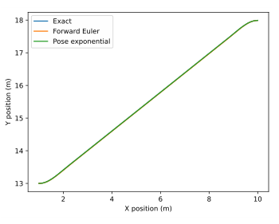
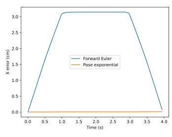
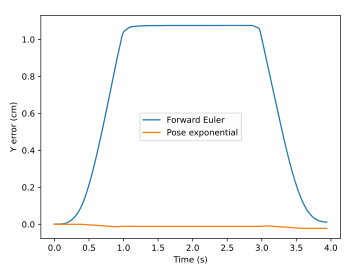
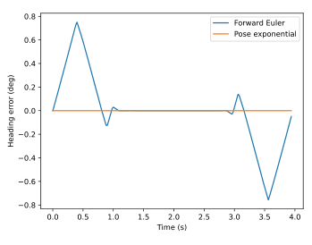

# Chapter 10: Pose estimation

Pose is defined as the position and orientation of an agent (a system with a controller). The plant usually includes the pose in its state vector. We’ll cover several methods for estimating an agent’s pose from local measurements such as encoders and gyroscope heading.

## 10.1 Forward Euler integration

The simplest way to perform pose estimation via dead reckoning (that is, no direct measurements of the pose are used) is to integrate the velocity in each orthogonal direction over time. In two dimensions, one could use

$$
\begin{aligned}
x_{k+1} &= x_k + v_k\cos\theta_k\,T \\
y_{k+1} &= y_k + v_k\sin\theta_k\,T \\
\theta_{k+1} &= \theta_{gyro,k+1}
\end{aligned}
$$

where $T$ is the sample period. This odometry approach assumes that the robot follows a straight path between samples (that is, $\omega = 0$ at all but the sample times).

## 10.2 Pose exponential

We can obtain a more accurate approximation of the pose by including first-order dynamics for the heading $\theta$. To provide a rationale for the math we’re about to do, we need to cover some aspects of group theory.

### 10.2.1 What is a group?

In mathematics, a group is a set equipped with a binary operation (an operation with two arguments) that combines any two elements (of the set) to form a third element in such a way that four conditions called *group axioms* are satisfied: closure, associativity, identity, and invertibility.

*Closure* means that the result is in the same set as the arguments.

*Associativity* means that within an expression containing two or more occurrences in a row of the same associative operator, the order in which the operations are performed does not matter as long as the sequence of the operands is not changed. In other words, different groupings of the operations produces the same result.

*Identity*, or an identity element, is a special type of element of a set with respect to a binary operation on that set, which leaves any element of the set unchanged when combined with it. For example, the additive identity of the set of integers is zero, which means that any integer summed with zero produces that integer.

*Invertibility* means there is an element that can “undo” the effect of combination with another given element. For integers and the addition operator, the inverse element would be the negation.

### 10.2.2 What is a pose?

To develop what a pose is in group theory, we need to define a few key groups. SO(2) is the special orthogonal group in dimension 2. They represent a 2D rotation.

SE(2) is the special euclidean group in dimension 2. They represent a 2D rotation and a 2D translation, which we call a 2D pose. In other words, pose is an element of SE(2).

### 10.2.3 What is a twist?

A 2D twist is an element of the tangent space of SE(2) (like the tangential distance traveled by the robot along an arc in SE(2)). We use the “pose exponential” to map a twist (an element of the tangent space) to an element of SE(2). In other words, we map a twist to a pose.

We call it a pose exponential because it’s an exponential map onto a pose. The term exponential is used because an exponential is the solution to integrating a differential equation whose derivative of a value is proportional to the value itself. For example, $\frac{dx}{dt} = ax$ has the solution $x = x_0 e^{at}$.

We use the pose exponential to take encoder measurement deltas and gyro angle deltas (which are in the tangent space and are thus a twist) and turn them into a change in pose. This gets added to the pose from the last update.

### 10.2.4 Derivation

We can obtain a more accurate approximation of the pose than Euler integration by including first-order dynamics for the heading $\theta$.

$$
\mathbf{x} = \begin{bmatrix}
    x \\
    y \\
    \theta
  \end{bmatrix}
$$

$v_x$, $v_y$, and $\omega$ are the $x$ and $y$ velocities of the robot within its local coordinate frame, which will be treated as constants.

> **Remark.** There are two coordinate frames used here: robot and global. A superscript on the left side of a matrix denotes the coordinate frame in which that matrix is represented. The robot’s coordinate frame is denoted by $R$ and the global coordinate frame is denoted by $G$.

In the robot frame (the tangent space)

$$
\begin{aligned}
{}^{R}{dx} &= {}^{R}{v_x} \,dt \\
{}^{R}{dy} &= {}^{R}{v_y} \,dt \\
{}^{R}{d\theta} &= {}^{R}{\omega} \,dt
\end{aligned}
$$

To transform this into the global frame SE(2), we apply a counterclockwise rotation matrix where $\theta$ changes over time.

$$
\begin{aligned}
{}^{G}{\begin{bmatrix}
    dx \\
    dy \\
    d\theta
  \end{bmatrix}} &=
  \begin{bmatrix}
    \cos\theta(t) & -\sin\theta(t) & 0 \\
    \sin\theta(t) &  \cos\theta(t) & 0 \\
                0 &              0 & 1
  \end{bmatrix}
  {}^{R}{\begin{bmatrix}
    v_x \\
    v_y \\
    \omega
  \end{bmatrix}} dt \\
  {}^{G}{\begin{bmatrix}
    dx \\
    dy \\
    d\theta
  \end{bmatrix}} &=
  \begin{bmatrix}
    \cos\omega t & -\sin\omega t & 0 \\
    \sin\omega t &  \cos\omega t & 0 \\
               0 &             0 & 1
  \end{bmatrix}
  {}^{R}{\begin{bmatrix}
    v_x \\
    v_y \\
    \omega
  \end{bmatrix}} dt
\end{aligned}
$$

Now, integrate the matrix equation (matrices are integrated element-wise). This derivation heavily utilizes the integration method described in section [4.3](04-calculus.md#43-change-of-variables).

$$
\begin{aligned}
{}^{G}{\begin{bmatrix}
    \Delta x \\
    \Delta y \\
    \Delta \theta
  \end{bmatrix}} &=
  \left.\begin{bmatrix}
     \frac{\sin\omega t}{\omega} & \frac{\cos\omega t}{\omega} & 0 \\
    -\frac{\cos\omega t}{\omega} & \frac{\sin\omega t}{\omega} & 0 \\
    0 & 0 & t
  \end{bmatrix}
  {}^{R}{\begin{bmatrix}
    v_x \\
    v_y \\
    \omega
  \end{bmatrix}} \right|_0^t \\
  {}^{G}{\begin{bmatrix}
    \Delta x \\
    \Delta y \\
    \Delta \theta
  \end{bmatrix}} &=
  \begin{bmatrix}
    \frac{\sin\omega t}{\omega} & \frac{\cos\omega t - 1}{\omega} & 0 \\
    \frac{1 - \cos\omega t}{\omega} & \frac{\sin\omega t}{\omega} & 0 \\
    0 & 0 & t
  \end{bmatrix}
  {}^{R}{\begin{bmatrix}
    v_x \\
    v_y \\
    \omega
  \end{bmatrix}}
\end{aligned}
$$

This equation assumes a starting orientation of $\theta = 0$. For nonzero starting orientations, we can apply a counterclockwise rotation by $\theta$.

$$
{}^{G}{\begin{bmatrix}
    \Delta x \\
    \Delta y \\
    \Delta \theta
  \end{bmatrix}} =
  \begin{bmatrix}
    \cos\theta & -\sin\theta & 0 \\
    \sin\theta &  \cos\theta & 0 \\
             0 &           0 & 1
  \end{bmatrix}
  \begin{bmatrix}
    \frac{\sin\omega t}{\omega} & \frac{\cos\omega t - 1}{\omega} & 0 \\
    \frac{1 - \cos\omega t}{\omega} & \frac{\sin\omega t}{\omega} & 0 \\
    0 & 0 & t
  \end{bmatrix}
  {}^{R}{\begin{bmatrix}
    v_x \\
    v_y \\
    \omega
  \end{bmatrix}} \tag{10.1}
$$

> **Remark.** Control system implementations will generally have a model update and a controller update in a given iteration. Equation (10.1) (the model update) uses the current velocity to advance the state to the next timestep (into the future). Since controllers use the current state, the controller update should be run before the model update.

If we factor out a $t$, we can use change in pose between updates instead of velocities.

$$
\begin{aligned}
{}^{G}{\begin{bmatrix}
    \Delta x \\
    \Delta y \\
    \Delta \theta
  \end{bmatrix}} &=
  \begin{bmatrix}
    \cos\theta & -\sin\theta & 0 \\
    \sin\theta &  \cos\theta & 0 \\
             0 &           0 & 1
  \end{bmatrix}
  \begin{bmatrix}
    \frac{\sin\omega t}{\omega} & \frac{\cos\omega t - 1}{\omega} & 0 \\
    \frac{1 - \cos\omega t}{\omega} & \frac{\sin\omega t}{\omega} & 0 \\
    0 & 0 & t
  \end{bmatrix}
  {}^{R}{\begin{bmatrix}
    v_x \\
    v_y \\
    \omega
  \end{bmatrix}}  \\
  {}^{G}{\begin{bmatrix}
    \Delta x \\
    \Delta y \\
    \Delta \theta
  \end{bmatrix}} &=
  \begin{bmatrix}
    \cos\theta & -\sin\theta & 0 \\
    \sin\theta &  \cos\theta & 0 \\
             0 &           0 & 1
  \end{bmatrix}
  \begin{bmatrix}
    \frac{\sin\omega t}{\omega t} & \frac{\cos\omega t - 1}{\omega t} & 0 \\
    \frac{1 - \cos\omega t}{\omega t} & \frac{\sin\omega t}{\omega t} & 0 \\
    0 & 0 & 1
  \end{bmatrix}
  {}^{R}{\begin{bmatrix}
    v_x \\
    v_y \\
    \omega
  \end{bmatrix}} t  \\
  {}^{G}{\begin{bmatrix}
    \Delta x \\
    \Delta y \\
    \Delta \theta
  \end{bmatrix}} &=
  \begin{bmatrix}
    \cos\theta & -\sin\theta & 0 \\
    \sin\theta &  \cos\theta & 0 \\
             0 &           0 & 1
  \end{bmatrix}
  \begin{bmatrix}
    \frac{\sin\omega t}{\omega t} & \frac{\cos\omega t - 1}{\omega t} & 0 \\
    \frac{1 - \cos\omega t}{\omega t} & \frac{\sin\omega t}{\omega t} & 0 \\
    0 & 0 & 1
  \end{bmatrix}
  {}^{R}{\begin{bmatrix}
    v_x t \\
    v_y t \\
    \omega t
  \end{bmatrix}}  \\
  {}^{G}{\begin{bmatrix}
    \Delta x \\
    \Delta y \\
    \Delta \theta
  \end{bmatrix}} &=
  \begin{bmatrix}
    \cos\theta & -\sin\theta & 0 \\
    \sin\theta &  \cos\theta & 0 \\
             0 &           0 & 1
  \end{bmatrix}
  {}^{R}{\begin{bmatrix}
    \frac{\sin\Delta\theta}{\Delta\theta} &
      \frac{\cos\Delta\theta - 1}{\Delta\theta} & 0 \\
    \frac{1 - \cos\Delta\theta}{\Delta\theta} &
      \frac{\sin\Delta\theta}{\Delta\theta} & 0 \\
    0 & 0 & 1
  \end{bmatrix}}
  {}^{R}{\begin{bmatrix}
    \Delta x \\
    \Delta y \\
    \Delta\theta
  \end{bmatrix}}
\end{aligned}
$$

The vector ${}^{R}{\begin{bmatrix}\Delta x & \Delta y & \Delta\theta \end{bmatrix}}^{\mathsf{T}}$ is a twist because it’s an element of the tangent space (the robot’s local coordinate frame).

> **Remark.** Control system implementations will generally have a model update and a controller update in a given iteration. Equation (None) (the model update) uses local distance and heading deltas between the previous and current timestep, so it advances the state to the current timestep. Since controllers use the current state, the controller update should be run after the model update.

When the robot is traveling on a straight trajectory ($\Delta\theta = 0$), some expressions within the equation above are indeterminate. We can approximate these with Taylor series expansions.

$$
\begin{aligned}
\frac{\sin\Delta\theta}{\Delta\theta}
    &= 1 - \frac{\Delta\theta^2}{6} + \ldots
    &&\approx 1 - \frac{\Delta\theta^2}{6} \\
\frac{\cos\Delta\theta - 1}{\Delta\theta}
    &= -\frac{\Delta\theta}{2} + \frac{\Delta\theta^3}{24} - \ldots
    &&\approx -\frac{\Delta\theta}{2} \\
\frac{1 - \cos\Delta\theta}{\Delta\theta}
    &= \frac{\Delta\theta}{2} - \frac{\Delta\theta^3}{24} + \ldots
    &&\approx \frac{\Delta\theta}{2}
\end{aligned}
$$

> **Theorem 10.2.1 — Pose exponential.**
>
> $$
> \begin{aligned}
> {}^{G}{\begin{bmatrix}
>       \Delta x \\
>       \Delta y \\
>       \Delta \theta
>     \end{bmatrix}} &=
>     \begin{bmatrix}
>       \cos\theta & -\sin\theta & 0 \\
>       \sin\theta &  \cos\theta & 0 \\
>                0 &           0 & 1
>     \end{bmatrix}
>     {}^{R}{\begin{bmatrix}
>       \frac{\sin\Delta\theta}{\Delta\theta} &
>         \frac{\cos\Delta\theta - 1}{\Delta\theta} & 0 \\
>       \frac{1 - \cos\Delta\theta}{\Delta\theta} &
>         \frac{\sin\Delta\theta}{\Delta\theta} & 0 \\
>       0 & 0 & 1
>     \end{bmatrix}}
>     {}^{R}{\begin{bmatrix}
>       \Delta x \\
>       \Delta y \\
>       \Delta\theta
>     \end{bmatrix}}
> \end{aligned}
> $$
>
> where $G$ denotes global coordinate frame and $R$ denotes robot’s coordinate frame.
>
> For sufficiently small $\Delta\theta$:
>
> $$
> \begin{aligned}
> \frac{\sin\Delta\theta}{\Delta\theta} &= 1 - \frac{\Delta\theta^2}{6} &
>     \frac{\cos\Delta\theta - 1}{\Delta\theta} &= -\frac{\Delta\theta}{2} &
>     \frac{1 - \cos\Delta\theta}{\Delta\theta} &= \frac{\Delta\theta}{2}
> \end{aligned}
> $$
>
> |  |  |  |  |
> |:---|:---|:---|:---|
> | $\Delta x$ | change in pose’s $x$ | $\Delta y$ | change in pose’s $y$ |
> | $\Delta \theta$ | change in pose’s $\theta$ | $\theta$ | starting angle in global coordinate frame |
>
> This change in pose can be added directly to the previous pose estimate to update it.

Figures 10.1 through 10.4 show the pose estimation errors of forward Euler odometry and pose exponential odometry for a feedforward S-curve trajectory (dt $= 20$ ms).

*Figure 10.1: Pose estimation comparison\
(y vs x)*

*Figure 10.2: Pose estimation comparison\
(x error vs time)*

*Figure 10.3: Pose estimation comparison\
(y error vs time)*

*Figure 10.4: Pose estimation comparison\
(heading error vs time)*

The highest errors for the 9.0 m by 5.0 m trajectory are 3.145 cm in $x$, 1.075 cm in $y$, and -0.757 deg in heading. The difference would be even more noticeable for paths with higher curvatures and longer durations. The error returns to near zero in this case because the curvature is symmetric, so the second half cancels the error accrued in the first half.

Using a smaller update period somewhat mitigates the forward Euler pose estimation error. However, there are bigger sources of error like turning scrub on skid steer robots that should be dealt with before odometry numerical accuracy.

### 10.2.5 Lie groups

While we avoided the topic in our explanation, pose is what’s known as a Lie group (a group that is also a differentiable manifold). There’s a lot of mathematical and controls results developed around Lie groups, so we’re mentioning the connection here in case you want to search the Internet for more information.

## 10.3 Pose correction

The previous methods for pose estimation have assumed no direct pose measurements are available. At best, only heading is available. To augment any of them with corrections from full pose measurements, an Extended Kalman filter (section [9.8](09-stochastic-control-theory.md#98-extended-kalman-filter)) or Unscented Kalman filter (section [9.9](09-stochastic-control-theory.md#99-unscented-kalman-filter)) can be used.
