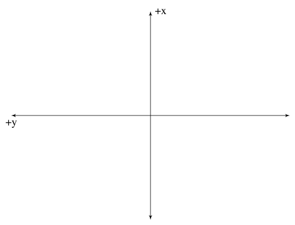
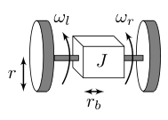
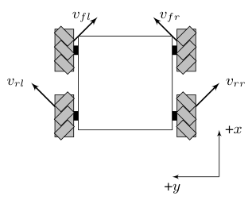
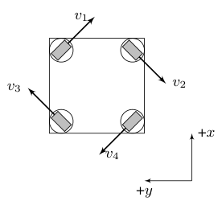

# Chapter 11: Dynamics

## 11.1 Linear motion

$$
\sum F = ma
$$

where $\sum F$ is the sum of all forces applied to an object in Newtons, $m$ is the mass of the object in $kg$, and $a$ is the net acceleration of the object in $\frac{m}{s^2}$.

$$
x(t) = x_0 + v_0 t + \frac{1}{2}at^2
$$

where $x(t)$ is an object’s position at time $t$, $x_0$ is the initial position, $v_0$ is the initial velocity, and $a$ is the acceleration.

## 11.2 Angular motion

$$
\sum \tau = I\alpha
$$

where $\sum \tau$ is the sum of all torques applied to an object in Newton-meters, $I$ is the moment of inertia of the object in $kg\text{-}m^2$ (also called the rotational mass), and $\alpha$ is the net angular acceleration of the object in $\frac{rad}{s^2}$.

$$
\theta(t) = \theta_0 + \omega_0 t + \frac{1}{2}\alpha t^2
$$

where $\theta(t)$ is an object’s angle at time $t$, $\theta_0$ is the initial angle, $\omega_0$ is the initial angular velocity, and $\alpha$ is the angular acceleration.

## 11.3 Vectors

Vectors are quantities with a magnitude and a direction. Vectors in three-dimensional space have a coordinate for each spatial direction $x$, $y$, and $z$. Let’s take the vector $\vec{a} = \langle 1, 2, 3 \rangle$. $\vec{a}$ is a three-dimensional vector that describes a movement 1 unit in the $x$ direction, 2 units in the $y$ direction, and 3 units in the $z$ direction.

We define $\hat{i}$, $\hat{j}$, and $\hat{k}$ as vectors that represent the fundamental movements one can make the three-dimensional space: 1 unit of movement in the $x$ direction, 1 unit of movement $y$ direction, and 1 unit of movement in the $z$ direction respectively. These three vectors form a *basis* of three-dimensional space because copies of them can be added together to reach any point in three-dimensional space.

$$
\begin{aligned}
\hat{i} = \langle 1, 0, 0 \rangle \\
\hat{j} = \langle 0, 1, 0 \rangle \\
\hat{k} = \langle 0, 0, 1 \rangle
\end{aligned}
$$

We can also write the vector $\vec{a}$ in terms of these basis vectors.

$$
\vec{a} = 1\hat{i} + 2\hat{j} + 3\hat{k}
$$

### 11.3.1 Basic vector operations

We will now show this is equivalent to the original notation through some vector mathematics. First, we’ll substitute in the values for the basis vectors.

$$
\begin{aligned}
\vec{a} &= 1\langle 1, 0, 0 \rangle + 2\langle 0, 1, 0 \rangle +
    3\langle 0, 0, 1 \rangle
\end{aligned}
$$

Scalars are multiplied component-wise with vectors.

$$
\begin{aligned}
\vec{a} &= \langle 1, 0, 0 \rangle + \langle 0, 2, 0 \rangle +
    \langle 0, 0, 3 \rangle
\end{aligned}
$$

Vectors are added by summing each of their components.

$$
\begin{aligned}
\vec{a} &= \langle 1, 2, 3 \rangle
\end{aligned}
$$

### 11.3.2 Cross product

The cross product is denoted by $\times$. The cross product of the basis vectors are computed as follows.

$$
\begin{aligned}
\hat{i} \times \hat{j} &= \hat{k} \\
\hat{j} \times \hat{k} &= \hat{i} \\
\hat{k} \times \hat{i} &= \hat{j}
\end{aligned}
$$

They proceed in a cyclic fashion through i, j, and k. If a vector is crossed with itself, it produces the zero vector (a scalar zero for each coordinate). The cross products of the basis vectors in the opposite order progress backwards and include a negative sign.

$$
\begin{aligned}
\hat{i} \times \hat{k} &= -\hat{j} \\
\hat{k} \times \hat{j} &= -\hat{i} \\
\hat{j} \times \hat{i} &= -\hat{k}
\end{aligned}
$$

Given vectors $\vec{u} = a\hat{i} + b\hat{j} + c\hat{k}$ and $\vec{v} = d\hat{i} + e\hat{j} + f\hat{k}$, $\vec{u} \times \vec{v}$ is computed using the distributive property.

$$
\begin{aligned}
\vec{u} \times \vec{v} &= (a\hat{i} + b\hat{j} + c\hat{k}) \times
    (d\hat{i} + e\hat{j} + f\hat{k}) \\
\vec{u} \times \vec{v} &= ad(\hat{i} \times \hat{i}) + ae(\hat{i} \times
    \hat{j}) + af(\hat{i} \times \hat{k}) \\
&\qquad + bd(\hat{j} \times \hat{i}) + be(\hat{j} \times \hat{j}) \\
&\qquad + bf(\hat{j} \times \hat{k}) \\
&\qquad + cd(\hat{k} \times \hat{i}) + ce(\hat{k} \times \hat{j}) +
    cf(\hat{k} \times \hat{k}) \\
\vec{u} \times \vec{v} &= ae\hat{k} + af(-\hat{j}) + bd(-\hat{k}) +
    bf\hat{i} + cd\hat{j} + ce(-\hat{i}) \\
\vec{u} \times \vec{v} &= ae\hat{k} - af\hat{j} - bd\hat{k} + bf\hat{i} +
    cd\hat{j} - ce\hat{i} \\
\vec{u} \times \vec{v} &= (bf - ce)\hat{i} + (cd - af)\hat{j} +
    (ae - bd)\hat{k}
\end{aligned}
$$

## 11.4 Curvilinear motion

Curvilinear motion describes the motion of an object along a fixed curve. This motion has both linear and angular components. For derivations involving curvilinear motion, we’ll assume positive $x$ ($\hat{i}$) is forward, positive $y$ ($\hat{j}$) is to the left, positive $z$ ($\hat{k}$) is up, and the robot is facing in the $x$ direction. This axes convention is known as North-West-Up (NWU), and is shown in figure 11.1.

*Figure 11.1: 2D projection of North-West-Up (NWU) axes convention. The positive z-axis is pointed out of the page toward the reader.*

The main equation we’ll need is the following.

$$
\vec{v}_B = \vec{v}_A + \omega_A \times \vec{r}_{B|A}
$$

where $\vec{v}_B$ is the velocity vector at point B, $\vec{v}_A$ is the velocity vector at point A, $\omega_A$ is the angular velocity vector at point A, and $\vec{r}_{B|A}$ is the distance vector from point A to point B (also described as the “distance to B relative to A”).

## 11.5 Differential drive kinematics

A differential drive has two wheels, one on each side, separated by some distance $2r_b$. The forces they generate when moving forward are shown in figure 11.2.

*Figure 11.2: Differential drive free body diagram*

### 11.5.1 Inverse kinematics

The mapping from $v$ and $\omega$ to the left and right wheel velocities $v_l$ and $v_r$ is derived as follows. Let $\vec{v}_c$ be the velocity vector of the center of rotation, $\vec{v}_l$ be the velocity vector of the left wheel, $\vec{v}_r$ be the velocity vector of the right wheel, $r_b$ is the distance from the center of rotation to each wheel, and $\omega$ is the counterclockwise turning rate around the center of rotation.

Once we have the vector equation representing the wheel’s velocity, we’ll project it onto the wheel direction vector using the dot product.

First, we’ll derive $v_l$.

$$
\begin{aligned}
\vec{v}_l &= v_c \hat{i} + \omega \hat{k} \times r_b \hat{j} \\
\vec{v}_l &= v_c \hat{i} - \omega r_b \hat{i} \\
\vec{v}_l &= (v_c - \omega r_b) \hat{i}
\end{aligned}
$$

Now, project this vector onto the left wheel, which is pointed in the $\hat{i}$ direction.

$$
\begin{aligned}
v_l &= (v_c - \omega r_b) \hat{i} \cdot \frac{\hat{i}}{\left\lVert \hat{i} \right\rVert}
\end{aligned}
$$

The magnitude of $\hat{i}$ is $1$, so the denominator cancels.

$$
\begin{aligned}
v_l &= (v_c - \omega r_b) \hat{i} \cdot \hat{i} \\
v_l &= v_c - \omega r_b
\end{aligned}
$$

Next, we’ll derive $v_r$.

$$
\begin{aligned}
\vec{v}_r &= v_c \hat{i} + \omega \hat{k} \times r_b \hat{j} \\
\vec{v}_r &= v_c \hat{i} + \omega r_b \hat{i} \\
\vec{v}_r &= (v_c + \omega r_b) \hat{i}
\end{aligned}
$$

Now, project this vector onto the right wheel, which is pointed in the $\hat{i}$ direction.

$$
\begin{aligned}
v_r &= (v_c + \omega r_b) \hat{i} \cdot \frac{\hat{i}}{\left\lVert \hat{i} \right\rVert}
\end{aligned}
$$

The magnitude of $\hat{i}$ is $1$, so the denominator cancels.

$$
\begin{aligned}
v_r &= (v_c + \omega r_b) \hat{i} \cdot \hat{i} \\
v_r &= v_c + \omega r_b
\end{aligned}
$$

So the two inverse kinematic equations are as follows.

$$
\begin{aligned}
v_l &= v_c - \omega r_b \\
v_r &= v_c + \omega r_b
\end{aligned}
$$

Now, we’ll factor them out into matrices.

$$
\begin{aligned}
\begin{bmatrix}
    v_l \\
    v_r
  \end{bmatrix} &=
  \begin{bmatrix}
    1 & -r_b \\
    1 & r_b
  \end{bmatrix}
  \begin{bmatrix}
    v_c \\
    \omega
  \end{bmatrix}
\end{aligned} \tag{11.5}
$$

### 11.5.2 Forward kinematics

The forward kinematics are the inverse of equation (11.5).

$$
\begin{aligned}
\begin{bmatrix}
    v_c \\
    \omega
  \end{bmatrix} &=
  \begin{bmatrix}
    1 & -r_b \\
    1 & r_b
  \end{bmatrix}^{-1}
  \begin{bmatrix}
    v_l \\
    v_r
  \end{bmatrix}  \\
  \begin{bmatrix}
    v_c \\
    \omega
  \end{bmatrix} &=
  \begin{bmatrix}
    \frac{1}{2} & \frac{1}{2} \\
    -\frac{1}{2r_b} & \frac{1}{2r_b}
  \end{bmatrix}
  \begin{bmatrix}
    v_l \\
    v_r
  \end{bmatrix}
\end{aligned}
$$

So the two forward kinematic equations are as follows.

$$
\begin{aligned}
v_c &= \frac{v_r + v_l}{2} \\
  \omega &= \frac{v_r - v_l}{2 r_b}
\end{aligned}
$$

## 11.6 Mecanum drive kinematics

A mecanum drive has four wheels, one on each corner of a rectangular chassis. The wheels have rollers offset at $45$ degrees (whether it’s clockwise or not varies per wheel). The forces they generate when moving forward are shown in figure 11.3.

*Figure 11.3: Mecanum drive free body diagram*

Note that the velocity of the wheel is the same as the velocity in the diagram for the purposes of feedback control. The rollers on the wheel redirect the velocity vector.

### 11.6.1 Inverse kinematics

First, we’ll derive the front-left wheel kinematics.

$$
\begin{aligned}
\vec{v}_{fl} &= v_x \hat{i} + v_y \hat{j} +
    \omega \hat{k} \times (r_{fl_x} \hat{i} + r_{fl_y} \hat{j}) \\
\vec{v}_{fl} &= v_x \hat{i} + v_y \hat{j} +
    \omega r_{fl_x} \hat{j} - \omega r_{fl_y} \hat{i} \\
\vec{v}_{fl} &= (v_x - \omega r_{fl_y}) \hat{i} +
    (v_y + \omega r_{fl_x}) \hat{j}
\end{aligned}
$$

Project the front-left wheel onto its wheel vector.

$$
\begin{aligned}
v_{fl} &= ((v_x - \omega r_{fl_y}) \hat{i} + (v_y + \omega r_{fl_x}) \hat{j})
    \cdot \frac{\hat{i} - \hat{j}}{\sqrt{2}} \\
v_{fl} &= ((v_x - \omega r_{fl_y}) - (v_y + \omega r_{fl_x}))
    \frac{1}{\sqrt{2}} \\
v_{fl} &= (v_x - \omega r_{fl_y} - v_y - \omega r_{fl_x})
    \frac{1}{\sqrt{2}} \\
v_{fl} &= (v_x - v_y - \omega r_{fl_y} - \omega r_{fl_x})
    \frac{1}{\sqrt{2}} \\
v_{fl} &= (v_x - v_y - \omega (r_{fl_x} + r_{fl_y}))
    \frac{1}{\sqrt{2}} \\
v_{fl} &= \frac{1}{\sqrt{2}} v_x - \frac{1}{\sqrt{2}} v_y -
    \frac{1}{\sqrt{2}} \omega (r_{fl_x} + r_{fl_y})
\end{aligned}
$$

Next, we’ll derive the front-right wheel kinematics.

$$
\begin{aligned}
\vec{v}_{fr} &= v_x \hat{i} + v_y \hat{j} +
    \omega \hat{k} \times (r_{fr_x} \hat{i} + r_{fr_y} \hat{j}) \\
\vec{v}_{fr} &= v_x \hat{i} + v_y \hat{j} +
    \omega r_{fr_x} \hat{j} - \omega r_{fr_y} \hat{i} \\
\vec{v}_{fr} &= (v_x - \omega r_{fr_y}) \hat{i} +
    (v_y + \omega r_{fr_x}) \hat{j}
\end{aligned}
$$

Project the front-right wheel onto its wheel vector.

$$
\begin{aligned}
v_{fr} &= ((v_x - \omega r_{fr_y}) \hat{i} + (v_y + \omega r_{fr_x}) \hat{j})
    \cdot (\hat{i} + \hat{j}) \frac{1}{\sqrt{2}} \\
v_{fr} &= ((v_x - \omega r_{fr_y}) + (v_y + \omega r_{fr_x}))
    \frac{1}{\sqrt{2}} \\
v_{fr} &= (v_x - \omega r_{fr_y} + v_y + \omega r_{fr_x})
    \frac{1}{\sqrt{2}} \\
v_{fr} &= (v_x + v_y - \omega r_{fr_y} + \omega r_{fr_x})
    \frac{1}{\sqrt{2}} \\
v_{fr} &= (v_x + v_y + \omega (r_{fr_x} - r_{fr_y}))
    \frac{1}{\sqrt{2}} \\
v_{fr} &= \frac{1}{\sqrt{2}} v_x + \frac{1}{\sqrt{2}} v_y +
    \frac{1}{\sqrt{2}} \omega (r_{fr_x} - r_{fr_y})
\end{aligned}
$$

Next, we’ll derive the rear-left wheel kinematics.

$$
\begin{aligned}
\vec{v}_{rl} &= v_x \hat{i} + v_y \hat{j} +
    \omega \hat{k} \times (r_{rl_x} \hat{i} + r_{rl_y} \hat{j}) \\
\vec{v}_{rl} &= v_x \hat{i} + v_y \hat{j} +
    \omega r_{rl_x} \hat{j} - \omega r_{rl_y} \hat{i} \\
\vec{v}_{rl} &= (v_x - \omega r_{rl_y}) \hat{i} +
    (v_y + \omega r_{rl_x}) \hat{j}
\end{aligned}
$$

Project the rear-left wheel onto its wheel vector.

$$
\begin{aligned}
v_{rl} &= ((v_x - \omega r_{rl_y}) \hat{i} + (v_y + \omega r_{rl_x}) \hat{j})
    \cdot (\hat{i} + \hat{j}) \frac{1}{\sqrt{2}} \\
v_{rl} &= ((v_x - \omega r_{rl_y}) + (v_y + \omega r_{rl_x}))
    \frac{1}{\sqrt{2}} \\
v_{rl} &= (v_x - \omega r_{rl_y} + v_y + \omega r_{rl_x})
    \frac{1}{\sqrt{2}} \\
v_{rl} &= (v_x + v_y - \omega r_{rl_y} + \omega r_{rl_x})
    \frac{1}{\sqrt{2}} \\
v_{rl} &= (v_x + v_y + \omega (r_{rl_x} - r_{rl_y}))
    \frac{1}{\sqrt{2}} \\
v_{rl} &= \frac{1}{\sqrt{2}} v_x + \frac{1}{\sqrt{2}} v_y +
    \frac{1}{\sqrt{2}} \omega (r_{rl_x} - r_{rl_y})
\end{aligned}
$$

Next, we’ll derive the rear-right wheel kinematics.

$$
\begin{aligned}
\vec{v}_{rr} &= v_x \hat{i} + v_y \hat{j} +
    \omega \hat{k} \times (r_{rr_x} \hat{i} + r_{rr_y} \hat{j}) \\
\vec{v}_{rr} &= v_x \hat{i} + v_y \hat{j} +
    \omega r_{rr_x} \hat{j} - \omega r_{rr_y} \hat{i} \\
\vec{v}_{rr} &= (v_x - \omega r_{rr_y}) \hat{i} +
    (v_y + \omega r_{rr_x}) \hat{j}
\end{aligned}
$$

Project the rear-right wheel onto its wheel vector.

$$
\begin{aligned}
v_{rr} &= ((v_x - \omega r_{rr_y}) \hat{i} + (v_y + \omega r_{rr_x}) \hat{j})
    \cdot \frac{\hat{i} - \hat{j}}{\sqrt{2}} \\
v_{rr} &= ((v_x - \omega r_{rr_y}) - (v_y + \omega r_{rr_x}))
    \frac{1}{\sqrt{2}} \\
v_{rr} &= (v_x - \omega r_{rr_y} - v_y - \omega r_{rr_x})
    \frac{1}{\sqrt{2}} \\
v_{rr} &= (v_x - v_y - \omega r_{rr_y} - \omega r_{rr_x})
    \frac{1}{\sqrt{2}} \\
v_{rr} &= (v_x - v_y - \omega (r_{rr_x} + r_{rr_y}))
    \frac{1}{\sqrt{2}} \\
v_{rr} &= \frac{1}{\sqrt{2}} v_x - \frac{1}{\sqrt{2}} v_y -
    \frac{1}{\sqrt{2}} \omega (r_{rr_x} + r_{rr_y})
\end{aligned}
$$

This gives the following inverse kinematic equations.

$$
\begin{aligned}
v_{fl} &= \frac{1}{\sqrt{2}} v_x - \frac{1}{\sqrt{2}} v_y -
    \frac{1}{\sqrt{2}} \omega (r_{fl_x} + r_{fl_y}) \\
v_{fr} &= \frac{1}{\sqrt{2}} v_x + \frac{1}{\sqrt{2}} v_y +
    \frac{1}{\sqrt{2}} \omega (r_{fr_x} - r_{fr_y}) \\
v_{rl} &= \frac{1}{\sqrt{2}} v_x + \frac{1}{\sqrt{2}} v_y +
    \frac{1}{\sqrt{2}} \omega (r_{rl_x} - r_{rl_y}) \\
v_{rr} &= \frac{1}{\sqrt{2}} v_x - \frac{1}{\sqrt{2}} v_y -
    \frac{1}{\sqrt{2}} \omega (r_{rr_x} + r_{rr_y})
\end{aligned}
$$

Now, we’ll factor them out into matrices.

$$
\begin{aligned}
\begin{bmatrix}
    v_{fl} \\
    v_{fr} \\
    v_{rl} \\
    v_{rr}
  \end{bmatrix} &=
  \begin{bmatrix}
    \frac{1}{\sqrt{2}} & -\frac{1}{\sqrt{2}} &
      -\frac{1}{\sqrt{2}}(r_{fl_x} + r_{fl_y}) \\
    \frac{1}{\sqrt{2}} &  \frac{1}{\sqrt{2}} &
      \frac{1}{\sqrt{2}}(r_{fr_x} - r_{fr_y}) \\
    \frac{1}{\sqrt{2}} &  \frac{1}{\sqrt{2}} &
      \frac{1}{\sqrt{2}}(r_{rl_x} - r_{rl_y}) \\
    \frac{1}{\sqrt{2}} & -\frac{1}{\sqrt{2}} &
      -\frac{1}{\sqrt{2}}(r_{rr_x} + r_{rr_y})
  \end{bmatrix}
  \begin{bmatrix}
    v_x \\
    v_y \\
    \omega
  \end{bmatrix}  \\
  \begin{bmatrix}
    v_{fl} \\
    v_{fr} \\
    v_{rl} \\
    v_{rr}
  \end{bmatrix} &= \frac{1}{\sqrt{2}}
  \begin{bmatrix}
    1 & -1  & -(r_{fl_x} + r_{fl_y}) \\
    1 &  1  &  (r_{fr_x} - r_{fr_y}) \\
    1 &  1  &  (r_{rl_x} - r_{rl_y}) \\
    1 & -1  & -(r_{rr_x} + r_{rr_y})
  \end{bmatrix}
  \begin{bmatrix}
    v_x \\
    v_y \\
    \omega
  \end{bmatrix}
\end{aligned}
$$

### 11.6.2 Forward kinematics

Let $\mathbf{M}$ be the $4 \times 3$ inverse kinematics matrix above including the $\frac{1}{\sqrt{2}}$ factor. The forward kinematics are

$$
\begin{bmatrix}
    v_x \\
    v_y \\
    \omega
  \end{bmatrix} =
  \mathbf{M}^+
  \begin{bmatrix}
    v_{fl} \\
    v_{fr} \\
    v_{rl} \\
    v_{rr}
  \end{bmatrix}
$$

where $\mathbf{M}^+$ is the pseudoinverse of $\mathbf{M}$.

## 11.7 Swerve drive kinematics

A swerve drive has an arbitrary number of wheels which can rotate in place independent of the chassis. The forces they generate are shown in figure 11.4.

*Figure 11.4: Swerve drive free body diagram*

### 11.7.1 Inverse kinematics

$$
\begin{aligned}
\vec{v}_{wheel1} &= \vec{v}_{robot} + \vec{\omega}_{robot} \times
    \vec{r}_{robot2wheel1} \\
\vec{v}_{wheel2} &= \vec{v}_{robot} + \vec{\omega}_{robot} \times
    \vec{r}_{robot2wheel2} \\
\vec{v}_{wheel3} &= \vec{v}_{robot} + \vec{\omega}_{robot} \times
    \vec{r}_{robot2wheel3} \\
\vec{v}_{wheel4} &= \vec{v}_{robot} + \vec{\omega}_{robot} \times
    \vec{r}_{robot2wheel4}
\end{aligned}
$$

where $\vec{v}_{wheel}$ is the wheel velocity vector, $\vec{v}_{robot}$ is the robot velocity vector, $\vec{\omega}_{robot}$ is the robot angular velocity vector, $\vec{r}_{robot2wheel}$ is the displacement vector from the robot’s center of rotation to the wheel,[^1] $\vec{v}_{robot} = v_x \hat{i} + v_y \hat{j}$, and $\vec{r}_{robot2wheel} = r_x \hat{i} + r_y \hat{j}$. The number suffixes denote a specific wheel in figure 11.4.

$$
\begin{aligned}
\vec{v}_1 &= v_x \hat{i} + v_y \hat{j} + \omega \hat{k} \times
    (r_{1x} \hat{i} + r_{1y} \hat{j}) \\
\vec{v}_2 &= v_x \hat{i} + v_y \hat{j} + \omega \hat{k} \times
    (r_{2x} \hat{i} + r_{2y} \hat{j}) \\
\vec{v}_3 &= v_x \hat{i} + v_y \hat{j} + \omega \hat{k} \times
    (r_{3x} \hat{i} + r_{3y} \hat{j}) \\
\vec{v}_4 &= v_x \hat{i} + v_y \hat{j} + \omega \hat{k} \times
    (r_{4x} \hat{i} + r_{4y} \hat{j})
\end{aligned}
$$

$$
\begin{aligned}
\vec{v}_1 &= v_x \hat{i} + v_y \hat{j} +
    (\omega r_{1x} \hat{j} - \omega r_{1y} \hat{i}) \\
\vec{v}_2 &= v_x \hat{i} + v_y \hat{j} +
    (\omega r_{2x} \hat{j} - \omega r_{2y} \hat{i}) \\
\vec{v}_3 &= v_x \hat{i} + v_y \hat{j} +
    (\omega r_{3x} \hat{j} - \omega r_{3y} \hat{i}) \\
\vec{v}_4 &= v_x \hat{i} + v_y \hat{j} +
    (\omega r_{4x} \hat{j} - \omega r_{4y} \hat{i})
\end{aligned}
$$

$$
\begin{aligned}
\vec{v}_1 &= v_x \hat{i} + v_y \hat{j} +
    \omega r_{1x} \hat{j} - \omega r_{1y} \hat{i} \\
\vec{v}_2 &= v_x \hat{i} + v_y \hat{j} +
    \omega r_{2x} \hat{j} - \omega r_{2y} \hat{i} \\
\vec{v}_3 &= v_x \hat{i} + v_y \hat{j} +
    \omega r_{3x} \hat{j} - \omega r_{3y} \hat{i} \\
\vec{v}_4 &= v_x \hat{i} + v_y \hat{j} +
    \omega r_{4x} \hat{j} - \omega r_{4y} \hat{i}
\end{aligned}
$$

$$
\begin{aligned}
\vec{v}_1 &= v_x \hat{i} - \omega r_{1y} \hat{i} +
    v_y \hat{j} + \omega r_{1x} \hat{j} \\
\vec{v}_2 &= v_x \hat{i} - \omega r_{2y} \hat{i} +
    v_y \hat{j} + \omega r_{2x} \hat{j} \\
\vec{v}_3 &= v_x \hat{i} - \omega r_{3y} \hat{i} +
    v_y \hat{j} + \omega r_{3x} \hat{j} \\
\vec{v}_4 &= v_x \hat{i} - \omega r_{4y} \hat{i} +
    v_y \hat{j} + \omega r_{4x} \hat{j}
\end{aligned}
$$

$$
\begin{aligned}
\vec{v}_1 &= (v_x - \omega r_{1y}) \hat{i} + (v_y + \omega r_{1x}) \hat{j} \\
\vec{v}_2 &= (v_x - \omega r_{2y}) \hat{i} + (v_y + \omega r_{2x}) \hat{j} \\
\vec{v}_3 &= (v_x - \omega r_{3y}) \hat{i} + (v_y + \omega r_{3x}) \hat{j} \\
\vec{v}_4 &= (v_x - \omega r_{4y}) \hat{i} + (v_y + \omega r_{4x}) \hat{j}
\end{aligned}
$$

Separate the i-hat components into independent equations.

$$
\begin{aligned}
v_{1x} &= v_x - \omega r_{1y} \\
v_{2x} &= v_x - \omega r_{2y} \\
v_{3x} &= v_x - \omega r_{3y} \\
v_{4x} &= v_x - \omega r_{4y}
\end{aligned}
$$

Separate the j-hat components into independent equations.

$$
\begin{aligned}
v_{1y} &= v_y + \omega r_{1x} \\
v_{2y} &= v_y + \omega r_{2x} \\
v_{3y} &= v_y + \omega r_{3x} \\
v_{4y} &= v_y + \omega r_{4x}
\end{aligned}
$$

Now, we’ll factor them out into matrices.

$$
\begin{aligned}
\begin{bmatrix}
    v_{1x} \\
    v_{2x} \\
    v_{3x} \\
    v_{4x} \\
    v_{1y} \\
    v_{2y} \\
    v_{3y} \\
    v_{4y}
  \end{bmatrix} &=
  \begin{bmatrix}
    1 & 0 & -r_{1y} \\
    1 & 0 & -r_{2y} \\
    1 & 0 & -r_{3y} \\
    1 & 0 & -r_{4y} \\
    0 & 1 &  r_{1x} \\
    0 & 1 &  r_{2x} \\
    0 & 1 &  r_{3x} \\
    0 & 1 &  r_{4x}
  \end{bmatrix}
  \begin{bmatrix}
    v_x \\
    v_y \\
    \omega
  \end{bmatrix}
\end{aligned}
$$

Rearrange the rows so the $x$ and $y$ components are in adjacent rows.

$$
\begin{aligned}
\begin{bmatrix}
    v_{1x} \\
    v_{1y} \\
    v_{2x} \\
    v_{2y} \\
    v_{3x} \\
    v_{3y} \\
    v_{4x} \\
    v_{4y}
  \end{bmatrix} &=
  \begin{bmatrix}
    1 & 0 & -r_{1y} \\
    0 & 1 &  r_{1x} \\
    1 & 0 & -r_{2y} \\
    0 & 1 &  r_{2x} \\
    1 & 0 & -r_{3y} \\
    0 & 1 &  r_{3x} \\
    1 & 0 & -r_{4y} \\
    0 & 1 &  r_{4x}
  \end{bmatrix}
  \begin{bmatrix}
    v_x \\
    v_y \\
    \omega
  \end{bmatrix}
\end{aligned} \tag{11.12}
$$

To convert the swerve module $x$ and $y$ velocity components to a velocity and heading, use the Pythagorean theorem and arctangent respectively. Here’s an example for module 1.

$$
\begin{aligned}
v_1 &= \sqrt{v_{1x}^2 + v_{1y}^2} \\
\theta_1 &= \tan^{-1}\left(\frac{v_{1y}}{v_{1x}}\right)
\end{aligned}
$$

### 11.7.2 Forward kinematics

Let $\mathbf{M}$ be the $8 \times 3$ inverse kinematics matrix from equation (11.12). The forward kinematics are

$$
\begin{bmatrix}
    v_x \\
    v_y \\
    \omega
  \end{bmatrix} =
  \mathbf{M}^+
  \begin{bmatrix}
    v_{1x} \\
    v_{1y} \\
    v_{2x} \\
    v_{2y} \\
    v_{3x} \\
    v_{3y} \\
    v_{4x} \\
    v_{4y}
  \end{bmatrix}
$$

where $\mathbf{M}^+$ is the pseudoinverse of $\mathbf{M}$.

[^1]: The robot’s center of rotation need not coincide with the robot’s geometric center.
