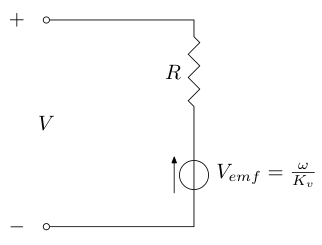
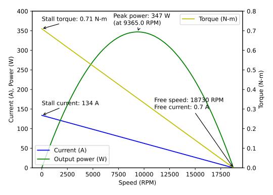
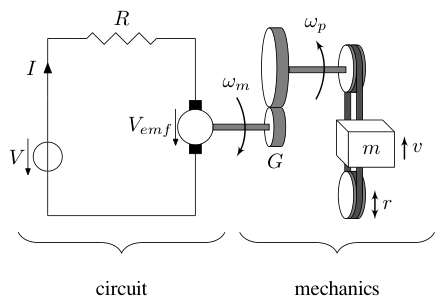
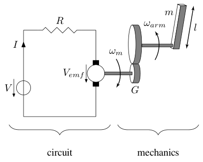
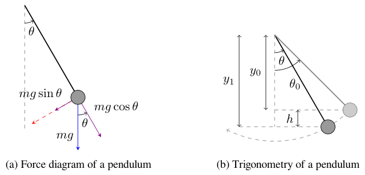
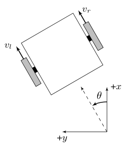

# Chapter 12: Newtonian mechanics examples

A model is a set of differential equations describing how the system behaves over time. There are two common approaches for developing them.

1.  Collecting data on the physical system’s behavior and performing system identification with it.

2.  Using physics to derive the system’s model from first principles.

This chapter covers the second approach using Newtonian mechanics.

The models derived here should cover most types of motion seen on an FRC robot. Furthermore, they can be easily tweaked to describe many types of mechanisms just by pattern-matching. There’s only so many ways to hook up a mass to a motor in FRC. The flywheel model can be used for spinning mechanisms, the elevator model can be used for spinning mechanisms transformed to linear motion, and the single-jointed arm model can be used for rotating servo mechanisms (it’s just the flywheel model augmented with a position state).

These models assume all motor controllers driving DC motors are set to brake mode instead of coast mode. Brake mode behaves the same as coast mode except where the applied voltage is zero. In brake mode, the motor leads are shorted together to prevent movement. In coast mode, the motor leads are an open circuit.

## 12.1 DC motor

We will be deriving a first-order model for a DC motor. A second-order model would include the inductance of the motor windings as well, but we’re assuming the time constant of the inductor is small enough that its affect on the model behavior is negligible for FRC use cases (see subsection [6.10.7](06-continuous-state-space-control.md#6107-do-flywheels-need-pd-control) for a demonstration of this for a real DC motor).

> **Remark.** For the brushless motor commutation methods currently available in FRC (trapezoidal commutation, field-oriented control), brushed and brushless DC motors have the same dynamics. However, more advanced commutation methods can break the linear back-EMF assumption of the brushed motor model.

The first-order model will only require numbers from the motor’s datasheet. The second-order model would require measuring the motor inductance as well, which generally isn’t in the datasheet. It can be difficult to measure accurately without the right equipment.

### 12.1.1 Equations of motion

The circuit for a DC motor is shown in figure 12.1.



*Figure 12.1: DC motor circuit*

$V$ is the voltage applied to the motor, $I$ is the current through the motor in Amps, $R$ is the resistance across the motor in Ohms, $\omega$ is the angular velocity of the motor in radians per second, and $K_v$ is the angular velocity constant in radians per second per Volt. This circuit reflects the following relation.

$$
V = IR + \frac{\omega}{K_v} \tag{12.1}
$$

The mechanical relation for a DC motor is

$$
\tau = K_t I
$$

where $\tau$ is the torque produced by the motor in Newton-meters and $K_t$ is the torque constant in Newton-meters per Amp. Therefore

$$
I = \frac{\tau}{K_t}
$$

Substitute this into equation (12.1).

$$
V = \frac{\tau}{K_t} R + \frac{\omega}{K_v} \tag{12.3}
$$

### 12.1.2 Calculating constants

A typical motor’s datasheet should include graphs of the motor’s measured torque and current for different angular velocities for a given voltage applied to the motor. Figure 12.2 is an example. An FRC motor’s datasheet can be found on its vendor’s website.



*Figure 12.2: Example motor datasheet for 775pro*

#### Torque constant $K_t$

$$
\begin{aligned}
\tau &= K_t I \\
K_t &= \frac{\tau}{I} \\
K_t &= \frac{\tau_{stall}}{I_{stall}}
\end{aligned}
$$

where $\tau_{stall}$ is the stall torque and $I_{stall}$ is the stall current of the motor from its datasheet.

#### Resistance $R$

Recall equation (12.1).

$$
\begin{aligned}
V &= IR + \frac{\omega}{K_v}
\end{aligned}
$$

When the motor is stalled, $\omega = 0$.

$$
\begin{aligned}
V &= I_{stall} R \\
R &= \frac{V}{I_{stall}}
\end{aligned}
$$

where $I_{stall}$ is the stall current of the motor and $V$ is the voltage applied to the motor at stall.

#### Angular velocity constant $K_v$

Recall equation (12.1).

$$
\begin{aligned}
V &= IR + \frac{\omega}{K_v} \\
V - IR &= \frac{\omega}{K_v} \\
K_v &= \frac{\omega}{V - IR}
\end{aligned}
$$

When the motor is spinning under no load,

$$
\begin{aligned}
K_v &= \frac{\omega_{free}}{V - I_{free}R}
\end{aligned}
$$

where $\omega_{free}$ is the angular velocity of the motor under no load (also known as the free speed), and $V$ is the voltage applied to the motor when it’s spinning at $\omega_{free}$, and $I_{free}$ is the current drawn by the motor under no load.

> **Remark.** To model a mechanism with several identical motors in one gearbox, multiply the stall torque, stall current, and free current by the number of motors $N$. $K_t$ and $K_v$ will be the same because $N$ cancels out, but $R$ will be divided by $N$. This multiplies the acceleration contribution of each model term by $N$.

### 12.1.3 Current limiting

Current limiting of a DC motor reduces the maximum input voltage to avoid exceeding a current threshold. Predictive current limiting uses a projected estimate of the current, so the voltage is reduced before the current threshold is exceeded. Reactive current limiting uses an actual current measurement, so the voltage is reduced after the current threshold is exceeded.

The following pseudocode demonstrates each type of current limiting.

```python
# Normal feedback control
V = K @ (r - x)

# Calculations for predictive current limiting
omega = angular_velocity_measurement
I = V / R - omega / (Kv * R)

# Calculations for reactive current limiting
I = current_measurement
omega = Kv * V - I * R * Kv  # or can be angular velocity measurement

# If predicted/actual current above max, limit current by reducing voltage
if I > I_max:
    V = I_max * R + omega / Kv

```

*Snippet 12.1. Limits current of DC motor to $I_{max}$*

## 12.2 Elevator

This elevator consists of a DC motor attached to a pulley that drives a mass up or down.



*Figure 12.3: Elevator system diagram*

Gear ratios are written as output over input, so $G$ is greater than one in figure 12.3.

### 12.2.1 Equations of motion

We want to derive an equation for the carriage acceleration $a$ (derivative of $v$) given an input voltage $V$, which we can integrate to get carriage velocity and position.

First, we’ll find a torque to substitute into the equation for a DC motor. Based on figure 12.3

$$
\tau_m G = \tau_p \tag{12.7}
$$

where $G$ is the gear ratio between the motor and the pulley and $\tau_p$ is the torque produced by the pulley.

$$
rF_m = \tau_p \tag{12.8}
$$

where $r$ is the radius of the pulley. Substitute equation (12.7) into $\tau_m$ in the DC motor equation (12.3).

$$
\begin{aligned}
V &= \frac{\frac{\tau_p}{G}}{K_t} R + \frac{\omega_m}{K_v} \\
V &= \frac{\tau_p}{GK_t} R + \frac{\omega_m}{K_v}
\end{aligned}
$$

Substitute in equation (12.8) for $\tau_p$.

$$
\begin{aligned}
V &= \frac{rF_m}{GK_t} R + \frac{\omega_m}{K_v}
\end{aligned} \tag{12.9}
$$

The angular velocity of the motor armature $\omega_m$ is

$$
\omega_m = G \omega_p \tag{12.10}
$$

where $\omega_p$ is the angular velocity of the pulley. The velocity of the mass (the elevator carriage) is

$$
v = r \omega_p
$$

$$
\omega_p = \frac{v}{r} \tag{12.11}
$$

Substitute equation (12.11) into equation (12.10).

$$
\omega_m = G \frac{v}{r} \tag{12.12}
$$

Substitute equation (12.12) into equation (12.9) for $\omega_m$.

$$
\begin{aligned}
V &= \frac{rF_m}{GK_t} R + \frac{G \frac{v}{r}}{K_v} \\
V &= \frac{RrF_m}{GK_t} + \frac{G}{rK_v} v
\end{aligned}
$$

Solve for $F_m$.

$$
\begin{aligned}
\frac{RrF_m}{GK_t} &= V - \frac{G}{rK_v} v \\
F_m &= \left(V - \frac{G}{rK_v} v\right) \frac{GK_t}{Rr} \\
F_m &= \frac{GK_t}{Rr} V - \frac{G^2K_t}{Rr^2 K_v} v
\end{aligned}
$$

We need to find the acceleration of the elevator carriage. Note that

$$
\sum F = ma
$$

where $\sum F$ is the sum of forces applied to the elevator carriage, $m$ is the mass of the elevator carriage in kilograms, and $a$ is the acceleration of the elevator carriage.

$$
\begin{aligned}
ma &= F_m \\
ma &= \left(\frac{GK_t}{Rr} V - \frac{G^2K_t}{Rr^2 K_v} v\right) \\
a &= \frac{GK_t}{Rrm} V - \frac{G^2K_t}{Rr^2 mK_v} v \\
a &= -\frac{G^2K_t}{Rr^2 mK_v} v + \frac{GK_t}{Rrm} V
\end{aligned} \tag{12.15}
$$

> **Remark.** Gravity is not part of the modeled dynamics because it complicates the state-space model and the controller will behave well enough without it.

This model will be converted to state-space notation in section [6.9](06-continuous-state-space-control.md#69-elevator).

## 12.3 Flywheel

This flywheel consists of a DC motor attached to a spinning mass of non-negligible moment of inertia.


*Figure 12.4: Flywheel system diagram*

Gear ratios are written as output over input, so $G$ is greater than one in figure 12.4.

### 12.3.1 Equations of motion

We want to derive an equation for the flywheel angular acceleration $\dot{\omega}_f$ given an input voltage $V$, which we can integrate to get flywheel angular velocity.

We will start with the equation derived earlier for a DC motor, equation (12.3).

$$
\begin{aligned}
V &= \frac{\tau_m}{K_t} R + \frac{\omega_m}{K_v}
\end{aligned}
$$

Solve for the angular acceleration. First, we’ll rearrange the terms because from inspection, $V$ is the model input, $\omega_m$ is the state, and $\tau_m$ contains the angular acceleration.

$$
\begin{aligned}
V &= \frac{R}{K_t} \tau_m + \frac{1}{K_v} \omega_m
\end{aligned}
$$

Solve for $\tau_m$.

$$
\begin{aligned}
V &= \frac{R}{K_t} \tau_m + \frac{1}{K_v} \omega_m \\
\frac{R}{K_t} \tau_m &= V - \frac{1}{K_v} \omega_m \\
\tau_m &= \frac{K_t}{R} V - \frac{K_t}{K_v R} \omega_m
\end{aligned}
$$

Since $\tau_m G = \tau_f$ and $\omega_m = G \omega_f$,

$$
\begin{aligned}
\left(\frac{\tau_f}{G}\right) &= \frac{K_t}{R} V -
    \frac{K_t}{K_v R} (G \omega_f) \\
\frac{\tau_f}{G} &= \frac{K_t}{R} V - \frac{G K_t}{K_v R} \omega_f \\
\tau_f &= \frac{G K_t}{R} V - \frac{G^2 K_t}{K_v R} \omega_f
\end{aligned} \tag{12.16}
$$

The torque applied to the flywheel is defined as

$$
\begin{aligned}
\tau_f &= J \dot{\omega}_f
\end{aligned} \tag{12.17}
$$

where $J$ is the moment of inertia of the flywheel and $\dot{\omega}_f$ is the angular acceleration. Substitute equation (12.17) into equation (12.16).

$$
\begin{aligned}
(J \dot{\omega}_f) &= \frac{G K_t}{R} V - \frac{G^2 K_t}{K_v R} \omega_f \\
\dot{\omega}_f &= \frac{G K_t}{RJ} V - \frac{G^2 K_t}{K_v RJ} \omega_f \\
\dot{\omega}_f &= -\frac{G^2 K_t}{K_v RJ} \omega_f + \frac{G K_t}{RJ} V
\end{aligned}
$$

We’ll relabel $\omega_f$ as $\omega$ for convenience.

$$
\begin{aligned}
\dot{\omega} &= -\frac{G^2 K_t}{K_v RJ} \omega + \frac{G K_t}{RJ} V
\end{aligned} \tag{12.18}
$$

This model will be converted to state-space notation in section [6.10](06-continuous-state-space-control.md#610-flywheel).

### 12.3.2 Calculating constants

#### Moment of inertia J

Given the simplicity of this mechanism, it may be easier to compute this value theoretically using material properties in CAD. A procedure for measuring it experimentally is presented below.

First, rearrange equation (12.18) into the form $y = mx + b$ such that $J$ is in the numerator of $m$.

$$
\begin{aligned}
\dot{\omega} &= -\frac{G^2 K_t}{K_v RJ} \omega + \frac{G K_t}{RJ} V \\
J\dot{\omega} &= -\frac{G^2 K_t}{K_v R} \omega + \frac{G K_t}{R} V
\end{aligned}
$$

Multiply by $\frac{K_v R}{G^2 K_t}$ on both sides.

$$
\begin{aligned}
\frac{J K_v R}{G^2 K_t} \dot{\omega} &= -\omega + \frac{G K_t}{R} \cdot
    \frac{K_v R}{G^2 K_t} V \\
\frac{J K_v R}{G^2 K_t} \dot{\omega} &= -\omega + \frac{K_v}{G} V \\
\omega &= -\frac{J K_v R}{G^2 K_t} \dot{\omega} + \frac{K_v}{G} V
\end{aligned} \tag{12.19}
$$

The test procedure is as follows.

1.  Run the flywheel forward at a constant voltage. Record the angular velocity over time.

2.  Compute the angular acceleration from the angular velocity data as the difference between each sample divided by the time between them.

3.  Perform a linear regression of angular velocity versus angular acceleration. The slope of this line has the form $-\frac{J K_v R}{G^2 K_t}$ as per equation (12.19).

4.  Multiply the slope by $-\frac{G^2 K_t}{K_v R}$ to obtain a least squares estimate of $J$.

## 12.4 Single-jointed arm

This single-jointed arm consists of a DC motor attached to a pulley that spins a straight bar in pitch.



*Figure 12.5: Single-jointed arm system diagram*

Gear ratios are written as output over input, so $G$ is greater than one in figure 12.5.

### 12.4.1 Equations of motion

We want to derive an equation for the arm angular acceleration $\dot{\omega}_{arm}$ given an input voltage $V$, which we can integrate to get arm angular velocity and angle.

We will start with the equation derived earlier for a DC motor, equation (12.3).

$$
\begin{aligned}
V &= \frac{\tau_m}{K_t} R + \frac{\omega_m}{K_v}
\end{aligned}
$$

Solve for the angular acceleration. First, we’ll rearrange the terms because from inspection, $V$ is the model input, $\omega_m$ is the state, and $\tau_m$ contains the angular acceleration.

$$
\begin{aligned}
V &= \frac{R}{K_t} \tau_m + \frac{1}{K_v} \omega_m
\end{aligned}
$$

Solve for $\tau_m$.

$$
\begin{aligned}
V &= \frac{R}{K_t} \tau_m + \frac{1}{K_v} \omega_m \\
\frac{R}{K_t} \tau_m &= V - \frac{1}{K_v} \omega_m \\
\tau_m &= \frac{K_t}{R} V - \frac{K_t}{K_v R} \omega_m
\end{aligned}
$$

Since $\tau_m G = \tau_{arm}$ and $\omega_m = G \omega_{arm}$,

$$
\begin{aligned}
\left(\frac{\tau_{arm}}{G}\right) &= \frac{K_t}{R} V -
    \frac{K_t}{K_v R} (G \omega_{arm}) \\
\frac{\tau_{arm}}{G} &= \frac{K_t}{R} V - \frac{G K_t}{K_v R} \omega_{arm} \\
\tau_{arm} &= \frac{G K_t}{R} V - \frac{G^2 K_t}{K_v R} \omega_{arm}
\end{aligned} \tag{12.21}
$$

The torque applied to the arm is defined as

$$
\begin{aligned}
\tau_{arm} &= J \dot{\omega}_{arm}
\end{aligned} \tag{12.22}
$$

where $J$ is the moment of inertia of the arm and $\dot{\omega}_{arm}$ is the angular acceleration. Substitute equation (12.22) into equation (12.21).

$$
\begin{aligned}
(J \dot{\omega}_{arm}) &= \frac{G K_t}{R} V - \frac{G^2 K_t}{K_v R}
    \omega_{arm} \\
\dot{\omega}_{arm} &= -\frac{G^2 K_t}{K_v RJ} \omega_{arm} +
    \frac{G K_t}{RJ} V
\end{aligned}
$$

We’ll relabel $\omega_{arm}$ as $\omega$ for convenience.

$$
\begin{aligned}
\dot{\omega} &= -\frac{G^2 K_t}{K_v RJ} \omega + \frac{G K_t}{RJ} V
\end{aligned} \tag{12.23}
$$

This model will be converted to state-space notation in section [6.11](06-continuous-state-space-control.md#611-single-jointed-arm).

### 12.4.2 Calculating constants

#### Moment of inertia J

Given the simplicity of this mechanism, it may be easier to compute this value theoretically using material properties in CAD. $J$ can also be approximated as the moment of inertia of a thin rod rotating around one end. Therefore

$$
J = \frac{1}{3}ml^2
$$

where $m$ is the mass of the arm and $l$ is the length of the arm. Otherwise, a procedure for measuring it experimentally is presented below.

First, rearrange equation (12.23) into the form $y = mx + b$ such that $J$ is in the numerator of $m$.

$$
\begin{aligned}
\dot{\omega} &= -\frac{G^2 K_t}{K_v RJ} \omega + \frac{G K_t}{RJ} V \\
J\dot{\omega} &= -\frac{G^2 K_t}{K_v R} \omega + \frac{G K_t}{R} V
\end{aligned}
$$

Multiply by $\frac{K_v R}{G^2 K_t}$ on both sides.

$$
\begin{aligned}
\frac{J K_v R}{G^2 K_t} \dot{\omega} &= -\omega + \frac{G K_t}{R} \cdot
    \frac{K_v R}{G^2 K_t} V \\
\frac{J K_v R}{G^2 K_t} \dot{\omega} &= -\omega + \frac{K_v}{G} V \\
\omega &= -\frac{J K_v R}{G^2 K_t} \dot{\omega} + \frac{K_v}{G} V
\end{aligned} \tag{12.25}
$$

The test procedure is as follows.

1.  Orient the arm such that its axis of rotation is aligned with gravity (i.e., the arm is on its side). This avoids gravity affecting the measurements.

2.  Run the arm forward at a constant voltage. Record the angular velocity over time.

3.  Compute the angular acceleration from the angular velocity data as the difference between each sample divided by the time between them.

4.  Perform a linear regression of angular velocity versus angular acceleration. The slope of this line has the form $-\frac{J K_v R}{G^2 K_t}$ as per equation (12.25).

5.  Multiply the slope by $-\frac{G^2 K_t}{K_v R}$ to obtain a least squares estimate of $J$.

## 12.5 Pendulum

Kinematics and dynamics are a rather large topics, so for now, we’ll just focus on the basics required for working with the models in this book. We’ll derive the same model, a pendulum, using three approaches: sum of forces, sum of torques, and conservation of energy.



*Figure 12.6: Pendulum force diagrams*

### 12.5.1 Force derivation

Consider figure 12.6a, which shows the forces acting on a pendulum.

Note that the path of the pendulum sweeps out an arc of a circle. The angle $\theta$ is measured in radians. The blue arrow is the gravitational force acting on the bob, and the violet arrows are that same force resolved into components parallel and perpendicular to the bob’s instantaneous motion. The direction of the bob’s instantaneous velocity always points along the red axis, which is considered the tangential axis because its direction is always tangent to the circle. Consider Newton’s second law

$$
F = ma
$$

where $F$ is the sum of forces on the object, $m$ is mass, and $a$ is the acceleration. Because we are only concerned with changes in speed, and because the bob is forced to stay in a circular path, we apply Newton’s equation to the tangential axis only. The short violet arrow represents the component of the gravitational force in the tangential axis, and trigonometry can be used to determine its magnitude. Therefore

$$
\begin{aligned}
-mg\sin\theta &= ma \\
a &= -g\sin\theta
\end{aligned}
$$

where $g$ is the acceleration due to gravity near the surface of the earth. The negative sign on the right hand side implies that $\theta$ and a always point in opposite directions. This makes sense because when a pendulum swings further to the left, we would expect it to accelerate back toward the right.

This linear acceleration $a$ along the red axis can be related to the change in angle $\theta$ by the arc length formulas; $s$ is arc length and $l$ is the length of the pendulum.

$$
\begin{aligned}
s &= l\theta \\
v &= \frac{ds}{dt} = l\frac{d\theta}{dt} \\
a &= \frac{d^2s}{dt^2} = l\frac{d^2\theta}{dt^2}
\end{aligned} \tag{12.26}
$$

Therefore,

$$
\begin{aligned}
l\frac{d^2\theta}{dt^2} &= -g\sin\theta \\
\frac{d^2\theta}{dt^2} &= -\frac{g}{l}\sin\theta \\
\ddot{\theta} &= -\frac{g}{l}\sin\theta
\end{aligned}
$$

### 12.5.2 Torque derivation

The equation can be obtained using two definitions for torque.

$$
\begin{aligned}
\mathbf{\tau} &= \mathbf{r} \times \mathbf{F}
\end{aligned}
$$

First start by defining the torque on the pendulum bob using the force due to gravity.

$$
\begin{aligned}
\mathbf{\tau} &= \mathbf{l} \times \mathbf{F}_g
\end{aligned}
$$

where $\mathbf{l}$ is the length vector of the pendulum and $\mathbf{F}_g$ is the force due to gravity.

For now just consider the magnitude of the torque on the pendulum.

$$
\lvert\tau\rvert = -mgl\sin\theta
$$

where $m$ is the mass of the pendulum, $g$ is the acceleration due to gravity, $l$ is the length of the pendulum and $\theta$ is the angle between the length vector and the force due to gravity.

Next rewrite the angular momentum.

$$
\mathbf{L} = \mathbf{r} \times \mathbf{p} =
    m\mathbf{r} \times (\mathbf{\omega} \times \mathbf{r})
$$

Again just consider the magnitude of the angular momentum.

$$
\begin{aligned}
\lvert\mathbf{L}\rvert &= mr^2\omega \\
\lvert\mathbf{L}\rvert &= ml^2 \frac{d\theta}{dt} \\
\frac{d}{dt}\lvert\mathbf{L}\rvert &= ml^2 \frac{d^2\theta}{dt^2}
\end{aligned}
$$

According to $\tau = \frac{d\mathbf{L}}{dt}$, we can just compare the magnitudes.

$$
\begin{aligned}
-mgl\sin\theta &= ml^2\frac{d^2\theta}{dt^2} \\
-\frac{g}{l}\sin\theta &= \frac{d^2\theta}{dt^2} \\
\ddot{\theta} &= -\frac{g}{l}\sin\theta
\end{aligned}
$$

which is the same result from force analysis.

### 12.5.3 Energy derivation

The equation can also be obtained via the conservation of mechanical energy principle: any object falling a vertical distance $h$ would acquire kinetic energy equal to that which it lost to the fall. In other words, gravitational potential energy is converted into kinetic energy. Change in potential energy is given by

$$
\begin{aligned}
\Delta U &= mgh
\end{aligned}
$$

The change in kinetic energy (body started from rest) is given by

$$
\begin{aligned}
\Delta K &= \frac{1}{2}mv^2
\end{aligned}
$$

Since no energy is lost, the gain in one must be equal to the loss in the other

$$
\begin{aligned}
\frac{1}{2}mv^2 &= mgh
\end{aligned}
$$

The change in velocity for a given change in height can be expressed as

$$
\begin{aligned}
v &= \sqrt{2gh}
\end{aligned}
$$

Using equation (12.26), this equation can be rewritten in terms of $\frac{d\theta}{dt}$.

$$
\begin{aligned}
v = l\frac{d\theta}{dt} &= \sqrt{2gh} \\
\frac{d\theta}{dt} &= \frac{2gh}{l}
\end{aligned} \tag{12.27}
$$

where $h$ is the vertical distance the pendulum fell. Look at figure 12.6b, which presents the trigonometry of a pendulum. If the pendulum starts its swing from some initial angle $\theta_0$, then $y_0$, the vertical distance from the pivot point, is given by

$$
\begin{aligned}
y_0 &= l\cos\theta_0
\end{aligned}
$$

Similarly for $y_1$, we have

$$
\begin{aligned}
y_1 &= l\cos\theta
\end{aligned}
$$

Then $h$ is the difference of the two

$$
\begin{aligned}
h &= l(\cos\theta - \cos\theta_0)
\end{aligned}
$$

Substituting this into equation (12.27) gives

$$
\begin{aligned}
\frac{d\theta}{dt} &= \sqrt{\frac{2g}{l}(\cos\theta - \cos\theta_0)}
\end{aligned}
$$

This equation is known as the first integral of motion. It gives the velocity in terms of the location and includes an integration constant related to the initial displacement ($\theta_0$). We can differentiate by applying the chain rule with respect to time. Doing so gives the acceleration.

$$
\begin{aligned}
\frac{d}{dt}\frac{d\theta}{dt} &=
    \frac{d}{dt}\sqrt{\frac{2g}{l}(\cos\theta - \cos\theta_0)} \\
\frac{d^2\theta}{dt^2} &= \frac{1}{2}\frac
    {-\frac{2g}{l}\sin\theta}
    {\sqrt{\frac{2g}{l}(\cos\theta - \cos\theta_0)}}\frac{d\theta}{dt} \\
\frac{d^2\theta}{dt^2} &= \frac{1}{2}\frac
    {-\frac{2g}{l}\sin\theta}
    {\sqrt{\frac{2g}{l}(\cos\theta - \cos\theta_0)}}
    \sqrt{\frac{2g}{l}(\cos\theta - \cos\theta_0)} \\
\frac{d^2\theta}{dt^2} &= -\frac{g}{l}\sin\theta \\
\ddot{\theta} &= -\frac{g}{l}\sin\theta
\end{aligned}
$$

which is the same result from force analysis.

## 12.6 Differential drive

This drivetrain consists of two DC motors per side which are chained together on their respective sides and drive wheels which are assumed to be massless.



*Figure 12.7: Differential drive system diagram*

### 12.6.1 Equations of motion

We want to derive equations for the accelerations of the left and right sides of the robot $\dot{v}_l$ and $\dot{v}_r$ given left and right input voltages $V_l$ and $V_r$.

From equation (12.16) of the flywheel model derivations

$$
\tau = \frac{GK_t}{R} V - \frac{G^2K_t}{K_v R} \omega
$$

where $\tau$ is the torque applied by one wheel of the differential drive, $G$ is the gear ratio of the differential drive, $K_t$ is the torque constant of the motor, $R$ is the resistance of the motor, and $K_v$ is the angular velocity constant. Since $\tau = rF$ and $\omega = \frac{v}{r}$ where $v$ is the velocity of a given drive side along the ground and $r$ is the drive wheel radius

$$
\begin{aligned}
(rF) &= \frac{GK_t}{R} V - \frac{G^2K_t}{K_v R} \left(\frac{v}{r}\right) \\
rF &= \frac{GK_t}{R} V - \frac{G^2K_t}{K_v Rr} v \\
F &= \frac{GK_t}{Rr} V - \frac{G^2K_t}{K_v Rr^2} v \\
F &= -\frac{G^2K_t}{K_v Rr^2} v + \frac{GK_t}{Rr} V
\end{aligned}
$$

Therefore, for each side of the robot,

$$
\begin{aligned}
F_l &= -\frac{G_l^2 K_t}{K_v R r^2} v_l + \frac{G_l K_t}{Rr} V_l \\
F_r &= -\frac{G_r^2 K_t}{K_v R r^2} v_r + \frac{G_r K_t}{Rr} V_r
\end{aligned}
$$

where the $l$ and $r$ subscripts denote the side of the robot to which each variable corresponds.

Let $C_1 = -\frac{G_l^2 K_t}{K_v R r^2}$, $C_2 = \frac{G_l K_t}{Rr}$, $C_3 = -\frac{G_r^2 K_t}{K_v R r^2}$, and $C_4 = \frac{G_r K_t}{Rr}$.

$$
\begin{aligned}
F_l &= C_1 v_l + C_2 V_l \\
F_r &= C_3 v_r + C_4 V_r
\end{aligned}
$$

First, find the sum of forces.

$$
\begin{aligned}
\sum F &= ma \\
F_l + F_r &= m \dot{v} \\
F_l + F_r &= m \frac{\dot{v}_l + \dot{v}_r}{2} \\
\frac{2}{m} (F_l + F_r) &= \dot{v}_l + \dot{v}_r \\
\dot{v}_l &= \frac{2}{m} (F_l + F_r) - \dot{v}_r
\end{aligned} \tag{12.31}
$$

Next, find the sum of torques.

$$
\begin{aligned}
\sum \tau &= J \dot{\omega} \\
\tau_l + \tau_r &= J \left(\frac{\dot{v}_r - \dot{v}_l}{2 r_b}\right)
\end{aligned}
$$

where $r_b$ is the radius of the differential drive.

$$
\begin{aligned}
(-r_b F_l) + (r_b F_r) &= J \frac{\dot{v}_r - \dot{v}_l}{2 r_b} \\
-r_b F_l + r_b F_r &= \frac{J}{2 r_b} (\dot{v}_r - \dot{v}_l) \\
-F_l + F_r &= \frac{J}{2 r_b^2} (\dot{v}_r - \dot{v}_l) \\
\frac{2 r_b^2}{J} (-F_l + F_r) &= \dot{v}_r - \dot{v}_l \\
\dot{v}_r &= \dot{v}_l + \frac{2 r_b^2}{J} (-F_l + F_r)
\end{aligned}
$$

Substitute in equation (12.31) for $\dot{v}_l$ to obtain an expression for $\dot{v}_r$.

$$
\begin{aligned}
\dot{v}_r &= \left(\frac{2}{m} (F_l + F_r) - \dot{v}_r\right) +
    \frac{2 r_b^2}{J} (-F_l + F_r) \\
2\dot{v}_r &= \frac{2}{m} (F_l + F_r) + \frac{2 r_b^2}{J} (-F_l + F_r) \\
\dot{v}_r &= \frac{1}{m} (F_l + F_r) + \frac{r_b^2}{J} (-F_l + F_r) \\
\dot{v}_r &= \frac{1}{m} F_l + \frac{1}{m} F_r - \frac{r_b^2}{J} F_l +
    \frac{r_b^2}{J} F_r \\
\dot{v}_r &= \left(\frac{1}{m} - \frac{r_b^2}{J}\right) F_l +
    \left(\frac{1}{m} + \frac{r_b^2}{J}\right) F_r
\end{aligned} \tag{12.32\text{--}12.33}
$$

Substitute equation (12.32) back into equation (12.31) to obtain an expression for $\dot{v}_l$.

$$
\begin{aligned}
\dot{v}_l &= \frac{2}{m} (F_l + F_r) - \left(\frac{1}{m} (F_l + F_r) +
    \frac{r_b^2}{J} (-F_l + F_r)\right) \\
\dot{v}_l &= \frac{1}{m} (F_l + F_r) - \frac{r_b^2}{J} (-F_l + F_r) \\
\dot{v}_l &= \frac{1}{m} (F_l + F_r) + \frac{r_b^2}{J} (F_l - F_r) \\
\dot{v}_l &= \frac{1}{m} F_l + \frac{1}{m} F_r + \frac{r_b^2}{J} F_l -
    \frac{r_b^2}{J} F_r \\
\dot{v}_l &= \left(\frac{1}{m} + \frac{r_b^2}{J}\right) F_l +
    \left(\frac{1}{m} - \frac{r_b^2}{J}\right) F_r
\end{aligned} \tag{12.34}
$$

Now, plug the expressions for $F_l$ and $F_r$ into equation (12.33).

$$
\begin{aligned}
\dot{v}_r &= \left(\frac{1}{m} - \frac{r_b^2}{J}\right) F_l +
    \left(\frac{1}{m} + \frac{r_b^2}{J}\right) F_r \\
\dot{v}_r &= \left(\frac{1}{m} - \frac{r_b^2}{J}\right)
    \left(C_1 v_l + C_2 V_l\right) +
    \left(\frac{1}{m} + \frac{r_b^2}{J}\right) \left(C_3 v_r + C_4 V_r\right)
\end{aligned} \tag{12.35}
$$

Now, plug the expressions for $F_l$ and $F_r$ into equation (12.34).

$$
\begin{aligned}
\dot{v}_l &= \left(\frac{1}{m} + \frac{r_b^2}{J}\right) F_l +
    \left(\frac{1}{m} - \frac{r_b^2}{J}\right) F_r \\
\dot{v}_l &= \left(\frac{1}{m} + \frac{r_b^2}{J}\right)
    \left(C_1 v_l + C_2 V_l\right) +
    \left(\frac{1}{m} - \frac{r_b^2}{J}\right) \left(C_3 v_r + C_4 V_r\right)
\end{aligned} \tag{12.36}
$$

This model will be converted to state-space notation in section [8.7](08-nonlinear-control.md#87-differential-drive).

### 12.6.2 Calculating constants

#### Moment of inertia J

We’ll use empirical measurements of linear and angular velocity to determine $J$. First, we’ll derive the equation required to perform a linear regression using velocity test data.

$$
\begin{aligned}
\tau_1 &= \mathbf{r} \times \mathbf{F} \\
\tau_1 &= rma
\end{aligned}
$$

where $\tau_1$ is the torque applied by a drive motor during only linear acceleration, $r$ is the wheel radius, $m$ is the robot mass, and $a$ is the linear acceleration.

$$
\begin{aligned}
\tau_2 &= I \alpha
\end{aligned}
$$

where $\tau_2$ is the torque applied by a drive motor during only angular acceleration, $I$ is the moment of inertia (same as $J$), and $\alpha$ is the angular acceleration. If a constant voltage is applied during both the linear and angular acceleration tests, $\tau_1 = \tau_2$. Therefore,

$$
\begin{aligned}
rma &= I \alpha
\end{aligned}
$$

Integrate with respect to time.

$$
\begin{aligned}
rmv + C_1 &= I \omega + C_2 \\
rmv &= I \omega + C_3 \\
v &= \frac{I}{rm} \omega + C_3
\end{aligned} \tag{12.37}
$$

where $v$ is linear velocity and $\omega$ is angular velocity. $C_1$, $C_2$, and $C_3$ are arbitrary constants of integration that won’t be needed. The test procedure is as follows.

1.  Run the drivetrain forward at a constant voltage. Record the linear velocity over time using encoders.

2.  Rotate the drivetrain around its center by applying the same voltage as the linear acceleration test with the motors driving in opposite directions. Record the angular velocity over time using a gyroscope.

3.  Perform a linear regression of linear velocity versus angular velocity. The slope of this line has the form $\frac{I}{rm}$ as per equation (12.37).

4.  Multiply the slope by $rm$ to obtain a least squares estimate of $I$.
