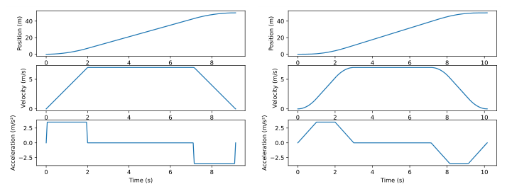

# Chapter 15: Motion profiles

If smooth, predictable motion of a system over time is desired, it’s best to only change a system’s reference as fast as the system is able to physically move. Motion profiles, also known as trajectories, are used for this purpose. For multi-state systems, each state is given its own trajectory. Since these states are usually position and velocity, they share different derivatives of the same profile.

## 15.1 1-DOF motion profiles

Trapezoid profiles (figure 15.1) and S-curve profiles (figure 15.2) are the most commonly used motion profiles in FRC for point-to-point movements with one degree of freedom ($1$ DOF). These profiles accelerate the system to a maximum velocity from rest, then decelerate it later such that the final acceleration velocity, are zero at the moment the system arrives at the desired location.



*Figure 15.1: Trapezoid profile*


*Figure 15.2: S-curve profile*

These profiles are given their names based on the shape of their velocity trajectory. The trapezoid profile has a velocity trajectory shaped like a trapezoid and the S-curve profile has a velocity trajectory shaped like an S-curve.

In the context of a point-to-point move, a full S-curve consists of seven distinct phases of motion. Phase I starts moving the system from rest at a linearly increasing acceleration until it reaches the maximum acceleration. In phase II, the profile accelerates at this maximum acceleration rate until it must start decreasing as it approaches the maximum velocity. This occurs in phase III when the acceleration linearly decreases until it reaches zero. In phase IV, the velocity is constant until deceleration begins, at which point the profiles decelerates in a manner symmetric to phases I, II and III.

A trapezoid profile, on the other hand, has three phases. It is a subset of an S-curve profile, having only the phases corresponding to phase II of the S-curve profile (constant acceleration), phase IV (constant velocity), and phase VI (constant deceleration). This reduced number of phases underscores the difference between these two profiles: the S-curve profile has extra motion phases which transition between periods of acceleration and periods of nonacceleration; the trapezoid profile has instantaneous transitions between these phases. This can be seen in the acceleration graphs of the corresponding velocity profiles for these two profile types.

### 15.1.1 Jerk

The motion characteristic that defines the change in acceleration, or transitional period, is known as “jerk”. Jerk is defined as the rate of change of acceleration with time. In a trapezoid profile, the jerk (change in acceleration) is infinite at the phase transitions, while in the S-curve profile the jerk is a constant value, spreading the change in acceleration over a period of time.

From figures 15.1 and 15.2, we can see S-curve profiles are smoother than trapezoid profiles. Why, however, do the S-curve profile result in less load oscillation? For a given load, the higher the jerk, the greater the amount of unwanted vibration energy will be generated, and the broader the frequency spectrum of the vibration’s energy will be.

This means that more rapid changes in acceleration induce more powerful vibrations, and more vibrational modes will be excited. Because vibrational energy is absorbed in the system mechanics, it may cause an increase in settling time or reduced accuracy if the vibration frequency matches resonances in the mechanical system.

### 15.1.2 Profile selection

Since trapezoid profiles spend their time at full acceleration or full deceleration, they are, from the standpoint of profile execution, faster than S-curve profiles. However, if this “all on”/“all off” approach causes an increase in settling time, the advantage is lost. Often, only a small amount of “S” (transition between acceleration and no acceleration) can substantially reduce induced vibration. Therefore to optimize throughput, the S-curve profile must be tuned for each a given load and given desired transfer speed.

What S-curve form is right for a given system? On an application by application basis, the specific choice of the form of the S-curve will depend on the mechanical nature of the system and the desired performance specifications. For example, in medical applications which involve liquid transfers that should not be jostled, it would be appropriate to choose a profile with no phase II and VI segment at all. Instead the acceleration transitions would be spread out as far as possible, thereby maximizing smoothness.

In other applications involving high speed pick and place, overall transfer speed is most important, so a good choice might be an S-curve with transition phases (phases I, III, V, and VII) that are five to fifteen percent of phase II and VI. In this case, the S-curve profile will add a small amount of time to the overall transfer time. However, the reduced load oscillation at the end of the move considerably decreases the total effective transfer time. Trial and error using a motion measurement system is generally the best way to determine the right amount of “S” because modeling high frequency dynamics is difficult to do accurately.

Another consideration is whether that “S” segment will actually lead to smoother control of the system. If the high frequency dynamics at play are negligible, one can use the simpler trapezoid profile.

> **Remark.** S-curve profiles are unnecessary for FRC mechanisms. Motors in FRC effectively have first-order velocity dynamics because the inductance effects are on the order of microseconds; FRC dynamics operate on the order of milliseconds. First-order motor models can achieve the instantaneous acceleration changes of trapezoid profiles because voltage is electromotive force, which is analogous to acceleration. That is, we can instantaneously achieve any desired acceleration with a finite voltage, and we can follow any trapezoid profile perfectly with only feedforward control.

### 15.1.3 Profile equations

#### Trapezoid profile

The trapezoid profile uses the following equations.

$$
\begin{aligned}
x(t) &= x_0 + v_0t + \frac{1}{2}at^2 \\
v(t) &= v_0 + at
\end{aligned}
$$

where $x(t)$ is the position at time $t$, $x_0$ is the initial position, $v_0$ is the initial velocity, and $a$ is the acceleration at time $t$.

Snippet 15.1 shows a Python implementation.

```python
"""Function for generating a trapezoid profile."""

import math

def generate_trapezoid_profile(max_v, time_to_max_v, dt, goal):
    """
    Creates a trapezoid profile with the given constraints.

    Args:
        max_v: Maximum velocity of profile.
        time_to_max_v: Time from rest to maximum velocity.
        dt: Timestep.
        goal: Final position when the profile is at rest.

    Returns:
        t_rec: List of timestamps.
        x_rec: List of positions at each timestep.
        v_rec: List of velocities at each timestep.
        a_rec: List of accelerations at each timestep.
    """
    t_rec = [0.0]
    x_rec = [0.0]
    v_rec = [0.0]
    a_rec = [0.0]

    a = max_v / time_to_max_v
    time_at_max_v = goal / max_v - time_to_max_v

    # If profile is short
    if max_v * time_to_max_v > goal:
        time_to_max_v = math.sqrt(goal / a)
        time_from_max_v = time_to_max_v
        time_total = 2.0 * time_to_max_v
        profile_max_v = a * time_to_max_v
    else:
        time_from_max_v = time_to_max_v + time_at_max_v
        time_total = time_from_max_v + time_to_max_v
        profile_max_v = max_v

    while t_rec[-1] < time_total:
        t = t_rec[-1] + dt
        t_rec.append(t)
        if t < time_to_max_v:
            # Accelerate up
            a_rec.append(a)
            v_rec.append(a * t)
        elif t < time_from_max_v:
            # Maintain max velocity
            a_rec.append(0.0)
            v_rec.append(profile_max_v)
        elif t < time_total:
            # Accelerate down
            decel_time = t - time_from_max_v
            a_rec.append(-a)
            v_rec.append(profile_max_v - a * decel_time)
        else:
            a_rec.append(0.0)
            v_rec.append(0.0)
        x_rec.append(x_rec[-1] + v_rec[-1] * dt)
    return t_rec, x_rec, v_rec, a_rec
```

*Snippet 15.1. Trapezoid profile implementation in Python*

#### S-curve profile

The S-curve profile equations also include jerk.

$$
\begin{aligned}
x(t) &= x_0 + v_0t + \frac{1}{2}at^2 + \frac{1}{6}jt^3 \\
v(t) &= v_0 + at + \frac{1}{2}jt^2 \\
a(t) &= a_0 + jt
\end{aligned}
$$

where $j$ is the jerk at time $t$, $a(t)$ is the acceleration at time $t$, and $a_0$ is the initial acceleration.

Snippet 15.2 shows a Python implementation.

```python
"""Function for generating an S-curve profile."""

import math

def generate_s_curve_profile(max_v, max_a, time_to_max_a, dt, goal):
    """
    Returns an s-curve profile with the given constraints.

    Args:
        max_v: Maximum velocity of profile.
        max_a: Maximum acceleration of profile.
        time_to_max_a: Time from rest to maximum acceleration.
        dt: Timestep.
        goal: Final position when the profile is at rest.

    Returns:
        t_rec: List of timestamps.
        x_rec: List of positions at each timestep.
        v_rec: List of velocities at each timestep.
        a_rec: List of accelerations at each timestep.
    """
    t_rec = [0.0]
    x_rec = [0.0]
    v_rec = [0.0]
    a_rec = [0.0]

    j = max_a / time_to_max_a
    short_profile = max_v * (time_to_max_a + max_v / max_a) > goal

    if short_profile:
        profile_max_v = max_a * (
            math.sqrt(goal / max_a - 0.75 * time_to_max_a**2) - 0.5 * time_to_max_a
        )
    else:
        profile_max_v = max_v

    # Find times at critical points
    t2 = profile_max_v / max_a
    t3 = t2 + time_to_max_a
    if short_profile:
        t4 = t3
    else:
        t4 = goal / profile_max_v
    t5 = t4 + time_to_max_a
    t6 = t4 + t2
    t7 = t6 + time_to_max_a
    time_total = t7

    while t_rec[-1] < time_total:
        t = t_rec[-1] + dt
        t_rec.append(t)
        if t < time_to_max_a:
            # Ramp up acceleration
            a_rec.append(j * t)
            v_rec.append(0.5 * j * t**2)
        elif t < t2:
            # Increase speed at max acceleration
            a_rec.append(max_a)
            v_rec.append(max_a * (t - 0.5 * time_to_max_a))
        elif t < t3:
            # Ramp down acceleration
            a_rec.append(max_a - j * (t - t2))
            v_rec.append(max_a * (t - 0.5 * time_to_max_a) - 0.5 * j * (t - t2) ** 2)
        elif t < t4:
            # Maintain max velocity
            a_rec.append(0.0)
            v_rec.append(profile_max_v)
        elif t < t5:
            # Ramp down acceleration
            a_rec.append(-j * (t - t4))
            v_rec.append(profile_max_v - 0.5 * j * (t - t4) ** 2)
        elif t < t6:
            # Decrease speed at max acceleration
            a_rec.append(-max_a)
            v_rec.append(max_a * (t2 + t5 - t - 0.5 * time_to_max_a))
        elif t < t7:
            # Ramp up acceleration
            a_rec.append(-max_a + j * (t - t6))
            v_rec.append(
                max_a * (t2 + t5 - t - 0.5 * time_to_max_a) + 0.5 * j * (t - t6) ** 2
            )
        else:
            a_rec.append(0.0)
            v_rec.append(0.0)
        x_rec.append(x_rec[-1] + v_rec[-1] * dt)
    return t_rec, x_rec, v_rec, a_rec
```

*Snippet 15.2. S-curve profile implementation in Python*

### 15.1.4 Other profile types

The ultimate goal of any profile is to match the profile’s motion characteristics to the desired application. Trapezoid and S-curve profiles work well when the system’s torque response curve is fairly flat. In other words, when the output torque does not vary that much over the range of velocities the system will be experiencing. This is true for most servo motor systems, whether DC brushed or DC brushless.

Step motors, however, do not have flat torque/speed curves. Torque output is nonlinear, sometimes has a large drop at a location called the “mid-range instability”, and generally drops off at higher velocities.

Mid-range instability occurs at the step frequency when the motor’s natural resonance frequency matches the current step rate. To address mid-range instability, the most common technique is to use a nonzero starting velocity. This means that the profile instantly “jumps” to a programmed velocity upon initial acceleration, and while decelerating. While crude, this technique sometimes provides better results than a smooth ramp for zero, particularly for systems that do not use a microstepping drive technique.

To address torque drop-off at higher velocities, a parabolic profile can be used. The corresponding acceleration curve has the smallest acceleration when the velocity is highest. This is a good match for stepper motors because there is less torque available at higher speeds. However, notice that starting and ending accelerations are very high, and there is no “S” phase where the acceleration smoothly transitions to zero. If load oscillation is a problem, parabolic profiles may not work as well as an S-curve despite the fact that a standard S-curve profile is not optimized for a stepper motor from the standpoint of the torque/speed curve.

### 15.1.5 Further reading

FRC teams 254 and 971 gave a talk at FIRST World Championships in 2015 about motion profiles.

> **Video:** [“Motion Planning and Control in FRC” (59 minutes)](https://youtu.be/8319J1BEHwM) — Team 254: The Cheesy Poofs

## 15.2 2-DOF motion profiles

In FRC, point-to-point movements with two degrees of freedom ($2$ DOFs) are almost always within the context of drivetrains where the two degrees of freedom are the $x$ and $y$ axes.

A *path* is a set of (x, y) points for the drivetrain to follow. A drivetrain *trajectory* is a path that includes both the states (e.g., position and velocity) and control inputs (e.g., voltage) of the drivetrain as functions of time.

Currently, the most common form of multidimensional trajectory planning in FRC is based on polynomial splines.

## 15.3 Drivetrain motion planning software

There’s a broad spectrum of drivetrain motion planning methods suitable for different team requirements and capabilities. On a tight schedule, consider writing and testing a simple fallback method before attempting one of the more complex and time-intensive methods discussed here.

### 15.3.1 Model-free

Model-free path planning methods use geometric relationships to enforce convergence to a desired pose. They’re ideal for those who want to avoid system modeling and don’t care about the exact path the robot takes between two points. Methods in this category include pure pursuit[^1] and guiding vector fields[^2].

Model-free methods satisfy the needs of most teams and save them tuning time, but they do impose a performance ceiling; higher performance necessarily requires reasoning about the robot’s dynamics and physical constraints.

### 15.3.2 Some modeling required

By investing a bit of effort into system modeling, one can obtain trajectories with reasonable default performance and limited feasibility guarantees.

PathPlanner[^3] is in this category. PathPlanner plans the shape of the path with a series of cubic or quintic Hermite splines, time-parameterizes each spline with a chassis velocity trapezoid profile, then iteratively constrains the profile based on differential or swerve drivetrain kinematics and user-defined velocity and acceleration limits. Trajectories can be replanned on-demand (useful for auto-aim/auto-score strategies).

*A Dive into WPILib Trajectories* by Declan Freeman-Gleason[^4] describes 2-DOF trajectory planning with Hermite splines in more detail. *Planning Motion Trajectories for Mobile Robots Using Splines* by Christoph Sprunk provides a more general treatment of spline-based trajectory generation[^5].

### 15.3.3 High-fidelity modeling

High-fidelity modeling allows us to use more sophisticated mathematical tools to achieve peak drivetrain performance, sometimes at the expense of robustness. Successful applications require accurate modeling and sufficient control input margin to compensate for disturbances. Replanning after large disturbances is theoretically possible but not always computationally tractible.

Choreo[^6] is in this category. Choreo poses and solves a nonlinear constrained optimization problem (see chapter [17](17-trajectory-optimization.md#chapter-17-trajectory-optimization)). It finds the time-minimizing trajectory through a set of waypoints subject to differential or swerve drivetrain dynamics, control input limits, velocity and acceleration limits, keep-in and keep-out regions, and pointing constraints. The dynamics are derived via sum-of-forces and sum-of-torques with user-provided drivetrain geometry and mass properties. Most constraints can be applied to either the whole trajectory or specific segments.

Choreo requires a lot of physical information about the drivetrain, but it tends to generate feasible trajectories that robots can execute well on their first try (assuming well-tuned wheel velocity controllers). These trajectories are too expensive to replan on-demand.

[^1]: <https://file.tavsys.net/control/pure-pursuit-considered-harmful.pdf>

[^2]: <https://research.rug.nl/en/publications/guiding-vector-fields-for-robot-motion-control/>

[^3]: <https://pathplanner.dev/home.html>

[^4]: <https://pietroglyph.github.io/trajectory-presentation/>

[^5]: <http://www2.informatik.uni-freiburg.de/~lau/students/Sprunk2008.pdf>

[^6]: <https://choreo.autos/>
