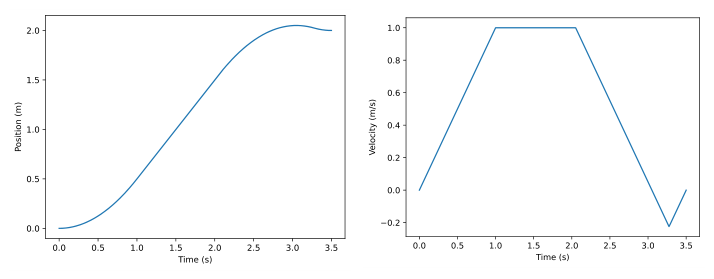
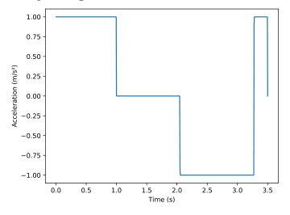
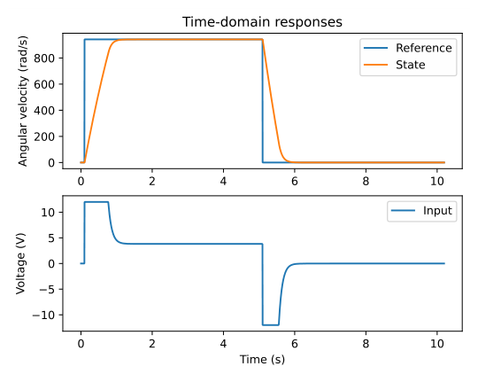
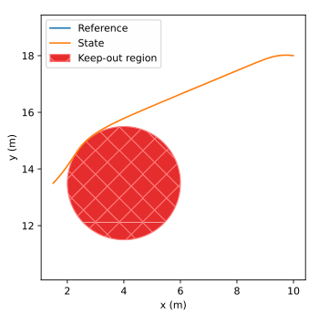
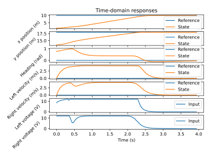

# Chapter 17: Trajectory optimization

A *trajectory* is a collection of samples defined over some time interval. A drivetrain trajectory would include its states (e.g., x position, y position, heading, and velocity) and control inputs (e.g., voltage).

*Trajectory optimization* finds the best choice of trajectory (for some mathematical definition of “best”) by formulating and solving a constrained optimization problem.

## 17.1 Solving optimization problems with Sleipnir

Sleipnir is a C++ library that facilitates the specification of constrained nonlinear optimization problems with natural mathematical notation, then efficiently solves them.

Sleipnir supports problems of the form:

$$
\begin{aligned}
\min_x             &f(x) \\
\text{subject to } &c_e(x) = 0 \\
&c_i(x) \geq 0
\end{aligned}
$$

where $f(x)$ is the scalar cost function, $x$ is the vector of decision variables (variables the solver can tweak to minimize the cost function), $c_e(x)$ is the vector-valued function whose rows are equality constraints, and $c_i(x)$ is the vector-valued function whose rows are inequality constraints. Constraints are equations or inequalities of the decision variables that constrain what values the solver is allowed to use when searching for an optimal solution.

The nice thing about Sleipnir is users don’t have to put their system in the form shown above manually; they can write it in natural mathematical form and it’ll be converted for them. We’ll cover some examples next.

### 17.1.1 Double integrator

A system with position and velocity states and an acceleration input is an example of a double integrator. We want to go from $0$ m at rest to $2$ m at rest in the minimum time while obeying the velocity limit $(-1, 1)$ and the acceleration limit $(-1, 1)$.

The model for our double integrator is $\ddot{x} = u$ where $x$ is the vector $\begin{bmatrix}\text{position} & \text{velocity}\end{bmatrix}^{\mathsf{T}}$ and $u$ is the acceleration. The velocity constraints are $-1 \leq x_1 \leq 1$ and the acceleration constraints are $-1 \leq u \leq 1$.

#### Importing required libraries

Sleipnir can be installed via `pip install sleipnirgroup-jormungandr`.

```python
from sleipnir.optimization import Problem, bounds
import numpy as np

```

#### Initializing a problem instance

First, we need to make a problem instance.

```python
TOTAL_TIME = 3.5  # s
dt = 0.005  # 5 ms
N = int(TOTAL_TIME / dt)

r = 2.0  # m

problem = Problem()
```

#### Creating decision variables

Next, we need to make decision variables for our state and input.

```python
# 2x1 state vector with N + 1 timesteps (includes last state)
X = problem.decision_variable(2, N + 1)

# 1x1 input vector with N timesteps (input at last state doesn't matter)
U = problem.decision_variable(1, N)
```

By convention, we use capital letters for the variables to designate matrices.

#### Applying constraints

Now, we need to apply dynamics constraints between timesteps.

```python
# Kinematics constraint assuming constant acceleration between timesteps
for k in range(N):
    p_k1 = X[0, k + 1]
    v_k1 = X[1, k + 1]
    p_k = X[0, k]
    v_k = X[1, k]
    a_k = U[0, k]

    problem.subject_to(p_k1 == p_k + v_k * dt + 0.5 * a_k * dt**2)
    problem.subject_to(v_k1 == v_k + a_k * dt)
```

Next, we’ll apply the state and input constraints.

```python
# Start and end at rest
problem.subject_to(X[:, 0] == np.array([[0.0], [0.0]]))
problem.subject_to(X[:, N] == np.array([[r], [0.0]]))

# Limit velocity
problem.subject_to(bounds(-1, X[1, :], 1))

# Limit acceleration
problem.subject_to(bounds(-1, U, 1))
```

#### Specifying a cost function

Next, we’ll create a cost function for minimizing position error.

```python
# Cost function - minimize position error
problem.minimize(sum((r - X[0, k]) ** 2 for k in range(N + 1)))
```

The cost function passed to minimize() should produce a scalar output.

#### Solving the problem

Now we can solve the problem.

```python
problem.solve()
```

The solver will find the decision variable values that minimize the cost function while satisfying the constraints.

#### Accessing the solution

You can obtain the solution by querying the values of the variables like so.

```python
position = X.value[0, 0]
velocity = X.value[1, 0]
acceleration = U.value(0)

```



*Figure 17.1: Double integrator position*


*Figure 17.2: Double integrator velocity*



*Figure 17.3: Double integrator acceleration*

#### Other applications

In retrospect, the solution here seems obvious: if you want to reach the desired position in the minimum time, you just apply positive max input to accelerate to the max speed, coast for a while, then apply negative max input to decelerate to a stop at the desired position. Optimization problems can get more complex than this though. In fact, we can use this same framework to design optimal trajectories for a drivetrain while satisfying dynamics constraints, avoiding keep-out regions, and driving through points of interest.

Sleipnir’s examples[^1] and tests[^2][^3] demonstrate constrained AprilTag pose estimation, subsystem current allocation, and various direct transcription, direct collocation, and single shooting trajectory optimization problems.

### 17.1.2 Optimizing the problem formulation

Cost functions and constraints can have the following orders:

- none (i.e., there is no cost function or are no constraints)

- constant

- linear

- quadratic

- nonlinear

For nonlinear problems, the solver calculates the Hessian of the cost function and the Jacobians of the constraints at each iteration. However, problems with lower order cost functions and constraints can be solved faster. For example, the following only need to be computed once because they’re constant:

- the Hessian of a quadratic or lower cost function

- the Jacobian of linear or lower constraints

A problem is constant if:

- the cost function is constant or lower

- the equality constraints are constant or lower

- the inequality constraints are constant or lower

A problem is a linear program (LP) if:

- the cost function is linear

- the equality constraints are linear or lower

- the inequality constraints are linear or lower

A problem is a quadratic program (QP) if:

- the cost function is quadratic

- the equality constraints are linear or lower

- the inequality constraints are linear or lower

All other problems are nonlinear programs (NLPs).

## 17.2 Solver implementation

*Numerical Optimization*, Second Edition by Nocedal and Wright[^4] is a useful introductory resource for implementing optimization problem solvers. Sleipnir provides a list of resources used to implement itself.[^5]

## 17.3 Model predictive control

If we can optimize trajectories quickly enough, then we can use trajectory optimization as a feedback policy that reacts better to future events (e.g., nonlinear system dynamics subject to control input limits, keep-out regions). At each timestep, we optimize a trajectory from the current state out to a *prediction horizon*, then apply the first control input from the optimized trajectory. This is called *model predictive control* (MPC).

Since we formulate trajectory optimization problems over a finite horizon, we can think of each optimization as reasoning about the next $N$ timesteps. To optimize performance over a longer horizon than $N$, we can continue solving for an $N$-step horizon at each timestep. For this reason, MPC is also called *receding horizon control*.

### 17.3.1 Linear MPC

Here’s an example problem formulation for a linear system $\mathbf{x}_{k+1} = \mathbf{A}\mathbf{x}_k + \mathbf{B}\mathbf{u}_k$.

$$
\begin{aligned}
\min_{\mathbf{x}_{0:N}, \mathbf{u}_{0:N-1}}
    &\mathbf{x}_N^{\mathsf{T}}\mathbf{Q}\mathbf{x}_N +
     \sum_{k=0}^{N-1} \left(\mathbf{x}_k^{\mathsf{T}}\mathbf{Q}\mathbf{x}_k + \mathbf{u}_k^{\mathsf{T}}\mathbf{R}\mathbf{u}_k\right) \\
\text{subject to } &\mathbf{x}_0 = \text{current state} \\
&\mathbf{x}_{k+1} = \mathbf{A}\mathbf{x}_k + \mathbf{B}\mathbf{u}_k \\
&\mathbf{u}_{min} \leq \mathbf{u}_k \leq \mathbf{u}_{max}
\end{aligned}
$$

where $N$ is the number of samples and $\mathbf{Q}$ and $\mathbf{R}$ are weighting factors. The controller solves this problem at each timestep and returns $\mathbf{u}_0$.

> **Remark.** This optimization problem is a generalization of finite-horizon LQR to linear equality and inequality constraints.

Snippet 17.1 shows a linear MPC class in Python.

```python
import frccontrol as fct
from sleipnir.optimization import Problem, bounds

class LinearMPC:
    def __init__(self, A, B, Q, R, dt, u_min, u_max, horizon):
        self.A_d, self.B_d = fct.discretize_ab(A, B, dt)
        self.Q, self.R = Q, R
        self.u_min, self.u_max = u_min, u_max
        self.N = int(horizon / dt)

    def calculate(self, x, r):
        problem = Problem()
        X = problem.decision_variable(self.A_d.shape[0], self.N + 1)
        U = problem.decision_variable(self.B_d.shape[1], self.N)

        J = 0
        for k in range(self.N + 1):
            J += (r - X[:, k : k + 1]).T @ self.Q @ (r - X[:, k : k + 1])
        for k in range(self.N):
            J += U[:, k : k + 1].T @ self.R @ U[:, k : k + 1]
        problem.minimize(J)

        problem.subject_to(X[:, :1] == x)
        for k in range(self.N):
            x_k, u_k = X[:, k : k + 1], U[:, k : k + 1]
            problem.subject_to(X[:, k + 1 : k + 2] == self.A_d @ x_k + self.B_d @ u_k)
            problem.subject_to(bounds(self.u_min, u_k, self.u_max))

        problem.solve()
        return U.value()[:, :1]
```

*Snippet 17.1. Linear MPC class in Python*

### 17.3.2 Nonlinear MPC

Here’s an example problem formulation for a nonlinear system $\dot{\mathbf{x}} = f(\mathbf{x}_k, \mathbf{u}_k)$.

$$
\begin{aligned}
\min_{\mathbf{x}_{0:N}, \mathbf{u}_{0:N-1}}
    &\mathbf{x}_N^{\mathsf{T}}\mathbf{Q}\mathbf{x}_N +
     \sum_{k=0}^{N-1} \left(\mathbf{x}_k^{\mathsf{T}}\mathbf{Q}\mathbf{x}_k + \mathbf{u}_k^{\mathsf{T}}\mathbf{R}\mathbf{u}_k\right) \\
\text{subject to } &\mathbf{x}_0 = \text{current state} \\
&\mathbf{x}_{k+1} = \text{RK4}(f, \mathbf{x}_k, \mathbf{u}_k, \Delta T) \\
&\mathbf{u}_{min} \leq \mathbf{u}_k \leq \mathbf{u}_{max}
\end{aligned}
$$

where $N$ is the number of samples, $\mathbf{Q}$ and $\mathbf{R}$ are weighting factors, and RK4 is a numerical integration method from section [7.9](07-discrete-state-space-control.md#79-numerical-integration-methods) chosen for its simplicity. The controller solves this problem at each timestep and returns $\mathbf{u}_0$.

Snippet 17.2 shows a nonlinear MPC class in Python.

```python
import frccontrol as fct
from sleipnir.optimization import Problem, bounds

class NonlinearMPC:
    def __init__(self, states, inputs, f, Q, R, dt, u_min, u_max, horizon):
        self.states, self.inputs = states, inputs
        self.f = f
        self.Q, self.R = Q, R
        self.dt = dt
        self.u_min, self.u_max = u_min, u_max
        self.N = int(horizon / dt)

    def calculate(self, x, r):
        problem = Problem()
        X = problem.decision_variable(self.states, self.N + 1)
        U = problem.decision_variable(self.inputs, self.N)

        J = 0
        for k in range(self.N + 1):
            J += (r - X[:, k : k + 1]).T @ self.Q @ (r - X[:, k : k + 1])
        for k in range(self.N):
            J += U[:, k : k + 1].T @ self.R @ U[:, k : k + 1]
        problem.minimize(J)

        problem.subject_to(X[:, :1] == x)
        for k in range(self.N):
            x_k, u_k = X[:, k : k + 1], U[:, k : k + 1]
            problem.subject_to(
                X[:, k + 1 : k + 2] == fct.rk4(self.f, x_k, u_k, self.dt)
            )
            problem.subject_to(bounds(self.u_min, u_k, self.u_max))

        problem.solve()
        return U.value()[:, :1]
```

*Snippet 17.2. Nonlinear MPC class in Python*

### 17.3.3 MPC implementation guidance

Since we only need a rough approximation of the optimal trajectory at each timestep, there’s several ways to trade off accuracy for faster solves.

1.  Make the optimization problem’s sample period much longer than the feedback controller’s sample period (reduces problem size for a given prediction horizon)

2.  Set a larger solver error tolerance (may reduce solver iterations)

3.  Use a solver that produces inexact solutions quickly (e.g., projected conjugate gradient method)

The prediction horizon should be long enough to capture relevant dynamics or future events. Longer prediction horizons yield more robustness but slower solves.

Warm starting the current timestep’s solve with the optimal trajectory from the previous timestep can drastically speed up convergence.

Set a solver timeout, because applying the control input from a partially optimized trajectory is better than overrunning the scheduled controller period.

### 17.3.4 Flywheel

Here’s a problem formulation for flywheel MPC.

$$
\begin{aligned}
\min_{\mathbf{x}_{0:N}, \mathbf{u}_{0:N-1}}
    &\sum_{k=0}^{N-1} \left((\mathbf{r} - \mathbf{x}_k)^{\mathsf{T}}\mathbf{Q}(\mathbf{r} - \mathbf{x}_k) + \mathbf{u}_k^{\mathsf{T}}\mathbf{R}\mathbf{u}_k\right) \\
\text{subject to } &\mathbf{x}_0 = \text{current state} \\
&\mathbf{x}_{k+1} = \mathbf{A}\mathbf{x}_k + \mathbf{B}\mathbf{u}_k \\
&\mathbf{u}_{min} \leq \mathbf{u}_k \leq \mathbf{u}_{max}
\end{aligned}
$$

where $\mathbf{x}_k = \begin{bmatrix}\omega\end{bmatrix}^{\mathsf{T}}$, $\mathbf{u}_k = \begin{bmatrix}V\end{bmatrix}^{\mathsf{T}}$, and $\mathbf{r}$ is the reference. Figure 17.4 shows the closed-loop response, which is identical to infinite-horizon LQR with a plant inversion feedforward.



*Figure 17.4: Flywheel MPC response*

### 17.3.5 Differential drive

Here’s a problem formulation for differential drive MPC with a circular keep-out region.

$$
\begin{aligned}
\min_{\mathbf{x}_{0:N}, \mathbf{u}_{0:N-1}}
    &\sum_{k=0}^{N-1} (\mathbf{r} - \mathbf{x}_k)^{\mathsf{T}}\mathbf{Q}(\mathbf{r} - \mathbf{x}_k) \\
\text{subject to } &\mathbf{x}_0 = \text{current state} \\
&\mathbf{x}_{k+1} = \text{RK4}(f, \mathbf{x}_k, \mathbf{u}_k, \Delta T) \\
&\mathbf{u}_{min} \leq \mathbf{u}_k \leq \mathbf{u}_{max} \\
&(x_k - c_x)^2 + (y_k - c_y)^2 \geq r^2
\end{aligned}
$$

where $\mathbf{x}_k = \begin{bmatrix}x & y & \theta & v_l & v_r\end{bmatrix}^{\mathsf{T}}$, $\mathbf{u}_k = \begin{bmatrix}V_l & V_r\end{bmatrix}^{\mathsf{T}}$, $\mathbf{r}$ is the reference, $(c_x, c_y)$ is the circle’s center, and $r$ is the circle’s radius. Figures 17.5 and 17.6 show the closed-loop response.



*Figure 17.5: Differential drive MPC x-y plot*



*Figure 17.6: Differential drive MPC response*

[^1]: <https://github.com/SleipnirGroup/Sleipnir/tree/v0.6.3/examples>

[^2]: <https://github.com/SleipnirGroup/Sleipnir/tree/v0.6.3/test>

[^3]: <https://github.com/SleipnirGroup/Sleipnir/tree/v0.6.3/python/test/optimization>

[^4]: <https://www.math.kent.edu/~reichel/courses/optimization/Numerical_Optimization.pdf>

[^5]: <https://sleipnirgroup.github.io/Sleipnir/md_contributing.html#educational-resources>
