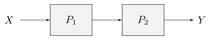
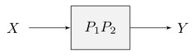
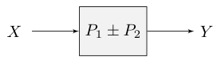
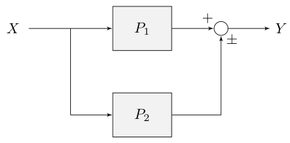
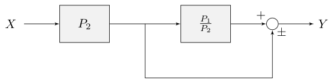
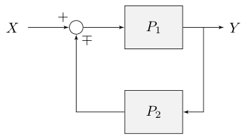
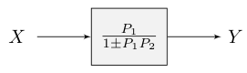
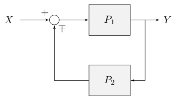
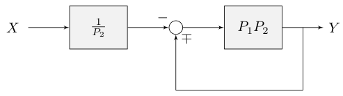

# Appendix A: Simplifying block diagrams

## A.1 Cascaded blocks

$$
Y = (P_1 P_2)X
$$

*Figure A.1: Cascaded blocks*

*Figure A.2: Simplified cascaded blocks*

## A.2 Combining blocks in parallel

$$
Y = P_1 X \pm P_2 X
$$

*Figure A.3: Parallel blocks*

*Figure A.4: Simplified parallel blocks*

## A.3 Removing a block from a feedforward loop

$$
Y = P_1 X \pm P_2 X
$$

*Figure A.5: Feedforward loop*

*Figure A.6: Transformed feedforward loop*

## A.4 Eliminating a feedback loop

$$
Y = P_1 (X \mp P_2 Y)
$$

*Figure A.7: Feedback loop*

*Figure A.8: Simplified feedback loop*

## A.5 Removing a block from a feedback loop

$$
Y = P_1 (X \mp P_2 Y)
$$

*Figure A.9: Feedback loop*

*Figure A.10: Transformed feedback loop*
