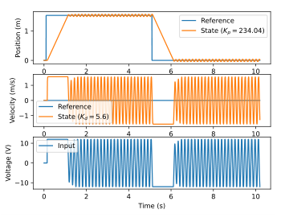
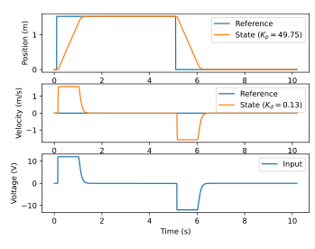
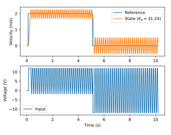
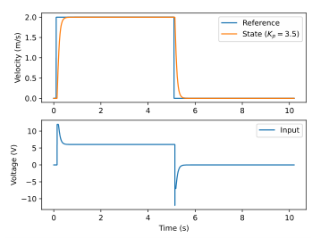
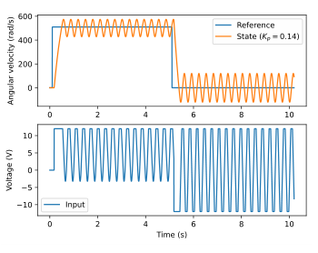
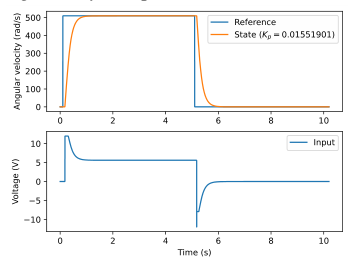

# Appendix B: Linear-quadratic regulator

This appendix will go into more detail on the linear-quadratic regulator’s derivation and interesting applications.

## B.1 Derivation

Let there be a discrete time linear system defined as

$$
\mathbf{x}_{k+1} = \mathbf{A}\mathbf{x}_k + \mathbf{B}\mathbf{u}_k
$$

with the cost functional

$$
J = \sum_{k=0}^\infty
    \begin{bmatrix}
      \mathbf{x}_k \\
      \mathbf{u}_k
    \end{bmatrix}^{\mathsf{T}}
    \begin{bmatrix}
      \mathbf{Q} & \mathbf{N} \\
      \mathbf{N}^{\mathsf{T}} & \mathbf{R}
    \end{bmatrix}
    \begin{bmatrix}
      \mathbf{x}_k \\
      \mathbf{u}_k
    \end{bmatrix}
$$

where $J$ represents a trade-off between state excursion and control effort with the weighting factors $\mathbf{Q}$, $\mathbf{R}$, and $\mathbf{N}$. $\mathbf{Q}$ is the weight matrix for error, $\mathbf{R}$ is the weight matrix for control effort, and $\mathbf{N}$ is a cross weight matrix between error and control effort. $\mathbf{N}$ is commonly utilized when penalizing the output in addition to the state and input.

$$
\begin{aligned}
J &= \sum_{k=0}^\infty
    \begin{bmatrix}
      \mathbf{x}_k \\
      \mathbf{u}_k
    \end{bmatrix}^{\mathsf{T}}
    \begin{bmatrix}
      \mathbf{Q}\mathbf{x}_k + \mathbf{N}\mathbf{u}_k \\
      \mathbf{N}^{\mathsf{T}}\mathbf{x}_k + \mathbf{R}\mathbf{u}_k
    \end{bmatrix} \\
  J &= \sum_{k=0}^\infty
    \begin{bmatrix}
      \mathbf{x}_k^{\mathsf{T}} & \mathbf{u}_k^{\mathsf{T}}
    \end{bmatrix}
    \begin{bmatrix}
      \mathbf{Q}\mathbf{x}_k + \mathbf{N}\mathbf{u}_k \\
      \mathbf{N}^{\mathsf{T}}\mathbf{x}_k + \mathbf{R}\mathbf{u}_k
    \end{bmatrix} \\
  J &= \sum_{k=0}^\infty
    (\mathbf{x}_k^{\mathsf{T}} (\mathbf{Q}\mathbf{x}_k + \mathbf{N}\mathbf{u}_k) +
      \mathbf{u}_k^{\mathsf{T}} (\mathbf{N}^{\mathsf{T}}\mathbf{x}_k + \mathbf{R}\mathbf{u}_k)) \\
  J &= \sum_{k=0}^\infty
    (\mathbf{x}_k^{\mathsf{T}}\mathbf{Q}\mathbf{x}_k + \mathbf{x}_k^{\mathsf{T}}\mathbf{N}\mathbf{u}_k +
      \mathbf{u}_k^{\mathsf{T}}\mathbf{N}^{\mathsf{T}}\mathbf{x}_k + \mathbf{u}_k^{\mathsf{T}}\mathbf{R}\mathbf{u}_k) \\
  J &= \sum_{k=0}^\infty
    (\mathbf{x}_k^{\mathsf{T}}\mathbf{Q}\mathbf{x}_k + \mathbf{x}_k^{\mathsf{T}}\mathbf{N}\mathbf{u}_k +
      \mathbf{x}_k^{\mathsf{T}}\mathbf{N}\mathbf{u}_k^{\mathsf{T}} + \mathbf{u_k}^{\mathsf{T}}\mathbf{R}\mathbf{u}_k) \\
  J &= \sum_{k=0}^\infty
    (\mathbf{x}_k^{\mathsf{T}}\mathbf{Q}\mathbf{x}_k + 2\mathbf{x}_k^{\mathsf{T}}\mathbf{N}\mathbf{u}_k +
      \mathbf{u}_k^{\mathsf{T}}\mathbf{R}\mathbf{u}_k) \\
  J &= \sum_{k=0}^\infty
    (\mathbf{x}_k^{\mathsf{T}}\mathbf{Q}\mathbf{x}_k + \mathbf{u}_k^{\mathsf{T}}\mathbf{R}\mathbf{u}_k +
      2\mathbf{x}_k^{\mathsf{T}}\mathbf{N}\mathbf{u}_k)
\end{aligned}
$$

The feedback control law which minimizes $J$ subject to the constraint $\mathbf{x}_{k+1} = \mathbf{A}\mathbf{x}_k + \mathbf{B}\mathbf{u}_k$ is

$$
\mathbf{u}_k = -\mathbf{K}\mathbf{x}_k
$$

where $\mathbf{K}$ is given by

$$
\mathbf{K} = (\mathbf{R} + \mathbf{B}^{\mathsf{T}}\mathbf{P}\mathbf{B})^{-1}
    (\mathbf{B}^{\mathsf{T}}\mathbf{P}\mathbf{A} + \mathbf{N}^{\mathsf{T}})
$$

and $\mathbf{P}$ is found by solving the discrete time algebraic Riccati equation defined as

$$
\mathbf{A}^{\mathsf{T}}\mathbf{P}\mathbf{A} - \mathbf{P} - (\mathbf{A}^{\mathsf{T}}\mathbf{P}\mathbf{B} + \mathbf{N})
    (\mathbf{R} + \mathbf{B}^{\mathsf{T}}\mathbf{P}\mathbf{B})^{-1}
    (\mathbf{B}^{\mathsf{T}}\mathbf{P}\mathbf{A} + \mathbf{N}^{\mathsf{T}}) + \mathbf{Q} = 0
$$

or alternatively

$$
\mathcal{A}^{\mathsf{T}}\mathbf{P}\mathcal{A} - \mathbf{P} - \mathcal{A}^{\mathsf{T}}\mathbf{P}\mathbf{B}
    (\mathbf{R} + \mathbf{B}^{\mathsf{T}}\mathbf{P}\mathbf{B})^{-1} \mathbf{B}^{\mathsf{T}}\mathbf{P}\mathcal{A} +
    \mathbf{Q} = 0
$$

with

$$
\begin{aligned}
\mathcal{A} &= \mathbf{A} - \mathbf{B}\mathbf{R}^{-1}\mathbf{N}^{\mathsf{T}} \\
\mathcal{Q} &= \mathbf{Q} - \mathbf{N}\mathbf{R}^{-1}\mathbf{N}^{\mathsf{T}}
\end{aligned}
$$

If there is no cross-correlation between error and control effort, $\mathbf{N}$ is a zero matrix and the cost functional simplifies to

$$
J = \sum_{k=0}^\infty (\mathbf{x}_k^{\mathsf{T}}\mathbf{Q}\mathbf{x}_k +
    \mathbf{u}_k^{\mathsf{T}}\mathbf{R}\mathbf{u}_k)
$$

The feedback control law which minimizes this $J$ subject to $\mathbf{x}_{k+1} = \mathbf{A}\mathbf{x}_k + \mathbf{B}\mathbf{u}_k$ is

$$
\mathbf{u}_k = -\mathbf{K}\mathbf{x}_k
$$

where $\mathbf{K}$ is given by

$$
\mathbf{K} = (\mathbf{R} + \mathbf{B}^{\mathsf{T}}\mathbf{P}\mathbf{B})^{-1} \mathbf{B}^{\mathsf{T}}\mathbf{P}\mathbf{A}
$$

and $\mathbf{P}$ is found by solving the discrete time algebraic Riccati equation defined as

$$
\mathbf{A}^{\mathsf{T}}\mathbf{P}\mathbf{A} - \mathbf{P} - \mathbf{A}^{\mathsf{T}}\mathbf{P}\mathbf{B}
    (\mathbf{R} + \mathbf{B}^{\mathsf{T}}\mathbf{P}\mathbf{B})^{-1} \mathbf{B}^{\mathsf{T}}\mathbf{P}\mathbf{A} +
    \mathbf{Q} = 0
$$

Snippets B.1 and B.2 compute the infinite horizon, discrete time LQR.

```cpp
#include <Eigen/Cholesky>
#include <Eigen/Core>

#include "dare.hpp"

template <int States, int Inputs>
Eigen::Matrix<double, Inputs, States> lqr(
    const Eigen::Matrix<double, States, States>& A,
    const Eigen::Matrix<double, States, Inputs>& B,
    const Eigen::Matrix<double, States, States>& Q,
    const Eigen::Matrix<double, Inputs, Inputs>& R,
    const Eigen::Matrix<double, States, Inputs>& N) {
  using StateMatrix = Eigen::Matrix<double, States, States>;

  auto R_llt = R.llt();
  StateMatrix A_2 = A - B * R_llt.solve(N.transpose());
  StateMatrix Q_2 = Q - N * R_llt.solve(N.transpose());

  StateMatrix P = DARE<States, Inputs>(A_2, B, Q_2, R);

  return (B.transpose() * P * B + R)
      .llt()
      .solve(B.transpose() * P * A + N.transpose());
}
```

*Snippet B.1. Infinite horizon, discrete time LQR solver in C++ (see subsection [5.14.2](05-linear-algebra.md#5142-discrete-algebraic-riccati-equation-dare) for DARE solver)*

```python
"""Function for computing the infinite horizon LQR."""

import numpy as np
import scipy as sp

def lqr(A, B, Q, R, N):
    """
    Solves for the optimal discrete linear-quadratic regulator (LQR).

    Args:
        A: System matrix, states x states.
        B: Input matrix, states x inputs.
        Q: State cost matrix, states x states.
        R: Control effort cost matrix, inputs x inputs.
        N: Cross weight matrix, states x inputs.

    Returns:
        Controller gain matrix, inputs x states.
    """
    P = sp.linalg.solve_discrete_are(a=A, b=B, q=Q, r=R, s=N)
    return np.linalg.solve(B.T @ P @ B + R, B.T @ P @ A + N.T)
```

*Snippet B.2. Infinite horizon, discrete time LQR solver in Python*

Other formulations of LQR for finite horizon and discrete time can be seen on Wikipedia.[^1]

The course notes for MIT 6.832 *Underactuated Robotics: Algorithms for Walking, Running, Swimming, Flying, and Manipulation* by Russ Tedrake have a rigorous proof of the results shown above.[^2]

## B.2 Gain and phase margin

### B.2.1 Gain margin

Let there be a linear system $\dot{\mathbf{x}} = \mathbf{A}\mathbf{x} + \mathbf{B}\mathbf{N}\mathbf{u}$ where $\mathbf{N}$ is a diagonal matrix of random, unknown gains on the control inputs. The gain margin is the maximum value of $\mathbf{N}$ for which the system is stable.

For stability analysis, we’ll use the Lyapunov function $V(\mathbf{x}) = \mathbf{x}^{\mathsf{T}}\mathbf{P}\mathbf{x}$ where $\mathbf{P}$ is the unique stabilizing solution to the continuous algebraic Riccati equation (CARE) $\mathbf{A}^{\mathsf{T}}\mathbf{P} + \mathbf{P}\mathbf{A} - \mathbf{P}\mathbf{B}\mathbf{R}^{-1}\mathbf{B}^{\mathsf{T}}\mathbf{P} + \mathbf{Q} = \mathbf{0}$. We’ll assume $\mathbf{R}$ is diagonal for sufficient decoupling.

The system is stable if $\dot{V}(\mathbf{x}) < 0$ for all $\mathbf{x} \neq \mathbf{0}$.

$$
\begin{gathered}
\dot{\mathbf{x}}^{\mathsf{T}}\mathbf{P}\mathbf{x} + \mathbf{x}^{\mathsf{T}}\mathbf{P}\dot{\mathbf{x}} < 0
\end{gathered}
$$

Substitute in the system dynamics $\dot{\mathbf{x}} = \mathbf{A}\mathbf{x} + \mathbf{B}\mathbf{N}\mathbf{u}$ and their transpose $\dot{\mathbf{x}}^{\mathsf{T}} = \mathbf{x}^{\mathsf{T}}\mathbf{A}^{\mathsf{T}} + \mathbf{u}^{\mathsf{T}}\mathbf{N}^{\mathsf{T}}\mathbf{B}^{\mathsf{T}}$.

$$
\begin{gathered}
(\mathbf{x}^{\mathsf{T}}\mathbf{A}^{\mathsf{T}} + \mathbf{u}^{\mathsf{T}}\mathbf{N}\mathbf{B}^{\mathsf{T}})\mathbf{P}\mathbf{x} +
    \mathbf{x}^{\mathsf{T}}\mathbf{P}(\mathbf{A}\mathbf{x} + \mathbf{B}\mathbf{N}\mathbf{u}) < 0 \\
\mathbf{x}^{\mathsf{T}}\mathbf{A}^{\mathsf{T}}\mathbf{P}\mathbf{x} + \mathbf{u}^{\mathsf{T}}\mathbf{N}\mathbf{B}^{\mathsf{T}}\mathbf{P}\mathbf{x} +
    \mathbf{x}^{\mathsf{T}}\mathbf{P}\mathbf{A}\mathbf{x} + \mathbf{x}^{\mathsf{T}}\mathbf{P}\mathbf{B}\mathbf{N}\mathbf{u} < 0 \\
\mathbf{x}^{\mathsf{T}}(\mathbf{A}^{\mathsf{T}}\mathbf{P} + \mathbf{P}\mathbf{A})\mathbf{x} +
    \mathbf{u}^{\mathsf{T}}\mathbf{N}\mathbf{B}^{\mathsf{T}}\mathbf{P}\mathbf{x} +
    \mathbf{x}^{\mathsf{T}}\mathbf{P}\mathbf{B}\mathbf{N}\mathbf{u} < 0
\end{gathered}
$$

Substitute in the continuous time LQR control law $\mathbf{u} = -\mathbf{R}^{-1}\mathbf{B}^{\mathsf{T}}\mathbf{P}\mathbf{x}$ and its transpose $\mathbf{u}^{\mathsf{T}} = -\mathbf{x}^{\mathsf{T}}\mathbf{P}\mathbf{B}\mathbf{R}^{-1}$.

$$
\begin{gathered}
\mathbf{x}^{\mathsf{T}}(\mathbf{A}^{\mathsf{T}}\mathbf{P} + \mathbf{P}\mathbf{A})\mathbf{x} -
    \mathbf{x}^{\mathsf{T}}\mathbf{P}\mathbf{B}\mathbf{R}^{-1}\mathbf{N}\mathbf{B}^{\mathsf{T}}\mathbf{P}\mathbf{x} -
    \mathbf{x}^{\mathsf{T}}\mathbf{P}\mathbf{B}\mathbf{N}\mathbf{R}^{-1}\mathbf{B}^{\mathsf{T}}\mathbf{P}\mathbf{x} < 0 \\
\mathbf{x}^{\mathsf{T}}(\mathbf{A}^{\mathsf{T}}\mathbf{P} + \mathbf{P}\mathbf{A} -
    \mathbf{P}\mathbf{B}\mathbf{R}^{-1}\mathbf{N}\mathbf{B}^{\mathsf{T}}\mathbf{P} -
    \mathbf{P}\mathbf{B}\mathbf{N}\mathbf{R}^{-1}\mathbf{B}^{\mathsf{T}}\mathbf{P})\mathbf{x} < 0
\end{gathered}
$$

Since we assumed $\mathbf{R}$ is diagonal, we can swap the order of $\mathbf{R}^{-1}\mathbf{N}$ in $\mathbf{P}\mathbf{B}\mathbf{R}^{-1}\mathbf{N}\mathbf{B}^{\mathsf{T}}\mathbf{P}$.

$$
\begin{gathered}
\mathbf{x}^{\mathsf{T}}(\mathbf{A}^{\mathsf{T}}\mathbf{P} + \mathbf{P}\mathbf{A} -
    \mathbf{P}\mathbf{B}\mathbf{N}\mathbf{R}^{-1}\mathbf{B}^{\mathsf{T}}\mathbf{P} -
    \mathbf{P}\mathbf{B}\mathbf{N}\mathbf{R}^{-1}\mathbf{B}^{\mathsf{T}}\mathbf{P})\mathbf{x} < 0 \\
\mathbf{x}^{\mathsf{T}}(\mathbf{A}^{\mathsf{T}}\mathbf{P} + \mathbf{P}\mathbf{A} -
    \mathbf{P}\mathbf{B}2\mathbf{N}\mathbf{R}^{-1}\mathbf{B}^{\mathsf{T}}\mathbf{P})\mathbf{x} < 0
\end{gathered}
$$

Substitute in the CARE $\mathbf{A}^{\mathsf{T}}\mathbf{P} + \mathbf{P}\mathbf{A} = \mathbf{P}\mathbf{B}\mathbf{R}^{-1}\mathbf{B}^{\mathsf{T}}\mathbf{P} - \mathbf{Q}$.

$$
\begin{gathered}
\mathbf{x}^{\mathsf{T}}(\mathbf{P}\mathbf{B}\mathbf{R}^{-1}\mathbf{B}^{\mathsf{T}}\mathbf{P} - \mathbf{Q} -
    \mathbf{P}\mathbf{B}2\mathbf{N}\mathbf{R}^{-1}\mathbf{B}^{\mathsf{T}}\mathbf{P})\mathbf{x} < 0 \\
\mathbf{x}^{\mathsf{T}}(\mathbf{P}\mathbf{B}(\mathbf{I} - 2\mathbf{N})\mathbf{R}^{-1}\mathbf{B}^{\mathsf{T}}\mathbf{P} -
    \mathbf{Q})\mathbf{x} < 0 \\
\mathbf{x}^{\mathsf{T}}(\mathbf{Q} - \mathbf{P}\mathbf{B}(\mathbf{I} -
    2\mathbf{N})\mathbf{R}^{-1}\mathbf{B}^{\mathsf{T}}\mathbf{P})\mathbf{x} > 0
\end{gathered}
$$

This inequality is satisfied if and only if

$$
\begin{gathered}
\mathbf{Q} - \mathbf{P}\mathbf{B}(\mathbf{I} - 2\mathbf{N})\mathbf{R}^{-1}\mathbf{B}^{\mathsf{T}}\mathbf{P} > \mathbf{0}
\end{gathered} \tag{B.2}
$$

which is satisfied for $\mathbf{N}_{i,i} > 0.5$. Thus, for each input, LQR allows one-half gain reduction and has infinite gain margin.

### B.2.2 Phase margin

Let $\mathbf{N}$ in inequality (B.2) be a diagonal matrix with $\mathbf{N}_{i,i} = e^{j \phi_i} = \cos(\phi_i) + j\sin(\phi_i)$. The inequality is satisfied if the real part $\cos(\phi_i) > 0.5$, which is satisfied for $|\phi_i| < 60^{\circ}$. Thus, LQR has 60^ of phase margin for each input.

## B.3 State feedback with output cost

LQR is normally used for state feedback on

$$
\begin{aligned}
\mathbf{x}_{k+1} &= \mathbf{A}\mathbf{x}_k + \mathbf{B}\mathbf{u}_k \\
\mathbf{y}_k &= \mathbf{C}\mathbf{x}_k + \mathbf{D}\mathbf{u}_k
\end{aligned}
$$

with the cost functional

$$
J = \sum_{k=0}^\infty (\mathbf{x}_k^{\mathsf{T}}\mathbf{Q}\mathbf{x}_k +
    \mathbf{u}_k^{\mathsf{T}}\mathbf{R}\mathbf{u}_k)
$$

However, we may not know how to select costs for some of the states, or we don’t care what certain internal states are doing. We can address this by writing the cost functional in terms of the output vector instead of the state vector. Not only can we make our output contain a subset of states, but we can use any other cost metric we can think of as long as it’s representable as a linear combination of the states and inputs.[^3]

For state feedback with an output cost, we want to minimize the following cost functional.

$$
\begin{aligned}
J &= \sum_{k=0}^\infty (\mathbf{y}_k^{\mathsf{T}}\mathbf{Q}\mathbf{y}_k +
    \mathbf{u}_k^{\mathsf{T}}\mathbf{R}\mathbf{u}_k)
\end{aligned}
$$

Substitute in the expression for $\mathbf{y}_k$.

$$
\begin{aligned}
J &= \sum_{k=0}^\infty ((\mathbf{C}\mathbf{x}_k + \mathbf{D}\mathbf{u}_k)^{\mathsf{T}}\mathbf{Q}
    (\mathbf{C}\mathbf{x}_k + \mathbf{D}\mathbf{u}_k) + \mathbf{u}_k^{\mathsf{T}}\mathbf{R}\mathbf{u}_k)
\end{aligned}
$$

Apply the transpose to the left-hand side of the $\mathbf{Q}$ term.

$$
\begin{aligned}
J &= \sum_{k=0}^\infty ((\mathbf{x}_k^{\mathsf{T}}\mathbf{C}^{\mathsf{T}} + \mathbf{u}_k^{\mathsf{T}}\mathbf{D}^{\mathsf{T}})\mathbf{Q}
    (\mathbf{C}\mathbf{x}_k + \mathbf{D}\mathbf{u}_k) + \mathbf{u}_k^{\mathsf{T}}\mathbf{R}\mathbf{u}_k)
\end{aligned}
$$

Factor out $\begin{bmatrix}\mathbf{x}_k \\ \mathbf{u}_k\end{bmatrix}^{\mathsf{T}}$ from the left side and $\begin{bmatrix}\mathbf{x}_k \\ \mathbf{u}_k\end{bmatrix}$ from the right side of each term.

$$
\begin{aligned}
J &= \sum_{k=0}^\infty \left(
    \begin{bmatrix}
      \mathbf{x}_k \\
      \mathbf{u}_k
    \end{bmatrix}^{\mathsf{T}}
    \begin{bmatrix}
      \mathbf{C}^{\mathsf{T}} \\
      \mathbf{D}^{\mathsf{T}}
    \end{bmatrix}
    \mathbf{Q}
    \begin{bmatrix}
      \mathbf{C} &
      \mathbf{D}
    \end{bmatrix}
    \begin{bmatrix}
      \mathbf{x}_k \\
      \mathbf{u}_k
    \end{bmatrix} +
    \begin{bmatrix}
      \mathbf{x}_k \\
      \mathbf{u}_k
    \end{bmatrix}^{\mathsf{T}}
    \begin{bmatrix}
      \mathbf{0} & \mathbf{0} \\
      \mathbf{0} & \mathbf{R}
    \end{bmatrix}
    \begin{bmatrix}
      \mathbf{x}_k \\
      \mathbf{u}_k
    \end{bmatrix}
    \right) \\
  J &= \sum_{k=0}^\infty \left(
    \begin{bmatrix}
      \mathbf{x}_k \\
      \mathbf{u}_k
    \end{bmatrix}^{\mathsf{T}}
    \left(
    \begin{bmatrix}
      \mathbf{C}^{\mathsf{T}} \\
      \mathbf{D}^{\mathsf{T}}
    \end{bmatrix}
    \mathbf{Q}
    \begin{bmatrix}
      \mathbf{C} &
      \mathbf{D}
    \end{bmatrix} +
    \begin{bmatrix}
      \mathbf{0} & \mathbf{0} \\
      \mathbf{0} & \mathbf{R}
    \end{bmatrix}
    \right)
    \begin{bmatrix}
      \mathbf{x}_k \\
      \mathbf{u}_k
    \end{bmatrix}
    \right)
\end{aligned}
$$

Multiply in $\mathbf{Q}$.

$$
\begin{aligned}
J &= \sum_{k=0}^\infty \left(
    \begin{bmatrix}
      \mathbf{x}_k \\
      \mathbf{u}_k
    \end{bmatrix}^{\mathsf{T}}
    \left(
    \begin{bmatrix}
      \mathbf{C}^{\mathsf{T}}\mathbf{Q} \\
      \mathbf{D}^{\mathsf{T}}\mathbf{Q}
    \end{bmatrix}
    \begin{bmatrix}
      \mathbf{C} &
      \mathbf{D}
    \end{bmatrix} +
    \begin{bmatrix}
      \mathbf{0} & \mathbf{0} \\
      \mathbf{0} & \mathbf{R}
    \end{bmatrix}
    \right)
    \begin{bmatrix}
      \mathbf{x}_k \\
      \mathbf{u}_k
    \end{bmatrix}
    \right)
\end{aligned}
$$

Multiply matrices in the left term together.

$$
\begin{aligned}
J &= \sum_{k=0}^\infty \left(
    \begin{bmatrix}
      \mathbf{x}_k \\
      \mathbf{u}_k
    \end{bmatrix}^{\mathsf{T}}
    \left(
    \begin{bmatrix}
      \mathbf{C}^{\mathsf{T}}\mathbf{Q}\mathbf{C} & \mathbf{C}^{\mathsf{T}}\mathbf{Q}\mathbf{D} \\
      \mathbf{D}^{\mathsf{T}}\mathbf{Q}\mathbf{C} & \mathbf{D}^{\mathsf{T}}\mathbf{Q}\mathbf{D}
    \end{bmatrix} +
    \begin{bmatrix}
      \mathbf{0} & \mathbf{0} \\
      \mathbf{0} & \mathbf{R}
    \end{bmatrix}
    \right)
    \begin{bmatrix}
      \mathbf{x}_k \\
      \mathbf{u}_k
    \end{bmatrix}
    \right)
\end{aligned}
$$

Add the terms together.

$$
J = \sum_{k=0}^\infty
  \begin{bmatrix}
    \mathbf{x}_k \\
    \mathbf{u}_k
  \end{bmatrix}^{\mathsf{T}}
  \begin{bmatrix}
    \underbrace{\mathbf{C}^{\mathsf{T}}\mathbf{Q}\mathbf{C}}_{\mathbf{Q}} &
    \underbrace{\mathbf{C}^{\mathsf{T}}\mathbf{Q}\mathbf{D}}_{\mathbf{N}} \\
    \underbrace{\mathbf{D}^{\mathsf{T}}\mathbf{Q}\mathbf{C}}_{\mathbf{N}^{\mathsf{T}}} &
    \underbrace{\mathbf{D}^{\mathsf{T}}\mathbf{Q}\mathbf{D} + \mathbf{R}}_{\mathbf{R}}
  \end{bmatrix}
  \begin{bmatrix}
    \mathbf{x}_k \\
    \mathbf{u}_k
  \end{bmatrix}
$$

Thus, state feedback with an output cost can be defined as the following optimization problem.

> **Theorem B.3.1 — Linear-quadratic regulator with output cost.**
>
> $$
> \begin{aligned}
> \mathbf{u}_k^* = \operatorname*{arg\,min}_{\mathbf{u}_k} &\sum_{k=0}^\infty
>     \begin{bmatrix}
>       \mathbf{x}_k \\
>       \mathbf{u}_k
>     \end{bmatrix}^{\mathsf{T}}
>     \begin{bmatrix}
>       \underbrace{\mathbf{C}^{\mathsf{T}}\mathbf{Q}\mathbf{C}}_{\mathbf{Q}} &
>       \underbrace{\mathbf{C}^{\mathsf{T}}\mathbf{Q}\mathbf{D}}_{\mathbf{N}} \\
>       \underbrace{\mathbf{D}^{\mathsf{T}}\mathbf{Q}\mathbf{C}}_{\mathbf{N}^{\mathsf{T}}} &
>       \underbrace{\mathbf{D}^{\mathsf{T}}\mathbf{Q}\mathbf{D} + \mathbf{R}}_{\mathbf{R}}
>     \end{bmatrix}
>     \begin{bmatrix}
>       \mathbf{x}_k \\
>       \mathbf{u}_k
>     \end{bmatrix}
>      \\
>     \text{subject to } &\mathbf{x}_{k+1} = \mathbf{A}\mathbf{x}_k + \mathbf{B}\mathbf{u}_k
> \end{aligned}
> $$
>
> The optimal control policy $\mathbf{u}_k^*$ is $\mathbf{K}(\mathbf{r}_k - \mathbf{x}_k)$ where $\mathbf{r}_k$ is the desired state. Note that the $\mathbf{Q}$ in $\mathbf{C}^{\mathsf{T}}\mathbf{Q}\mathbf{C}$ is outputs $\times$ outputs instead of states $\times$ states. $\mathbf{K}$ can be computed via the typical LQR equations based on the algebraic Riccati equation.

If the output is just the state vector, then $\mathbf{C} = \mathbf{I}$, $\mathbf{D} = \mathbf{0}$, and the cost functional simplifies to that of LQR with a state cost.

$$
J = \sum_{k=0}^\infty
  \begin{bmatrix}
    \mathbf{x}_k \\
    \mathbf{u}_k
  \end{bmatrix}^{\mathsf{T}}
  \begin{bmatrix}
    \mathbf{Q} & \mathbf{0} \\
    \mathbf{0} & \mathbf{R}
  \end{bmatrix}
  \begin{bmatrix}
    \mathbf{x}_k \\
    \mathbf{u}_k
  \end{bmatrix}
$$

## B.4 Implicit model following

If we want to design a feedback controller that erases the dynamics of our system and makes it behave like some other system, we can use *implicit model following*. This is used on the Blackhawk helicopter at NASA Ames research center when they want to make it fly like experimental aircraft (within the limits of the helicopter’s actuators, of course).

### B.4.1 Following reference system matrix

Let the original system dynamics be

$$
\begin{aligned}
\mathbf{x}_{k+1} &= \mathbf{A}\mathbf{x}_k + \mathbf{B}\mathbf{u}_k \\
\mathbf{y}_k &= \mathbf{C}\mathbf{x}_k
\end{aligned}
$$

and the desired system dynamics be $\mathbf{z}_{k+1} = \mathbf{A}_{ref}\mathbf{z}_k$.

$$
\begin{aligned}
\mathbf{y}_{k+1} &= \mathbf{C}\mathbf{x}_{k+1} \\
\mathbf{y}_{k+1} &= \mathbf{C}(\mathbf{A}\mathbf{x}_k + \mathbf{B}\mathbf{u}_k) \\
\mathbf{y}_{k+1} &= \mathbf{C}\mathbf{A}\mathbf{x}_k + \mathbf{C}\mathbf{B}\mathbf{u}_k
\end{aligned}
$$

We want to minimize the following cost functional.

$$
J = \sum_{k=0}^\infty \left((\mathbf{y}_{k+1} - \mathbf{z}_{k+1})^{\mathsf{T}} \mathbf{Q}
    (\mathbf{y}_{k+1} - \mathbf{z}_{k+1}) + \mathbf{u}_k^{\mathsf{T}}\mathbf{R}\mathbf{u}_k\right)
$$

We’ll be measuring the desired system’s state, so let $\mathbf{y} = \mathbf{z}$.

$$
\begin{aligned}
\mathbf{z}_{k+1} &= \mathbf{A}_{ref}\mathbf{y}_k \\
\mathbf{z}_{k+1} &= \mathbf{A}_{ref}\mathbf{C}\mathbf{x}_k
\end{aligned}
$$

Therefore,

$$
\begin{aligned}
\mathbf{y}_{k+1} - \mathbf{z}_{k+1} &=
    \mathbf{C}\mathbf{A}\mathbf{x}_k + \mathbf{C}\mathbf{B}\mathbf{u}_k -
    (\mathbf{A}_{ref}\mathbf{C}\mathbf{x}_k) \\
\mathbf{y}_{k+1} - \mathbf{z}_{k+1} &=
    (\mathbf{C}\mathbf{A} - \mathbf{A}_{ref}\mathbf{C})\mathbf{x}_k + \mathbf{C}\mathbf{B}\mathbf{u}_k
\end{aligned}
$$

Substitute this into the cost functional.

$$
\begin{aligned}
J &= \sum_{k=0}^\infty \left((\mathbf{y}_{k+1} - \mathbf{z}_{k+1})^{\mathsf{T}} \mathbf{Q}
    (\mathbf{y}_{k+1} - \mathbf{z}_{k+1}) + \mathbf{u}_k^{\mathsf{T}}\mathbf{R}\mathbf{u}_k\right) \\
J &= \sum_{k=0}^\infty \left(
    ((\mathbf{C}\mathbf{A} - \mathbf{A}_{ref}\mathbf{C})\mathbf{x}_k + \mathbf{C}\mathbf{B}\mathbf{u}_k)^{\mathsf{T}}
    \mathbf{Q}
    ((\mathbf{C}\mathbf{A} - \mathbf{A}_{ref}\mathbf{C})\mathbf{x}_k + \mathbf{C}\mathbf{B}\mathbf{u}_k) \right. \\
&\qquad \left. + \mathbf{u}_k^{\mathsf{T}}\mathbf{R}\mathbf{u}_k\right)
\end{aligned}
$$

Apply the transpose to the left-hand side of the $\mathbf{Q}$ term.

$$
\begin{aligned}
J &= \sum_{k=0}^\infty \left(
    (\mathbf{x}_k^{\mathsf{T}}(\mathbf{C}\mathbf{A} - \mathbf{A}_{ref}\mathbf{C})^{\mathsf{T}} + \mathbf{u}_k^{\mathsf{T}}(\mathbf{C}\mathbf{B})^{\mathsf{T}})
    \mathbf{Q}
    ((\mathbf{C}\mathbf{A} - \mathbf{A}_{ref}\mathbf{C})\mathbf{x}_k + \mathbf{C}\mathbf{B}\mathbf{u}_k) \right. \\
&\qquad \left. + \mathbf{u}_k^{\mathsf{T}}\mathbf{R}\mathbf{u}_k\right)
\end{aligned}
$$

Factor out $\begin{bmatrix}\mathbf{x}_k \\ \mathbf{u}_k\end{bmatrix}^{\mathsf{T}}$ from the left side and $\begin{bmatrix}\mathbf{x}_k \\ \mathbf{u}_k\end{bmatrix}$ from the right side of each term.

$$
\begin{aligned}
J &= \sum_{k=0}^\infty \left(
    \begin{bmatrix}
      \mathbf{x}_k \\
      \mathbf{u}_k
    \end{bmatrix}^{\mathsf{T}}
    \begin{bmatrix}
      (\mathbf{C}\mathbf{A} - \mathbf{A}_{ref}\mathbf{C})^{\mathsf{T}} \\
      (\mathbf{C}\mathbf{B})^{\mathsf{T}}
    \end{bmatrix}
    \mathbf{Q}
    \begin{bmatrix}
      \mathbf{C}\mathbf{A} - \mathbf{A}_{ref}\mathbf{C} &
      \mathbf{C}\mathbf{B}
    \end{bmatrix}
    \begin{bmatrix}
      \mathbf{x}_k \\
      \mathbf{u}_k
    \end{bmatrix} \right. \\
  &\qquad \left. +
    \begin{bmatrix}
      \mathbf{x}_k \\
      \mathbf{u}_k
    \end{bmatrix}^{\mathsf{T}}
    \begin{bmatrix}
      \mathbf{0} & \mathbf{0} \\
      \mathbf{0} & \mathbf{R}
    \end{bmatrix}
    \begin{bmatrix}
      \mathbf{x}_k \\
      \mathbf{u}_k
    \end{bmatrix}
    \right) \\
  J &= \sum_{k=0}^\infty \left(
    \begin{bmatrix}
      \mathbf{x}_k \\
      \mathbf{u}_k
    \end{bmatrix}^{\mathsf{T}}
    \left(
    \begin{bmatrix}
      (\mathbf{C}\mathbf{A} - \mathbf{A}_{ref}\mathbf{C})^{\mathsf{T}} \\
      (\mathbf{C}\mathbf{B})^{\mathsf{T}}
    \end{bmatrix}
    \mathbf{Q}
    \begin{bmatrix}
      \mathbf{C}\mathbf{A} - \mathbf{A}_{ref}\mathbf{C} &
      \mathbf{C}\mathbf{B}
    \end{bmatrix}
    \right.\right. \\
  &\qquad \left.\left. +
    \begin{bmatrix}
      \mathbf{0} & \mathbf{0} \\
      \mathbf{0} & \mathbf{R}
    \end{bmatrix}
    \right)
    \begin{bmatrix}
      \mathbf{x}_k \\
      \mathbf{u}_k
    \end{bmatrix}
    \right)
\end{aligned}
$$

Multiply in $\mathbf{Q}$.

$$
\begin{aligned}
J &= \sum_{k=0}^\infty \left(
    \begin{bmatrix}
      \mathbf{x}_k \\
      \mathbf{u}_k
    \end{bmatrix}^{\mathsf{T}}
    \left(
    \begin{bmatrix}
      (\mathbf{C}\mathbf{A} - \mathbf{A}_{ref}\mathbf{C})^{\mathsf{T}}\mathbf{Q} \\
      (\mathbf{C}\mathbf{B})^{\mathsf{T}}\mathbf{Q}
    \end{bmatrix}
    \begin{bmatrix}
      \mathbf{C}\mathbf{A} - \mathbf{A}_{ref}\mathbf{C} &
      \mathbf{C}\mathbf{B}
    \end{bmatrix} \right.\right. \\
  &\qquad \left.\left. +
    \begin{bmatrix}
      \mathbf{0} & \mathbf{0} \\
      \mathbf{0} & \mathbf{R}
    \end{bmatrix}
    \right)
    \begin{bmatrix}
      \mathbf{x}_k \\
      \mathbf{u}_k
    \end{bmatrix}
    \right)
\end{aligned}
$$

Multiply matrices in the left term together.

$$
\begin{aligned}
J &= \sum_{k=0}^\infty \\
&\left(
    \begin{bmatrix}
      \mathbf{x}_k \\
      \mathbf{u}_k
    \end{bmatrix}^{\mathsf{T}}
    \left(
    \begin{bmatrix}
      (\mathbf{C}\mathbf{A} - \mathbf{A}_{ref}\mathbf{C})^{\mathsf{T}}\mathbf{Q}(\mathbf{C}\mathbf{A} - \mathbf{A}_{ref}\mathbf{C}) &
      (\mathbf{C}\mathbf{A} - \mathbf{A}_{ref}\mathbf{C})^{\mathsf{T}}\mathbf{Q}(\mathbf{C}\mathbf{B}) \\
      (\mathbf{C}\mathbf{B})^{\mathsf{T}}\mathbf{Q}(\mathbf{C}\mathbf{A} - \mathbf{A}_{ref}\mathbf{C}) &
      (\mathbf{C}\mathbf{B})^{\mathsf{T}}\mathbf{Q}(\mathbf{C}\mathbf{B})
    \end{bmatrix} \right.\right. \\
  &\qquad \left.\left. +
    \begin{bmatrix}
      \mathbf{0} & \mathbf{0} \\
      \mathbf{0} & \mathbf{R}
    \end{bmatrix}
    \right)
    \begin{bmatrix}
      \mathbf{x}_k \\
      \mathbf{u}_k
    \end{bmatrix}
    \right)
\end{aligned}
$$

Add the terms together.

$$
\begin{aligned}
J &= \sum_{k=0}^\infty \\
&\begin{bmatrix}
    \mathbf{x}_k \\
    \mathbf{u}_k
  \end{bmatrix}^{\mathsf{T}}
  \left[\begin{smallmatrix}
    \underbrace{(\mathbf{C}\mathbf{A} - \mathbf{A}_{ref}\mathbf{C})^{\mathsf{T}}\mathbf{Q}
      (\mathbf{C}\mathbf{A} - \mathbf{A}_{ref}\mathbf{C})}_{\mathbf{Q}} &
    \underbrace{(\mathbf{C}\mathbf{A} - \mathbf{A}_{ref}\mathbf{C})^{\mathsf{T}}\mathbf{Q}
      (\mathbf{C}\mathbf{B})}_{\mathbf{N}} \\
    \underbrace{(\mathbf{C}\mathbf{B})^{\mathsf{T}}\mathbf{Q}
      (\mathbf{C}\mathbf{A} - \mathbf{A}_{ref}\mathbf{C})}_{\mathbf{N}^{\mathsf{T}}} &
    \underbrace{(\mathbf{C}\mathbf{B})^{\mathsf{T}}\mathbf{Q}(\mathbf{C}\mathbf{B}) + \mathbf{R}}_{\mathbf{R}}
  \end{smallmatrix}\right]
  \begin{bmatrix}
    \mathbf{x}_k \\
    \mathbf{u}_k
  \end{bmatrix}
\end{aligned}
$$

Thus, implicit model following can be defined as the following optimization problem.

> **Theorem B.4.1 — Implicit model following.**
>
> $$
> \begin{aligned}
> \mathbf{u}_k^* = \operatorname*{arg\,min}_{\mathbf{u}_k} &\sum_{k=0}^\infty
>     \begin{bmatrix}
>       \mathbf{x}_k \\
>       \mathbf{u}_k
>     \end{bmatrix}^{\mathsf{T}}
>     \begin{bmatrix}
>       \mathbf{Q}_{imf} & \mathbf{N}_{imf} \\
>       \mathbf{N}_{imf}^{\mathsf{T}} & \mathbf{R}_{imf}
>     \end{bmatrix}
>     \begin{bmatrix}
>       \mathbf{x}_k \\
>       \mathbf{u}_k
>     \end{bmatrix}
>      \\
>     \text{subject to } &\mathbf{x}_{k+1} = \mathbf{A}\mathbf{x}_k + \mathbf{B}\mathbf{u}_k
> \end{aligned}
> $$
>
> where
>
> $$
> \begin{aligned}
> \mathbf{Q}_{imf} &= (\mathbf{C}\mathbf{A} - \mathbf{A}_{ref}\mathbf{C})^{\mathsf{T}}\mathbf{Q}
>       (\mathbf{C}\mathbf{A} - \mathbf{A}_{ref}\mathbf{C}) \\
> \mathbf{N}_{imf} &= (\mathbf{C}\mathbf{A} - \mathbf{A}_{ref}\mathbf{C})^{\mathsf{T}}\mathbf{Q}
>       (\mathbf{C}\mathbf{B}) \\
> \mathbf{R}_{imf} &= (\mathbf{C}\mathbf{B})^{\mathsf{T}}\mathbf{Q}(\mathbf{C}\mathbf{B}) + \mathbf{R}
> \end{aligned}
> $$
>
> The optimal control policy $\mathbf{u}_k^*$ is $-\mathbf{K}\mathbf{x}_k$. $\mathbf{K}$ can be computed via the typical LQR equations based on the algebraic Riccati equation.

The control law $\mathbf{u}_{imf,k} = -\mathbf{K}\mathbf{x}_k$ makes $\mathbf{x}_{k+1} = \mathbf{A}\mathbf{x}_k + \mathbf{B}\mathbf{u}_{imf,k}$ match the open-loop response of $\mathbf{z}_{k+1} = \mathbf{A}_{ref}\mathbf{z}_k$.

If the original and desired system have the same states, then $\mathbf{C} = \mathbf{I}$ and the cost functional simplifies to

$$
J = \sum_{k=0}^\infty
  \begin{bmatrix}
    \mathbf{x}_k \\
    \mathbf{u}_k
  \end{bmatrix}^{\mathsf{T}}
  \begin{bmatrix}
    \underbrace{(\mathbf{A} - \mathbf{A}_{ref})^{\mathsf{T}}\mathbf{Q}
      (\mathbf{A} - \mathbf{A}_{ref})}_{\mathbf{Q}} &
    \underbrace{(\mathbf{A} - \mathbf{A}_{ref})^{\mathsf{T}}\mathbf{Q}\mathbf{B}}_{\mathbf{N}} \\
    \underbrace{\mathbf{B}^{\mathsf{T}}\mathbf{Q}(\mathbf{A} - \mathbf{A}_{ref})}_{\mathbf{N}^{\mathsf{T}}} &
    \underbrace{\mathbf{B}^{\mathsf{T}}\mathbf{Q}\mathbf{B} + \mathbf{R}}_{\mathbf{R}}
  \end{bmatrix}
  \begin{bmatrix}
    \mathbf{x}_k \\
    \mathbf{u}_k
  \end{bmatrix}
$$

### B.4.2 Following reference input matrix

The feedback control law above makes the open-loop system behave like $\mathbf{A}_{ref}$, but the input dynamics are still that of the original system. Here’s how to make the input dynamics behave like $\mathbf{B}_{ref}$. We want to find the $\mathbf{u}_{imf,k}$ that makes the real model follow the reference model.

$$
\begin{aligned}
\mathbf{x}_{k+1} &= \mathbf{A}\mathbf{x}_k + \mathbf{B}\mathbf{u}_{imf,k} \\
\mathbf{z}_{k+1} &= \mathbf{A}_{ref}\mathbf{z}_k + \mathbf{B}_{ref}\mathbf{u}_k
\end{aligned}
$$

Let $\mathbf{x} = \mathbf{z}$.

$$
\begin{aligned}
\mathbf{x}_{k+1} &= \mathbf{z}_{k+1} \\
\mathbf{A}\mathbf{x}_k + \mathbf{B}\mathbf{u}_{imf,k} &= \mathbf{A}_{ref}\mathbf{x}_k +
    \mathbf{B}_{ref}\mathbf{u}_k \\
\mathbf{B}\mathbf{u}_{imf,k} &= \mathbf{A}_{ref}\mathbf{x}_k - \mathbf{A}\mathbf{x}_k +
    \mathbf{B}_{ref}\mathbf{u}_k \\
\mathbf{B}\mathbf{u}_{imf,k} &= (\mathbf{A}_{ref} - \mathbf{A})\mathbf{x}_k +
    \mathbf{B}_{ref}\mathbf{u}_k \\
\mathbf{u}_{imf,k} &= \mathbf{B}^+ ((\mathbf{A}_{ref} - \mathbf{A})\mathbf{x}_k +
    \mathbf{B}_{ref}\mathbf{u}_k) \\
\mathbf{u}_{imf,k} &= -\mathbf{B}^+ (\mathbf{A} - \mathbf{A}_{ref})\mathbf{x}_k +
    \mathbf{B}^+ \mathbf{B}_{ref}\mathbf{u}_k
\end{aligned}
$$

The first term makes the open-loop poles match that of the reference model, and the second term makes the input behave like that of the reference model.

## B.5 Latency compensation

Linear-Quadratic regulator controller gains tend to be aggressive. If sensor measurements are delayed too long, the LQR may be unstable (see figure B.1). However, we can compensate for the delay if we know the control law applied at future timesteps ($\mathbf{u} = -\mathbf{K}\mathbf{x}$) and the delay’s duration.

To get the true state at the current time for control purposes, we project our delayed state forward by the delay duration using our model and the control law. Figure B.2 shows improved control with the predicted state.[^4]



*Figure B.1: Elevator response at 5 ms sample period with 50 ms of output lag*



*Figure B.2: Elevator response at 5 ms sample period with 50 ms of output lag (latency-compensated)*

This method of latency compensation seems to work better for second-order systems than first-order systems, assuming steady-state controller gains from the second case in equation (B.11).

Figures B.3 and B.5 show a delayed drivetrain velocity system and delayed flywheel system respectively. Figures B.4 and B.6 show that compensating the controller gain significantly reduces the feedback gain, resulting in an almost open-loop response with poor disturbance rejection. Fixing the source of the delay is always preferred for systems with fast dynamics and long delays.



*Figure B.3: Drivetrain velocity response at 1 ms sample period with 40 ms of output lag*



*Figure B.4: Drivetrain velocity response at 1 ms sample period with 40 ms of output lag (latency-compensated)*



*Figure B.5: Flywheel response at 1 ms sample period with 80 ms of output lag*



*Figure B.6: Flywheel response at 1 ms sample period with 80 ms of output lag (latency-compensated)*

Since we are computing the control based on future states and the state exponentially converges to zero over time, the control action we apply at the current timestep also converges to zero for longer delays. During startup, the inputs we use to predict the future state are zero because there’s initially no input history. This means the initial inputs are larger to give the system a kick in the right direction. As the input delay buffer fills up, the controller gain converges to a smaller steady-state value. If one uses the steady-state controller gain during startup, the transient response may be slow.

We’ll show how to derive this controller gain compensation for continuous and discrete systems.

### B.5.1 Continuous case

The undelayed continuous linear system is defined as $\dot{\mathbf{x}} = \mathbf{A}\mathbf{x}(t) + \mathbf{B}\mathbf{u}(t)$ with the controller $\mathbf{u}(t) = -\mathbf{K}\mathbf{x}(t)$. Let $L$ be the delay duration in seconds. We can avoid the delay if we compute the control based on the plant $L$ seconds in the future.

$$
\mathbf{u}(t) = -\mathbf{K}\mathbf{x}(t + L)
$$

We need to find $\mathbf{x}(t + L)$ given $\mathbf{x}(t)$. Since we know $\mathbf{u}(t) = -\mathbf{K}\mathbf{x}(t)$ will be applied over the time interval $[t, t + L)$, substitute it into the continuous model.

$$
\begin{aligned}
\dot{\mathbf{x}} &= \mathbf{A}\mathbf{x}(t) + \mathbf{B}\mathbf{u}(t) \\
\dot{\mathbf{x}} &= \mathbf{A}\mathbf{x}(t) + \mathbf{B}(-\mathbf{K}\mathbf{x}(t)) \\
\dot{\mathbf{x}} &= \mathbf{A}\mathbf{x}(t) - \mathbf{B}\mathbf{K}\mathbf{x}(t) \\
\dot{\mathbf{x}} &= (\mathbf{A} - \mathbf{B}\mathbf{K}) \mathbf{x}(t)
\end{aligned}
$$

We now have a differential equation for the closed-loop system dynamics. Take the matrix exponential from the current time $t$ to $L$ in the future to obtain $\mathbf{x}(t + L)$.

$$
\mathbf{x}(t + L) = e^{(\mathbf{A} - \mathbf{B}\mathbf{K})L} \mathbf{x}(t) \tag{B.6}
$$

This works for $t \geq L$, but if $t < L$, we have no input history for the time interval $[t, L)$. If we assume the inputs for $[t, L)$ are zero, the state prediction for that interval is

$$
\mathbf{x}(L) = e^{\mathbf{A}(L - t)} \mathbf{x}(t)
$$

The time interval $[0, t)$ has nonzero inputs since it’s in the past and was using the normal control law.

$$
\begin{aligned}
\mathbf{x}(t + L) &= e^{(\mathbf{A} - \mathbf{B}\mathbf{K})t} \mathbf{x}(L) \\
\mathbf{x}(t + L) &= e^{(\mathbf{A} - \mathbf{B}\mathbf{K})t} e^{\mathbf{A}(L - t)}
    \mathbf{x}(t)
\end{aligned} \tag{B.7}
$$

Therefore, equations (B.6) and (B.7) give the latency-compensated control law for all $t \geq 0$.

$$
\begin{aligned}
\mathbf{u}(t) &= -\mathbf{K} \mathbf{x}(t + L) \\
\mathbf{u}(t) &=
  \begin{cases}
    -\mathbf{K} e^{(\mathbf{A} - \mathbf{B}\mathbf{K})t} e^{\mathbf{A}(L - t)} \mathbf{x}(t) &
      \text{if } 0 \leq t < L \\
    -\mathbf{K} e^{(\mathbf{A} - \mathbf{B}\mathbf{K})L} \mathbf{x}(t) & \text{if } t \geq L
  \end{cases}
\end{aligned}
$$

### B.5.2 Discrete case

The undelayed discrete linear system is defined as $\mathbf{x}_{k+1} = \mathbf{A}\mathbf{x}_k + \mathbf{B}\mathbf{u}_k$ with the controller $\mathbf{u}_k = -\mathbf{K}\mathbf{x}_k$. Let $L$ be the delay duration in seconds. We can avoid the delay if we compute the control based on the plant $L$ seconds in the future.

$$
\mathbf{u}_k = -\mathbf{K}\mathbf{x}_{k + L/T}
$$

We need to find $\mathbf{x}_{k + L/T}$ given $\mathbf{x}_k$. Since we know $\mathbf{u}_k = -\mathbf{K}\mathbf{x}_k$ will be applied for the timesteps $k$ through $k + \frac{L}{T}$, substitute it into the discrete model.

$$
\begin{aligned}
\mathbf{x}_{k+1} &= \mathbf{A}\mathbf{x}_k + \mathbf{B}\mathbf{u}_k \\
\mathbf{x}_{k+1} &= \mathbf{A}\mathbf{x}_k + \mathbf{B}(-\mathbf{K}\mathbf{x}_k) \\
\mathbf{x}_{k+1} &= \mathbf{A}\mathbf{x}_k - \mathbf{B}\mathbf{K}\mathbf{x}_k \\
\mathbf{x}_{k+1} &= (\mathbf{A} - \mathbf{B}\mathbf{K}) \mathbf{x}_k
\end{aligned}
$$

Let $T$ be the duration between timesteps in seconds and $L$ be the delay duration in seconds. $\frac{L}{T}$ gives the number of timesteps represented by $L$.

$$
\mathbf{x}_{k + L/T} = (\mathbf{A} - \mathbf{B}\mathbf{K})^\frac{L}{T} \mathbf{x}_k \tag{B.9}
$$

This works for $kT \geq L$ where $kT$ is the current time, but if $kT < L$, we have no input history for the time interval $[kT, L)$. If we assume the inputs for $[kT, L)$ are zero, the state prediction for that interval is

$$
\begin{aligned}
\mathbf{x}_{L/T} &= \mathbf{A}^\frac{L - kT}{T} \mathbf{x}_k \\
\mathbf{x}_{L/T} &= \mathbf{A}^{\frac{L}{T} - k} \mathbf{x}_k
\end{aligned}
$$

The time interval $[0, kT)$ has nonzero inputs since it’s in the past and was using the normal control law.

$$
\begin{aligned}
\mathbf{x}_{k + L/T} &= (\mathbf{A} - \mathbf{B}\mathbf{K})^k \mathbf{x}_{L/T} \\
\mathbf{x}_{k + L/T} &= (\mathbf{A} - \mathbf{B}\mathbf{K})^k
    \mathbf{A}^{\frac{L}{T} - k} \mathbf{x}_k
\end{aligned} \tag{B.10}
$$

Therefore, equations (B.9) and (B.10) give the latency-compensated control law for all $t \geq 0$.

$$
\begin{aligned}
\mathbf{u}_k &= -\mathbf{K} \mathbf{x}_{k + L/T} \\
\mathbf{u}_k &=
  \begin{cases}
    -\mathbf{K} (\mathbf{A} - \mathbf{B}\mathbf{K})^k \mathbf{A}^{\frac{L}{T} - k} \mathbf{x}_k &
      \text{if } 0 \leq k < \frac{L}{T} \\
    -\mathbf{K} (\mathbf{A} - \mathbf{B}\mathbf{K})^\frac{L}{T} \mathbf{x}_k &
      \text{if } k \geq \frac{L}{T}
  \end{cases}
\end{aligned} \tag{B.11}
$$

If the delay $L$ isn’t a multiple of the sample period $T$ in equation (B.11), we have to evaluate fractional matrix powers, which can be tricky. Eigen (a C++ library) supports fractional powers with the `pow()` member function provided by\
. SciPy (a Python library) supports fractional powers with the free function\
. If the language you’re using doesn’t provide such a function, you can try the following approach instead.

Let there be a matrix $\mathbf{M}$ raised to a fractional power $n$. If $\mathbf{M}$ is diagonalizable, we can obtain an exact answer for $\mathbf{M}^n$ by decomposing $\mathbf{M}$ into $\mathbf{P}\mathbf{D}\mathbf{P}^{-1}$ where $\mathbf{D}$ is a diagonal matrix, computing $\mathbf{D}^n$ as each diagonal element raised to $n$, then recomposing $\mathbf{M}^n$ as $\mathbf{P}\mathbf{D}^n\mathbf{P}^{-1}$.

If a matrix raised to a fractional power in equation (B.11) isn’t diagonalizable, we have to approximate by rounding $\frac{L}{T}$ to the nearest integer. This approximation gets worse as $L \bmod T$ approaches $\frac{T}{2}$.

### B.5.3 Estimating measurement delay

There are two common sources of measurement delay: filter delay, and communication delay (e.g., sensor data sent periodically over a network). The delay introduced by a finite-impulse response (FIR) filter is the weighted average of its sample’s delays, where the weights are the magnitudes of the FIR filter’s weights.

Theorem B.5.1 shows the delay introduced by a moving average filter.

> **Theorem B.5.1 — Moving average filter delay.**
>
> The delay introduced by a moving average filter with $N$ taps and a sample period of $T$ is $\frac{(N - 1)T}{2}$.
>
> Proof:
>
> Let there be a moving average filter with $N$ taps whose sample delays range from $0$ to $(N - 1) T$ inclusive. The average delay is
>
> $$
> \begin{aligned}
> L &= \frac{\sum_{k=0}^{N - 1} kT}{N} \\
> L &= \frac{T \sum_{k=0}^{N - 1} k}{N} \\
> L &= \frac{T \frac{(N - 1)((N - 1) + 1)}{2}}{N} \\
> L &= \frac{(N - 1)((N - 1) + 1) T}{2N} \\
> L &= \frac{(N - 1)NT}{2N} \\
> L &= \frac{(N - 1) T}{2}
> \end{aligned}
> $$
>

Theorem B.5.2 shows the delay introduced by a first-order backward finite difference, which is commonly used to estimate velocity from position samples.

> **Theorem B.5.2 — First-order backward finite difference delay.**
>
> The delay introduced by a first-order backward finite difference with a sample period of $T$ is $\frac{T}{2}$.
>
> Proof:
>
> The first-order backward finite difference with a period of $T$ is $\frac{x_k - x_{k-1}}{T}$. Since $x_k$ and $x_{k-1}$ have delays of $0$ and $T$ respectively, the average delay is $\frac{T}{2}$.

[^1]: <https://en.wikipedia.org/wiki/Linear-quadratic_regulator>

[^2]: <https://underactuated.mit.edu/lqr.html>

[^3]: We’ll see this later on in section [B.4](#b4-implicit-model-following) when we define the cost metric as deviation from the behavior of another model.

[^4]: Input delay and output delay have the same effect on the system, so a delay can be simulated with either an input delay buffer or a measurement delay buffer.
