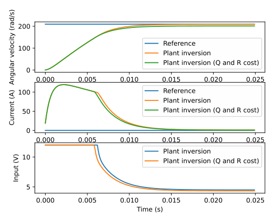
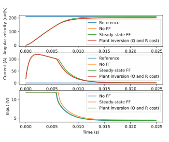
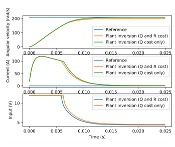

# Appendix C: Feedforwards

This appendix will show the derivations for alternate feedforward formulations.

## C.1 QR-weighted linear plant inversion

### C.1.1 Setup

Let’s start with the equation for the reference dynamics

$$
\mathbf{r}_{k+1} = \mathbf{A}\mathbf{r}_k + \mathbf{B}\mathbf{u}_k
$$

where $\mathbf{u}_k$ is the feedforward input. Note that this feedforward equation does not and should not take into account any feedback terms. We want to find the optimal $\mathbf{u}_k$ such that we minimize the tracking error between $\mathbf{r}_{k+1}$ and $\mathbf{r}_k$.

$$
\mathbf{r}_{k+1} - \mathbf{A}\mathbf{r}_k = \mathbf{B}\mathbf{u}_k
$$

To solve for $\mathbf{u}_k$, we need to take the inverse of the nonsquare matrix $\mathbf{B}$. This isn’t possible, but we can find the pseudoinverse given some constraints on the state tracking error and control effort. To find the optimal solution for these sorts of trade-offs, one can define a cost function and attempt to minimize it. To do this, we’ll first solve the expression for $\mathbf{0}$.

$$
\mathbf{0} = \mathbf{B}\mathbf{u}_k - (\mathbf{r}_{k+1} - \mathbf{A}\mathbf{r}_k)
$$

This expression will be the state tracking cost we use in our cost function.

Our cost function will use an $H_2$ norm with $\mathbf{Q}$ as the state cost matrix with dimensionality $states \times states$ and $\mathbf{R}$ as the control input cost matrix with dimensionality $inputs \times inputs$.

$$
\mathbf{J} = (\mathbf{B}\mathbf{u}_k - (\mathbf{r}_{k+1} - \mathbf{A}\mathbf{r}_k))^{\mathsf{T}} \mathbf{Q}
    (\mathbf{B}\mathbf{u}_k - (\mathbf{r}_{k+1} - \mathbf{A}\mathbf{r}_k)) +
    \mathbf{u}_k^{\mathsf{T}}\mathbf{R}\mathbf{u}_k
$$

### C.1.2 Minimization

Given theorem 5.15.1 and corollary 5.15.3, find the minimum of $\mathbf{J}$ by taking the partial derivative with respect to $\mathbf{u}_k$ and setting the result to $\mathbf{0}$.

$$
\begin{aligned}
\frac{\partial\mathbf{J}}{\partial\mathbf{u}_k} &= 2\mathbf{B}^{\mathsf{T}}\mathbf{Q}
    (\mathbf{B}\mathbf{u}_k - (\mathbf{r}_{k+1} - \mathbf{A}\mathbf{r}_k)) +
    2\mathbf{R}\mathbf{u}_k \\
\mathbf{0} &= 2\mathbf{B}^{\mathsf{T}}\mathbf{Q}
    (\mathbf{B}\mathbf{u}_k - (\mathbf{r}_{k+1} - \mathbf{A}\mathbf{r}_k)) +
    2\mathbf{R}\mathbf{u}_k \\
\mathbf{0} &= \mathbf{B}^{\mathsf{T}}\mathbf{Q}
    (\mathbf{B}\mathbf{u}_k - (\mathbf{r}_{k+1} - \mathbf{A}\mathbf{r}_k)) +
    \mathbf{R}\mathbf{u}_k \\
\mathbf{0} &= \mathbf{B}^{\mathsf{T}}\mathbf{Q}\mathbf{B}\mathbf{u}_k -
    \mathbf{B}^{\mathsf{T}}\mathbf{Q}(\mathbf{r}_{k+1} - \mathbf{A}\mathbf{r}_k) + \mathbf{R}\mathbf{u}_k \\
\mathbf{B}^{\mathsf{T}}\mathbf{Q}\mathbf{B}\mathbf{u}_k + \mathbf{R}\mathbf{u}_k &=
    \mathbf{B}^{\mathsf{T}}\mathbf{Q}(\mathbf{r}_{k+1} - \mathbf{A}\mathbf{r}_k) \\
(\mathbf{B}^{\mathsf{T}}\mathbf{Q}\mathbf{B} + \mathbf{R})\mathbf{u}_k &=
    \mathbf{B}^{\mathsf{T}}\mathbf{Q}(\mathbf{r}_{k+1} - \mathbf{A}\mathbf{r}_k) \\
\mathbf{u}_k &= (\mathbf{B}^{\mathsf{T}}\mathbf{Q}\mathbf{B} + \mathbf{R})^{-1}
    \mathbf{B}^{\mathsf{T}}\mathbf{Q}(\mathbf{r}_{k+1} - \mathbf{A}\mathbf{r}_k)
\end{aligned}
$$

> **Theorem C.1.1 — QR-weighted linear plant inversion.**
>
> Given the discrete model $\mathbf{x}_{k+1} = \mathbf{A}\mathbf{x}_k + \mathbf{B}\mathbf{u}_k$, the plant inversion feedforward is
>
> $$
> \mathbf{u}_k = \mathbf{K}_{ff} (\mathbf{r}_{k+1} - \mathbf{A}\mathbf{r}_k)
> $$
>
> where $\mathbf{K}_{ff} = (\mathbf{B}^{\mathsf{T}}\mathbf{Q}\mathbf{B} + \mathbf{R})^{-1}\mathbf{B}^{\mathsf{T}}\mathbf{Q}$, $\mathbf{r}_{k+1}$ is the reference at the next timestep, and $\mathbf{r}_k$ is the reference at the current timestep.

Figure C.1 shows plant inversion applied to a second-order CIM motor model.

*Figure C.1: Second-order CIM motor response with plant inversion*

Plant inversion isn’t as effective with both $\mathbf{Q}$ and $\mathbf{R}$ cost because the $\mathbf{R}$ matrix penalized control effort. The reference tracking with no cost matrices is much better.

## C.2 Steady-state feedforward

Steady-state feedforwards apply the control effort required to keep a system at the reference if it is no longer moving (i.e., the system is at steady-state). The first steady-state feedforward converts desired outputs to desired states.

$$
\mathbf{x}_c = \mathbf{N}_x\mathbf{y}_c
$$

$\mathbf{N}_x$ converts desired outputs $\mathbf{y}_c$ to desired states $\mathbf{x}_c$ (also known as $\mathbf{r}$). For steady-state, that is

$$
\mathbf{x}_{ss} = \mathbf{N}_x\mathbf{y}_{ss} \tag{C.1}
$$

The second steady-state feedforward converts the desired outputs $\mathbf{y}$ to the control input required at steady-state.

$$
\mathbf{u}_c = \mathbf{N}_u\mathbf{y}_c
$$

$\mathbf{N}_u$ converts the desired outputs $\mathbf{y}$ to the control input $\mathbf{u}$ required at steady-state. For steady-state, that is

$$
\mathbf{u}_{ss} = \mathbf{N}_u\mathbf{y}_{ss} \tag{C.2}
$$

### C.2.1 Continuous case

To find the control input required at steady-state, set equation (6.3) to zero.

$$
\begin{aligned}
\dot{\mathbf{x}} &= \mathbf{A}\mathbf{x} + \mathbf{B}\mathbf{u} \\
\mathbf{y} &= \mathbf{C}\mathbf{x} + \mathbf{D}\mathbf{u}
\end{aligned}
$$

$$
\begin{aligned}
\mathbf{0} &= \mathbf{A}\mathbf{x}_{ss} + \mathbf{B}\mathbf{u}_{ss} \\
\mathbf{y}_{ss} &= \mathbf{C}\mathbf{x}_{ss} + \mathbf{D}\mathbf{u}_{ss}
\end{aligned}
$$

$$
\begin{aligned}
\mathbf{0} &= \mathbf{A}\mathbf{N}_x\mathbf{y}_{ss} + \mathbf{B}\mathbf{N}_u\mathbf{y}_{ss} \\
\mathbf{y}_{ss} &= \mathbf{C}\mathbf{N}_x\mathbf{y}_{ss} + \mathbf{D}\mathbf{N}_u\mathbf{y}_{ss}
\end{aligned}
$$

$$
\begin{aligned}
\begin{bmatrix}
    \mathbf{0} \\
    \mathbf{y}_{ss}
  \end{bmatrix} &=
  \begin{bmatrix}
    \mathbf{A}\mathbf{N}_x + \mathbf{B}\mathbf{N}_u \\
    \mathbf{C}\mathbf{N}_x + \mathbf{D}\mathbf{N}_u
  \end{bmatrix}
  \mathbf{y}_{ss} \\
  \begin{bmatrix}
    \mathbf{0} \\
    \mathbf{1}
  \end{bmatrix} &=
  \begin{bmatrix}
    \mathbf{A}\mathbf{N}_x + \mathbf{B}\mathbf{N}_u \\
    \mathbf{C}\mathbf{N}_x + \mathbf{D}\mathbf{N}_u
  \end{bmatrix} \\
  \begin{bmatrix}
    \mathbf{0} \\
    \mathbf{1}
  \end{bmatrix} &=
  \begin{bmatrix}
    \mathbf{A} & \mathbf{B} \\
    \mathbf{C} & \mathbf{D}
  \end{bmatrix}
  \begin{bmatrix}
    \mathbf{N}_x \\
    \mathbf{N}_u
  \end{bmatrix} \\
  \begin{bmatrix}
    \mathbf{N}_x \\
    \mathbf{N}_u
  \end{bmatrix} &=
  \begin{bmatrix}
    \mathbf{A} & \mathbf{B} \\
    \mathbf{C} & \mathbf{D}
  \end{bmatrix}^+
  \begin{bmatrix}
    \mathbf{0} \\
    \mathbf{1}
  \end{bmatrix}
\end{aligned}
$$

where $^+$ denotes the Moore-Penrose pseudoinverse.

### C.2.2 Discrete case

Now, we’ll do the same thing for the discrete system. To find the control input required at steady-state, set $\mathbf{x}_{k+1} = \mathbf{A}\mathbf{x}_k + \mathbf{B}\mathbf{u}_k$ to zero.

$$
\begin{aligned}
\mathbf{x}_{k+1} &= \mathbf{A}\mathbf{x}_k + \mathbf{B}\mathbf{u}_k \\
\mathbf{y}_k &= \mathbf{C}\mathbf{x}_k + \mathbf{D}\mathbf{u}_k
\end{aligned}
$$

$$
\begin{aligned}
\mathbf{x}_{ss} &= \mathbf{A}\mathbf{x}_{ss} + \mathbf{B}\mathbf{u}_{ss} \\
\mathbf{y}_{ss} &= \mathbf{C}\mathbf{x}_{ss} + \mathbf{D}\mathbf{u}_{ss}
\end{aligned}
$$

$$
\begin{aligned}
\mathbf{0} &= (\mathbf{A} - \mathbf{I})\mathbf{x}_{ss} + \mathbf{B}\mathbf{u}_{ss} \\
\mathbf{y}_{ss} &= \mathbf{C}\mathbf{x}_{ss} + \mathbf{D}\mathbf{u}_{ss}
\end{aligned}
$$

$$
\begin{aligned}
\mathbf{0} &= (\mathbf{A} - \mathbf{I})\mathbf{N}_x\mathbf{y}_{ss} +
    \mathbf{B}\mathbf{N}_u\mathbf{y}_{ss} \\
\mathbf{y}_{ss} &= \mathbf{C}\mathbf{N}_x\mathbf{y}_{ss} + \mathbf{D}\mathbf{N}_u\mathbf{y}_{ss}
\end{aligned}
$$

$$
\begin{aligned}
\begin{bmatrix}
    \mathbf{0} \\
    \mathbf{y}_{ss}
  \end{bmatrix} &=
  \begin{bmatrix}
    (\mathbf{A} - \mathbf{I})\mathbf{N}_x + \mathbf{B}\mathbf{N}_u \\
    \mathbf{C}\mathbf{N}_x + \mathbf{D}\mathbf{N}_u
  \end{bmatrix}
  \mathbf{y}_{ss} \\
  \begin{bmatrix}
    \mathbf{0} \\
    \mathbf{1}
  \end{bmatrix} &=
  \begin{bmatrix}
    (\mathbf{A} - \mathbf{I})\mathbf{N}_x + \mathbf{B}\mathbf{N}_u \\
    \mathbf{C}\mathbf{N}_x + \mathbf{D}\mathbf{N}_u
  \end{bmatrix} \\
  \begin{bmatrix}
    \mathbf{0} \\
    \mathbf{1}
  \end{bmatrix} &=
  \begin{bmatrix}
    \mathbf{A} - \mathbf{I} & \mathbf{B} \\
    \mathbf{C} & \mathbf{D}
  \end{bmatrix}
  \begin{bmatrix}
    \mathbf{N}_x \\
    \mathbf{N}_u
  \end{bmatrix} \\
  \begin{bmatrix}
    \mathbf{N}_x \\
    \mathbf{N}_u
  \end{bmatrix} &=
  \begin{bmatrix}
    \mathbf{A} - \mathbf{I} & \mathbf{B} \\
    \mathbf{C} & \mathbf{D}
  \end{bmatrix}^+
  \begin{bmatrix}
    \mathbf{0} \\
    \mathbf{1}
  \end{bmatrix}
\end{aligned}
$$

where $^+$ denotes the Moore-Penrose pseudoinverse.

### C.2.3 Deriving steady-state input

Now, we’ll find an expression that uses $\mathbf{N}_x$ and $\mathbf{N}_u$ to convert the reference $\mathbf{r}$ to a control input feedforward $\mathbf{u}_{ff}$. Let’s start with equation (C.1).

$$
\begin{aligned}
\mathbf{x}_{ss} &= \mathbf{N}_x \mathbf{y}_{ss} \\
\mathbf{N}_x^+ \mathbf{x}_{ss} &= \mathbf{y}_{ss}
\end{aligned}
$$

Now substitute this into equation (C.2).

$$
\begin{aligned}
\mathbf{u}_{ss} &= \mathbf{N}_u \mathbf{y}_{ss} \\
\mathbf{u}_{ss} &= \mathbf{N}_u (\mathbf{N}_x^+ \mathbf{x}_{ss}) \\
\mathbf{u}_{ss} &= \mathbf{N}_u \mathbf{N}_x^+ \mathbf{x}_{ss}
\end{aligned}
$$

$\mathbf{u}_{ss}$ and $\mathbf{x}_{ss}$ are also known as $\mathbf{u}_{ff}$ and $\mathbf{r}$ respectively.

$$
\begin{aligned}
\mathbf{u}_{ff} &= \mathbf{N}_u \mathbf{N}_x^+ \mathbf{r}
\end{aligned}
$$

So all together, we get theorem C.2.1.

> **Theorem C.2.1 — Steady-state feedforward.**
>
> Continuous:
>
> $$
> \begin{aligned}
> \begin{bmatrix}
>       \mathbf{N}_x \\
>       \mathbf{N}_u
>     \end{bmatrix} &=
>     \begin{bmatrix}
>       \mathbf{A} & \mathbf{B} \\
>       \mathbf{C} & \mathbf{D}
>     \end{bmatrix}^+
>     \begin{bmatrix}
>       \mathbf{0} \\
>       \mathbf{1}
>     \end{bmatrix} \\
>     \mathbf{u}_{ff} &= \mathbf{N}_u \mathbf{N}_x^+ \mathbf{r}
> \end{aligned}
> $$
>
> Discrete:
>
> $$
> \begin{aligned}
> \begin{bmatrix}
>       \mathbf{N}_x \\
>       \mathbf{N}_u
>     \end{bmatrix} &=
>     \begin{bmatrix}
>       \mathbf{A} - \mathbf{I} & \mathbf{B} \\
>       \mathbf{C} & \mathbf{D}
>     \end{bmatrix}^+
>     \begin{bmatrix}
>       \mathbf{0} \\
>       \mathbf{1}
>     \end{bmatrix} \\
>     \mathbf{u}_{ff,k} &= \mathbf{N}_u \mathbf{N}_x^+ \mathbf{r}_k
> \end{aligned}
> $$
>
> In the augmented matrix, $\mathbf{B}$ should contain one column corresponding to an actuator and $\mathbf{C}$ should contain one row whose output will be driven by that actuator. More than one actuator or output can be included in the computation at once, but the result won’t be the same as if they were computed independently and summed afterward.
>
> After computing the feedforward for each actuator-output pair, the respective collections of $\mathbf{N}_x$ and $\mathbf{N}_u$ matrices can summed to produce the combined feedforward.

If the augmented matrix in theorem C.2.1 is square (number of inputs = number of outputs), the normal matrix inverse can be used instead.

#### Case study: second-order CIM motor model

Each feedforward implementation has advantages. The steady-state feedforward allows using specific actuators to maintain the reference at steady-state. Plant inversion doesn’t support this, but can be used for reference tracking as well with the same tuning parameters as LQR design. Figure C.2 shows both types of feedforwards applied to a second-order CIM motor model.

*Figure C.2: Second-order CIM motor response with various feedforwards*

*Figure C.3: Second-order CIM motor response with plant inversions*

Plant inversion isn’t as effective in figure C.2 because the $\mathbf{R}$ matrix penalized control effort. If the $\mathbf{R}$ cost matrix is removed from the plant inversion calculation, the reference tracking is much better (see figure C.3).
