# Appendix E: Classical control theory

This appendix is provided for those who are curious about a lower-level interpretation of control systems. It describes what a transfer function is and shows how they can be used to analyze dynamical systems. Emphasis is placed on the geometric intuition of this analysis rather than the frequency domain math. Many tools exclusive to classical control theory (root locus, Bode plots, Nyquist plots, etc.) aren’t useful for or relevant to the examples presented in the main chapters, so they would only complicate the learning process.

With classical control theory’s geometric interpretation, one can perform stability and robustness analyses and design reasonable controllers for systems on the back of a napkin. However, computing power is much more plentiful nowadays; we should take advantage of the modern tools this enables to better express the controls designer’s intent (for example, via optimal control criteria rather than frequency response characteristics).

Classical control theory should only be used when the controls designer cares about directly shaping the frequency response of a system. Electrical engineers do this a lot, but all the other university controls students have been forced to learn it too regardless of its utility in other disciplines.

## E.1 Classical vs modern control theory

State-space notation provides a more convenient and compact way to model and analyze systems with multiple inputs and outputs. For a system with $p$ inputs and $q$ outputs, we would have to write $q \times p$ transfer functions to represent it. Not only is the resulting algebra unwieldy, but it only works for linear systems. Including nonzero initial conditions complicates the algebra even more. State-space representation uses the time domain instead of the Laplace domain, so it can model nonlinear systems[^1] and trivially supports nonzero initial conditions.

If modern control theory is so great and classical control theory isn’t needed to use it, why learn classical control theory at all? We teach classical control theory because it provides a framework within which to understand results from the mathematical machinery of modern control as well as vocabulary with which to communicate that understanding. For example, faster poles (poles moved to the left in the s-plane) mean faster decay, and oscillation means there is at least one pair of complex conjugate poles. Not only can you describe what happened succinctly, but you know why it happened from a theoretical perspective.

This book uses LQR and modern control over, say, loop shaping with Bode and Nyquist plots because we have accurate dynamical models to leverage, and LQR allows directly expressing what the author is concerned with optimizing: state excursion relative to control effort. Applying lead and lag compensators, while effective for robust controller design, doesn’t provide the same expressive power.

## E.2 Transfer functions

We will briefly discuss what transfer functions are, how the locations of poles and zeroes affect system response and stability, and how controllers affect pole locations.

### E.2.1 Laplace transform

For an introduction to Laplace transforms and the geometric intuition behind transfer functions, watch “What does the Laplace Transform really tell us?” by Zach Star.

> **Video:** [“What does the Laplace Transform really tell us?” (21 minutes)](https://youtu.be/n2y7n6jw5d0) — Zach Star

A more mathematical introduction is presented later in chapter [E.3](#e3-laplace-domain-analysis).

### E.2.2 Parts of a transfer function

A transfer function maps an input coordinate to an output coordinate in the Laplace domain. These can be obtained by applying the Laplace transform to a differential equation and rearranging the terms to obtain a ratio of the output variable to the input variable. Equation (E.1) is an example of a transfer function.

$$
H(s) = \frac{\overbrace{(s-9+9i)(s-9-9i)}^{zeroes}}
    {\underbrace{s(s+10)}_{poles}} \tag{E.1}
$$

#### Poles and zeroes

The roots of factors in the numerator of a transfer function are called *zeroes* because they make the transfer function approach zero. Likewise, the roots of factors in the denominator of a transfer function are called *poles* because they make the transfer function approach infinity; on a 3D graph, these look like the poles of a circus tent (see figure E.1).

When the factors of the denominator are broken apart using partial fraction expansion into something like $\frac{A}{s + a} + \frac{B}{s + b}$, the constants $A$ and $B$ are called residues, which determine how much each pole contributes to the system response.

The factors representing poles are each the Laplace transform of a decaying exponential.[^2] That means the time domain responses of systems comprise decaying exponentials (e.g., $y = e^{-t}$).

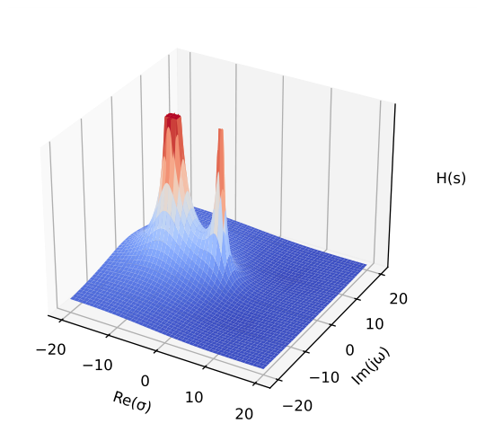

*Figure E.1: Equation (E.1) plotted in 3D*

> **Remark.** Imaginary poles and zeroes always come in complex conjugate pairs (e.g., $-2 + 3i$, $-2 - 3i$).

The locations of the closed-loop poles in the complex plane determine the stability of the system. Each pole represents a frequency mode of the system, and their location determines how much of each response is induced for a given input frequency. Figure E.2 shows the impulse responses in the time domain for transfer functions with various pole locations. They all have an initial condition of $1$.

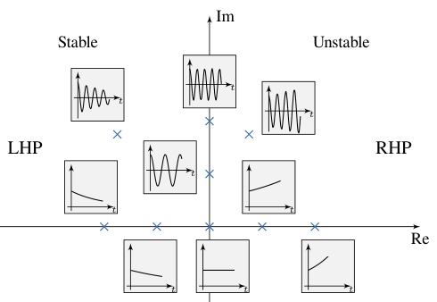

*Figure E.2: Continuous impulse response vs pole location*

Poles in the left half-plane (LHP) are stable; the system’s output may oscillate but it converges to steady-state. Poles on the imaginary axis are marginally stable; the system’s output oscillates at a constant amplitude forever. Poles in the right half-plane (RHP) are unstable; the system’s output grows without bound.

#### Nonminimum phase zeroes

While poles in the RHP are unstable, the same is not true for zeroes. They can be characterized by the system initially moving in the wrong direction before heading toward the reference. Since the poles always move toward the zeroes, zeroes impose a “speed limit” on the system response because it takes a finite amount of time to move the wrong direction, then change directions.

One example of this type of system is bicycle steering. Try riding a bicycle without holding the handle bars, then poke the right handle; the bicycle turns right. Furthermore, if one is holding the handlebars and wants to turn left, rotating the handlebars counterclockwise will make the bicycle fall toward the right. The rider has to lean into the turn and overpower the nonminimum phase dynamics to go the desired direction.

Another example is a Segway. To move forward by some distance, the Segway must first roll backward to rotate the Segway forward. Once the Segway starts falling in that direction, it begins rolling forward to avoid falling over until it reaches the target distance. At that point, the Segway increases its forward speed to pitch backward and slow itself down. To come to a stop, the Segway rolls backward again to level itself out.

#### Pole-zero cancellation

Pole-zero cancellation occurs when a pole and zero are located at the same place in the s-plane. This effectively eliminates the contribution of each to the system dynamics. By placing poles and zeroes at various locations (this is done by placing transfer functions in series), we can eliminate undesired system dynamics. While this may appear to be a useful design tool at first, there are major caveats. Most of these are due to model uncertainty resulting in poles which aren’t in the locations the controls designer expected.

Notch filters are typically used to dampen a specific range of frequencies in the system response. If its band is made too narrow, it can still leave the undesirable dynamics, but now you can no longer measure them in the response. They are still happening, but they are what’s called *unobservable*.

Never pole-zero cancel unstable or nonminimum phase dynamics. If the model doesn’t quite reflect reality, an attempted pole cancellation by placing a nonminimum phase zero results in the pole still moving to the zero placed next to it. You have the same dynamics as before, but the pole is also stuck where it is no matter how much feedback gain is applied. For an attempted nonminimum phase zero cancellation, you have effectively placed an unstable pole that’s unobservable. This means the system will be going unstable and blowing up, but you won’t be able to detect this and react to it.

Keep in mind when making design decisions that the model likely isn’t perfect. The whole point of feedback control is to be robust to this kind of uncertainty.

### E.2.3 Transfer functions in feedback

For controllers to regulate a system or track a reference, they must be placed in positive or negative feedback with the plant (whether to use positive or negative depends on the plant in question). Stable feedback loops attempt to make the output equal the reference.

#### Derivation

Given the feedback network in figure E.3, find an expression for $Y(s)$.

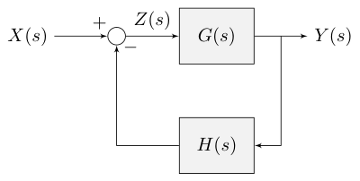

*Figure E.3: Closed-loop block diagram*

$$
\begin{aligned}
Y(s) &= Z(s) G(s) \\
Z(s) &= X(s) - Y(s) H(s) \\
X(s) &= Z(s) + Y(s) H(s) \\
X(s) &= Z(s) + Z(s) G(s) H(s) \\
\frac{Y(s)}{X(s)} &= \frac{Z(s) G(s)}{Z(s) + Z(s) G(s) H(s)} \\
\frac{Y(s)}{X(s)} &= \frac{G(s)}{1 + G(s) H(s)}
\end{aligned}
$$

A more general form is

$$
\frac{Y(s)}{X(s)} = \frac{G(s)}{1 \mp G(s) H(s)} \tag{E.3}
$$

where positive feedback uses the top sign and negative feedback uses the bottom sign.

#### Control system with feedback

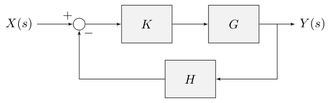

*Figure E.4: Feedback controller block diagram*

Following equation (E.3), the transfer function of figure E.4, a control system diagram with negative feedback, from input to output is

$$
G_{cl}(s) = \frac{Y(s)}{X(s)} = \frac{KG}{1 + KGH}
$$

The numerator is the open-loop gain and the denominator is one plus the gain around the feedback loop, which may include parts of the open-loop gain. As another example, the transfer function from the input to the error is

$$
G_{cl}(s) = \frac{E(s)}{X(s)} = \frac{1}{1 + KGH}
$$

The roots of the denominator of $G_{cl}(s)$ are different from those of the open-loop transfer function $KG(s)$. These are called the closed-loop poles.

#### DC motor transfer function

If poles are much farther left in the LHP than the typical system dynamics exhibit, they can be considered negligible. Every system has some form of unmodeled high frequency, nonlinear dynamics, but they can be safely ignored depending on the operating regime.

To demonstrate this, consider the transfer function for a second-order DC motor (a CIM motor) from voltage to velocity.

$$
G(s) = \frac{K}{(Js + b)(Ls + R) + K^2}
$$

where $J = 3.2284 \times 10^{-6}$ $kg$-$m^2$, $b = 3.5077 \times 10^{-6}$ $N$-$m$-$s$, $K_e = K_t = 0.0181 \,V/rad/s$, $R = 0.0902 \,\Omega$, and $L = 230 \times 10^{-6} \,H$.

This system is second-order because it has two poles; one corresponds to velocity and the other corresponds to current.

Compare the step response of this system (figure E.5) with the step response of this system with $L$ set to zero (figure E.6). For small values of $K$, both systems are stable and have nearly indistinguishable step responses on a long timescale. The high frequency dynamics only cause oscillation for large values of $K$ that induce fast system responses. In other words, the system responses of the second-order model and its first-order approximation are similar for low frequency operating regimes.

*Figure E.5: Second-order CIM motor model step response ($L = 230$ μH)*

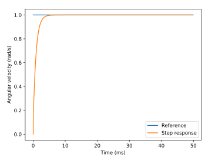

*Figure E.6: First-order CIM motor model step response ($L = 0$ μH)*

Why can’t unstable poles close to the origin be ignored in the same way? The response of high frequency stable poles decays rapidly. Unstable poles, on the other hand, represent unstable dynamics which cause the system output to grow to infinity. Regardless of how slow these unstable dynamics are, they will eventually dominate the response.

## E.3 Laplace domain analysis

This chapter uses Laplace transforms and transfer functions to analyze properties of control systems like steady-state error.

These case studies cover various aspects of PID control using the algebraic approach of transfer functions. For this, we’ll be using equation (E.6), the transfer function for a PID controller.

$$
K(s) = K_p + \frac{K_i}{s} + K_ds \tag{E.6}
$$

First, we will define mathematically what Laplace transforms and transfer functions are, which is rooted in the concept of orthogonal projections.

### E.3.1 Projections

Consider a two-dimensional Euclidean space $\mathbb{R}^2$ shown in figure E.7 (each $\mathbb{R}$ is a dimension whose domain is the set of real numbers, so $\mathbb{R}^2$ is the standard x-y plane).

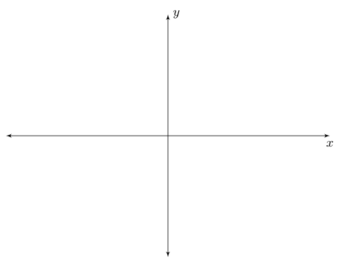

*Figure E.7: Euclidean space $\mathbb{R}^2$*

Ordinarily, we notate points in this plane by their components in the set of basis vectors $\{\hat{i}, \hat{j}\}$, where $\hat{i}$ (pronounced i-hat) is the unit vector in the positive $x$ direction and $\hat{j}$ is the unit vector in the positive $y$ direction. Figure E.8 shows an example vector $\mathbf{v}$ in this basis.

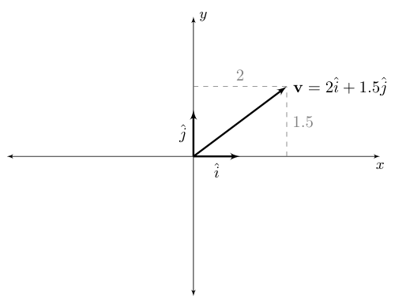

*Figure E.8: $\mathbf{v}$ with basis set $\{\hat{i}, \hat{j}\}$*

How do we find the coordinates of $\mathbf{v}$ in this basis mathematically? As long as the basis is *orthogonal* (i.e., the basis vectors are at right angles to each other), we simply take the *orthogonal projection* of $\mathbf{v}$ onto $\hat{i}$ and $\hat{j}$. Intuitively, this means finding “the amount of $\mathbf{v}$ that points in the direction of $\hat{i}$ or $\hat{j}$”. Note that a set of orthogonal vectors have a dot product of zero with respect to each other.

More formally, we can calculate projections with the dot product - the projection of $\mathbf{v}$ onto any other vector $\mathbf{w}$ is as follows.

$$
\text{proj}_\mathbf{w} \mathbf{v} = \frac{\mathbf{v} \cdot \mathbf{w}}{|\mathbf{w}|}
$$

Since $\hat{i}$ and $\hat{j}$ are *unit vectors*, their magnitudes are $1$ so the coordinates of $\mathbf{v}$ are $\mathbf{v} \cdot \hat{i}$ and $\mathbf{v} \cdot \hat{j}$.

We can use this same process to find the coordinates of $\mathbf{v}$ in *any* orthogonal basis. For example, imagine the basis $\{\hat{i} + \hat{j}, \hat{i} - \hat{j}\}$ - the coordinates in this basis are given by $\frac{\mathbf{v} \cdot (\hat{i} + \hat{j})}{\sqrt{2}}$ and $\frac{\mathbf{v} \cdot (\hat{i} - \hat{j})}{\sqrt{2}}$. Let’s “unwrap” the formula for dot product and look a bit more closely.

$$
\frac{\mathbf{v} \cdot (\hat{i} + \hat{j})}{\sqrt{2}} =
    \frac{1}{\sqrt{2}} \sum_{i=0}^n \mathbf{v}_i (\hat{i} + \hat{j})_i
$$

where the subscript $i$ denotes which component of each vector and $n$ is the total number of components. To change coordinates, we expanded both $\mathbf{v}$ and $\hat{i} + \hat{j}$ in a basis, multiplied their components, and added them up. Here’s a more concrete example. Let $\mathbf{v} = 2\hat{i} + 1.5\hat{j}$ from figure E.8. First, we’ll project $\mathbf{v}$ onto the $\hat{i} + \hat{j}$ basis vector.

$$
\begin{aligned}
\frac{\mathbf{v} \cdot (\hat{i} + \hat{j})}{\sqrt{2}} &=
    \frac{1}{\sqrt{2}} (2\hat{i} \cdot \hat{i} + 1.5\hat{j} \cdot \hat{j}) \\
\frac{\mathbf{v} \cdot (\hat{i} + \hat{j})}{\sqrt{2}} &=
    \frac{1}{\sqrt{2}} (2 + 1.5) \\
\frac{\mathbf{v} \cdot (\hat{i} + \hat{j})}{\sqrt{2}} &= \frac{3.5}{\sqrt{2}} \\
\frac{\mathbf{v} \cdot (\hat{i} + \hat{j})}{\sqrt{2}} &= \frac{3.5\sqrt{2}}{2} \\
\frac{\mathbf{v} \cdot (\hat{i} + \hat{j})}{\sqrt{2}} &= 1.75\sqrt{2}
\end{aligned}
$$

Next, we’ll project $\mathbf{v}$ onto the $\hat{i} - \hat{j}$ basis vector.

$$
\begin{aligned}
\frac{\mathbf{v} \cdot (\hat{i} - \hat{j})}{\sqrt{2}} &=
    \frac{1}{\sqrt{2}} (2\hat{i} \cdot \hat{i} - 1.5\hat{j} \cdot \hat{j}) \\
\frac{\mathbf{v} \cdot (\hat{i} - \hat{j})}{\sqrt{2}} &=
    \frac{1}{\sqrt{2}} (2 - 1.5) \\
\frac{\mathbf{v} \cdot (\hat{i} - \hat{j})}{\sqrt{2}} &= \frac{0.5}{\sqrt{2}} \\
\frac{\mathbf{v} \cdot (\hat{i} - \hat{j})}{\sqrt{2}} &= \frac{0.5\sqrt{2}}{2} \\
\frac{\mathbf{v} \cdot (\hat{i} - \hat{j})}{\sqrt{2}} &= 0.25\sqrt{2}
\end{aligned}
$$

Figure E.9 shows this result geometrically with respect to the basis $\{\hat{i} + \hat{j}, \hat{i} - \hat{j}\}$.

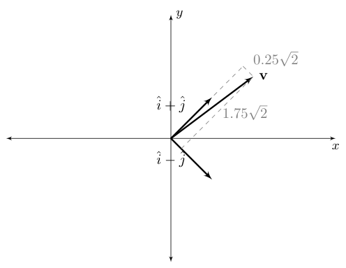

*Figure E.9: $\mathbf{v}$ with basis $\{\hat{i} + \hat{j}, \hat{i} - \hat{j}\}$*

The previous example was only a change of coordinates in a finite-dimensional vector space. However, as we will see, the core idea does not change much when we move to more complicated structures. Observe the formula for the Fourier transform.

$$
\hat{f}(\xi) = \int_{-\infty}^\infty f(x) e^{-2\pi ix \xi} \,dx
    \text{ where } \xi \in \mathbb{R}
$$

This is fundamentally the same formula we had before. $f(x)$ has taken the place of $v_n$, $e^{-2\pi ix \xi}$ has taken the place of $(\hat{i} + \hat{j})_i$, and the sum over $i$ has turned into an integral over $dx$, but the underlying concept is the same. To change coordinates in a *function space*, we simply take the orthogonal projection onto our new basis *functions*. In the case of the Fourier transform, the function basis is the family of functions of the form $f(x) = e^{-2\pi ix \xi} \text{ for } \xi \in \mathbb{R}$. Since these functions are oscillatory at a frequency determined by $\xi$, we can think of this as a “frequency basis”.

> **Remark.** Watch the “Abstract vector spaces” video from 3Blue1Brown’s *Essence of linear algebra* series for a more geometric introduction to using functions as a basis.
>
> > **Video:** [“Abstract vector spaces” (17 minutes)](https://www.3blue1brown.com/lessons/abstract-vector-spaces/) — 3Blue1Brown

Now, the Laplace transform is somewhat more complicated - as it turns out, the Fourier basis is orthogonal, so the analogy to the simpler vector space holds almost-precisely. The Laplace transform is *not* orthogonal, so we can’t interpret it *strictly* as a change of coordinates in the traditional sense. However, the intuition is the same: we are taking the orthogonal projection of our original function onto the functions of our new basis set.

$$
F(s) = \int_0^\infty f(t) e^{-st} \,dt, \text{ where } s \in \mathbb{C}
$$

Here, it becomes obvious that the Laplace transform is a *generalization* of the Fourier transform in that the basis family is strictly larger (we have allowed the “frequency” parameter to take *complex* values, as opposed to merely *real* values). As a result, the Laplace basis contains functions that grow and decay, while the Fourier basis does not.

### E.3.2 Fourier transform

The Fourier transform decomposes a function of time into its component frequencies. Each of these frequencies is part of what’s called a *basis*. These basis waveforms can be multiplied by their respective contribution amount and summed to produce the original signal (this weighted sum is called a linear combination). In other words, the Fourier transform provides a way for us to determine, given some signal, what frequencies can we add together and in what amounts to produce the original signal.

Think of an Fmajor4 chord which has the notes $F_4$ ($349.23$ Hz), $A_4$ ($440$ Hz), and $C_4$ ($261.63$ Hz). The waveform over time looks like figure E.10.

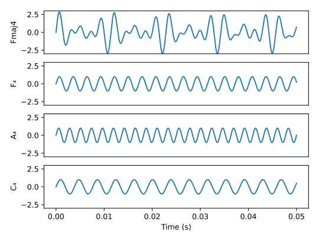

*Figure E.10: Frequency decomposition of Fmajor4 chord*

Notice how this complex waveform can be represented just by three frequencies. They show up as Dirac delta functions[^3] in the frequency domain with the area underneath them equal to their contribution (see figure E.11).

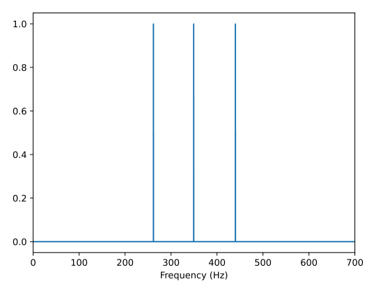

*Figure E.11: Fourier transform of Fmajor4 chord*

### E.3.3 Laplace transform

The Laplace domain is a generalization of the frequency domain that has the frequency ($j\omega$) on the imaginary y-axis and a real number on the x-axis, yielding a two-dimensional coordinate system. We represent coordinates in this space as a complex number $s = \sigma + j\omega$. The real part $\sigma$ corresponds to the x-axis and the imaginary part $j\omega$ corresponds to the y-axis (see figure E.12).

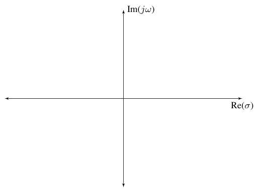

*Figure E.12: Laplace domain*

To extend our analogy of each coordinate being represented by some basis, we now have the y coordinate representing the oscillation frequency of the system response (the frequency domain) and also the x coordinate representing the speed at which that oscillation decays and the system converges to zero (i.e., a decaying exponential). Figure E.2 shows this for various points.

If we move the component frequencies in the Fmajor4 chord example parallel to the real axis to $\sigma = -25$, the resulting time domain response attenuates according to the decaying exponential $e^{-25t}$ (see figure E.13).

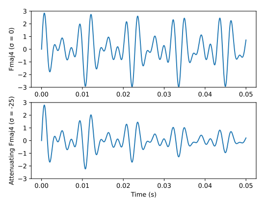

*Figure E.13: Fmajor4 chord at $\sigma = 0$ and $\sigma = -25$*

Note that this explanation as a basis isn’t exact because the Laplace basis isn’t orthogonal (that is, the x and y coordinates affect each other and have cross-talk). In the frequency domain, we had a basis of sine waves that we represented as delta functions in the frequency domain. Each frequency contribution was independent of the others. In the Laplace domain, this is not the case; a pure exponential is $\frac{1}{s - a}$ (a rational function where $a$ is a real number) instead of a delta function. This function is nonzero at points that aren’t actually frequencies present in the time domain. Figure E.14 demonstrates this, which shows the Laplace transform of the Fmajor4 chord plotted in 3D.

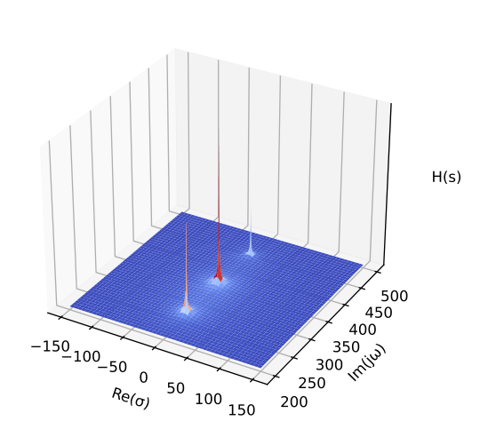

*Figure E.14: Laplace transform of Fmajor4 chord plotted in 3D*

Notice how the values of the function around each component frequency decrease according to $\frac{1}{\sqrt{x^2 + y^2}}$ in the $x$ and $y$ directions (in just the $x$ direction, it would be $\frac{1}{x}$).

### E.3.4 Laplace transform definition

The Laplace transform of a function $f(t)$ is defined as

$$
\mathcal{L}\{f(t)\} = F(s) = \int_0^\infty f(t) e^{-st} \,dt
$$

We won’t be computing any Laplace transforms by hand using this formula (everyone in the real world looks these up in a table anyway). Common Laplace transforms (assuming zero initial conditions) are shown in table E.1. Of particular note are the Laplace transforms for the derivative, unit step,[^4] and exponential decay. We can see that a derivative is equivalent to multiplying by $s$, and an integral is equivalent to multiplying by $\frac{1}{s}$.

*Table E.1: Common Laplace transforms and Laplace transform properties with zero initial conditions*

|                     |   **Time domain**    |   **Laplace domain**   |
|:-------------------:|:--------------------:|:----------------------:|
|      Linearity      | $a\,f(t) + b\,g(t)$  |  $a\,F(s) + b\,G(s)$   |
|     Convolution     |     $(f * g)(t)$     |     $F(s) \,G(s)$      |
|     Derivative      |       $f'(t)$        |       $s \,F(s)$       |
| $n^{th}$ derivative |     $f^{(n)}(t)$     |      $s^n \,F(s)$      |
|      Unit step      |        $u(t)$        |     $\frac{1}{s}$      |
|        Ramp         |      $t \,u(t)$      |    $\frac{1}{s^2}$     |
|  Exponential decay  | $e^{-\alpha t} u(t)$ | $\frac{1}{s + \alpha}$ |

### E.3.5 Steady-state error

To demonstrate the problem of steady-state error, we will use a DC motor controlled by a velocity PID controller. A DC motor has a transfer function from voltage ($V$) to angular velocity ($\dot{\theta}$) of

$$
G(s) = \frac{\dot{\Theta}(s)}{V(s)} = \frac{K}{(Js+b)(Ls+R)+K^2}
$$

First, we’ll try controlling it with a P controller defined as

$$
K(s) = K_p
$$

When these are in unity feedback, the transfer function from the input voltage to the error is

$$
\begin{aligned}
\frac{E(s)}{V(s)} &= \frac{1}{1 + K(s)G(s)} \\
E(s) &= \frac{1}{1 + K(s)G(s)} V(s) \\
E(s) &= \frac{1}{1 + (K_p) \left(\frac{K}{(Js+b)(Ls+R)+K^2}\right)} V(s) \\
E(s) &= \frac{1}{1 + \frac{K_p K}{(Js+b)(Ls+R)+K^2}} V(s)
\end{aligned}
$$

The steady-state of a transfer function can be found via

$$
\lim_{s\to0} sH(s)
$$

since steady-state has an input frequency of zero.

$$
\begin{aligned}
e_{ss} &= \lim_{s\to0} sE(s) \\
e_{ss} &= \lim_{s\to0} s \frac{1}{1 + \frac{K_p K}{(Js+b)(Ls+R)+K^2}} V(s) \\
e_{ss} &= \lim_{s\to0} s \frac{1}{1 + \frac{K_p K}{(Js+b)(Ls+R)+K^2}}
    \frac{1}{s} \\
e_{ss} &= \lim_{s\to0} \frac{1}{1 + \frac{K_p K}{(Js+b)(Ls+R)+K^2}} \\
e_{ss} &= \frac{1}{1 + \frac{K_p K}{(J(0)+b)(L(0)+R)+K^2}} \\
e_{ss} &= \frac{1}{1 + \frac{K_p K}{bR+K^2}}
\end{aligned} \tag{E.9}
$$

Notice that the steady-state error is nonzero. To fix this, an integrator must be included in the controller.

$$
K(s) = K_p + \frac{K_i}{s}
$$

The same steady-state calculations are performed as before with the new controller.

$$
\begin{aligned}
\frac{E(s)}{V(s)} &= \frac{1}{1 + K(s)G(s)} \\
E(s) &= \frac{1}{1 + K(s)G(s)} V(s) \\
E(s) &= \frac{1}{1 + \left(K_p + \frac{K_i}{s}\right)
    \left(\frac{K}{(Js+b)(Ls+R)+K^2}\right)} \left(\frac{1}{s}\right) \\
e_{ss} &= \lim_{s\to0} s \frac{1}{1 + \left(K_p + \frac{K_i}{s}\right)
    \left(\frac{K}{(Js+b)(Ls+R)+K^2}\right)} \left(\frac{1}{s}\right) \\
e_{ss} &= \lim_{s\to0} \frac{1}{1 + \left(K_p + \frac{K_i}{s}\right)
    \left(\frac{K}{(Js+b)(Ls+R)+K^2}\right)} \\
e_{ss} &= \lim_{s\to0} \frac{1}{1 + \left(K_p + \frac{K_i}{s}\right)
    \left(\frac{K}{(Js+b)(Ls+R)+K^2}\right)} \frac{s}{s} \\
e_{ss} &= \lim_{s\to0} \frac{s}{s + \left(K_p s + K_i\right)
    \left(\frac{K}{(Js+b)(Ls+R)+K^2}\right)} \\
e_{ss} &= \frac{0}{0 + (K_p (0) + K_i)
    \left(\frac{K}{(J(0)+b)(L(0)+R)+K^2}\right)} \\
e_{ss} &= \frac{0}{K_i \frac{K}{bR+K^2}}
\end{aligned}
$$

The denominator is nonzero, so $e_{ss} = 0$. Therefore, an integrator is required to eliminate steady-state error in all cases for this model.

It should be noted that $e_{ss}$ in equation (E.9) approaches zero for $K_p = \infty$. This is known as a bang-bang controller. In practice, an infinite switching frequency cannot be achieved, but it may be close enough for some performance specifications.

### E.3.6 Do flywheels need PD control?

PID controllers typically control voltage to a motor in FRC independent of the equations of motion of that motor. For position PID control, large values of $K_p$ can lead to overshoot and $K_d$ is commonly used to reduce overshoots. Let’s consider a flywheel controlled with a standard PID controller. Why wouldn’t $K_d$ provide damping for velocity overshoots in this case?

PID control is designed to control second-order and first-order systems well. It can be used to control a lot of things, but struggles when given higher order systems. It has three degrees of freedom. Two are used to place the two poles of the system, and the third is used to remove steady-state error. With higher order systems like a one input, seven state system, there aren’t enough degrees of freedom to place the system’s poles in desired locations. This will result in poor control.

The math for PID doesn’t assume voltage, a motor, etc. It defines an output based on derivatives and integrals of its input. We happen to use it for motors because it actually works pretty well for it because motors are second-order systems.

The following math will be in continuous time, but the same ideas apply to discrete time. This is all assuming a velocity controller.

Our simple motor model hooked up to a mass is

$$
\begin{aligned}
V &= IR + \frac{\omega}{K_v} \\
\tau &= I K_t \\
\tau &= J \frac{d\omega}{dt}
\end{aligned} \tag{E.10\text{--}E.12}
$$

For an explanation of where these equations come from, read section [12.1](12-newtonian-mechanics-examples.md#121-dc-motor).

First, we’ll solve for $\frac{d\omega}{dt}$ in terms of $V$.

Substitute equation (E.11) into equation (E.10).

$$
\begin{aligned}
V &= IR + \frac{\omega}{K_v} \\
V &= \left(\frac{\tau}{K_t}\right) R + \frac{\omega}{K_v}
\end{aligned}
$$

Substitute in equation (E.12).

$$
\begin{aligned}
V &= \frac{\left(J \frac{d\omega}{dt}\right)}{K_t} R + \frac{\omega}{K_v}
\end{aligned}
$$

Solve for $\frac{d\omega}{dt}$.

$$
\begin{aligned}
V &= \frac{J \frac{d\omega}{dt}}{K_t} R + \frac{\omega}{K_v} \\
V - \frac{\omega}{K_v} &= \frac{J \frac{d\omega}{dt}}{K_t} R \\
\frac{d\omega}{dt} &= \frac{K_t}{JR} \left(V - \frac{\omega}{K_v}\right) \\
\frac{d\omega}{dt} &= -\frac{K_t}{JRK_v} \omega + \frac{K_t}{JR} V
\end{aligned}
$$

Now take the Laplace transform. Because the Laplace transform is a linear operator, we can take the Laplace transform of each term individually. Based on table E.1, $\frac{d\omega}{dt}$ becomes $s\omega$ and $\omega(t)$ and $V(t)$ become $\omega(s)$ and $V(s)$ respectively (the parenthetical notation has been dropped for clarity).

$$
\begin{aligned}
s \omega &= -\frac{K_t}{JRK_v} \omega + \frac{K_t}{JR} V
\end{aligned} \tag{E.13}
$$

Solve for the transfer function $H(s) = \frac{\omega}{V}$.

$$
\begin{aligned}
s \omega &= -\frac{K_t}{JRK_v} \omega + \frac{K_t}{JR} V \\
\left(s + \frac{K_t}{JRK_v}\right) \omega &= \frac{K_t}{JR} V \\
\frac{\omega}{V} &= \frac{\frac{K_t}{JR}}{s + \frac{K_t}{JRK_v}}
\end{aligned}
$$

That gives us a pole at $-\frac{K_t}{JRK_v}$, which is actually stable. Notice that there is only one pole.

First, we’ll use a simple P controller.

$$
V = K_p (\omega_{goal} - \omega)
$$

Substitute this controller into equation (E.13).

$$
\begin{aligned}
s \omega &= -\frac{K_t}{JRK_v} \omega + \frac{K_t}{JR} K_p (\omega_{goal} -
    \omega)
\end{aligned}
$$

Solve for the transfer function $H(s) = \frac{\omega}{\omega_{goal}}$.

$$
\begin{aligned}
s \omega &= -\frac{K_t}{JRK_v} \omega + \frac{K_t K_p}{JR} (\omega_{goal} -
    \omega) \\
s \omega &= -\frac{K_t}{JRK_v} \omega + \frac{K_t K_p}{JR} \omega_{goal} -
    \frac{K_t K_p}{JR} \omega \\
\left(s + \frac{K_t}{JRK_v} + \frac{K_t K_p}{JR}\right) \omega &=
    \frac{K_t K_p}{JR} \omega_{goal} \\
\frac{\omega}{\omega_{goal}} &= \frac{\frac{K_t K_p}{JR}}
    {\left(s + \frac{K_t}{JRK_v} + \frac{K_t K_p}{JR}\right)}
\end{aligned}
$$

This has a pole at $-\left(\frac{K_t}{JRK_v} + \frac{K_t K_p}{JR}\right)$. Assuming that that quantity is negative (i.e., we are stable), that pole corresponds to a time constant of $\frac{1}{\frac{K_t}{JRK_v} + \frac{K_t K_p}{JR}}$.

As can be seen above, a flywheel has a single pole. It therefore only needs a single pole controller to place that pole anywhere on the real axis.

This analysis assumes that the motor is well coupled to the mass and that the time constant of the inductor is small enough that it doesn’t factor into the motor equations. The latter is a pretty good assumption for a CIM motor (see figures E.15 and E.16). If more mass is added to the motor armature, the response timescales increase and the inductance matters even less.

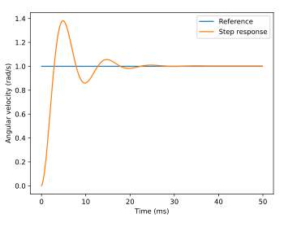

*Figure E.15: Second-order CIM motor model step response ($L = 230$ μH)*

*Figure E.16: First-order CIM motor model step response ($L = 0$ μH)*

Next, we’ll try a PD loop. (This will use a perfect derivative, but anyone following along closely already knows that we can’t really take a derivative here, so the math will need to be updated at some point. We could switch to discrete time and pick a differentiation method, or pick some other way of modeling the derivative.)

$$
V = K_p (\omega_{goal} - \omega) + K_d s (\omega_{goal} - \omega)
$$

Substitute this controller into equation (E.13).

$$
\begin{aligned}
s \omega &= -\frac{K_t}{JRK_v} \omega + \frac{K_t}{JR}
    \left(K_p (\omega_{goal} - \omega) + K_d s (\omega_{goal} - \omega)\right) \\
s \omega &= -\frac{K_t}{JRK_v} \omega + \frac{K_t K_p}{JR}
    (\omega_{goal} - \omega) + \frac{K_t K_d s}{JR} (\omega_{goal} - \omega) \\
s \omega &= -\frac{K_t}{JRK_v} \omega + \frac{K_t K_p}{JR} \omega_{goal} -
    \frac{K_t K_p}{JR} \omega + \frac{K_t K_d s}{JR} \omega_{goal} -
    \frac{K_t K_d s}{JR} \omega
\end{aligned}
$$

Collect the common terms on separate sides and refactor.

$$
\begin{aligned}
s \omega + \frac{K_t K_d s}{JR} \omega + \frac{K_t}{JRK_v} \omega +
    \frac{K_t K_p}{JR} \omega &= \frac{K_t K_p}{JR} \omega_{goal} +
    \frac{K_t K_d s}{JR} \omega_{goal} \\
\left(s + \frac{K_t K_d s}{JR} + \frac{K_t}{JRK_v} +
    \frac{K_t K_p}{JR}\right) \omega &= \left(\frac{K_t K_p}{JR} +
    \frac{K_t K_d s}{JR}\right) \omega_{goal} \\
\left(s \left(1 + \frac{K_t K_d}{JR}\right) + \frac{K_t}{JRK_v} +
    \frac{K_t K_p}{JR}\right) \omega &= \frac{K_t}{JR}
    \left(K_p + K_d s\right) \omega_{goal}
\end{aligned}
$$

Solve for $\frac{\omega}{\omega_{goal}}$.

$$
\frac{\omega}{\omega_{goal}} = \frac{\frac{K_t}{JR}\left(K_p + K_d s\right)}
    {s \left(1 + \frac{K_t K_d}{JR}\right) +
      \frac{K_t}{JRK_v} + \frac{K_t K_p}{JR}} \\
$$

So, we added a zero at $-\frac{K_p}{K_d}$ and moved our pole to $-\frac{\frac{K_t}{JRK_v} + \frac{K_t K_p}{JR}}{1 + \frac{K_t K_d}{JR}}$. This isn’t progress. We’ve added more complexity to our system and, practically speaking, gotten nothing good in return. Zeroes should be avoided if at all possible because they amplify unwanted high frequency modes of the system and are noisier the faster the system is sampled. At least this is a stable zero, but it’s still undesirable.

In summary, derivative doesn’t help on an ideal flywheel. $K_d$ may compensate for unmodeled dynamics such as accelerating projectiles slowing the flywheel down, but that effect may also increase recovery time; $K_d$ drives the acceleration to zero in the undesired case of negative acceleration as well as well as the actually desired case of positive acceleration.

Subsection [6.7.2](06-continuous-state-space-control.md#672-input-error-estimation) covers a superior compensation method that avoids zeroes in the controller, doesn’t act against the desired control action, and facilitates better tracking.

### E.3.7 Gain margin and phase margin

One generally needs to learn about Bode plots and Nyquist plots to truly understand gain and phase margin and their origins, but those plots are large topics unto themselves. Since we won’t be using either of them for controller design, we’ll just cover what gain and phase margin are in a general sense and how they are used.

Gain margin and phase margin are two metrics for measuring a system’s relative stability. Gain and phase margin are the amounts by which the closed-loop gain and phase can be varied respectively before the system becomes unstable. In a sense, they are safety margins for when unmodeled dynamics affect the system response.

Watch the following video for a more thorough explanation of gain and phase margin.

> **Video:** [“Gain and Phase Margins Explained!” (14 minutes)](https://youtu.be/ThoA4amCAX4) — Brian Douglas

## E.4 s-plane to z-plane

Transfer functions are converted to impulse responses using the Z-transform. The s-plane’s LHP maps to the inside of a unit circle in the z-plane. Table E.2 contains a few common points and figure E.17 shows the mapping visually.

*Table E.2: Mapping from s-plane to z-plane*

|  **s-plane**   |     **z-plane**     |
|:--------------:|:-------------------:|
|    $(0, 0)$    |      $(1, 0)$       |
| imaginary axis | edge of unit circle |
| $(-\infty, 0)$ |      $(0, 0)$       |

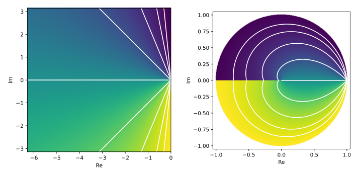

*Figure E.17: Mapping of complex plane from s-plane (left) to z-plane (right)*

### E.4.1 Discrete system stability

Eigenvalues of a system that are within the unit circle are stable. To demonstrate this, consider the discrete system $x_{k + 1} = ax_k$ where $a$ is a complex number. $|a| < 1$ will make $x_{k + 1}$ converge to zero.

### E.4.2 Discrete system behavior

Figure E.18 shows the impulse responses in the time domain for systems with various pole locations in the complex plane (real numbers on the x-axis and imaginary numbers on the y-axis). Each response has an initial condition of $1$.

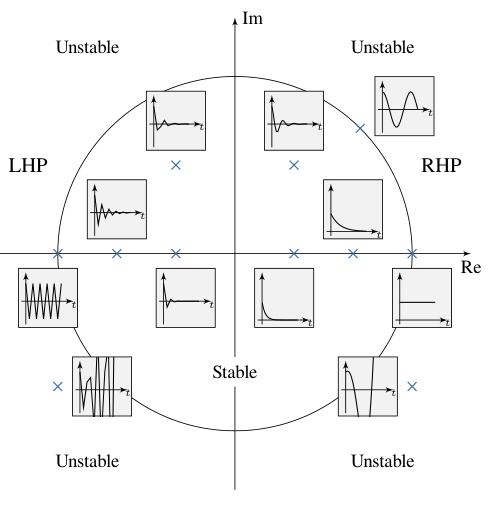

*Figure E.18: Discrete impulse response vs pole location*

As $\omega$ increases in $s = j\omega$, a pole in the z-plane moves around the perimeter of the unit circle. Once it hits $\frac{\omega_s}{2}$ (half the sampling frequency) at $(-1, 0)$, the pole wraps around. This is due to poles faster than the sample frequency folding down to below the sample frequency (that is, higher frequency signals *alias* to lower frequency ones).

Placing the poles at $(0, 0)$ produces a *deadbeat controller*. An $\rm N^{th}$-order deadbeat controller decays to the reference in N timesteps. While this sounds great, there are other considerations like control effort, robustness, and noise immunity.

Poles in the left half-plane cause jagged outputs because the frequency of the system dynamics is above the Nyquist frequency (twice the sample frequency). The discretized signal doesn’t have enough samples to reconstruct the continuous system’s dynamics. See figures E.19 and E.20 for examples.

*Figure E.19: Single poles in various locations in z-plane*

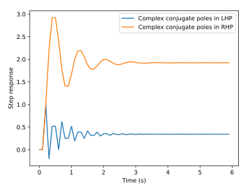

*Figure E.20: Complex conjugate poles in various locations in z-plane*

## E.5 Discretization methods

Discretization is done using a zero-order hold. That is, the input is only updated at discrete intervals and it’s held constant between samples (see figure E.21). The exact method of applying this uses the matrix exponential, but this can be computationally expensive. Instead, approximations such as the following are used.

1.  Forward Euler method. This is defined as $y_{n+1} = y_n + f(t_n, y_n) \Delta t$.

2.  Backward Euler method. This is defined as $y_{n+1} = y_n + f(t_{n+1}, y_{n+1}) \Delta t$.

3.  Bilinear transform. The first-order bilinear approximation is $s = \frac{2}{T} \frac{1 - z^{-1}}{1 + z^{-1}}$.

where the function $f(t_n, y_n)$ is the slope of $y$ at $n$ and $T$ is the sample period for the discrete system. Each of these methods is essentially finding the area underneath a curve. The forward and backward Euler methods use rectangles to approximate that area while the bilinear transform uses trapezoids (see figures E.22 and E.23). Since these are approximations, there is distortion between the real discrete system’s poles and the approximate poles. This is in addition to the phase loss introduced by discretizing at a given sample rate in the first place. For fast-changing systems, this distortion can quickly lead to instability.

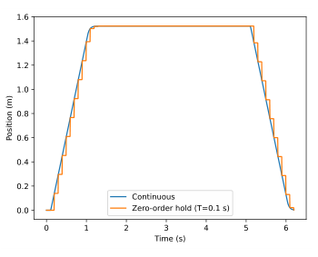

*Figure E.21: Zero-order hold of a system response*

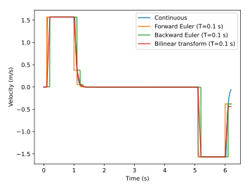

*Figure E.22: Discretization methods applied to velocity data*

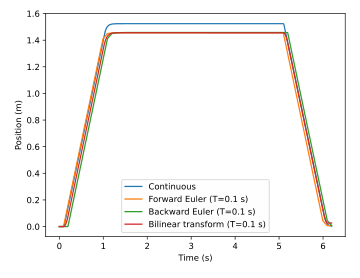

*Figure E.23: Position plot of discretization methods applied to velocity data*

Figures E.24, E.25, and E.26 show simulations of the same controller for different sampling methods and sample rates, which have varying levels of fidelity to the real system.

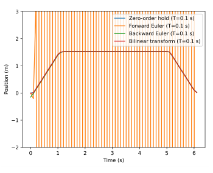

*Figure E.24: Sampling methods for system simulation with $T = 0.1$ s*

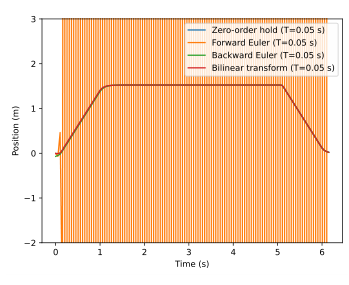

*Figure E.25: Sampling methods for system simulation with $T = 0.05$ s*

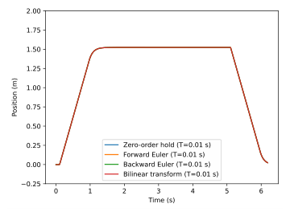

*Figure E.26: Sampling methods for system simulation with $T = 0.01$ s*

Forward Euler is numerically unstable for low sample rates. The bilinear transform is a significant improvement due to it being a second-order approximation, but zero-order hold performs best due to the matrix exponential including much higher orders.

Table E.3 compares the Taylor series expansions of several common discretization methods (these are found using polynomial division). The bilinear transform does best with accuracy trailing off after the third-order term. Forward Euler has no second-order or higher terms, so it undershoots. Backward Euler has twice the second-order term and overshoots the remaining higher order terms as well.

*Table E.3: Taylor series expansions of discretization methods (scalar case). The zero-order hold discretization method is exact.*

| **Method** | **Conversion to z** | **Taylor series expansion** |
|:--:|:---|:---|
| Zero-order hold | $e^{Ts}$ | $1 + Ts + \frac{1}{2}T^2s^2 + \frac{1}{6}T^3s^3 + \ldots$ |
| Bilinear | $\frac{1 + \frac{1}{2}Ts}{1 - \frac{1}{2}Ts}$ | $1 + Ts + \frac{1}{2}T^2s^2 + \frac{1}{4}T^3s^3 + \ldots$ |
| Forward Euler | $1 + Ts$ | $1 + Ts$ |
| Backward Euler | $\frac{1}{1 - Ts}$ | $1 + Ts + T^2s^2 + T^3s^3 + \ldots$ |

## E.6 Phase loss

Implementing a discrete control system is easier than implementing a continuous one, but discretization has drawbacks. A microcontroller updates the system input in discrete intervals of duration $T$; it’s held constant between updates. This introduces an average sample delay of $\frac{T}{2}$ that leads to phase loss in the controller. Phase loss is the reduction of phase margin that occurs in digital implementations of feedback controllers from sampling the continuous system at discrete time intervals. As the sample rate of the controller decreases, the phase margin decreases according to $-\frac{T}{2}\omega$ where $T$ is the sample period and $\omega$ is the frequency of the system dynamics. Instability occurs if the phase margin of the system reaches zero. Large amounts of phase loss can make a stable controller in the continuous domain become unstable in the discrete domain. Here are a few ways to combat this.

- Run the controller with a high sample rate.

- Designing the controller in the analog domain with enough phase margin to compensate for any phase loss that occurs as part of discretization.

- Convert the plant to the digital domain and design the controller completely in the digital domain.

## E.7 System identification with Bode plots

It’s straightforward to perform system identification by feeding a system sine waves of increasing frequency, recording the amplitude of the output oscillations, then collating that information into a Bode plot. This plot can be used to create a transfer function, or lead and lag compensators can be applied directly based on the Bode plot.

[^1]: This book primarily focuses on analysis and control of linear systems. See chapter [8](08-nonlinear-control.md#chapter-8-nonlinear-control) for more on nonlinear control.

[^2]: We are handwaving Laplace transform derivations because they are complicated and neither relevant nor useful.

[^3]: The Dirac delta function is zero everywhere except at the origin. The nonzero region has an infinitesimal width and has a height such that the area within that region is $1$.

[^4]: The unit step $u(t)$ is defined as $0$ for $t < 0$ and $1$ for $t \ge 0$.
