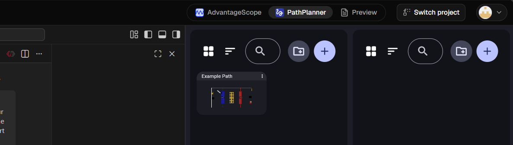

## Custom Web Dashboard feature

I'd like update this project so that custom web interfaces that can interact with the running robot program through networktables can be added to lesson modules: https://mathewdunne.github.io/CodeRunner/lessons/authoring-modules

This is just for illustration but a simple example standalone web based dashboard can be found in `web-dashboard` at the root of the repo. The most important piece is the useNTValue react hook. If there are equivalent ways of doing all the other pieces in the existing project, reuse them instead of reinventing the wheel.

When a dashboard is part of a lesson module, it show up as a tab in the CodeRunner interface:

CodeRunner should provide an API assigned to the window object which should allow custom we dashboards to interact with the existing Networktables client, in addition to other things that might be useful for custom web dashboards.

Lesson module authors should be able to create web dashboards in any framework they want, but the CodeRunner repo should provide a react/vite/typescript template they can use to get started.